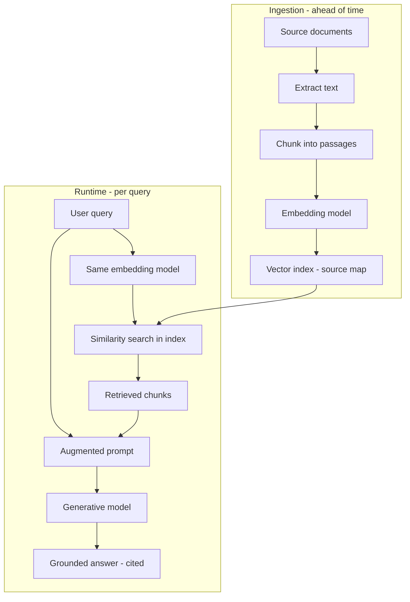
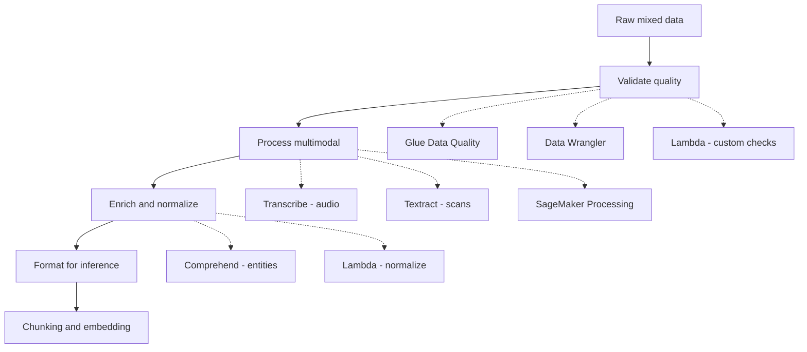
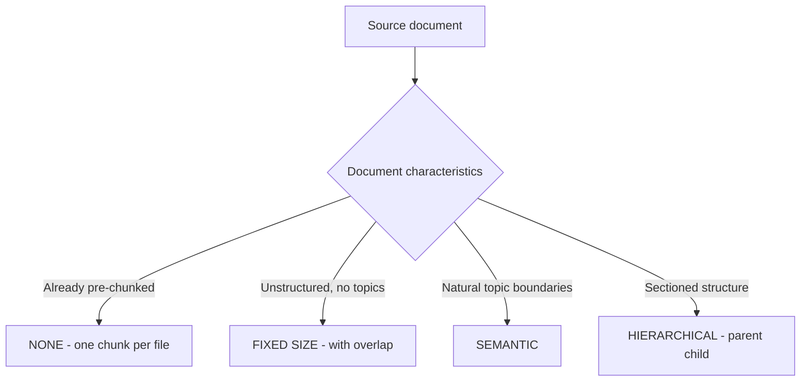
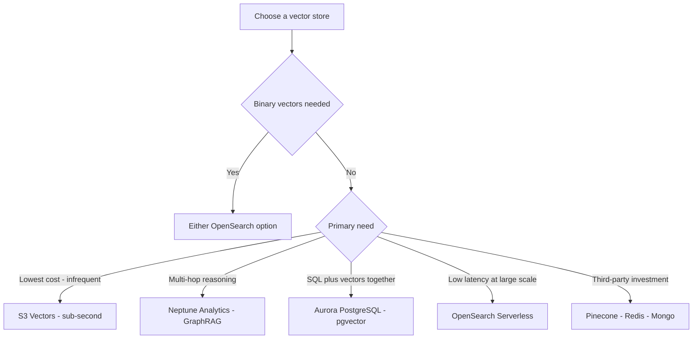
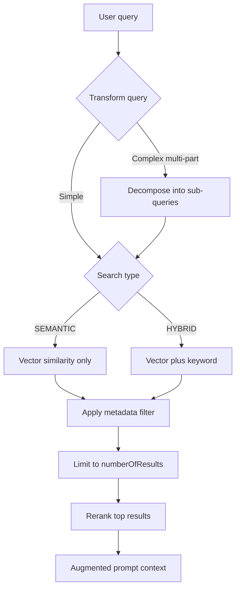
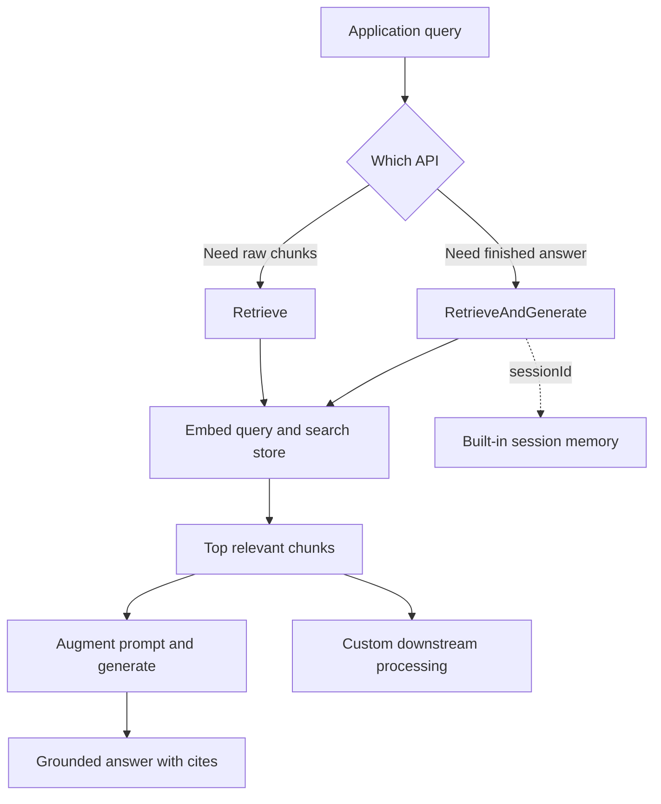
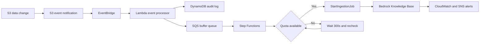
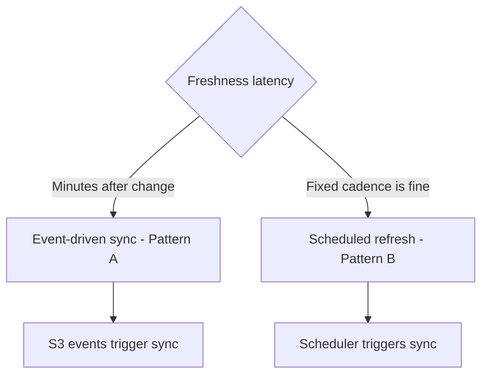
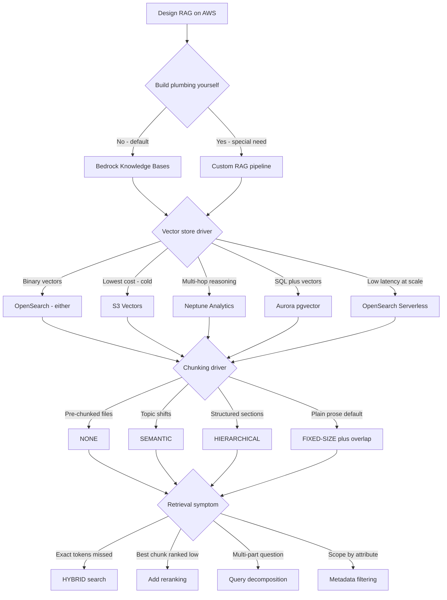

# RAG, Vector Stores & Knowledge Bases — Deep-Dive Study Guide

## Document Metadata

| Field | Value |
|-------|-------|
| Target Exam | AWS Certified Generative AI Developer - Professional (AIP-C01) |
| Exam Domains Covered | Domain 1: FM Integration, Data Management, and Compliance (31%) |
| Primary Tasks | Task 1.3 (data pipelines), Task 1.4 (vector stores), Task 1.5 (retrieval) |
| Study Guide | Guide 02 of the AIP-C01 Study Strategy |
| Priority Level | CRITICAL — the single densest exam topic |
| Prerequisite Knowledge | Guide 01 (Foundation Models & Bedrock Core); embeddings vs generative models; tokens/context windows |
| Source Material | Official AIP-C01 Exam Guide, Amazon Bedrock User Guide, AIP strategy + blueprint, MCP-researched AWS documentation |

---

## How to Use This Guide

Retrieval Augmented Generation is the most heavily tested architecture on the AIP-C01 exam, and the bulk of Domain 1 — the largest domain at 31% — lives here. Guide 01 established what RAG is at a high level and why it usually beats fine-tuning for fresh or private knowledge. This guide goes deep on how to actually build, tune, and operate a production RAG system on AWS: the ingestion pipeline, embeddings, chunking, vector store selection, retrieval tuning, Amazon Bedrock Knowledge Bases as the managed implementation, and keeping the whole thing current.

Each section is textbook-depth prose with comparison tables and Mermaid diagrams, ending with an Exam-Relevant Distinctions checklist and a collapsible Knowledge Check quiz. Work the quizzes before revealing the answers.

---

## Table of Contents

- [Section 1: RAG Foundations](#section-1-rag-foundations)
- [Section 2: Data Pipelines for FM Consumption](#section-2-data-pipelines-for-fm-consumption)
- [Section 3: Embeddings](#section-3-embeddings)
- [Section 4: Chunking Strategies](#section-4-chunking-strategies)
- [Section 5: Vector Stores](#section-5-vector-stores)
- [Section 6: Retrieval Tuning](#section-6-retrieval-tuning)
- [Section 7: Amazon Bedrock Knowledge Bases](#section-7-amazon-bedrock-knowledge-bases)
- [Section 8: Data Freshness and Maintenance](#section-8-data-freshness-and-maintenance)
- [Section 9: Exam Patterns and Quick Reference](#section-9-exam-patterns-and-quick-reference)
- [AWS Documentation References](#aws-documentation-references)

---

## Section 1: RAG Foundations

### The Problem RAG Solves

A foundation model knows only what was in its training data, frozen at the moment training ended. It has never seen your company's internal wiki, last week's support tickets, your current product catalog, or the contract a user just uploaded. Ask it about any of those and one of two bad things happens: it admits it does not know, or — worse — it confidently makes something up. That second failure mode is hallucination, and it is the central reliability problem of generative AI in the enterprise.

Guide 01 framed the three levers for closing this gap — prompt engineering, RAG, and fine-tuning — and established that when the missing ingredient is knowledge that is private or changes over time, Retrieval Augmented Generation is the right tool. This section explains why, mechanically. RAG does not teach the model anything permanently. Instead, at the moment of each query, it retrieves the relevant facts from your own data and inserts them into the prompt, so the model answers from supplied context rather than from memory. The model's general language ability does the reasoning and phrasing; your data supplies the facts. The result is an answer that is grounded, current, and — because you know which documents were retrieved — auditable.

This is why RAG dominates the exam. It sidesteps the cost, latency, and staleness of retraining; it keeps sensitive data in your own stores rather than baked into model weights; and it gives you citations. When a scenario stresses private or frequently-changing knowledge, reduced hallucination, or the need to cite sources, RAG is almost always the intended answer.

### The Two Phases of RAG

Every RAG system, whether you hand-build it or use a managed service, operates in two distinct phases that the exam expects you to separate cleanly.

The ingestion (pre-processing) phase happens ahead of time, when you prepare your data. You take unstructured source data — documents, web pages, tickets — and convert it to text. You split that text into manageable pieces called chunks. You pass each chunk through an embedding model, which converts it into a vector (a list of numbers capturing its meaning). You write those vectors into a vector index, keeping a mapping back to the original source chunk so you can cite it later. This phase is where chunking strategy (Section 4), embedding choice (Section 3), and vector store selection (Section 5) are decided, and it is run again whenever the source data changes (Section 8).

The runtime phase happens on every user query. You take the user's question and pass it through the same embedding model to get a query vector. You search the vector index for the chunks whose vectors are most semantically similar to the query vector — these are the relevant passages. You insert those retrieved chunks into the prompt as context, alongside the user's question. You send the augmented prompt to a generative model, which produces an answer grounded in the retrieved context. Retrieval tuning (Section 6) is about making this phase return the right chunks.

The single most important conceptual point: the same embedding model must be used in both phases. Documents and queries have to live in the same vector space for similarity comparison to mean anything. Mixing embedding models between ingestion and runtime is a classic "what went wrong" — the vectors are no longer comparable and retrieval returns garbage.

### How RAG Reduces Hallucination and Enables Citations

Grounding is the mechanism by which RAG fights hallucination. When the prompt contains the actual relevant passages and the system instructs the model to answer from them, the model has far less reason to invent — the facts it needs are right there in front of it. This is not a guarantee (a model can still misread or over-extrapolate, which is why Guardrails and contextual grounding checks in the safety guide add another layer), but it dramatically reduces the rate of fabricated answers compared to asking the model to rely on memory.

Citations fall out of the architecture for free. Because you kept a mapping from each vector back to its source chunk during ingestion, you can tell the user exactly which documents the answer was drawn from. That traceability is both a trust feature for users and a compliance feature for regulated industries — it is why source attribution shows up repeatedly across Domain 1 and Domain 3. A managed implementation like Amazon Bedrock Knowledge Bases (Section 7) returns these citations automatically.

### Exam-Relevant Distinctions

| If the exam says... | The answer is... | Why |
|---|---|---|
| "Ground answers in private/current data, cite sources" | RAG | Retrieves facts at query time and maps back to source |
| "Reduce hallucinations without retraining" | RAG (grounding) | Supplies facts in the prompt instead of relying on memory |
| "Data changes frequently" | RAG, not fine-tuning | Update the store, not the model weights |
| "Retrieval returns irrelevant chunks after a model change" | Embedding model mismatch between phases | Query and docs must share one embedding space |
| "Avoid building RAG plumbing ourselves" | Amazon Bedrock Knowledge Bases | Managed RAG automates ingestion and retrieval |

- RAG has two phases: ingestion (chunk, embed, store) and runtime (embed query, retrieve, augment, generate).
- The same embedding model must be used for both documents and queries.
- Citations come from the vector-to-source mapping created during ingestion.
- RAG keeps private data in your stores rather than baked into model weights.
- RAG complements, does not replace, prompt engineering and Guardrails for safe output.

### 🧠 Knowledge Check

Q1: A bank wants an assistant that answers from its internal policy documents, which are updated weekly, and must show which document each answer came from. Which approach fits best?

- A) Fine-tune a model weekly on the policy documents
- B) RAG with a vector store and source citations
- C) Prompt engineering with the policies pasted into every system prompt
- D) Increase the model's context window

**Answer: B** — Frequently-updated private data plus a citation requirement is the textbook RAG case: retrieve the relevant policy passages at query time and return their source. Weekly fine-tuning (A) is expensive, slow to reflect changes, and does not give citations. Pasting all policies into every prompt (C) wastes tokens and breaks once policies exceed the context window. D alone does not retrieve or cite.

Q2: True or False — In RAG, the foundation model permanently learns the retrieved information after answering.

**False.** RAG does not modify the model at all. The retrieved chunks are inserted into the prompt for that single query and then gone; nothing is learned or stored in the model. This is exactly why RAG stays current — the next query re-retrieves from the (possibly updated) store rather than relying on anything baked into the model.

Q3: A team switched their ingestion pipeline to a new embedding model but kept the old query-time embedding model. Retrieval quality collapsed. What went wrong?

**Answer:** Documents and queries must be embedded by the same model so they share one vector space. By embedding stored documents with a new model while embedding queries with the old one, the two sets of vectors are no longer comparable, and similarity search returns irrelevant results. The fix is to use one consistent embedding model for both phases (and re-embed the corpus if the model changes).

Q4: Which two phases make up a RAG system, and what happens in each?

**Answer:** Ingestion (pre-processing), done ahead of time: extract text, chunk it, embed the chunks, and store the vectors in an index with a mapping to source. Runtime, per query: embed the user's query with the same model, search the index for similar chunks, augment the prompt with those chunks, and generate a grounded answer. Chunking/embedding/store choices are made in ingestion; retrieval tuning happens at runtime.

> **Source attribution:** RAG fundamentals, the ingestion/runtime phases, and grounding/citations are MCP-researched from the Amazon Bedrock "How knowledge bases work" documentation and the AWS Prescriptive Guidance RAG options. The RAG-vs-fine-tuning framing carries forward from Guide 01.

---

## Section 2: Data Pipelines for FM Consumption

### Garbage In, Hallucinations Out

RAG quality is capped by the quality of the data you ingest. A vector store full of duplicated, malformed, outdated, or noisy text will retrieve duplicated, malformed, outdated, noisy chunks, and the model will faithfully ground its answers in that mess. Task 1.3 of the exam — implement data validation and processing pipelines for FM consumption — is about the unglamorous work that determines whether RAG succeeds: validating, processing, formatting, and enriching data before it ever reaches an embedding model or an inference call. The exam tests this as a set of service-to-purpose mappings, so the goal here is to know which AWS service does which job.

### Data Validation Workflows

Before data enters the pipeline, you validate that it meets quality standards (Skill 1.3.1). The exam-relevant services each have a lane. AWS Glue Data Quality defines and enforces quality rules over data in your data lake or catalog — completeness, uniqueness, freshness, conformity — and is the answer when the scenario involves validating large structured or semi-structured datasets at scale. It is built on the open-source DeeQu framework and expresses rules in a purpose-built language called DQDL (Data Quality Definition Language) with more than 25 built-in rule types, and it offers two entry points: validating data already cataloged in the AWS Glue Data Catalog, or validating data in flight inside a Glue ETL job. Amazon SageMaker Data Wrangler provides a visual, interactive way to explore, clean, and transform data and detect quality issues, fitting the data-preparation and feature-style work that precedes model consumption; it is now integrated into Amazon SageMaker Canvas as the no-code data-prep experience. Custom AWS Lambda functions handle bespoke validation logic that does not fit a managed rule engine — format checks, business-specific constraints, lightweight transformations. And Amazon CloudWatch metrics let you track data-quality indicators over time and alarm when they drift. The pattern to remember: Glue Data Quality for rule-based validation at scale, Data Wrangler for interactive prep, Lambda for custom checks, CloudWatch for ongoing monitoring.

### Processing Complex and Multimodal Data

Real corpora are not just clean paragraphs of text. They include scanned PDFs, images, audio recordings, and tabular data, each needing specialized handling before an FM can use it (Skill 1.3.2). The exam expects you to route each data type to the right processor. Amazon Bedrock multimodal models can directly accept images and documents alongside text (the content blocks from Guide 01), so for many image-and-text tasks you can hand the raw media to a multimodal model. Amazon Transcribe converts audio and video speech to text, which is the entry point for making spoken content searchable in RAG. Amazon Textract extracts text, forms, and tables from scanned documents and images when you need structured extraction rather than holistic understanding. Amazon SageMaker Processing runs large-scale, containerized batch data-processing jobs when transformation volume is high. Stitched together, these form the advanced multimodal pipeline the skill describes: Transcribe the audio, Textract the scans, process at scale with SageMaker Processing, and feed the resulting text into chunking and embedding.

### Formatting Input for FM Inference

Models are particular about input shape (Skill 1.3.3). The exam recognizes a few formatting concerns. Bedrock API requests expect JSON in a specific structure (the messages/content blocks from Guide 01's Converse section), so input must be assembled into that shape. SageMaker AI endpoints serving self-hosted models expect their own structured input format defined by the endpoint. And dialog-based applications need conversation formatting — assembling the running history into the role-tagged message array the model expects. Getting this wrong produces ValidationException errors (the non-retryable client errors from Guide 01), so formatting is also a troubleshooting topic.

### Enriching Data to Improve Response Quality

Beyond cleaning and formatting, you can actively improve input so the model produces better, more consistent output (Skill 1.3.4). Amazon Comprehend extracts entities, key phrases, sentiment, and PII from text — useful both for enriching chunks with metadata (entities become filterable attributes, Section 5) and for handling PII, where Comprehend can both detect and redact it (replacing detected PII entities with a placeholder before the text is stored or sent to a model, a capability the safety guide builds on). Amazon Bedrock itself can reformat or normalize messy text into a cleaner form before storage. Lambda functions normalize data into consistent units, casing, and structure. The theme: enrichment adds signal (metadata, entities, normalized form) that makes both retrieval and generation more accurate downstream.

### Exam-Relevant Distinctions

| If the exam says... | The answer is... | Why |
|---|---|---|
| "Validate large datasets against quality rules" | AWS Glue Data Quality | Rule-based quality enforcement at scale |
| "Interactive data exploration and cleaning" | SageMaker Data Wrangler | Visual prep and quality detection |
| "Make audio/video content searchable" | Amazon Transcribe | Speech-to-text entry point |
| "Extract forms/tables from scanned documents" | Amazon Textract | Structured extraction from scans |
| "Extract entities or detect PII in text" | Amazon Comprehend | NLP entity/PII extraction |
| "Custom or business-specific validation logic" | AWS Lambda | Bespoke checks beyond managed rule engines |
| "Large-scale batch data transformation" | SageMaker Processing | Containerized batch processing jobs |

- Glue Data Quality = rule-based validation at scale; Data Wrangler = interactive prep.
- Transcribe (audio→text), Textract (scans→text/tables), Comprehend (entities/PII) are distinct — match to the data type.
- Bedrock multimodal models can accept images/documents directly via content blocks (no separate OCR sometimes needed).
- Input formatting errors surface as ValidationException (a non-retryable client error).
- Enrichment (entities, normalization) improves both retrieval precision and generation quality.

### 🧠 Knowledge Check

Q1: A RAG pipeline must ingest thousands of recorded support calls so the assistant can answer from them. What is the correct first processing step?

- A) Amazon Textract
- B) Amazon Transcribe
- C) Amazon Comprehend
- D) Amazon Rekognition

**Answer: B** — Recorded calls are audio; Amazon Transcribe converts speech to text, which is the entry point for making spoken content searchable in RAG. Textract (A) is for scanned documents and forms, Comprehend (C) extracts entities from text you already have, and Rekognition (D) analyzes images/video for objects and scenes — none of which turn audio into text.

Q2: A team needs to enforce completeness and uniqueness rules across a large structured dataset in their data lake before it feeds a RAG ingestion job. Which service fits?

**Answer:** AWS Glue Data Quality. It defines and enforces rule-based data-quality checks (completeness, uniqueness, freshness, conformity) over data in the catalog/data lake at scale. SageMaker Data Wrangler would fit interactive, visual exploration and cleaning, but for automated rule enforcement at scale on data-lake datasets, Glue Data Quality is the intended answer.

Q3: An application sends prompts to a Bedrock model and intermittently receives ValidationException errors. The team's retry-with-backoff logic does not help. Why, and what is the actual fix?

**Answer:** ValidationException is a client error caused by malformed input — the request body does not conform to the expected JSON/message structure — so retrying produces the identical failure (as covered in Guide 01, client errors are not retryable). The fix is in the data pipeline's input-formatting step: assemble the request into the correct Bedrock JSON/content-block shape before sending, rather than retrying a structurally invalid request.

Q4: True or False — Enriching chunks with entities extracted by Amazon Comprehend can improve retrieval precision later.

**True.** Entities (and other attributes) extracted during enrichment can be attached as metadata to chunks, which then becomes filterable metadata in the vector store (Section 5). Filtering retrieval by metadata narrows the candidate set to the most relevant context, improving precision — one of the reasons enrichment is part of a quality data pipeline.

> **Source attribution:** Service-to-purpose mappings for validation, multimodal processing, formatting, and enrichment are derived from AIP-C01 Skills 1.3.1-1.3.4 and corroborated by MCP-researched AWS service documentation. This section is largely service-mapping; specific service capabilities were verified against AWS docs.

---

## Section 3: Embeddings

### What an Embedding Actually Is

Guide 01 drew the line between generative models (which produce answers) and embedding models (which produce searchable representations). This section goes deeper, because embeddings are the quiet machinery that makes the entire retrieval half of RAG possible, and the exam tests both the concept and the selection decision.

An embedding is a vector — a fixed-length list of numbers — that a model produces to represent the meaning of a piece of text (or an image). The crucial property is geometric: texts that mean similar things produce vectors that sit close together in the high-dimensional space, and texts that mean different things sit far apart. "How do I reset my password" and "I forgot my login credentials" use almost no words in common, yet a good embedding model places their vectors near each other because they mean nearly the same thing. This is what lets RAG retrieve by meaning rather than by keyword — the heart of semantic search.

Retrieval, then, is a distance computation. You embed the query, and you find the stored chunk vectors nearest to it, using a similarity metric — most commonly Euclidean distance, cosine similarity, or dot product. Euclidean distance measures the straight-line gap between two vectors, cosine similarity measures the angle between them (ignoring magnitude), and dot product combines both angle and magnitude. A subtle but exam-relevant point: the embedding model only produces the vectors. The similarity computation itself happens in the vector store (Section 5), which is optimized to do this nearest-neighbor search quickly even over millions of vectors and lets you configure which metric it uses. Everything about chunking, store choice, and retrieval tuning ultimately serves this one operation: putting the right vectors near the query vector.

### Amazon Titan Embeddings and Selection

On Bedrock, the Amazon Titan Text Embeddings models are the native embedding option, and the exam (Skill 1.5.2) expects you to select an embedding model based on two main factors. The first is dimensionality — how many numbers are in each vector. Higher dimensionality can capture more nuance but costs more storage and can slow search; lower dimensionality is cheaper and faster but may lose some semantic precision. The two generations differ here in a testable way. Titan Text Embeddings V1 (and the earlier Titan Embeddings G1 - Text) produce a fixed output dimension with no configurable size. Titan Text Embeddings V2 lets you choose the output dimension — 256, 512, or 1024, defaulting to 1024 — and accepts up to 8,192 tokens (about 50,000 characters) of input per request. That configurability is what makes V2 the model most exam scenarios assume when they describe tuning dimensions for cost.

The headline statistic worth memorizing comes straight from this flexibility: with Titan Text Embeddings V2, the 256-dimension output retains roughly 97% of the retrieval accuracy of the 1024-dimension output while using about 75% less storage. That is the concrete payoff behind "reduce dimensions to cut storage cost with minimal quality loss," and the exam likes numbers like these.

The second selection factor is domain fit — how well the model's training matches your content. A general embedding model handles broad text well; specialized content (legal, medical, code) may retrieve better with a model whose training aligns with that domain. You can also batch-generate embeddings with Lambda functions when ingesting large corpora.

Beyond text, Bedrock offers multimodal embedding options for when retrieval must span more than plain text. Amazon Titan Multimodal Embeddings G1 embeds text and images into the same vector space (output dimensions of 256, 384, or 1024), so an image and a text description of it land near each other — useful for image search and mixed text-plus-image RAG. Amazon Nova Multimodal Embeddings extends this further into a unified space across text, documents, images, video, and audio. The selection idea is the same: match the modality and domain of your content to the embedding model.

The selection logic mirrors model selection from Guide 01: pick the embedding model and dimension that clear your retrieval-quality bar at the lowest storage and latency cost, and validate with retrieval-quality testing (Guide 08) rather than assuming.

| Model | Output dimensions | Max input | Notes |
|---|---|---|---|
| Titan Text Embeddings V2 | 256, 512, 1024 (default 1024) | 8,192 tokens / ~50,000 chars | Configurable dims; supports binary output |
| Titan Embeddings G1 - Text / V1 | Fixed (no choice) | 8,192 tokens | Earlier generation; float32 only |
| Titan Multimodal Embeddings G1 | 256, 384, 1024 | Text + image | Shared text-and-image vector space |
| Amazon Nova Multimodal Embeddings | Configurable | Text, doc, image, video, audio | Unified cross-modal space |

### Floating-Point vs Binary Vectors

A specific, testable distinction in Bedrock is the choice between floating-point and binary vector embeddings. Most embedding models supported by Bedrock produce floating-point vectors (float32), using 32 bits per dimension — precise but storage-heavy. Some models can produce binary vectors, using just 1 bit per dimension. On the Titan side, Titan Text Embeddings V2 is the binary-capable model: its embeddingTypes parameter can request float, binary, or both in a single call. The tradeoff is direct: binary vectors are far cheaper to store and faster to search because each dimension is a single bit, but they are less precise representations of the text, which can reduce retrieval quality. The exam-critical fact is the constraint: only Amazon OpenSearch Serverless and Amazon OpenSearch Managed clusters support storing binary vectors. If you choose a binary embedding model, you must pair it with one of those two stores. Every other Bedrock-supported store — Amazon S3 Vectors, Amazon Aurora (pgvector), Amazon Neptune Analytics, Pinecone, Redis Enterprise Cloud, and MongoDB Atlas — holds float32 vectors only and cannot store binary vectors. More broadly, your choice of embedding model and vector dimensions can constrain which vector stores are available to you, so embedding selection and store selection (Section 5) are linked decisions, not independent ones.

| Vector type | Bits per dimension | Storage cost | Precision | Store support |
|---|---|---|---|---|
| Floating-point (float32) | 32 | Higher | Higher | All supported stores |
| Binary | 1 | Lower | Lower | OpenSearch Serverless and Managed only |

### Exam-Relevant Distinctions

| If the exam says... | The answer is... | Why |
|---|---|---|
| "Retrieve by meaning, not keywords" | Embedding-based semantic search | Similar meanings produce nearby vectors |
| "Reduce vector storage cost, accept some precision loss" | Binary vector embeddings | 1 bit/dimension vs 32 |
| "Cut storage with minimal accuracy loss, stay float32" | Lower Titan V2 dimension (e.g., 256) | 256-dim keeps ~97% accuracy, saves ~75% storage |
| "Using binary vectors with Aurora/Pinecone/S3 Vectors" | Not supported — use OpenSearch | Only OpenSearch options store binary vectors |
| "Configurable embedding dimensions" | Titan Text Embeddings V2 | V2 offers 256/512/1024; V1/G1 are fixed |
| "Embed images and text in one space" | Titan Multimodal Embeddings G1 | Shared text-and-image vector space |
| "Higher retrieval nuance for specialized domain" | Higher-dimension or domain-fit embedding model | Dimensionality and domain fit drive quality |
| "Embed a large corpus efficiently" | Batch-generate embeddings (e.g., Lambda) | Bulk embedding during ingestion |

- The same embedding model must serve both ingestion and query time (carried from Section 1).
- Float32 = 32 bits/dimension (precise, costly); binary = 1 bit/dimension (cheap, less precise).
- Titan Text Embeddings V2: dimensions 256/512/1024 (default 1024), max input 8,192 tokens (~50,000 chars).
- 256-dim Titan V2 ≈ 97% of 1024-dim accuracy at ~75% less storage.
- Titan V1 / Titan Embeddings G1 - Text have a fixed dimension — no configurable size.
- Titan Text Embeddings V2 is the binary-capable Titan model (embeddingTypes = float and/or binary).
- Only OpenSearch Serverless and OpenSearch Managed support binary vectors; all other stores are float32 only.
- Embedding model + dimension choice can constrain which vector stores you may use.
- Similarity metrics (Euclidean, cosine, dot product) are computed in the vector store, not the embedding model.

### 🧠 Knowledge Check

Q1: A team wants to cut vector storage costs significantly and is willing to accept slightly lower retrieval precision. They plan to use Amazon Aurora (pgvector) as the store. What is the problem?

- A) Aurora cannot store any vectors
- B) Binary vectors are only supported by OpenSearch Serverless and OpenSearch Managed, not Aurora
- C) Binary vectors require fine-tuning first
- D) There is no problem; Aurora supports binary vectors

**Answer: B** — Binary vector embeddings (the cost-saving option) are only supported by Amazon OpenSearch Serverless and OpenSearch Managed clusters. Aurora (pgvector) stores floating-point vectors but not binary, so the team must either switch the store to OpenSearch to use binary vectors or keep float32 vectors on Aurora. A is false (Aurora does store float32 vectors), and C/D are incorrect.

Q2: Fill in the blank — Two sentences that share almost no words but mean the same thing will, under a good embedding model, produce vectors that are ___ in the vector space.

**Answer:** Close together (near each other). Embeddings capture meaning, not surface words, so semantically similar texts map to nearby vectors. This is precisely what enables semantic retrieval: the query vector lands near the vectors of relevant chunks even when the wording differs.

Q3: True or False — Choosing a higher-dimension embedding model always improves a RAG system and has no downside.

**False.** Higher dimensionality can capture more semantic nuance, but it increases storage cost and can slow nearest-neighbor search. The right choice balances retrieval quality against storage and latency cost — the same constrained-optimization mindset as model selection. You validate the choice with retrieval-quality testing rather than assuming bigger is better.

Q4: Why must embedding model selection and vector store selection be considered together rather than independently?

**Answer:** Because the choice of embedding model and its vector dimensions can constrain which vector stores are compatible. The clearest case is binary vectors, which only OpenSearch Serverless and OpenSearch Managed support — choosing a binary embedding model rules out other stores. More generally, dimension and vector-type compatibility link the two decisions, so you select embedding and store as a pair.

Q5: Fill in the numbers — Titan Text Embeddings V2 supports output dimensions of ___, ___, and ___ (default ___), and its 256-dim output retains about ___% of the accuracy of the 1024-dim output while saving roughly ___% storage.

**Answer:** 256, 512, and 1024 (default 1024); ~97% accuracy at ~75% storage savings. These numbers are the concrete justification for dropping to a smaller dimension when storage cost matters more than the last sliver of retrieval precision. Note this is the float32 dimension knob — distinct from switching to binary vectors, which is a separate, OpenSearch-only cost lever.

> **Source attribution:** Embedding concepts, float32 vs binary tradeoff, the OpenSearch-only binary constraint, and embedding/store coupling are MCP-researched from the Amazon Bedrock "How knowledge bases work" and "vector store prerequisites" documentation. Titan V2 dimensions (256/512/1024, default 1024), the 8,192-token input limit, the ~97% accuracy at ~75% storage figure, binary embeddingTypes support, and multimodal models are from the [Titan Text Embeddings](https://docs.aws.amazon.com/bedrock/latest/userguide/titan-embedding-models.html) and [Titan Multimodal Embeddings G1](https://docs.aws.amazon.com/bedrock/latest/userguide/titan-multiemb-models.html) documentation. Selection logic maps to Skill 1.5.2.

---

## Section 4: Chunking Strategies

### Why Chunking Decides Retrieval Quality

Chunking is the step in ingestion where you split source documents into the passages that get embedded and stored, and it has an outsized effect on retrieval quality that the exam tests directly (Skill 1.5.1). The reason is a tension between two failure modes. If chunks are too large, each one covers many topics, so its embedding is a muddy average of all of them — a query about one topic retrieves a chunk that is mostly about other things, and you waste precious context-window space (Guide 01) on irrelevant text. If chunks are too small, you fragment ideas across boundaries, so a chunk may contain a fact without the surrounding context needed to use it, and the model gets a sentence with no situational meaning. Good chunking finds the size and boundary placement where each chunk is a coherent, self-contained unit of meaning. Amazon Bedrock Knowledge Bases exposes four chunking strategies, and knowing each by name and purpose is squarely testable.

### The Four Bedrock Chunking Strategies

Before the four strategies, one practical note that trips people up: the Bedrock console exposes five chunking options — fixed-size, default, hierarchical, semantic, and none — but the underlying API `chunkingStrategy` enum has only four values: FIXED_SIZE, HIERARCHICAL, SEMANTIC, and NONE. The console's "default" is not a fifth API mode; it is effectively fixed-size chunking with sensible defaults. If you do not configure chunking at all, Bedrock applies default chunking, which splits content into chunks of approximately 300 tokens while honoring sentence boundaries — it keeps complete sentences together rather than cutting one in half. So "default" on the exam means roughly 300-token, sentence-aware fixed-size chunks.

Fixed-size chunking splits text into chunks of an approximately equal, configured number of tokens, with a required overlap between adjacent chunks so an idea is not cut cleanly in half at a boundary. Two parameters drive it: `maxTokens` (the target chunk size) and `overlapPercentage`, which is a required field accepting a value from 1 to 99 — overlap is not optional in the API, you must specify how much adjacent chunks share. Fixed-size is simple, predictable, and a reasonable default when documents lack clear structure. Its weakness is that it ignores meaning — it will happily split mid-topic — which is exactly why the overlap exists, to soften those arbitrary boundaries.

Hierarchical chunking creates a layered structure of larger parent chunks and smaller child chunks derived from them. You configure exactly two levels (a parent level and a child level), each with its own `maxTokens` (up to 8,192 tokens per level), plus an `overlapTokens` value — and note this is an absolute token count, not a percentage like fixed-size uses. The mechanic that makes hierarchical distinctive is in retrieval: the system matches the query against the small, precise child chunks, then replaces each matched child with its larger parent chunk before handing context to the model, giving you precise matching plus broad surrounding context. A side effect worth remembering is that because multiple matched children can map to the same parent, the number of results actually returned can be lower than the number you requested. Hierarchical suits structured documents (manuals, contracts, anything with sections and subsections) where the natural hierarchy carries meaning. One constraint: it is not recommended with Amazon S3 vector buckets.

Semantic chunking splits based on semantic similarity, using a foundation model to detect where the topic actually shifts and placing boundaries there rather than at arbitrary token counts. It is configured with `maxTokens`, a `bufferSize` (0 to 1, how many surrounding sentences are evaluated together when judging a boundary), and a `breakpointPercentileThreshold` (50 to 99, how dissimilar adjacent content must be before a boundary is drawn). The result is chunks that align with natural topic boundaries, so each chunk is a coherent idea. It is the strongest choice when content has natural topic structure that fixed-size splitting would butcher — but because it invokes a foundation model during ingestion, it carries additional cost beyond the other strategies. That extra cost is the tradeoff you are weighing against the relevance gain.

None means no chunking — Bedrock treats each file as a single chunk. This is the right choice when you have already pre-chunked your data upstream (each file is deliberately one coherent passage), so you do not want Bedrock to split it further.

| Strategy | How it splits | Key parameters | Best for | Tradeoff |
|---|---|---|---|---|
| FIXED_SIZE | Approximately equal token-size chunks with overlap | maxTokens, overlapPercentage (1-99, required) | Unstructured text, simple default | Ignores meaning; may split mid-topic |
| HIERARCHICAL | Larger parent + smaller child chunks (exactly 2 levels) | parent/child maxTokens (max 8192), overlapTokens (absolute) | Structured docs with sections | Not for S3 vectors; result count may be lower |
| SEMANTIC | At detected topic boundaries via a foundation model | maxTokens, bufferSize (0-1), breakpointPercentileThreshold (50-99) | Content with natural topic shifts | Extra cost — uses a foundation model |
| NONE | Each file is one chunk | none | Pre-chunked data | No further splitting by Bedrock |

Default (console only) ≈ fixed-size at ~300 tokens with sentence-boundary preservation.

Two related ingestion options often appear alongside chunking. Advanced parsing lets you use a foundation model parser to extract text from complex documents (tables, diagrams, scanned PDFs) before chunking — more capable but at additional cost. A custom transformation step lets you inject your own AWS Lambda function at the POST_CHUNKING point to modify chunks (add metadata, redact, reshape) before they are embedded. Finally, a detail with real exam and design weight: the chunking strategy is fixed at data source creation and cannot be changed afterward — to use a different strategy you must create a new data source and re-ingest.

### Choosing a Strategy

The exam wants you to map document characteristics to a strategy. If the data is already split into coherent units upstream, choose NONE so Bedrock does not re-split it. If the documents are unstructured prose with no reliable structure, fixed-size with overlap is the pragmatic default. If the content has clear topic shifts that arbitrary splitting would damage — articles, knowledge-base entries, mixed-topic pages — semantic chunking preserves coherence. If the documents are highly structured with sections and subsections, hierarchical chunking captures both fine-grained matches and the broader context around them. When a question complains that retrieval returns fragments that lack context or chunks that mix unrelated topics, the remedy is almost always a smarter chunking strategy (semantic or hierarchical) or tuned chunk size/overlap — this is a recurring Domain 5 troubleshooting thread (Skill 5.2.1, content-handling and dynamic chunking).

### Exam-Relevant Distinctions

| If the exam says... | The answer is... | Why |
|---|---|---|
| "Data is already split into coherent passages" | NONE | Avoid re-splitting; one chunk per file |
| "Unstructured prose, need a simple default" | FIXED_SIZE (with overlap) | Predictable; overlap softens boundaries |
| "Default chunking — what size?" | ~300 tokens, sentence-aware | Default keeps complete sentences |
| "Content has natural topic shifts" | SEMANTIC | Boundaries placed where topics change |
| "Structured manual with sections" | HIERARCHICAL | Parent + child gives precision and context |
| "Retrieved chunks mix unrelated topics" | Move to SEMANTIC chunking | Topic-aligned boundaries fix muddy chunks |
| "Retrieved chunk lacks surrounding context" | HIERARCHICAL or larger size/overlap | Parent chunk supplies context |
| "Need to change chunking after ingestion" | Distractor — not possible in place | Strategy is fixed; create a new data source |
| "Want cheapest chunking that respects meaning" | Not SEMANTIC | Semantic uses an FM, so it costs more |

- The four API strategies are FIXED_SIZE, HIERARCHICAL, SEMANTIC, and NONE — the console adds "default" (≈300-token, sentence-aware fixed-size) as a fifth label, not a fifth API value.
- FIXED_SIZE requires overlapPercentage (1-99); overlap is mandatory in the API, not optional.
- HIERARCHICAL uses overlapTokens (absolute token count), parent/child maxTokens up to 8,192, exactly 2 levels — and is not recommended with S3 vector buckets.
- Hierarchical retrieval matches child chunks then returns their parents, so the result count can come back lower than requested.
- SEMANTIC costs more because it invokes a foundation model; bufferSize is 0-1 and breakpointPercentileThreshold is 50-99.
- Chunking strategy cannot be changed after data source creation — re-ingest under a new data source to switch.
- Chunks too large = muddy embeddings + wasted context window; too small = lost context.
- Poor-relevance and missing-context complaints often trace to chunking, not the model.

### 🧠 Knowledge Check

Q1: A knowledge base ingests well-structured product manuals with chapters, sections, and subsections. The team wants precise matches but also enough surrounding context in each answer. Which chunking strategy fits best?

- A) NONE
- B) FIXED_SIZE with no overlap
- C) HIERARCHICAL
- D) Binary chunking

**Answer: C** — Hierarchical chunking creates smaller child chunks (for precise matching) derived from larger parent chunks (for surrounding context), which is exactly what structured, sectioned documents call for when you want both precision and context. NONE (A) would store whole files; fixed-size with no overlap (B) ignores the structure and risks cutting context; D is not a real strategy.

Q2: A RAG system over mixed-topic web articles returns chunks that combine two or three unrelated topics, hurting answer relevance. Which change most directly helps?

**Answer:** Switch to semantic chunking. Semantic chunking uses a foundation model to place boundaries where the topic actually shifts, so each chunk is a single coherent idea instead of a muddy mix. Fixed-size splitting at arbitrary token counts is what produced the multi-topic chunks; aligning boundaries to topics fixes the muddiness and improves retrieval relevance. The tradeoff is added ingestion cost from the foundation model.

Q3: True or False — If your upstream pipeline already splits documents into individually coherent passages, you should still apply fixed-size chunking in Bedrock.

**False.** If files are already coherent, pre-chunked passages, the correct setting is NONE, which treats each file as a single chunk and avoids re-splitting work that was already done well. Applying fixed-size chunking on top would fragment passages that were deliberately assembled, potentially degrading retrieval.

Q4: Why does making chunks very large tend to hurt retrieval quality?

**Answer:** A large chunk usually spans many topics, so its single embedding becomes a muddy average of all of them. A query about one of those topics may still retrieve the chunk, but the chunk's vector poorly represents any single topic, lowering match precision — and the oversized chunk also consumes more of the limited context window with mostly irrelevant text. Coherent, appropriately-sized chunks produce cleaner embeddings and better matches.

Q5: Fill in the numbers — Bedrock default chunking targets approximately ___ tokens per chunk; FIXED_SIZE requires an overlapPercentage between ___ and ___; and SEMANTIC's breakpointPercentileThreshold ranges from ___ to ___.

**Answer:** ~300 tokens (honoring sentence boundaries); overlapPercentage 1 to 99 (required, not optional); breakpointPercentileThreshold 50 to 99. The default ~300-token behavior is why "default" is effectively sentence-aware fixed-size chunking, not a distinct fifth API strategy. The overlapPercentage being a required field is a common trap — fixed-size overlap is mandatory in the API.

Q6: True or False — After creating a data source with FIXED_SIZE chunking, you can switch it to SEMANTIC chunking in place to improve relevance.

**False.** The chunking strategy is set at data source creation and cannot be changed afterward. To move from fixed-size to semantic chunking you must create a new data source with the desired strategy and re-ingest the content. This immutability is why chunking choice deserves up-front thought rather than being treated as a tunable knob.

> **Source attribution:** The four chunking strategies (FIXED_SIZE, HIERARCHICAL, SEMANTIC, NONE), the default ~300-token sentence-aware behavior, and per-strategy parameters are MCP-researched from the Amazon Bedrock [How content chunking works](https://docs.aws.amazon.com/bedrock/latest/userguide/kb-chunking.html) documentation and the ChunkingConfiguration, HierarchicalChunkingConfiguration, and SemanticChunkingConfiguration API references. The required overlapPercentage (1-99), hierarchical overlapTokens / 8,192-token levels / child-to-parent retrieval, semantic foundation-model cost, and the post-creation immutability of chunking strategy are verified from those sources; the custom transformation Lambda (POST_CHUNKING) is from the Bedrock custom transformation documentation. Selection and troubleshooting guidance map to Skills 1.5.1 and 5.2.1.

---

## Section 5: Vector Stores

### What a Vector Store Does

Sections 3 and 4 produced the raw material of retrieval: chunks of text turned into embedding vectors. The vector store is where those vectors live and, more importantly, where the similarity search at the heart of runtime RAG actually executes. When a query vector arrives, it is the vector store — not the embedding model and not the foundation model — that finds the stored chunk vectors nearest to it and returns them. A vector store is therefore a database specialized for one operation: storing high-dimensional vectors and answering "which of my millions of vectors are closest to this one" fast enough to sit inside a live request. Task 1.4 of the exam — select and configure vector store solutions — is about knowing the options, their constraints, and how to choose among them, and it is one of the most reliably tested areas in Domain 1.

The reason this matters so much in practice is that the vector store decision is mostly irreversible and ripples outward. It is coupled to your embedding choice (Section 3 — binary vectors force an OpenSearch store), it sets your cost floor and your latency ceiling, and it determines whether you can do graph reasoning or relational joins alongside vector search. Getting it right means matching the store to the scale, query pattern, cost target, and integration needs of the workload rather than reaching for a default.

### The Three Fields a Vector Index Requires

When Amazon Bedrock Knowledge Bases stores a chunk, it does not store just the vector. Every knowledge base vector index must define three fields, and the exam expects you to know all three by role.

The first is the vector embeddings field (the `vectorField`), which holds the numeric embedding produced for each chunk — this is what similarity search compares against. The second is the text chunks field (the `textField`), which holds the original chunk text so it can be returned to the model as context and shown in citations; in Bedrock's mapping this is the field tagged `AMAZON_BEDROCK_TEXT_CHUNK`. The third is the Bedrock-managed metadata field (the `metadataField`), tagged `AMAZON_BEDROCK_METADATA`, which Bedrock uses internally to store the bookkeeping it needs — the source location and other managed attributes that make citations and source mapping work. Without all three, the index cannot serve as a knowledge base store: the vector field enables the search, the text field supplies the answer context, and the managed metadata field ties each result back to its source.

A nuance that separates the stores: some require you to also create custom, filterable metadata fields by hand. With Amazon Aurora and Amazon OpenSearch Managed clusters, if you want to filter retrieval on your own attributes (a category, a date, a tenant ID), you create those columns or fields yourself in addition to the three required ones. On OpenSearch Managed in particular, those custom filterable fields must be of type `keyword` — a frequently-missed detail. With the quick-create stores, Bedrock provisions the required fields for you, but custom filter attributes still have to be planned for.

### The Supported Vector Store Options

Bedrock Knowledge Bases supports eight vector store options through its `StorageConfiguration`. Five are AWS services and three are third-party stores accessed through endpoints and credentials in AWS Secrets Manager. The exam tests which store fits which scenario, so the goal is to internalize each one's defining characteristic.

Amazon OpenSearch Serverless is the AWS default and the most commonly recommended store. It delivers millisecond query latency and scales from thousands to billions of vectors without reindexing, using the faiss engine with the HNSW algorithm. It supports binary vectors, supports hybrid (semantic plus keyword) search, and is the only store supported for the Confluence, SharePoint, and Salesforce data sources. When a scenario says "fully managed, low latency, scales large, no infrastructure to run," this is the intended answer.

Amazon OpenSearch Managed clusters give you the same OpenSearch search capabilities but with cluster-level control — you size and tune the nodes. It supports binary vectors (engine version 2.16 or later for binary) and is a bring-your-own store: Bedrock will not auto-create the index, and the cluster must be configured with public access because a knowledge base cannot reach it inside a VPC. It fits teams who need fine-grained cluster control and are willing to manage it.

Amazon Aurora PostgreSQL with the pgvector extension (the `StorageConfiguration` API type is "Amazon RDS") stores vectors alongside relational data, so you can combine SQL queries and vector search in one database. It supports hybrid search and, in its Aurora PostgreSQL Serverless form, supports Bedrock quick-create. It does not support binary vectors (float32 only). This is the answer when the scenario stresses keeping vectors next to existing relational data or doing SQL plus vector together.

Amazon S3 Vectors is the lowest-cost option — purpose-built for vector storage at roughly 90% lower cost than alternatives — trading latency for price: it delivers sub-second (not millisecond) query latency and is aimed at large-scale, infrequently-queried RAG such as archival and cold corpora at billions of vectors. It is float32 only (no binary) and does not support hybrid search. It also inherits the managed-knowledge-base filter restriction — the `startsWith` and `stringContains` metadata operators are unavailable — but be precise about the scope: that restriction applies to *every* fully managed knowledge base, not only to S3 Vectors (see the metadata-filtering note in Section 6). Choose S3 Vectors when cost dominates and occasional sub-second latency is acceptable; avoid it when you need millisecond latency or hybrid search.

Amazon Neptune Analytics is the GraphRAG option. It combines vector similarity search with graph traversal so retrieval can follow relationships between documents — enabling multi-hop reasoning across connected sources, more explainable answers, and reduced hallucinations. It supports quick-create, is float32 only, and works only with Amazon S3 data sources; when paired with hierarchical chunking it returns child chunks only. Reach for it when the scenario emphasizes relationships, connected entities, or multi-step reasoning across documents rather than flat passage lookup.

The three third-party stores are all bring-your-own and authenticate through Secrets Manager. Pinecone is a managed vector database connected via an API key stored in Secrets Manager. Redis Enterprise Cloud connects over TLS with credentials in Secrets Manager. MongoDB Atlas integrates document storage with vector search, supports hybrid search, and requires manual filter configuration for metadata filtering. None of the three support Bedrock quick-create, and none store binary vectors.

| Vector store | Quick-create | Binary vectors | Hybrid search | Defining characteristic |
|---|---|---|---|---|
| OpenSearch Serverless | Yes | Yes | Yes | AWS default; ms latency, thousands→billions, no reindex; only store for Confluence/SharePoint/Salesforce |
| OpenSearch Managed | No (BYO) | Yes (engine 2.16+) | Yes | Cluster-level control; needs public access (no VPC) |
| Aurora PostgreSQL + pgvector ("Amazon RDS") | Yes (Serverless) | No | Yes | Vectors alongside relational data; SQL + vector together |
| Amazon S3 Vectors | Yes | No | No | Lowest cost (~90% cheaper); sub-second latency; archival/infrequent at scale |
| Neptune Analytics (GraphRAG) | Yes | No | n/a | Vector + graph traversal; multi-hop reasoning; S3 sources only |
| Pinecone | No (BYO) | No | — | Managed vector DB; API key in Secrets Manager |
| Redis Enterprise Cloud | No (BYO) | No | — | TLS + credentials in Secrets Manager |
| MongoDB Atlas | No (BYO) | No | Yes | Document store + vector search; manual filter config |

### Choosing a Vector Store

The exam frames store selection around four levers: scale, cost, query type, and binary-vector support. Walk them in order.

Start with binary support because it is the hardest constraint. If your embedding choice produces binary vectors (Section 3 — Titan Text Embeddings V2 with binary output), only OpenSearch Serverless and OpenSearch Managed can store them. That single fact eliminates six of the eight stores and frequently decides the question outright.

Next consider cost versus latency, which is the S3 Vectors axis. When the workload is large but queried infrequently — archives, compliance corpora, cold knowledge that must exist but is rarely hit — S3 Vectors wins on price (~90% cheaper) and its sub-second latency is acceptable. When queries are frequent and user-facing, the sub-second floor is too slow and you want OpenSearch Serverless's millisecond latency instead.

Then consider query type and integration. If retrieval must reason over relationships between documents — multi-hop questions, connected entities, "how does A relate to C through B" — Neptune Analytics and its GraphRAG model fit. If vectors should live beside existing relational data so you can join SQL and vector results, Aurora PostgreSQL with pgvector fits. If you need hybrid keyword-plus-semantic search, OpenSearch (either flavor), Aurora, and MongoDB Atlas support it while S3 Vectors does not.

Finally, scale and operational model. OpenSearch Serverless scales from thousands to billions of vectors without reindexing and removes infrastructure management, which is why it is the default recommendation for most production RAG. OpenSearch Managed is the choice only when you specifically need cluster-level tuning control and accept the operational burden. The third-party stores fit teams already invested in Pinecone, Redis, or MongoDB Atlas.

### Quick-Create vs Bring-Your-Own

There are two ways to attach a vector index to a knowledge base, and the distinction is a clean exam fact. With the quick-create flow, Bedrock automatically creates and configures the vector index for you — you point the knowledge base at the service and Bedrock provisions the three required fields and wires everything up. Quick-create is available for exactly four stores: OpenSearch Serverless, Aurora PostgreSQL Serverless, Neptune Analytics, and S3 Vectors. This is the fast path and the one most "just stand up a knowledge base" scenarios assume.

With bring-your-own, you must create and configure the vector store and its index yourself before creating the knowledge base, then tell Bedrock the field names and index details. Bring-your-own is required for OpenSearch Managed clusters and for all three third-party stores (Pinecone, Redis Enterprise Cloud, MongoDB Atlas). The mental shortcut: if the store is a self-managed cluster or a non-AWS service, you build the index first; if it is one of the four quick-create AWS services, Bedrock can build it for you.

| Path | Bedrock creates the index | Stores |
|---|---|---|
| Quick-create | Yes | OpenSearch Serverless, Aurora PostgreSQL Serverless, Neptune Analytics, S3 Vectors |
| Bring-your-own | No — you create it first | OpenSearch Managed, Pinecone, Redis Enterprise Cloud, MongoDB Atlas |

### Metadata Frameworks for Filtering and Precision

Storing vectors is only half the job; the other half is being able to narrow what gets searched. Metadata filtering (Skill 1.4.2) attaches custom attributes — tags, dates, categories, document owners, tenant IDs — to each chunk and lets retrieval pre-filter the candidate set by those attributes before or within the semantic search. This does two things at once: it improves accuracy by excluding irrelevant-but-semantically-similar chunks (a query about 2024 pricing should not retrieve a near-identical 2021 chunk), and it enforces access control by scoping a user's retrieval to only the documents they are allowed to see.

For an Amazon S3 data source, you supply metadata through a sidecar file named `<filename>.<ext>.metadata.json` placed beside each source object, and each metadata file must be 10 KB or smaller. Bedrock reads these during ingestion and makes the attributes filterable. At query time the Retrieve and RetrieveAndGenerate APIs accept a filter expression built from a set of operators: `equals` and `notEquals`, the numeric comparisons `greaterThan` / `greaterThanOrEquals` and `lessThan` / `lessThanOrEquals`, the set operators `in` and `notIn`, the string operators `startsWith` and `stringContains`, and the logical combinators `andAll` and `orAll` for compound conditions. (Important scope caveat: `startsWith` and `stringContains` are not supported on *any* fully managed knowledge base — AWS's guidance is to "use `equals`, `greaterThan`, `lessThan`, `in`, or `notIn` instead." S3 Vectors is one such managed store, but so is the quick-create managed OpenSearch Serverless index; the two string operators are reliable only when you bring your own OpenSearch Serverless store in a custom knowledge base.) Bedrock also supports implicit metadata filtering, where instead of you writing the filter, Bedrock automatically generates one from the natural-language query plus a metadata schema you provide — a capability available with Anthropic Claude models that turns "show me 2024 contracts from the legal team" into the corresponding structured filter.

### High-Performance Indexing at Scale

Behind the millisecond latencies is approximate nearest neighbor (ANN) search. Exact nearest-neighbor search would compare the query against every stored vector — impossibly slow at scale — so vector stores use ANN algorithms that trade a tiny amount of recall for enormous speed. The two the exam may name are HNSW (Hierarchical Navigable Small World), which builds a layered graph that lets search hop quickly toward the nearest neighbors, and IVF (Inverted File), which partitions vectors into clusters and searches only the most promising clusters. OpenSearch uses the faiss engine with the hnsw method for this.

Scaling beyond a single index introduces three patterns (Skill 1.4.3). Sharding splits one large index across multiple nodes so search load and storage spread horizontally. Multi-index designs use several indexes — for example, S3 Vectors organizes vectors as multiple indexes within a vector bucket — to partition data by tenant, topic, or time and keep each index smaller and faster. Hierarchical indexing ties back to hierarchical chunking (Section 4): the small child chunks are what get indexed and matched for precision, while the larger parent chunks are returned for context, so the index stays fine-grained without sacrificing the breadth of the answer. OpenSearch Serverless deserves a specific callout here because it scales from thousands to billions of vectors without reindexing, separates indexing compute from search compute so each scales independently, and supports vectors of up to 16,000 dimensions — the combination that makes it the default for large, growing corpora.

### Exam-Relevant Distinctions

| If the exam says... | The answer is... | Why |
|---|---|---|
| "Fully managed, low latency, scales to billions, no infra" | OpenSearch Serverless | AWS default; ms latency, no reindex, separates index/search compute |
| "Lowest cost, large corpus queried infrequently" | S3 Vectors | ~90% cheaper; sub-second latency; archival/cold RAG |
| "Need binary vectors" | OpenSearch Serverless or Managed | Only OpenSearch options store binary |
| "Multi-hop reasoning across related documents" | Neptune Analytics (GraphRAG) | Vector search plus graph traversal |
| "Store vectors next to relational data / SQL + vectors" | Aurora PostgreSQL + pgvector | Relational and vector in one DB |
| "Need cluster-level tuning control" | OpenSearch Managed | Bring-your-own; you size the nodes |
| "Data source is Confluence, SharePoint, or Salesforce" | OpenSearch Serverless | Only store supported for those sources |
| "Bedrock should create the index automatically" | Quick-create store | OSS, Aurora PG Serverless, Neptune, S3 Vectors |
| "Filter retrieval by 2024-only / one tenant / a category" | Metadata filtering | Pre-filters candidates; also enforces access control |
| "Filter expression uses startsWith / stringContains on a managed KB (incl. S3 Vectors)" | Distractor — unsupported on any managed KB | Managed knowledge bases don't support startsWith / stringContains; use equals, greaterThan, lessThan, in, notIn — or bring your own OpenSearch Serverless store |

- A knowledge base vector index requires three fields: vector embeddings (`vectorField`), text chunk (`textField` → `AMAZON_BEDROCK_TEXT_CHUNK`), and Bedrock-managed metadata (`metadataField` → `AMAZON_BEDROCK_METADATA`).
- Quick-create works for exactly four stores: OpenSearch Serverless, Aurora PostgreSQL Serverless, Neptune Analytics, S3 Vectors.
- Bring-your-own is required for OpenSearch Managed and all three third-party stores (Pinecone, Redis Enterprise Cloud, MongoDB Atlas).
- OpenSearch Managed needs public access (a knowledge base cannot reach it inside a VPC) and needs engine 2.16+ for binary vectors.
- OpenSearch Managed custom filterable metadata fields must be of type `keyword`.
- S3 Vectors: float32 only, no hybrid search, sub-second (not millisecond) latency, organizes vectors as multiple indexes per vector bucket.
- Neptune Analytics works only with S3 data sources; with hierarchical chunking it returns child chunks only.
- S3 metadata is supplied via a `<filename>.<ext>.metadata.json` sidecar file, each ≤ 10 KB.
- Filter operators: equals/notEquals, greaterThan(OrEquals), lessThan(OrEquals), in/notIn, startsWith, stringContains, andAll/orAll.
- Implicit metadata filtering auto-generates a filter from the query plus a metadata schema (Claude models).
- ANN algorithms: HNSW (layered graph) and IVF (inverted file / clustering); OpenSearch uses faiss with hnsw.
- OpenSearch Serverless supports up to 16,000 dimensions and scales thousands→billions without reindexing.

### 🧠 Knowledge Check

Q1: A company needs a fully managed vector store for a user-facing assistant that requires millisecond retrieval latency and must scale from a few thousand to billions of vectors over time without reindexing. Which store fits best?

- A) Amazon S3 Vectors
- B) Amazon OpenSearch Serverless
- C) Amazon Aurora PostgreSQL with pgvector
- D) Amazon Neptune Analytics

**Answer: B** — OpenSearch Serverless is the AWS default for production RAG: millisecond latency, scales from thousands to billions of vectors without reindexing, and separates indexing from search compute. S3 Vectors (A) is lowest-cost but only sub-second latency, wrong for a latency-sensitive user-facing app. Aurora (C) fits relational+vector workloads, not billion-scale low-latency search. Neptune (D) is for graph/multi-hop reasoning, not the stated need.

Q2: Fill in the fields — Every Bedrock knowledge base vector index must define three fields. Name them and the Bedrock tag for the text and metadata fields.

**Answer:** (1) the vector embeddings field (`vectorField`), which holds the embedding used for similarity search; (2) the text chunks field (`textField`), tagged `AMAZON_BEDROCK_TEXT_CHUNK`, which holds the original chunk text for context and citations; and (3) the Bedrock-managed metadata field (`metadataField`), tagged `AMAZON_BEDROCK_METADATA`, which stores the source location and managed attributes Bedrock needs for citations. All three are mandatory for the index to serve as a knowledge base store.

Q3: True or False — You can use Bedrock quick-create to automatically provision the index for an OpenSearch Managed cluster or a Pinecone store.

**False.** Quick-create is available only for OpenSearch Serverless, Aurora PostgreSQL Serverless, Neptune Analytics, and S3 Vectors. OpenSearch Managed clusters and all three third-party stores (Pinecone, Redis Enterprise Cloud, MongoDB Atlas) are bring-your-own — you must create and configure the index yourself before creating the knowledge base, then give Bedrock the field names.

Q4: Scenario — A legal-tech firm needs RAG over millions of documents, must answer multi-hop questions that follow relationships between contracts and clauses, and wants more explainable, less hallucination-prone answers. Which store and why?

**Answer:** Amazon Neptune Analytics (GraphRAG). It combines vector similarity search with graph traversal, so retrieval can follow the relationships between connected documents and support multi-hop reasoning ("which clauses in related contracts affect this one"), producing more explainable answers and reduced hallucinations. A flat store like OpenSearch or S3 Vectors retrieves independent passages by similarity but cannot traverse the relationships the scenario depends on. Note Neptune works only with S3 data sources.

Q5: A team built a RAG system on Amazon S3 Vectors to minimize cost. They now report that metadata filters using `startsWith` fail and that latency is too high for their new interactive chat feature. What went wrong, and what is the fix?

**Answer:** Two constraints were ignored. First, the `startsWith` (and `stringContains`) filter operators are not supported on fully managed knowledge bases — S3 Vectors is one such managed store, so those filter expressions are invalid here. The fix is to use supported operators (`equals`, `in`, numeric comparisons) or, if string-prefix/substring filtering is a hard requirement, bring your own OpenSearch Serverless vector store in a custom knowledge base (where those operators are available) rather than a managed index. Note the scope: a candidate who assumes "switch off S3 Vectors and the string operators work" is only half right — they must also leave the managed-index path. Second, S3 Vectors delivers sub-second, not millisecond, latency; it is designed for large-scale, infrequently-queried/archival RAG, not interactive chat. For a latency-sensitive interactive feature, the right store is OpenSearch Serverless. The original choice optimized cost at the expense of the two requirements that now matter.

> **Source attribution:** The three required index fields (`vectorField`, `textField` → `AMAZON_BEDROCK_TEXT_CHUNK`, `metadataField` → `AMAZON_BEDROCK_METADATA`), the eight supported stores and their constraints, quick-create vs bring-your-own, and metadata filtering operators are MCP-researched from the Amazon Bedrock [vector store prerequisites](https://docs.aws.amazon.com/bedrock/latest/userguide/knowledge-base-setup.html) and create-knowledge-base documentation, the StorageConfiguration API reference, and the query-configuration/filtering documentation. GraphRAG behavior is from the Neptune Analytics knowledge base documentation, and the cost/latency and multi-index characteristics of S3 Vectors are from the Amazon S3 Vectors documentation. Indexing-at-scale (HNSW/IVF, sharding, multi-index, hierarchical) and binary-vector constraints map to Skills 1.4.2 and 1.4.3.

---

## Section 6: Retrieval Tuning

### Tuning the Runtime Half of RAG

Sections 3 through 5 built the ingestion machinery — embeddings, chunks, and the store they live in. Retrieval tuning is about the runtime half: given a user's question, how do you make the system return the *right* chunks, in the *right* order, in the *right* quantity, so the foundation model has clean, relevant context to answer from. This is where a RAG system that technically works becomes a RAG system that answers well, and the AIP-C01 exam tests it heavily under Task 1.5 because most production relevance problems are solved here rather than by changing the model. The mental model to carry through this section is that retrieval quality has several independent knobs — search type, reranking, query transformation, result count, and metadata filtering — and they are complementary, not interchangeable. Each fixes a different failure mode, and the exam often hands you a symptom and expects you to reach for the matching knob.

A useful framing before the details: think of retrieval as a funnel. The raw query may first be *reformulated* (expansion or decomposition). The reformulated query is matched against the store using a *search type* (semantic or hybrid). The matches are optionally *filtered* by metadata to enforce relevance and access control. The store returns up to *numberOfResults* candidate chunks. Those candidates may then be *reranked* by a dedicated relevance model before the top ones are stitched into the prompt. Walking the funnel in order is the cleanest way to keep the knobs straight.

### Semantic Search vs Hybrid Search

The default retrieval mechanism in RAG is semantic search: the query is embedded, and the store returns the chunks whose vectors are nearest to the query vector. Semantic search is powerful because it matches on *meaning* — a query about "cost" will retrieve a chunk that talks about "price," because the embedding model places those concepts near each other in vector space even though the words differ. This synonym- and intent-awareness is exactly why embeddings beat old keyword search for natural-language questions.

But pure semantic search has a blind spot: exact tokens. When a query hinges on a specific named entity — a product SKU, an error code like `ThrottlingException`, a stock ticker, a part number, a precise price — semantic similarity can drift. The embedding of "error code 5xx" sits near many chunks that discuss errors generally, and the one chunk containing the literal string you need may not be the nearest vector. Keyword (lexical) search is the opposite: it nails exact-token matches but has no notion of synonyms or intent. Hybrid search runs both — vector similarity over the embeddings *and* keyword search over the raw text — and combines the two result sets, so you get the meaning-awareness of semantic search plus the exact-match precision of keyword search. Hybrid is the better default for open-domain question answering across diverse collections and for chatbots whose users mix conceptual questions with specific entities (names, codes, numbers).

In Amazon Bedrock Knowledge Bases, you select this with the `overrideSearchType` field inside the `vectorSearchConfiguration` of a Retrieve or RetrieveAndGenerate request. It takes three values. Default lets Bedrock automatically choose the best available search strategy for the store. HYBRID forces combined vector-plus-keyword search. SEMANTIC forces vector-embeddings-only search. The exam-critical trap lives in HYBRID: hybrid search is only supported for vector stores that contain a filterable text field — specifically Amazon Aurora/RDS (PostgreSQL with pgvector), Amazon OpenSearch Serverless, and MongoDB Atlas. If you request HYBRID against a store that does not support it, Bedrock does not throw an error — it *silently falls back to semantic search*. A team can believe they have hybrid search enabled, see no error, and quietly be running pure semantic the whole time. (Note that when this capability first reached general availability in March 2024 it was OpenSearch Serverless only; the current User Guide lists Aurora/RDS, OpenSearch Serverless, and MongoDB Atlas.)

| Search type | What it matches | Strength | Weakness |
|---|---|---|---|
| SEMANTIC (vector only) | Meaning / intent / synonyms | "cost" finds "price"; natural-language questions | Misses exact tokens — codes, SKUs, tickers |
| Keyword (lexical) | Exact tokens in raw text | Precise named-entity and code matches | No synonym or intent awareness |
| HYBRID (vector + keyword) | Both, combined | Meaning plus exact-match precision | Only on Aurora/RDS, OpenSearch Serverless, MongoDB Atlas |

### Reranking — A Second Relevance Pass

Vector and keyword search are fast, approximate first-pass filters: they pull a candidate set out of millions of chunks quickly, but the *ordering* within that candidate set is based on a relatively crude similarity score. Reranking adds a second, more discerning relevance pass. A reranker model takes the original query and the initially-retrieved set, scores each document for how well it actually answers the query, and reorders them — pushing the genuinely most relevant chunks to the top and demoting near-misses that scored well on raw vector similarity but are not truly on point. The payoff is precision at the top of the list, which matters because only the top few chunks usually make it into the prompt; if the best chunk was ranked fifth, reranking promotes it to first so the model actually sees it.

There are two ways to use reranking on Bedrock. The first is directly through the Rerank API (on the `bedrock-agent-runtime` endpoint), which works on *any* set of documents you supply — it is not tied to a knowledge base. A Rerank request carries a `queries` array (one `RerankQuery` of type TEXT), a `sources` array (each a `RerankSource` of type INLINE wrapping a `RerankDocument` that is TEXT or JSON), and a `rerankingConfiguration` that names the reranker model ARN and a `numberOfResults` to return after reranking. The response is a list of `RerankResult` objects, each with the document, a `relevanceScore`, and the original `index`. The second way is as part of a knowledge base query: you enable reranking in the console's Reranking section or configure it within the `vectorSearchConfiguration`, and Bedrock reranks the retrieved chunks before generation automatically.

Two reranker models are available: Amazon Rerank 1.0 (`amazon.rerank-v1:0`) and Cohere Rerank 3.5 (`cohere.rerank-v3-5:0`, which handles a 4K-token context and 100-plus languages). The region trap is the highly testable detail here: Amazon Rerank 1.0 is *not* available in us-east-1 (N. Virginia) — only Cohere Rerank 3.5 works there. A scenario that pins you to us-east-1 and asks which reranker to use is testing exactly this.

### Query Transformation — Expansion, Decomposition, and Reformulation

Sometimes the relevance problem is not in the store or the search type — it is in the query itself. A vague, overloaded, or multi-part question retrieves poorly because no single chunk answers all of it at once. Query transformation is the umbrella technique for rewriting the incoming query into a form that retrieves better. Three flavors appear on the exam. Query expansion broadens a terse query with related terms or rephrasings so it matches more relevant chunks. Query reformulation rewrites an awkward query into a cleaner one. Query decomposition breaks a complex, multi-faceted question into several smaller sub-queries, runs a separate retrieval for each, and combines the results into one final answer. The canonical decomposition example: "Who scored higher in the 2022 FIFA World Cup, Argentina or France?" is split into a sub-query for each team's goal count, each retrieved independently, then combined — a single flat retrieval would struggle because no one chunk compares both teams.

Bedrock offers a managed primitive for decomposition. In a RetrieveAndGenerate request you set `orchestrationConfiguration.queryTransformationConfiguration.type` to QUERY_DECOMPOSITION, and Bedrock handles the split-retrieve-combine flow for you. Note this lives on RetrieveAndGenerate, not the bare Retrieve API, because it is a generation-orchestration feature — it needs the generation step to combine the sub-answers. For everything beyond the managed primitive — custom expansion, multi-step reformulation, conditional query routing — the build-your-own pattern is to use a Bedrock foundation model to rewrite or expand the query, orchestrate the multi-step flow with AWS Lambda and AWS Step Functions, and feed the reformulated queries into the Retrieve API. Lambda runs the per-step logic (call a model to rewrite, call Retrieve, post-process) and Step Functions sequences and branches the steps. The exam framing: QUERY_DECOMPOSITION is the documented managed option; Lambda plus Step Functions is the custom orchestration pattern when you need control the managed feature does not give.

### Controlling How Much Comes Back — numberOfResults and Filtering

Two more knobs sit in the same `vectorSearchConfiguration`. The `numberOfResults` parameter sets the maximum number of source chunks the retrieval returns — and its default is 5. It is a ceiling, not a guarantee: the actual count can be lower. The clearest case is hierarchical chunking (Section 4), where `numberOfResults` counts the child chunks retrieved, but because children that share a parent are replaced by that single parent, the returned count can come back smaller than requested. Tuning `numberOfResults` is a balance: too few and the model may miss the chunk it needed; too many and you flood the context window (Guide 01) with marginal chunks, raising cost and diluting the signal — which is precisely the failure that reranking helps with, by making the top few count.

Metadata filtering, introduced for the store in Section 5, is the other knob and it operates at query time. It restricts the candidate set to chunks whose metadata attributes match a filter, which does two jobs at once: it sharpens relevance (a query about 2024 pricing should never retrieve a near-identical 2021 chunk) and it enforces access control (scope a user's retrieval to only the documents they may see). There are two modes. Manual filtering is where you write the filter explicitly against metadata attributes — it requires that metadata exist, requires the faiss engine on OpenSearch Serverless, and cannot use `startsWith` or `stringContains` on any fully managed knowledge base (which includes S3 Vectors and the quick-create managed OpenSearch Serverless index); AWS's guidance is to use `equals`, `greaterThan`, `lessThan`, `in`, or `notIn` instead, and those two string operators are reliable only when you bring your own OpenSearch Serverless store in a custom knowledge base. Implicit filtering is where Bedrock auto-generates the filter from the natural-language query plus a metadata schema you provide — a capability tied to Anthropic Claude models, which turns "show me 2024 contracts from the legal team" into the structured filter for you. The supported operators are `equals` and `notEquals`, the numeric comparisons `greaterThan` / `greaterThanOrEquals` and `lessThan` / `lessThanOrEquals`, the set operators `in` and `notIn`, the string operators `startsWith` and `stringContains`, the list operator `listContains`, and the logical combinators `andAll` and `orAll`.

The four relevance knobs map to four distinct jobs, and keeping them straight is the heart of this section:

| Knob | What it controls | The job it does |
|---|---|---|
| Search type (semantic vs hybrid) | How matches are found | Recall — find the right candidates, including exact tokens |
| Reranking | The order of candidates | Precision at the top — best chunk reaches the prompt |
| Metadata filtering | Which candidates are eligible | Restrict the candidate set + enforce access control |
| numberOfResults | How many chunks return | How much context reaches the prompt |

### Consistent Access for FM Integration — Function Calling and MCP

The last piece of retrieval tuning is less about relevance and more about *how* a foundation model or agent issues a vector query in the first place (Skill 1.5.6). The exam cares about two mechanisms that give consistent, model-agnostic access to retrieval. The first is function calling, also called tool use, exposed through the Amazon Bedrock Converse API. You define a tool — say, a retrieval tool that queries a vector store — and describe it to the model through a consistent cross-model interface; the model then decides, within an agent loop, when to invoke that tool, the API returns the tool's results, and the model continues reasoning with them. Because the Converse API presents the same tool-use contract regardless of the underlying model, you can swap models without rewriting how retrieval is invoked.

The second is the Model Context Protocol (MCP), an open standard (originated by Anthropic) that standardizes how agents discover available tools, request their execution, and process their results — a universal connector between models and external capabilities. Amazon Bedrock Agents can use MCP servers to connect to data sources and tools without bespoke per-integration code; an MCP server can expose a retrieval or knowledge-base-query tool that any MCP client can call. The unifying idea behind both mechanisms is decoupling: function calling and MCP both separate *how an FM or agent issues a vector query* from the specific model being used and the specific store underneath, so the retrieval layer stays stable as models and stores change. Function calling is the per-request, in-API tool-use contract; MCP is the broader interoperability standard for wiring agents to tools and data across systems.

### Exam-Relevant Distinctions

| If the exam says... | The answer is... | Why |
|---|---|---|
| "Queries mix concepts and exact codes / SKUs / tickers" | HYBRID search | Vector for meaning + keyword for exact tokens |
| "Pure semantic but missing exact-string matches" | Switch to HYBRID | Semantic alone drifts on literal tokens |
| "Set HYBRID but no error and still semantic results" | Store does not support hybrid — silent fallback | Hybrid only on Aurora/RDS, OpenSearch Serverless, MongoDB Atlas |
| "Force vector-only search" | overrideSearchType = SEMANTIC | Explicitly disables keyword component |
| "Right chunk retrieved but ranked too low to be used" | Reranking | Reorders candidates by true relevance |
| "Reranking in us-east-1, which model?" | Cohere Rerank 3.5 | Amazon Rerank 1.0 is not available in us-east-1 |
| "Complex multi-part question, no single chunk answers it" | Query decomposition (QUERY_DECOMPOSITION) | Splits into sub-queries, retrieves each, combines |
| "Custom multi-step query rewriting / routing" | Bedrock + Lambda + Step Functions | Custom orchestration beyond the managed primitive |
| "How many chunks does retrieval return by default?" | 5 (numberOfResults default) | It is a max ceiling, not a guarantee |
| "Restrict retrieval to 2024 / one tenant / a category" | Metadata filtering | Sharpens relevance and enforces access control |
| "Auto-build a filter from the natural-language query" | Implicit filtering (Claude models) | Bedrock generates the filter from query + schema |
| "Consistent way for any model to invoke retrieval" | Function calling via Converse API | Same tool-use contract across models |
| "Open standard connecting agents to tools/data sources" | Model Context Protocol (MCP) | Universal connector; Bedrock Agents can use MCP servers |

- `overrideSearchType` takes three values: Default (Bedrock auto-selects), HYBRID (vector + keyword), SEMANTIC (vector only).
- Requesting HYBRID on an unsupported store silently falls back to semantic search — no error is raised.
- Hybrid search is supported only on Aurora/RDS, OpenSearch Serverless, and MongoDB Atlas (stores with a filterable text field).
- Reranking is available two ways: the standalone Rerank API (any documents, `bedrock-agent-runtime`) and as a knowledge base query option.
- Reranker models: Amazon Rerank 1.0 (`amazon.rerank-v1:0`) and Cohere Rerank 3.5 (`cohere.rerank-v3-5:0`, 4K context, 100+ languages).
- Region trap: Amazon Rerank 1.0 is not available in us-east-1; only Cohere Rerank 3.5 is.
- QUERY_DECOMPOSITION is set via `orchestrationConfiguration.queryTransformationConfiguration.type` on RetrieveAndGenerate (not bare Retrieve).
- `numberOfResults` defaults to 5 and is a maximum; hierarchical chunking can return fewer because children collapse into a shared parent.
- Implicit metadata filtering (auto-generated filter) requires Anthropic Claude models; manual filtering requires the metadata to exist.
- Filter operators: equals/notEquals, greaterThan(OrEquals), lessThan(OrEquals), in/notIn, startsWith, stringContains, listContains, andAll/orAll.
- Function calling (Converse API tool use) and MCP both decouple how a model issues a vector query from the model and store underneath.

### 🧠 Knowledge Check

Q1: A support chatbot answers conceptual questions well but keeps missing answers when users paste exact error codes like "ThrottlingException" or specific product SKUs. The knowledge base uses OpenSearch Serverless. What change most directly helps?

- A) Increase numberOfResults to 50
- B) Set overrideSearchType to HYBRID
- C) Set overrideSearchType to SEMANTIC
- D) Switch the embedding model to a larger dimension

**Answer: B** — The symptom is missed exact-token matches (error codes, SKUs), which is the classic weakness of pure semantic search. Hybrid search adds keyword (lexical) matching over the raw text alongside vector similarity, so literal strings like `ThrottlingException` are matched precisely while meaning-based questions still work. OpenSearch Serverless supports hybrid, so the override takes effect. A floods the context window without fixing the precision problem; C forces vector-only, the opposite of what is needed; D does not address exact-token matching.

Q2: True or False — If you set overrideSearchType to HYBRID on a knowledge base backed by Amazon S3 Vectors, Bedrock returns an error telling you hybrid search is unsupported.

**False.** Hybrid search is only supported on stores with a filterable text field — Aurora/RDS, OpenSearch Serverless, and MongoDB Atlas — and S3 Vectors is not one of them. Crucially, Bedrock does not raise an error in this case; it *silently falls back to semantic search*. This is a dangerous trap because a team can believe hybrid is active, see no error, and unknowingly run pure semantic retrieval. The fix is to use a hybrid-capable store if hybrid behavior is required.

Q3: A RAG team in the us-east-1 (N. Virginia) region wants to add reranking to push the most relevant chunks to the top. Which reranker model can they use, and what is the gotcha?

**Answer:** Cohere Rerank 3.5 (`cohere.rerank-v3-5:0`). The gotcha is the region trap: Amazon Rerank 1.0 (`amazon.rerank-v1:0`) is *not* available in us-east-1, so only the Cohere reranker works there. Reranking itself is the right tool for the goal — it adds a second relevance pass that reorders the initially-retrieved candidates so the genuinely best chunk reaches the prompt rather than being stranded at rank five. Both models can be used either via the standalone Rerank API or as a knowledge base query option.

Q4: Scenario — Users ask multi-part comparison questions such as "Did the Phoenix or Denver region have higher Q3 revenue and which grew faster?" A single semantic retrieval returns chunks for one region or the other but never enough to compare both. Which retrieval technique fixes this, and how is it enabled as a managed feature?

**Answer:** Query decomposition. It breaks the complex multi-part question into smaller sub-queries (one per region, plus the growth comparison), runs a separate retrieval for each, and combines the results into one grounded answer — exactly the case where a single flat retrieval fails because no one chunk covers both regions. As a managed feature it is enabled on a RetrieveAndGenerate request by setting `orchestrationConfiguration.queryTransformationConfiguration.type` to QUERY_DECOMPOSITION. It lives on RetrieveAndGenerate (not bare Retrieve) because the generation step is what combines the sub-answers. For logic beyond the managed primitive, the custom pattern is Bedrock to rewrite queries orchestrated by Lambda and Step Functions feeding the Retrieve API.

Q5: Fill in the number and explain — By default, the vectorSearchConfiguration returns at most ___ source chunks, and with hierarchical chunking the actual number returned can be ___ than requested. Why?

**Answer:** 5 (the default `numberOfResults`), and the actual number can be *lower* than requested. `numberOfResults` is a maximum ceiling, not a guarantee. With hierarchical chunking, `numberOfResults` counts the child chunks matched, but children that share the same parent are replaced by that single parent chunk before results are returned — so multiple matched children collapse into one parent, shrinking the final count. Setting the value too low risks missing the needed chunk; too high floods the context window with marginal chunks, which is the dilution that reranking helps counter.

Q6: An agent needs a consistent way to call a vector-store retrieval tool that does not have to be rewritten every time the team swaps the underlying foundation model. Two mechanisms are relevant — name both and state the key difference.

**Answer:** (1) Function calling / tool use via the Amazon Bedrock Converse API — you define a retrieval tool and the model decides when to invoke it within an agent loop, using the same tool-use contract regardless of which model is underneath. (2) The Model Context Protocol (MCP) — an open standard (originated by Anthropic) that standardizes how agents discover tools, request execution, and process results; Bedrock Agents can use MCP servers to expose a retrieval/knowledge-base tool any MCP client can call. The key difference: function calling is the per-request, in-API tool-use contract for a single model interaction, while MCP is the broader interoperability standard for wiring agents to tools and data sources across systems. Both decouple how a query is issued from the specific model and store.

> **Source attribution:** The `overrideSearchType` values (Default/HYBRID/SEMANTIC), the hybrid silent-fallback behavior, supported hybrid stores (Aurora/RDS, OpenSearch Serverless, MongoDB Atlas), `numberOfResults` (default 5, max), metadata filtering operators, and QUERY_DECOMPOSITION are MCP-researched from the Amazon Bedrock [Configure and customize queries and response generation](https://docs.aws.amazon.com/bedrock/latest/userguide/kb-test-config.html) documentation. Reranking — the Rerank API shape, the knowledge base reranking option, the Amazon Rerank 1.0 and Cohere Rerank 3.5 models, and the us-east-1 region constraint — is from the [Use a reranker model](https://docs.aws.amazon.com/bedrock/latest/userguide/rerank-use.html) and supported-regions documentation. Function calling is from the Bedrock Converse API reference and MCP-with-Bedrock-Agents material. Query transformation/orchestration (Skill 1.5.5), reranking (Skill 1.5.4), and consistent FM access via function calling and MCP (Skill 1.5.6) map to the corresponding exam skills.

---

## Section 7: Amazon Bedrock Knowledge Bases

### The Managed Implementation of Everything So Far

The previous six sections taught RAG from first principles: convert data to text, chunk it, embed the chunks, store the vectors, then at runtime embed the query, retrieve the nearest chunks, augment the prompt, and generate a grounded answer. Building that pipeline by hand means standing up an embedding workflow, provisioning and maintaining a vector store, writing chunking and ingestion code, keeping the index in sync as source data changes, and wiring the retrieval-then-generation call. Amazon Bedrock Knowledge Bases is the fully managed service that does all of that for you. You point it at where your data lives, choose an embedding model and a vector store, and Bedrock fetches and ingests the documents, chunks them according to your chosen strategy, generates embeddings (float or binary), writes them to the store, and — critically — keeps those embeddings in sync with the source data over time. Everything in Sections 2 through 6 is still happening; Knowledge Bases simply automates the operational machinery so you can focus on the data and the queries. For the AIP-C01 exam this is the centerpiece of Task 1.4 and 1.5, because most "how would you build RAG on AWS" scenarios resolve to "use a knowledge base unless the question gives you a specific reason to build it yourself."

The mental model to carry through this section: a knowledge base has a build-time half and a runtime half. The build-time half is the data source plus the ingestion job — how documents get in and stay current. The runtime half is the query API — how an application asks a question and gets either raw chunks or a finished grounded answer. The exam tests both halves, but the single most tested distinction in the whole section is the difference between the two runtime query operations, so we anchor there first and then work outward to data sources, citations, metadata filtering, and the brief handoff to agents.

### The Two Runtime APIs — Retrieve vs RetrieveAndGenerate

When an application queries a knowledge base, it calls one of two operations on the `bedrock-agent-runtime` endpoint, and choosing between them is the defining design decision of a Bedrock RAG application.

RetrieveAndGenerate does the entire RAG process in a single call. It embeds the incoming query, searches the vector store, retrieves the most relevant chunks, augments a prompt with them, sends that prompt to a foundation model, and returns a finished natural-language answer — together with citations pointing back to the source chunks the answer drew from. It is the turnkey, end-to-end grounded-chat operation. Two of its built-in conveniences are heavily testable. First, it manages short-term conversation memory for you: pass a `sessionId` (and an optional session configuration) and Bedrock retains the context of the multi-turn conversation, so a follow-up question like "and what about the second one?" resolves against the earlier turns without your application tracking history itself. Second, it supports the surrounding generation controls — guardrails, inference parameters, and prompt templates — in the same call. The input query can be up to 1,000 characters. For a structured (SQL) data source, RetrieveAndGenerate internally uses the GenerateQuery capability to turn the natural-language question into SQL before running it.

Retrieve does only the retrieval half. It embeds the query, searches the store, and returns the array of most-relevant source chunks — and then stops. There is no generation step, no foundation model invocation, and no built-in session memory. You use Retrieve when you want to own the downstream processing: build a custom RAG pipeline with your own prompt assembly and a model of your choosing, evaluate retrieval relevance in isolation, feed the chunks to a framework such as LangChain's `AmazonKnowledgeBasesRetriever`, or post-process the chunks before generation. The retrieval-tuning knobs from Section 6 — `overrideSearchType`, `numberOfResults`, metadata filters, reranking — live in the `vectorSearchConfiguration` of both operations, so you get the same retrieval controls either way; the difference is purely whether Bedrock also generates the answer.

A third, supporting operation rounds out the picture. GenerateQuery converts a natural-language question into a query for a structured data store — in practice, natural-language-to-SQL. You can call it directly when you want the generated SQL without execution, and RetrieveAndGenerate calls it internally when the knowledge base is backed by a structured store. Reranking, from Section 6, can be applied to either Retrieve or RetrieveAndGenerate.

| Operation | What it does | Returns | Session memory | Use when |
|---|---|---|---|---|
| RetrieveAndGenerate | Full RAG in one call — retrieve plus generate | Grounded answer with citations | Yes — via sessionId | You want a turnkey grounded answer or multi-turn chat |
| Retrieve | Retrieval only — no generation | Array of raw source chunks | No | You own the downstream generation or evaluate retrieval |
| GenerateQuery | Natural language to SQL for structured stores | Generated query | No | You need the SQL, or used internally by RetrieveAndGenerate |

### Data Sources — Unstructured Connectors and Structured Stores

A knowledge base draws from one or more data sources, and Bedrock splits them into two fundamentally different families that behave so differently the exam treats the split as a primary distinction.

Unstructured data sources are documents — the natural home of embeddings-based RAG. Bedrock provides built-in connectors for Amazon S3, Confluence, Microsoft SharePoint, Salesforce, a Web Crawler, and a custom source for content you push in yourself. Each connector has its own characteristics worth knowing. The S3 connector is the workhorse and the only one (alongside the custom source) that supports multimodal content — images, audio, and video — where the others are text-oriented; it also supports per-file `.metadata.json` sidecar files for filtering, inclusion and exclusion filters to scope which objects are ingested, and incremental sync. The Web Crawler connects to public web pages with up to 10 seed URLs and a configurable crawl rate, scope, and filters. Confluence has notable constraints the exam can probe — it connects to Confluence Cloud only and is supported only with an OpenSearch Serverless vector store. For all unstructured sources, ingestion produces embeddings and retrieval is semantic/vector search — this is the RAG you have studied.

Structured data sources are a different mechanism entirely, and the contrast is the most important fact in this part of the section: a structured data store does not use embeddings at all. Instead of embedding and vector search, Bedrock generates SQL from the natural-language question (the GenerateQuery capability) and runs that SQL against a data warehouse. Configuring a structured store has three parts. The query engine configuration names what executes the generated SQL — Amazon Redshift, either Provisioned or Serverless. The storage configuration names where the data lives — Redshift databases or an AWS Glue Data Catalog (Lake Formation). The optional query generation configuration tunes how SQL is produced — a maximum query execution time, table and column descriptions to help the model write better SQL, table and column inclusions and exclusions, and curated queries that pair example natural-language questions with their correct SQL to steer the generator. Because there are no embeddings and no vector index, the unstructured retrieval knobs do not apply: `numberOfResults`, search type (semantic vs hybrid), and metadata filtering are concepts of the vector path only. A scenario that mentions querying a Redshift warehouse or "natural language to SQL" is pointing at the structured path; a scenario about documents in S3 or Confluence is pointing at the embeddings path.

| Aspect | Unstructured sources | Structured store |
|---|---|---|
| Examples | S3, Confluence, SharePoint, Salesforce, Web Crawler, custom | Redshift, Glue Data Catalog |
| Retrieval mechanism | Embeddings plus semantic/vector search | Natural language to SQL via GenerateQuery |
| Uses a vector store | Yes | No |
| numberOfResults / search type / metadata filter | Apply | Do not apply |
| Multimodal content | S3 and custom only | Not applicable |

### Ingestion Jobs — Getting Data In and Keeping It Current

Creating a knowledge base and attaching a data source does not, by itself, load any data. You then run an ingestion job — what the console surfaces as the Sync button and the API exposes as `StartIngestionJob`. The API call takes a `knowledgeBaseId` and a `dataSourceId`, returns HTTP 202 with the ingestion job's status and document statistics, and kicks off the fetch-chunk-embed-store pipeline for that source. The defining property of syncing is that it is incremental: after the first full ingestion, each subsequent sync only processes documents that were added, modified, or deleted since the last sync. Unchanged documents are skipped, changed documents are re-ingested, new documents are ingested, and deleted documents are removed from the vector store. A subtle and testable optimization: if only a document's metadata changed (not its content), Bedrock can merge the new metadata without re-embedding the chunk, saving the embedding cost. One configuration constraint catches people out — the chunking strategy cannot be changed after a data source is created, so chunking is a decision you commit to at data-source creation time. For a structured store, the sync ingests the schema metadata rather than embedding content, and you must re-sync whenever the underlying schema changes so the SQL generator stays accurate.

### Citations and Source Attribution

The reason RAG reduces hallucinations is that answers are grounded in retrieved source text, and Knowledge Bases make that grounding visible through citations. A RetrieveAndGenerate response carries citations that map spans of the generated answer back to the specific source chunks they drew from, and Bedrock cites only the sources actually used — not every chunk retrieved. In the console, citations appear as footnotes; clicking one shows the chunk excerpt and, for an S3 source, a link to the underlying S3 object, while a "Show source details" control reveals the full chunk text and its metadata. This traceability is what lets a user verify an answer and what makes the system auditable, which directly supports the hallucination-reduction story from Section 1.

Two caveats are exam-grade. For multimodal content, the model can use insights drawn from images and can cite the image-containing source, but the generated response itself cannot contain images — it is text that references the visual source, not an answer that embeds the picture. The second caveat is the more dangerous trap: guardrails apply to the input query and the model-generated output, but not to the retrieved references themselves. The raw chunks returned by retrieval are not passed through the guardrail filter, so sensitive content sitting in a citation excerpt is not scrubbed by a guardrail the way the generated answer is. This is a frequent source of misunderstanding and a clean exam distractor.

### Metadata Filtering — Precision and Access Control

Section 5 introduced metadata at the store and Section 6 covered the filter operators; here the focus is the role metadata filtering plays in a knowledge base. Filtering happens at query time and acts as a pre-filter: before the semantic search runs, Bedrock restricts the candidate set to chunks whose metadata attributes satisfy the filter, then searches only within that subset. Because it narrows the search space before the vector comparison, filtering improves relevance and precision and simultaneously reduces cost and latency — fewer vectors to compare against. You attach metadata as JSON files (up to 10 KB each), one per source file, with attribute types of string, number, or boolean, and you express the filter in the `retrievalConfiguration`'s `vectorSearchConfiguration`. Filtering can be manual (you write the filter explicitly) or implicit (Bedrock infers the filter from the natural-language query using a provided metadata schema).

The role that earns metadata filtering its own acceptance criterion is access control. By tagging chunks with attributes such as role, department, or sensitivity level and applying the matching filter at query time, you ensure a user retrieves only the information they are authorized to see — a finance user's query never surfaces HR-confidential chunks, for instance. This turns metadata filtering into a mechanism for privacy, governance, and compliance, not merely a relevance tuner. Note that, like everything on the embeddings path, metadata filtering applies to unstructured sources; the structured (SQL) path does not use it.

### Integration with Bedrock Agents (Brief)

A knowledge base is not only queried directly by applications — it can be attached to an Amazon Bedrock agent so the agent can ground its reasoning in your data. You associate a knowledge base with an agent using the `AssociateAgentKnowledgeBase` operation, and the agent version must be DRAFT when you do so. At runtime the agent decides when a knowledge base is relevant, retrieves the information, and folds it into its prompt, guided by natural-language instructions you provide that tell it when and how to query the knowledge base. That is the extent of what you need here — agents, their action groups, orchestration, and the full association workflow are covered in depth in Guide 04. For this guide, the takeaway is simply that the knowledge base you build in this section becomes the retrieval backbone an agent uses.

### Exam-Relevant Distinctions

| If the exam says... | The answer is... | Why |
|---|---|---|
| "Return a finished grounded answer in one call" | RetrieveAndGenerate | Does retrieve plus generate end to end, with citations |
| "Multi-turn chat that remembers earlier questions" | RetrieveAndGenerate with sessionId | Built-in session memory only on this API |
| "Return raw chunks for a custom pipeline" | Retrieve | Retrieval only, no generation, no memory |
| "Evaluate retrieval relevance in isolation" | Retrieve | No generation step to confound the evaluation |
| "Feed chunks to LangChain / own model" | Retrieve | Raw chunks for downstream processing |
| "Natural language to SQL over a warehouse" | Structured store via GenerateQuery | No embeddings — SQL generated against Redshift |
| "Query engine for a structured store" | Amazon Redshift (Provisioned or Serverless) | Executes the generated SQL |
| "Confluence as a data source" | OpenSearch Serverless only, Cloud only | Connector constraint |
| "Ingest images / audio / video" | S3 or custom source only | Only these support multimodal content |
| "Crawl public web pages" | Web Crawler, up to 10 seed URLs | Configurable crawl rate, scope, filters |
| "Update the index after source files change" | StartIngestionJob / Sync — incremental | Only added, modified, deleted docs processed |
| "Restrict retrieval to one tenant / role / year" | Metadata filtering at query time | Pre-filters before search; relevance and access control |
| "Guardrail should scrub the cited chunks" | Distractor — it does not | Guardrails cover input and output, not retrieved references |
| "Attach a knowledge base to an agent" | AssociateAgentKnowledgeBase, agent must be DRAFT | Covered further in Guide 04 |

- The two runtime operations live on the `bedrock-agent-runtime` endpoint; both share the same `vectorSearchConfiguration` retrieval knobs.
- RetrieveAndGenerate returns citations to only the sources actually used, not every retrieved chunk.
- RetrieveAndGenerate input query limit is 1,000 characters; it also supports guardrails, inference parameters, and prompt templates.
- Retrieve has no built-in session memory; RetrieveAndGenerate manages short-term conversation memory via sessionId.
- Structured stores use no embeddings; numberOfResults, search type, and metadata filtering apply to unstructured (vector) sources only.
- Structured store config has three parts: query engine (Redshift), storage (Redshift databases or Glue Data Catalog), and optional query generation (descriptions, inclusions/exclusions, curated queries).
- Syncing is incremental — unchanged skipped, changed re-ingested, new ingested, deleted removed; a metadata-only change can merge without re-embedding.
- The chunking strategy cannot be changed after a data source is created.
- Multimodal: the model can cite image-containing sources, but the response itself cannot contain images.
- Guardrails apply to the input and the generated output, not to the retrieved reference chunks.
- Metadata files are JSON, up to 10 KB each, one per source file; attribute types are string, number, boolean.

### 🧠 Knowledge Check

Q1: A developer is building a customer-support assistant on a Bedrock knowledge base. They want Bedrock to return a finished, grounded natural-language answer with citations and to remember the context of earlier turns in the conversation. Which runtime operation and feature should they use?

- A) Retrieve, then call InvokeModel separately
- B) RetrieveAndGenerate with a sessionId
- C) GenerateQuery with a sessionId
- D) Retrieve with overrideSearchType set to HYBRID

**Answer: B** — RetrieveAndGenerate performs the entire RAG flow in one call and returns a grounded answer with citations, and passing a `sessionId` enables its built-in short-term conversation memory so follow-up questions resolve against earlier turns. A works but is the manual path — more code and no built-in memory — so it is not the best fit when the managed operation does exactly what is asked. C (GenerateQuery) is natural-language-to-SQL for structured stores, not conversational document RAG. D returns raw chunks with no generation and no session memory.

Q2: True or False — When you query a knowledge base with RetrieveAndGenerate, the Bedrock guardrail you configured scrubs sensitive content out of both the generated answer and the retrieved citation chunks.

**False.** Guardrails apply to the input query and the model-generated output, but they do not filter the retrieved references themselves. The raw chunks returned by retrieval — including the text shown in citation excerpts — are not passed through the guardrail. So sensitive content sitting in a source chunk can still appear in a citation even though the generated answer is filtered. This is a common trap; the fix for sensitive source content is data-source hygiene and metadata-based access control, not relying on the guardrail to scrub citations.

Q3: Scenario — A company wants a knowledge base that answers questions over a sales database in Amazon Redshift using plain-English questions. A teammate insists they first pick an embedding model and tune numberOfResults and hybrid search. What is wrong with that plan?

**Answer:** They are applying the unstructured (vector) playbook to a structured data store, which works completely differently. A structured store uses no embeddings at all — Bedrock generates SQL from the natural-language question (the GenerateQuery capability) and runs it against Redshift, which serves as the query engine. Because there is no vector index, the embeddings-path knobs do not exist here: numberOfResults, search type (semantic vs hybrid), and metadata filtering apply only to unstructured sources. The right configuration work is the structured-store path: the query engine (Redshift Provisioned or Serverless), the storage config (Redshift databases or a Glue Data Catalog), and optionally the query generation config — table/column descriptions, inclusions/exclusions, and curated NL-to-SQL example queries to improve the generated SQL.

Q4: Fill in the blanks — To load data into a knowledge base you run an ingestion job via the ___ API (the console "Sync" button). After the first load, syncing is ___, meaning only documents that were ___, ___, or ___ since the last sync are processed.

**Answer:** `StartIngestionJob`; incremental; added, modified, or deleted. The first sync does a full ingestion; every sync after that processes only the deltas — unchanged documents are skipped, changed documents are re-embedded and re-ingested, new documents are ingested, and deleted documents are removed from the vector store. A useful optimization to remember: if only a document's metadata changed (not its content), Bedrock can merge the new metadata without re-embedding the chunk. Also note the chunking strategy is fixed at data-source creation and cannot be changed afterward.

Q5: A retrieval over a multi-tenant knowledge base is returning chunks belonging to other tenants, and a separate query is also surfacing a 2021 policy when the user clearly asked about the 2024 policy. Which single knowledge base feature addresses both the access-control leak and the relevance problem, and how does it work?

**Answer:** Metadata filtering at query time. By tagging each chunk with attributes — a tenant ID, a year, a department or sensitivity level — and applying the matching filter in the `vectorSearchConfiguration`, Bedrock pre-filters the candidate set before the semantic search runs. Restricting to the current tenant's chunks fixes the access-control leak (only authorized chunks are eligible), and restricting to year = 2024 fixes the relevance problem (the 2021 chunk is never a candidate). Because the filter narrows the search space first, it also reduces cost and latency. Metadata is supplied as JSON files (up to 10 KB each, types string/number/boolean), one per source file, and filtering applies to unstructured sources only — not the structured SQL path.

> **Source attribution:** Knowledge Bases as managed RAG and the build-vs-runtime split are MCP-researched from the Amazon Bedrock [How knowledge bases work](https://docs.aws.amazon.com/bedrock/latest/userguide/kb-how-it-works.html) documentation. The two runtime operations (Retrieve vs RetrieveAndGenerate), session memory, the 1,000-character query limit, and GenerateQuery are from the retrieve-and-generate and Retrieve/RetrieveAndGenerate API documentation. Data source connectors (S3, Confluence, SharePoint, Salesforce, Web Crawler, custom) and their constraints come from the data-source-connectors documentation; the structured store (query engine, storage, and query generation configuration) is from the [structured data store](https://docs.aws.amazon.com/bedrock/latest/userguide/knowledge-base-structured-create.html) documentation. The ingestion job behavior is from the `StartIngestionJob` API reference; citations, the multimodal and guardrail caveats, and metadata filtering are from the knowledge base query and metadata-filtering documentation. Agent integration (AssociateAgentKnowledgeBase, DRAFT version) is from the add-knowledge-base-to-agent documentation and is covered in depth in Guide 04. Topics map to Tasks 1.4 and 1.5.

---
## Section 8: Data Freshness and Maintenance

### Why Freshness Is an Operational Requirement, Not a Nice-to-Have

Section 1 established the reason RAG exists: a foundation model is frozen at training time, so to answer from current, private knowledge it must retrieve that knowledge at query time and generate from the supplied context. That guarantee only holds if the vector index actually reflects the source data. The moment your documents change and the index does not, RAG quietly breaks in the most dangerous way possible. The model still retrieves chunks, still grounds its answer in them, and still attaches citations — but the chunks are stale, so it produces a confident, well-cited, fluent answer built on out-of-date facts. This is the stale retrieval failure mode, and it is worse than a plain hallucination because every signal a user relies on to trust the answer — grounding, citations, specificity — is present and reassuring. A pricing assistant cites the 2023 price sheet after a 2024 repricing; a support bot quotes a procedure that was revised last week; a policy assistant answers from a contract clause that was already superseded. Each answer looks authoritative and each is wrong.

Freshness therefore is not a tuning luxury; it is the operational discipline that keeps the whole RAG promise intact. It matters most exactly where RAG is most valuable: content that updates frequently (catalogs, pricing, documentation), multi-user environments where many people depend on a shared and authoritative source of truth, and real-time applications such as customer support where an answer minutes out of date can be materially harmful. The exam frames this under Task 1.4 (Skill 1.4.5) as keeping vector stores current, and the mental model to carry through this section is that there are three timing postures for refresh — incremental sync, real-time direct ingestion, and scheduled refresh — plus the deletion and retention mechanics that govern what happens when data or the knowledge base itself goes away. Everything else is a composition of those primitives.

### Incremental Sync — The Core Mechanism

Section 7 introduced the ingestion job; here is the property that makes it operationally sustainable. Syncing is incremental: after the first full ingestion, Amazon Bedrock only processes documents that were added, modified, or deleted since the last sync. It does not re-ingest the entire data source every time, which is what makes routine refresh affordable in both time and embedding cost. When a document has changed, "re-ingested" means the full pipeline runs again for that document — it is re-parsed, re-chunked, re-embedded, and re-indexed — so the vector store ends up holding vectors that reflect the new content. The four cases are worth committing to memory because the exam states them as outcomes:

| Document state at sync | What Bedrock does |
|---|---|
| Unchanged since last sync | Skipped — no work, no cost |
| Content or metadata changed | Re-ingested — re-parsed, re-chunked, re-embedded, re-indexed |
| New document added | Ingested for the first time |
| Document deleted from source | Removed from the vector store |

There is a subtle and highly testable optimization layered on the "changed" case. If the only thing that changed about a document is its metadata — its `.metadata.json` sidecar file — and the content itself is untouched, Bedrock can skip the expensive embedding step entirely. It retrieves the existing embeddings, merges in the new metadata, and writes the record back, never paying to re-embed unchanged text. This metadata-only fast path has two conditions: it applies to non-CSV content, and it does not apply when a custom transformation Lambda is configured (because that Lambda may alter content during ingestion, so Bedrock cannot assume the embeddings are still valid). CSV files are the explicit exception — a CSV is always re-ingested on a metadata change, because in a CSV the metadata and the row content are entangled. One more operational detail rounds out the picture: after a sync completes, newly written embeddings may take a few minutes to become queryable for every vector store except Amazon Aurora (RDS), where they are available immediately. A scenario that says "the sync job shows COMPLETE but a brand-new document is not yet retrievable" is usually pointing at this propagation delay, not at a bug.

### Ingestion Jobs — Triggering a Sync and Reading the Result

To run a sync you call StartIngestionJob on the build-time control plane, passing the `knowledgeBaseId` and the `dataSourceId` of the source you want to refresh; in the console this is the Sync button. The call returns HTTP 202 with an `ingestionJob` object describing the job that was started — it is asynchronous, so the 202 means "accepted and running," not "finished." You track progress with the companion operations: GetIngestionJob polls a single job (the terminal success status is COMPLETE), ListIngestionJobs enumerates a data source's jobs, and StopIngestionJob halts one in flight. When a job finishes, its `statistics` object is the audit trail of what actually happened, and the field names map directly to the four sync cases above: `numberOfDocumentsScanned`, `numberOfNewDocumentsIndexed`, `numberOfModifiedDocumentsIndexed`, `numberOfDocumentsDeleted`, and `numberOfDocumentsFailed`, alongside counts for metadata documents. Reading these statistics is how you confirm a refresh did what you expected — for instance, that a deploy which touched 12 files produced 12 modified-document indexings and zero failures. Structured (SQL) data sources are synced the same way, except the job ingests schema metadata rather than embedding content, and you re-sync whenever the schema changes so the natural-language-to-SQL generator stays accurate.

### Direct Ingestion — Real-Time, Single-Document Updates

A full data-source sync scans the entire source to find what changed, which is the right tool for batch refresh but heavyweight when you know exactly which one document just changed and want it reflected immediately. For that, Bedrock offers direct ingestion through the KnowledgeBaseDocuments API operations — most notably IngestKnowledgeBaseDocuments, which adds, updates, or deletes specific documents straight into the vector store in a single step, with no data-source sync at all. The contrast is the exam's point of leverage: StartIngestionJob scans the whole data source and reconciles it, whereas IngestKnowledgeBaseDocuments submits a specific array of documents you hand it and ingests just those. Direct ingestion is the real-time change-detection answer — when an upstream event tells you precisely which document changed, you push that one document rather than rescanning everything. It is supported for Amazon S3 and Custom data sources only; a Custom data source in fact needs no sync mechanism at all, because direct ingestion is its native way of getting data in.

Direct ingestion against an S3 source carries a caveat that is easy to get wrong and therefore exam-friendly. Changes you make through IngestKnowledgeBaseDocuments are written into the vector store but are not reflected back into the S3 bucket. So if the S3 object still holds the old content, the next full StartIngestionJob sync will see the bucket as the source of truth and overwrite your direct-ingestion change. The rule is to also replicate the change in S3 (or accept that the next sync reverts it), and never run IngestKnowledgeBaseDocuments and StartIngestionJob against the same source at the same time, because the two can race over the same records.

| Mechanism | Scope | Sync required | Supported sources | Best for |
|---|---|---|---|---|
| StartIngestionJob | Scans the whole data source, reconciles deltas | Yes — it is the sync | All connectors | Batch and scheduled refresh |
| IngestKnowledgeBaseDocuments | A specific array of documents you supply | No — single step | S3 and Custom only | Real-time, known-document updates |

### Deletions and the Data Deletion Policy

Removing data has two layers that the exam keeps distinct. The first is removing a document. Through sync, you delete the file from the data source and re-sync; the incremental job detects the absence and removes it from the vector store. Through direct deletion, DeleteKnowledgeBaseDocuments removes specific documents from the store without a full sync. The same S3 gotcha applies in reverse: a document deleted directly from a knowledge base on an S3 source is not deleted from the S3 bucket, so unless you also delete it in S3, the next sync sees it in the bucket and reintroduces it. Document removal is not durable until the source of truth agrees.

The second layer is what happens to embeddings when the knowledge base or data source resource itself is deleted, and this is governed by a per-data-source setting called the `dataDeletionPolicy`, which takes one of two values. DELETE means that when you delete the knowledge base or data source, Bedrock also deletes the embedded data it created in the vector store (this cleanup is ignored if the deletion is happening because the entire AWS account is being closed). RETAIN means the embedded data is left in place even after the data source is deleted. The nuance the exam loves: in both cases the vector store itself is never deleted by Bedrock — only the embedded data is affected, and only under DELETE. Bedrock does not own and will not tear down the OpenSearch collection, Aurora cluster, or other store you pointed it at; the policy only governs the vectors Bedrock wrote. You set the policy in the console's advanced settings or via UpdateDataSource. While you are in that update path, remember a constraint from Section 7 that lives in the same place: the chunking configuration cannot be changed on an existing data source — to change chunking you must recreate the data source.

### Automated Synchronization Workflows — Two Architecture Patterns

Knowing the primitives is half the exam; the other half is recognizing the two canonical architectures that wrap them, because Skill 1.4.5 explicitly calls out automated synchronization workflows and scheduled refresh pipelines as distinct postures.

Pattern A is event-driven, near-real-time sync, and it is a published AWS reference architecture rather than something you assemble from scratch. When an object lands in or changes in S3, an S3 event notification fires; EventBridge routes it to a Lambda event processor, which writes an audit record to DynamoDB and enqueues the work to an SQS queue. SQS exists here for a specific reason — to buffer bursts so the downstream does not exceed Bedrock's ingestion rate limits. A Step Functions state machine then orchestrates the actual sync: it checks the service quota, and if capacity is available it calls StartIngestionJob, otherwise it waits 300 seconds and rechecks before proceeding; once a job is running it monitors the job to completion. CloudWatch metrics and SNS alerts close the loop with observability. The reason this needs a state machine rather than a single Lambda calling StartIngestionJob directly is the quota math: Bedrock allows only a small number of concurrent ingestion jobs — on the order of 5 per account, 1 per knowledge base, and 1 per data source — and StartIngestionJob is rate-limited to roughly 0.1 requests per second (one call every 10 seconds) per Region, with all of these quotas applied per Region. A naive "event triggers sync" design floods straight into those limits under load; the buffer-and-orchestrate pattern is what makes event-driven sync survivable.

Pattern B is scheduled refresh, the simpler posture for when near-real-time is unnecessary and a periodic re-sync (nightly, hourly) is cheaper and easier to reason about. The standard composition is Amazon EventBridge Scheduler — a serverless scheduler supporting cron, rate, and one-time schedules with time-zone awareness — invoking a Lambda function on the schedule, and that Lambda simply calls StartIngestionJob. For a multi-step scheduled batch (refresh several sources, run validation, then notify), the scheduler instead triggers a Step Functions state machine. The building blocks here are individually documented AWS features; the end-to-end "scheduler to Lambda to sync" assembly is a standard pattern rather than a single AWS blueprint. The deciding question between the two patterns is latency tolerance: if the business needs the index current within minutes of a source change, use the event-driven Pattern A; if a fixed cadence is acceptable, use the cheaper scheduled Pattern B.

A third situation is worth naming for context. The non-S3 connectors — Web Crawler, Confluence, SharePoint, Salesforce — still ingest through the same sync mechanism and StartIngestionJob, but these connectors do not advertise a built-in recurring auto-sync. That means external scheduling or eventing is the freshness mechanism for them too: you wrap them in Pattern B (a scheduler that periodically calls StartIngestionJob) to keep their content current, because the connector itself will not re-crawl or re-pull on its own cadence.

### Exam-Relevant Distinctions

| If the exam says... | The answer is... | Why |
|---|---|---|
| "Cited answer is fluent but quotes outdated facts" | Stale retrieval — index not synced | Grounding and citations mask out-of-date chunks |
| "Refresh after source files change" | StartIngestionJob / Sync — incremental | Only added, modified, deleted docs are processed |
| "Only the metadata file changed, not content" | Metadata merged without re-embedding | Skips embedding cost — non-CSV, no transform Lambda |
| "Metadata changed on a CSV file" | Always re-ingested | CSV content and metadata are entangled |
| "Push one known-changed document immediately" | IngestKnowledgeBaseDocuments (direct ingestion) | Single step, no full scan — S3 and Custom only |
| "Custom data source — how to refresh" | Direct ingestion, no sync needed | Custom source ingests directly by design |
| "Direct-ingested S3 change disappears after next sync" | Replicate the change in S3 too | Direct ingestion is not written back to the bucket |
| "Delete a document from the knowledge base" | Delete in source + re-sync, or DeleteKnowledgeBaseDocuments | Must also delete in S3 or sync reintroduces it |
| "What happens to embeddings when the KB is deleted" | dataDeletionPolicy — DELETE or RETAIN | DELETE removes embeddings; RETAIN keeps them |
| "Does deleting the KB delete the vector store" | No — only the embedded data, only under DELETE | Bedrock never deletes the store itself |
| "Auto-sync within minutes of an S3 landing" | S3 events to EventBridge to Lambda to StartIngestionJob | Event-driven Pattern A — mind the quotas |
| "Nightly or hourly periodic refresh" | EventBridge Scheduler to Lambda to StartIngestionJob | Scheduled Pattern B — simpler and cheaper |
| "Change the chunking on an existing data source" | Not possible — recreate the data source | Chunking config is fixed at creation |

- Syncing is incremental: only documents added, modified, or deleted since the last sync are processed; unchanged docs are skipped.
- "Re-ingested" means the full pipeline reruns for that doc — re-parsed, re-chunked, re-embedded, re-indexed.
- Metadata-only change skips re-embedding (retrieve existing embeddings, merge metadata, write back) — only for non-CSV content with no custom transformation Lambda; CSV always re-ingests.
- After a sync, new embeddings may take a few minutes to be queryable for every store except Aurora (RDS), which is immediate.
- StartIngestionJob (build-time) takes knowledgeBaseId + dataSourceId, returns 202; poll with GetIngestionJob (terminal status COMPLETE), plus ListIngestionJobs and StopIngestionJob.
- The job `statistics` report documents scanned, new indexed, modified indexed, deleted, and failed.
- IngestKnowledgeBaseDocuments adds/updates/deletes specific documents directly, no full sync — S3 and Custom sources only.
- S3 direct-ingestion changes are not written back to the bucket; don't run IngestKnowledgeBaseDocuments and StartIngestionJob on the same source simultaneously.
- dataDeletionPolicy = DELETE deletes embedded data on KB/data-source deletion (ignored if the AWS account is deleted); RETAIN keeps it. Neither deletes the vector store itself. Set via console or UpdateDataSource.
- Ingestion quotas are per-Region: roughly 5 concurrent jobs per account, 1 per KB, 1 per data source; StartIngestionJob rate limit ~0.1 RPS (one per 10s).
- Non-S3 connectors (Web Crawler, Confluence, SharePoint, Salesforce) have no built-in recurring auto-sync — use external scheduling/eventing.

### 🧠 Knowledge Check

Q1: A pricing chatbot built on a Bedrock knowledge base keeps returning confident, well-cited answers that quote last year's prices, even though the source documents in S3 were updated weeks ago. The retrieval and generation pipeline shows no errors. What is the most likely root cause?

- A) The guardrail is filtering out the new prices
- B) The vector index was never re-synced after the S3 documents changed
- C) The embedding model dimension is too small
- D) numberOfResults is set too low

**Answer: B** — This is the classic stale retrieval failure mode. RAG only stays current if the vector index reflects the source data; if the documents changed in S3 but no ingestion job re-synced the knowledge base, retrieval keeps returning the old chunks. Because the answer is still grounded in retrieved text and carries citations, every trust signal looks fine — which is exactly what makes stale retrieval dangerous. The fix is to run StartIngestionJob (incremental, so only the changed price docs are reprocessed) and, going forward, automate it with a scheduled or event-driven sync. A is wrong — guardrails act on input and output, not on whether content is current; C and D affect retrieval quality, not freshness.

Q2: True or False — If you set a data source's dataDeletionPolicy to DELETE and then delete the knowledge base, Bedrock deletes both the embeddings it created and the underlying vector store (for example, the OpenSearch Serverless collection).

**False.** Under DELETE, Bedrock deletes the embedded data it wrote into the vector store when the knowledge base or data source is deleted — but it never deletes the vector store itself. The store (OpenSearch collection, Aurora cluster, etc.) is a resource you own and provisioned; Bedrock only governs the vectors it created. RETAIN would leave even those embeddings in place. The exam likes this distinction because candidates assume DELETE tears down the whole store; it does not. (Also note the DELETE cleanup is skipped if the deletion is happening because the entire AWS account is being closed.)

Q3: Scenario — A document management system emits an event the instant a single contract is updated, and the business needs that one contract reflected in the knowledge base within seconds, not on the next nightly batch. The source is an S3 data source. Which ingestion mechanism fits, and what S3-specific caveat must the team handle?

**Answer:** Direct ingestion via IngestKnowledgeBaseDocuments. Unlike StartIngestionJob, which scans the entire data source to find changes, direct ingestion pushes a specific array of documents straight into the vector store in a single step — ideal when an upstream event already tells you exactly which document changed and you want real-time freshness without a full rescan. It is supported for S3 and Custom sources. The S3 caveat: changes made through direct ingestion are written to the vector store but not back into the S3 bucket, so if the bucket still holds the old object, the next full StartIngestionJob sync will overwrite the direct-ingested change. The team must also replicate the update in S3 (and must not run direct ingestion and a sync job against the same source at the same time).

Q4: Fill in the blanks — An incremental sync processes only documents that were ___, ___, or ___ since the last sync. If only a document's ___ changed (and it is not a CSV and has no custom transformation Lambda), Bedrock can update it without paying to ___ the chunk.

**Answer:** added, modified, or deleted; metadata; re-embed. Incremental sync is what makes routine refresh affordable — unchanged documents are skipped entirely. The metadata-only fast path is the key optimization: when only the `.metadata.json` sidecar changed and the content is untouched, Bedrock retrieves the existing embeddings, merges the new metadata, and writes the record back, skipping the expensive embedding step. The two conditions are that the content is non-CSV and that no custom transformation Lambda is configured (a CSV is always re-ingested on a metadata change because its content and metadata are entangled).

Q5: A team wants every change to their S3-backed knowledge base reflected within a few minutes, and they expect bursts of hundreds of file changes during deploys. A junior engineer proposes wiring the S3 event directly to a Lambda that calls StartIngestionJob on each event. Why does this break under load, and what is the documented architecture?

**Answer:** It breaks because Bedrock's ingestion quotas are tight and per-Region — roughly 5 concurrent ingestion jobs per account, 1 per knowledge base, and 1 per data source, and StartIngestionJob is rate-limited to about 0.1 requests per second (one call per 10 seconds). A burst of hundreds of events firing StartIngestionJob directly will immediately hit those limits and fail. The documented event-driven reference architecture buffers and orchestrates instead: S3 event notification to EventBridge to a Lambda event processor (which logs an audit record to DynamoDB and enqueues to SQS), with SQS absorbing the burst; a Step Functions state machine then checks the service quota and either calls StartIngestionJob or waits 300 seconds and rechecks before monitoring the job to completion, with CloudWatch and SNS for observability. The SQS buffer plus Step Functions quota-aware orchestration is precisely what makes near-real-time sync survive bursty load. If near-real-time were not required, the simpler scheduled pattern — EventBridge Scheduler to Lambda to StartIngestionJob — would be the cheaper choice.

> **Source attribution:** Incremental sync behavior (only added/modified/deleted documents processed), the metadata-only optimization and its CSV/transformation-Lambda conditions, and the post-sync queryability delay (all stores except Aurora/RDS) are MCP-researched from the Amazon Bedrock [Sync your data with your Amazon Bedrock knowledge base](https://docs.aws.amazon.com/bedrock/latest/userguide/kb-data-source-sync-ingest.html) documentation. The StartIngestionJob shape (knowledgeBaseId + dataSourceId, 202 response, statistics fields) and the companion GetIngestionJob/ListIngestionJobs/StopIngestionJob operations are from the StartIngestionJob API reference. Direct ingestion (IngestKnowledgeBaseDocuments, DeleteKnowledgeBaseDocuments, S3-and-Custom-only support, and the S3 write-back caveat) is from the direct-ingestion documentation. The dataDeletionPolicy (DELETE vs RETAIN, the account-deletion exception, the vector-store-not-deleted nuance) and the chunking-config-immutable constraint are from the [Modify a data source](https://docs.aws.amazon.com/bedrock/latest/userguide/kb-ds-update.html) documentation. The event-driven reference architecture and the per-Region ingestion quotas are from the AWS Machine Learning Blog automatic-sync solution; the scheduled-refresh composition uses EventBridge Scheduler with Lambda as documented building blocks. Topics map to Task 1.4, Skill 1.4.5.

---

## Section 9: Exam Patterns and Quick Reference

### How to Use This Section

The previous eight sections taught RAG on AWS from first principles, one layer at a time. This final section does the opposite: it collapses all of that material into the fast-recall artifacts you actually reach for during the exam and in the last hours of review. Nothing here is new — every claim was established and MCP-verified in Sections 1 through 8 — but it is reorganized around the questions the exam asks rather than around the concepts the system is built from. The exam rarely says "explain chunking"; it says "a team reports retrieved chunks that mix unrelated topics — what do you change?" and expects you to map symptom to remedy in seconds. The decision tree, scenario tables, trap list, and troubleshooting matrix below are built for exactly that pattern-matching.

Read this section as a synthesis, not a substitute. If a row surprises you, follow the parenthetical pointer back to its home section and re-read the reasoning, because the exam's distractors are designed to punish memorization that has no understanding behind it. The single most valuable habit this section reinforces is sequencing: RAG design decisions cascade in a fixed order — managed versus custom, then vector store, then chunking, then retrieval tuning — and getting the order right is often what separates the correct answer from a plausible-looking trap.

### The RAG Design Decision Tree

Almost every "design a RAG system on AWS" question can be walked through the same four-stage cascade. First decide whether to use the managed service or build the pipeline yourself; default to Amazon Bedrock Knowledge Bases unless the scenario gives a specific reason to hand-build (a need for orchestration the managed APIs do not expose, or a non-supported store you are already committed to). Second, choose the vector store, driven hardest by binary-vector need, then cost-versus-latency, then query type. Third, choose the chunking strategy from the shape of the source documents. Fourth, tune retrieval only if the scenario describes a relevance symptom. The tree below encodes that cascade; the drivers on each branch are the words the exam plants to point you down it.

### Quick Decision Guide

This table is the section's centerpiece — a scenario-to-answer map spanning all eight teaching sections. Each row is a compressed exam stem on the left, the intended answer in the middle, and the one-line reason on the right. The parentheticals point back to the section where the full reasoning lives. Drill this until the mapping is reflexive.

| Exam scenario | Answer pattern | Why |
|---|---|---|
| Ground answers in private, frequently-changing data and cite sources | RAG, not fine-tuning (S1) | Retrieves facts at query time and maps each answer back to its source chunk |
| "We do not want to build and operate the RAG plumbing" | Amazon Bedrock Knowledge Bases (S7) | Managed RAG automates ingestion, chunking, embedding, storage, and sync |
| Validate large structured datasets against quality rules at scale | AWS Glue Data Quality (S2) | DQDL rule engine on DeeQu for completeness, uniqueness, freshness at scale |
| Make spoken audio searchable in the corpus | Amazon Transcribe then chunk and embed (S2) | Speech-to-text is the entry point for audio into RAG |
| Cut vector storage cost, accept some precision loss | Binary vectors on OpenSearch (S3) | 1 bit per dimension vs 32; only OpenSearch stores binary |
| Cut storage with minimal accuracy loss, stay float32 | Lower Titan V2 dimension to 256 (S3) | 256-dim keeps about 97% accuracy at about 75% storage savings |
| Files already split into coherent passages upstream | NONE chunking (S4) | Avoids re-splitting; one chunk per file |
| Retrieved chunks mix unrelated topics | SEMANTIC chunking (S4) | Places boundaries where the topic actually shifts |
| Structured manual needing precise match plus context | HIERARCHICAL chunking (S4) | Child chunks match, parent chunks supply surrounding context |
| Fully managed store, ms latency, scales to billions, no infra | OpenSearch Serverless (S5) | AWS default; no reindex, separates index and search compute |
| Lowest cost over a huge, infrequently-queried corpus | Amazon S3 Vectors (S5) | About 90% cheaper; sub-second latency fits archival RAG |
| Multi-hop reasoning across related documents | Neptune Analytics GraphRAG (S5) | Vector search plus graph traversal over relationships |
| Data source is Confluence, SharePoint, or Salesforce | OpenSearch Serverless (S5) | The only store supported for those connectors |
| Queries paste exact error codes or SKUs and miss | HYBRID search (S6) | Adds keyword matching for literal tokens beside vector search |
| Best chunk is retrieved but ranked too low to be used | Add reranking (S6) | A second relevance pass reorders candidates before generation |
| Complex multi-part question no single chunk answers | Query decomposition (S6) | Splits into sub-queries, retrieves each, combines the answers |
| Multi-turn chat that remembers earlier turns | RetrieveAndGenerate with sessionId (S7) | Built-in short-term session memory on this API only |
| Return raw chunks to a custom LangChain pipeline | Retrieve API (S7) | Retrieval only, no generation, no session memory |
| Natural-language questions over a Redshift warehouse | Structured store via GenerateQuery (S7) | No embeddings — generates SQL against the warehouse |
| Keep the index current within minutes of an S3 change | Event-driven sync, Pattern A (S8) | S3 events to EventBridge to Lambda to SQS to Step Functions to sync |
| Acceptable to refresh on a nightly or hourly cadence | EventBridge Scheduler to Lambda to sync, Pattern B (S8) | Scheduled refresh is simpler and cheaper than event-driven |

### Common Traps and Distractors

The RAG portion of the exam is built on a small set of recurring traps, each engineered so that a plausible-sounding answer is quietly wrong. Knowing the trap is often worth more than knowing the feature, because the trap is what the distractor is made of. The ten below are the highest-yield ones across this guide; each names the trap, then explains why the tempting answer fails.

1. Hybrid search silently falls back on unsupported stores. Setting overrideSearchType to HYBRID on a store that does not support it — S3 Vectors, for instance — does not raise an error. Bedrock quietly reverts to semantic search, so a team can believe hybrid is active while running pure vector retrieval. Hybrid is supported only on Aurora/RDS, OpenSearch Serverless, and MongoDB Atlas (the stores with a filterable text field). The trap rewards anyone who assumes "no error" means "it worked." (S6)

2. Binary vectors are an OpenSearch-only capability. The cost-saving move of dropping from 32-bit floats to 1-bit binary vectors is supported only on OpenSearch Serverless and OpenSearch Managed. A question that pairs binary vectors with Aurora, Pinecone, or S3 Vectors is a distractor — those stores are float32 only. Choosing a binary embedding effectively pre-selects an OpenSearch store. (S3, S5)

3. Guardrails do not scrub retrieved reference chunks. Bedrock Guardrails filter the input query and the model-generated output, but not the raw chunks returned by retrieval. Sensitive text sitting in a source chunk can still surface in a citation excerpt even when the generated answer is filtered. The fix is data-source hygiene and metadata-based access control, never "the guardrail will catch it." (S7)

4. Chunking strategy is immutable after data source creation. You cannot switch a data source from FIXED_SIZE to SEMANTIC in place. Changing chunking requires creating a new data source with the desired strategy and re-ingesting. Any answer that says "edit the chunking config to fix relevance" on an existing data source is wrong. (S4, S7, S8)

5. Amazon Rerank 1.0 is not available in us-east-1. Reranking is the right tool when the best chunk is retrieved but ranked too low — but in us-east-1 (N. Virginia), only Cohere Rerank 3.5 is available; Amazon Rerank 1.0 is not. A question that sets the scene in us-east-1 and offers Amazon Rerank 1.0 as the reranker is a region trap. (S6)

6. numberOfResults is a maximum, not a guarantee, and defaults to 5. It sets a ceiling on how many chunks come back, not a fixed count. With hierarchical chunking, matched child chunks that share a parent collapse into that single parent, so the actual number returned can be lower than requested. Setting it too low risks missing the needed chunk; too high dilutes the context window. (S6)

7. dataDeletionPolicy DELETE removes embeddings, never the vector store. Under DELETE, deleting the knowledge base or data source removes the embedded data Bedrock wrote — but Bedrock never deletes the underlying store (the OpenSearch collection, the Aurora cluster). Candidates assume DELETE tears down the whole store; it does not. RETAIN leaves even the embeddings in place. (S8)

8. A structured (SQL) store has no embeddings, so the vector knobs do not apply. For a Redshift-backed structured store, Bedrock generates SQL via GenerateQuery rather than embedding and searching. numberOfResults, search type (semantic vs hybrid), and metadata filtering are all vector-path concepts that simply do not exist on the structured path. An answer that tunes those knobs for a "natural language to SQL" scenario is applying the wrong playbook. (S7)

9. The embedding model must match between ingestion and query time. Documents and queries must live in the same vector space, which means the same embedding model embeds both. Swapping the ingestion model while leaving the query model unchanged (or vice versa) makes the two vector sets incomparable and collapses retrieval quality. Changing the embedding model requires re-embedding the entire corpus. (S1, S3)

10. Managed knowledge bases lack the startsWith and stringContains filter operators. Fully managed knowledge bases support metadata filtering, but not the string-prefix and substring operators — AWS says to use equals, greaterThan, lessThan, in, or notIn instead. This applies to S3 Vectors *and* the quick-create managed OpenSearch Serverless index, so the trap is two-sided: a filter expression using startsWith/stringContains is invalid on any managed index, and moving off S3 Vectors to another managed store does not restore them — only bringing your own OpenSearch Serverless store in a custom knowledge base does. For S3 Vectors specifically, combine this with its sub-second (not millisecond) latency and lack of hybrid search: it is the wrong choice whenever the scenario needs string-prefix filtering, interactive latency, or hybrid retrieval. (S5, S6)

### Vector Store Selection Quick Reference

Store selection is the most reliably tested decision in Domain 1, and it is decided by four levers in order: binary-vector need (hardest constraint), cost versus latency, query type, and operational model. This table condenses the full Section 5 matrix into the defining trait, the quick-create answer, and the binary/hybrid support that the distractors target.

| Vector store | Choose when | Quick-create | Binary | Hybrid |
|---|---|---|---|---|
| OpenSearch Serverless | Default — ms latency, scales to billions, no infra; only store for Confluence/SharePoint/Salesforce | Yes | Yes | Yes |
| OpenSearch Managed | You need cluster-level tuning control and accept the ops burden; needs public access | No - BYO | Yes (2.16+) | Yes |
| Aurora PostgreSQL pgvector | Vectors must live beside relational data; SQL plus vector together | Yes - Serverless | No | Yes |
| Amazon S3 Vectors | Lowest cost over huge, infrequently-queried corpora; sub-second latency is fine | Yes | No | No |
| Neptune Analytics GraphRAG | Multi-hop reasoning across related documents; S3 sources only | Yes | No | n/a |
| Pinecone | Already invested in Pinecone; API key in Secrets Manager | No - BYO | No | — |
| Redis Enterprise Cloud | Already invested in Redis; TLS plus credentials in Secrets Manager | No - BYO | No | — |
| MongoDB Atlas | Document store plus vector search; manual filter config | No - BYO | No | Yes |

Decision shortcuts to memorize: binary vectors force OpenSearch; lowest cost over a cold corpus means S3 Vectors; relationships and multi-hop mean Neptune; SQL beside vectors means Aurora; everything else defaults to OpenSearch Serverless. Quick-create covers exactly four AWS stores — OpenSearch Serverless, Aurora PostgreSQL Serverless, Neptune Analytics, and S3 Vectors — and everything else is bring-your-own.

### Chunking Selection Quick Reference

Chunking is chosen from the shape of the source documents, and the choice is permanent for that data source. This table maps document characteristics to the strategy and flags the parameter that the exam likes to probe.

| Source characteristic | Strategy | Key parameter / note |
|---|---|---|
| Already split into coherent passages upstream | NONE | One chunk per file; no re-splitting |
| Plain unstructured prose, need a simple default | FIXED_SIZE with overlap | overlapPercentage 1-99 is required, not optional |
| Console default, no explicit strategy | Default (~300-token, sentence-aware) | A label over fixed-size, not a fifth API value |
| Content with natural topic shifts | SEMANTIC | bufferSize 0-1, breakpointPercentileThreshold 50-99; costs more (uses an FM) |
| Highly structured docs with sections | HIERARCHICAL | parent/child maxTokens up to 8192, overlapTokens absolute; not for S3 vector buckets |

Two memory anchors: SEMANTIC is the only strategy that invokes a foundation model, so it is never the "cheapest" answer; and chunking cannot be changed after data source creation, so a "fix relevance by editing chunking in place" option is always a distractor — the real fix is a new data source plus re-ingestion.

### RAG Troubleshooting Quick Reference

Domain 5 (Testing, Validation, and Troubleshooting, 11%) reuses everything in this guide from the failure-mode angle: it hands you a symptom and asks for the cause and the fix. The four symptom families below — poor relevance, hallucinations, stale data, and context overflow — account for most RAG troubleshooting questions, and the discipline they reward is separating the symptom you observe from the root cause underneath it. Note how often the same surface symptom has several candidate causes; the scenario details tell you which one applies.

| Symptom | Likely cause | Fix |
|---|---|---|
| Poor relevance — retrieved chunks are off-topic | Chunks too large or split mid-topic, muddying embeddings | Move to SEMANTIC or HIERARCHICAL chunking; tune size and overlap (S4) |
| Poor relevance — exact codes, SKUs, or names missed | Pure semantic search drifts on literal tokens | Switch to HYBRID search on a hybrid-capable store (S6) |
| Poor relevance — right chunk retrieved but unused | Best chunk ranked below the numberOfResults cutoff | Add reranking to reorder candidates by true relevance (S6) |
| Poor relevance — retrieval collapsed after a model change | Embedding model mismatch between ingestion and query | Use one embedding model for both; re-embed the corpus (S1, S3) |
| Poor relevance — irrelevant-but-similar chunks returned | No metadata scoping on the candidate set | Apply metadata filtering by year, tenant, or category (S5, S6) |
| Hallucinations — confident answers not in the sources | Retrieval returns nothing relevant; model fills the gap | Fix retrieval first (chunking, hybrid, rerank); add grounding checks |
| Hallucinations — sensitive text appears in citations | Guardrails do not filter retrieved reference chunks | Data-source hygiene plus metadata access control, not guardrails (S7) |
| Stale data — fluent, cited answers quote outdated facts | Index not re-synced after the source changed | Run StartIngestionJob; automate event-driven or scheduled sync (S8) |
| Stale data — one known change must reflect immediately | Full sync is too slow for a single-document update | Direct ingestion via IngestKnowledgeBaseDocuments — S3/Custom only (S8) |
| Stale data — connector content never refreshes | Confluence/SharePoint/Salesforce have no auto-sync | Wrap in EventBridge Scheduler calling StartIngestionJob (S8) |
| Context overflow — prompt exceeds the window | numberOfResults too high or chunks too large | Lower numberOfResults; add reranking; right-size chunks (S4, S6) |
| Sync fails under bursty load | StartIngestionJob hits per-Region ingestion quotas | Buffer with SQS and orchestrate with Step Functions quota checks (S8) |

### Domain and Task Mapping

This guide is scoped entirely to Domain 1, the largest domain at 31%, and concentrates on its three data-and-retrieval tasks. The table maps each of the nine sections to the Domain 1 task it most directly serves, so you can target review at whichever task your practice scores flag as weak. Section 9 itself synthesizes across all three tasks, and the troubleshooting reference above is the bridge to Domain 5.

| Section | Primary task | Task focus |
|---|---|---|
| 1. RAG Foundations | 1.4, 1.5 | Why RAG, the two phases, end-to-end pipeline |
| 2. Data Pipelines for FM Consumption | 1.3 | Validation, multimodal processing, input formatting, enrichment |
| 3. Embeddings | 1.5 | Titan embeddings, dimensionality, float32 vs binary |
| 4. Chunking Strategies | 1.5 | FIXED_SIZE, HIERARCHICAL, SEMANTIC, NONE selection |
| 5. Vector Stores | 1.4 | Store options, selection, metadata, indexing at scale |
| 6. Retrieval Tuning | 1.5 | Hybrid search, reranking, query transformation, filtering, MCP |
| 7. Amazon Bedrock Knowledge Bases | 1.4, 1.5 | Retrieve vs RetrieveAndGenerate, data sources, citations |
| 8. Data Freshness and Maintenance | 1.4 | Incremental sync, direct ingestion, scheduled and event-driven refresh |
| 9. Exam Patterns and Quick Reference | 1.3, 1.4, 1.5 | Decision trees, scenario maps, traps, troubleshooting |

Task 1.3 is data validation and processing pipelines for FM consumption; Task 1.4 is designing and implementing vector store solutions; Task 1.5 is designing retrieval mechanisms for FM augmentation. Together they are the core of the densest domain on the exam.

### 🧠 Knowledge Check

This capstone quiz spans the whole guide rather than a single section — each question forces a decision that cascades across the design tree, so treat them as mini exam stems and commit to an answer before revealing it.

Q1: A retailer is designing RAG over product manuals in S3. Requirements: fully managed (no plumbing), millisecond latency for an interactive assistant, manuals are highly structured with chapters and sections, and users often paste exact part numbers that must match precisely. Which combination is correct?

- A) Custom pipeline on S3 Vectors, FIXED_SIZE chunking, semantic search
- B) Knowledge Bases on OpenSearch Serverless, HIERARCHICAL chunking, HYBRID search
- C) Knowledge Bases on Aurora pgvector, SEMANTIC chunking, SEMANTIC search
- D) Knowledge Bases on Neptune Analytics, NONE chunking, HYBRID search

**Answer: B** — Walk the cascade. "No plumbing" plus managed means Bedrock Knowledge Bases. "Millisecond latency, interactive, scales" means OpenSearch Serverless (S3 Vectors is sub-second, ruling out A). "Highly structured with chapters and sections" plus a need for precise match and context means HIERARCHICAL chunking. "Exact part numbers that must match precisely" means HYBRID search, which OpenSearch Serverless supports. A is a custom build on a sub-second store; C uses semantic-only search that drifts on exact tokens; D's Neptune is for multi-hop reasoning, not the stated need, and NONE chunking ignores the document structure.

Q2: True or False — A team sets overrideSearchType to HYBRID on an S3 Vectors knowledge base and, seeing no errors, concludes hybrid search is working. Their conclusion is correct.

**False.** S3 Vectors does not support hybrid search, and Bedrock does not raise an error when you request it on an unsupported store — it silently falls back to pure semantic search. "No error" is exactly the false signal the trap depends on. Hybrid is supported only on Aurora/RDS, OpenSearch Serverless, and MongoDB Atlas. To actually run hybrid retrieval, the team must move to one of those stores.

Q3: Fill in the numbers and terms — Quick-create provisions the index for exactly ___ AWS stores. The default numberOfResults is ___, and it is a ___ rather than a guarantee. Binary vectors are supported only on ___.

**Answer:** four (OpenSearch Serverless, Aurora PostgreSQL Serverless, Neptune Analytics, S3 Vectors); 5; maximum (ceiling); OpenSearch Serverless and OpenSearch Managed. These four numbers and constraints are among the most directly tested facts in the guide — quick-create scope, the default result ceiling, and the OpenSearch-only binary capability each anchor a recurring distractor.

Q4: Scenario — A pricing chatbot on a Bedrock knowledge base returns confident, well-cited answers that quote last year's prices. The source documents in S3 were updated three weeks ago, retrieval and generation show no errors, and citations look correct. What is the root cause, and what fixes it both now and going forward?

**Answer:** Stale retrieval — the vector index was never re-synced after the S3 documents changed, so retrieval keeps returning the old chunks. Because the answer is still grounded in retrieved text and carries citations, every trust signal looks healthy, which is what makes stale data dangerous. The immediate fix is to run StartIngestionJob, which is incremental and reprocesses only the changed price documents. The durable fix is to automate the sync — event-driven (S3 to EventBridge to Lambda to SQS to Step Functions to StartIngestionJob) if the index must be current within minutes, or scheduled (EventBridge Scheduler to Lambda to StartIngestionJob) if a nightly or hourly cadence is acceptable. Guardrails, embedding dimension, and numberOfResults are all unrelated to freshness.

Q5: What went wrong — A team needs natural-language questions answered over a sales database in Amazon Redshift. They pick an embedding model, stand up OpenSearch Serverless, tune numberOfResults and HYBRID search, and cannot understand why none of the retrieval knobs change the results. Diagnose the mistake.

**Answer:** They applied the unstructured (vector) playbook to a structured data store. A Redshift-backed structured store uses no embeddings and no vector index at all — Bedrock generates SQL from the natural-language question via GenerateQuery and runs it against Redshift as the query engine. Because there is no vector search, numberOfResults, search type (semantic vs hybrid), and metadata filtering simply do not apply, which is why tuning them has no effect. The correct configuration is a structured store with a query engine (Redshift Provisioned or Serverless), a storage configuration (Redshift databases or a Glue Data Catalog), and optional query generation tuning such as table and column descriptions and curated queries to improve the generated SQL.

> **Source attribution:** This section is a synthesis and quick-reference aggregation of content already established and MCP-verified in Sections 1 through 8 — no new external research was conducted for it. The decision tree, scenario map, traps, quick-reference tables, and troubleshooting matrix consolidate facts sourced earlier from the Amazon Bedrock User Guide (knowledge base setup, chunking, vector store prerequisites, query configuration, reranking, sync and ingestion, data source modification), the StartIngestionJob and direct-ingestion API references, the Titan embeddings documentation, and the AWS Machine Learning Blog automatic-sync solution. The domain and task mapping is drawn from the official AIP-C01 Exam Guide and the AIP-C01 Exam Blueprint (Domain 1, Tasks 1.3, 1.4, 1.5); the troubleshooting framing connects forward to Domain 5 (Testing, Validation, and Troubleshooting).

### 🧠 Multiple-Response Knowledge Check

The real AIP-C01 exam leans heavily on multiple-response items — pick the required number of correct options out of five or more, with no partial credit. These four questions mirror that shape and force you to hold two independent constraints in mind at once. Decide your full answer set before revealing.

Q1: A user-facing assistant runs on a Bedrock knowledge base. Users mix conceptual questions ("how do refunds work?") with exact tokens (SKUs, error codes like <code>ThrottlingException</code>). The team sets <code>overrideSearchType</code> to HYBRID and sees no errors, yet exact-token matches still miss. Which TWO statements explain the situation or fix it? (Select TWO)

- A) Hybrid search is only supported on Aurora/RDS, OpenSearch Serverless, and MongoDB Atlas; on any other store Bedrock silently falls back to semantic search
- B) HYBRID requests against an unsupported store raise a ValidationException, so the "no errors" claim is impossible
- C) If the store is S3 Vectors or Neptune Analytics, the team must move to a hybrid-capable store (e.g., OpenSearch Serverless) for the exact-token matching to actually run
- D) Pure semantic search reliably matches exact tokens, so the search type is irrelevant to the symptom
- E) Switching to a higher embedding dimension would resolve the missed exact-token matches

**Answer: A, C** — Hybrid (vector + keyword) search is supported only on Aurora/RDS, OpenSearch Serverless, and MongoDB Atlas. The named trap is that requesting HYBRID on an unsupported store does NOT error — Bedrock *silently falls back to semantic search*, which is exactly why the team sees no error yet gets semantic-only behavior (A). The remedy is to move to a hybrid-capable store so keyword matching actually executes (C). B is the inverse of the real behavior — there is no error, which is what makes the trap dangerous. D is false: pure semantic search is precisely what *drifts* on exact tokens like SKUs and error codes. E confuses dimensionality (a precision/cost knob for semantic meaning) with the lexical exact-match problem, which only keyword/hybrid search solves.

Q2: A team wants to cut vector storage cost on a Bedrock knowledge base and is willing to accept some retrieval-precision loss. They are evaluating binary vectors versus lowering Titan Text Embeddings V2 output dimensions. Which THREE statements are correct? (Select THREE)

- A) Binary vectors (1 bit/dimension) are only supported by OpenSearch Serverless and OpenSearch Managed; choosing them rules out Aurora, S3 Vectors, Pinecone, Redis, and MongoDB Atlas
- B) Titan Text Embeddings V2's 256-dimension output retains roughly 97% of the 1024-dimension accuracy while using about 75% less storage, and stays float32 so it works with any supported store
- C) Titan Text Embeddings V1 / Titan Embeddings G1 - Text also let you choose 256, 512, or 1024 dimensions
- D) S3 Vectors is the lowest-cost store option (~90% cheaper) but delivers sub-second, not millisecond, latency and does not support binary vectors
- E) Binary vectors are more precise than float32 because each dimension is reduced to a single decisive bit

**Answer: A, B, D** — Binary vectors live only on the two OpenSearch options, so picking them eliminates the other six stores (A). Dropping Titan V2 to 256 dimensions is the float32 cost lever — ~97% accuracy at ~75% storage savings — and because it stays float32 it does not constrain store choice (B). S3 Vectors is the lowest-cost store (~90% cheaper) at sub-second latency and float32-only, so it cannot hold binary vectors (D). C is false: V1 and G1 produce a *fixed* dimension with no configurable size — only V2 offers 256/512/1024. E reverses the tradeoff — binary vectors are *less* precise than float32; the bit reduction saves storage and search time at the cost of accuracy.

Q3: A pricing chatbot on a Bedrock knowledge base over S3 documents returns confident, well-cited answers that quote last year's prices. Retrieval and generation show no errors and citations look correct; the S3 files were updated three weeks ago. Which TWO actions correctly address the root cause? (Select TWO)

- A) Run StartIngestionJob to incrementally reprocess the changed documents so the index reflects the updated prices
- B) Tighten the Bedrock Guardrail to block the outdated prices from appearing
- C) Automate ongoing freshness with an event-driven sync (S3 → EventBridge → Lambda → StartIngestionJob) or a scheduled EventBridge Scheduler job
- D) Lower numberOfResults so fewer stale chunks reach the prompt
- E) Switch the embedding model to a higher dimension to improve retrieval accuracy

**Answer: A, C** — The root cause is stale retrieval: the vector index was never re-synced after the source changed, so it keeps returning old chunks — and because the answer is still grounded and cited, every trust signal looks healthy. StartIngestionJob re-syncs incrementally, reprocessing only changed documents (A), and automating the sync (event-driven for minutes-fresh, scheduled for a fixed cadence) is the durable fix (C). B is the classic mis-mapping — Guardrails govern unsafe content, not data freshness, and would not make the prices current. D reduces how much context returns but the chunks themselves are still stale, so the answer stays wrong. E addresses precision, not freshness — re-embedding at a higher dimension on a stale index still retrieves old facts.

Q4: A legal-tech firm is designing RAG over millions of contracts in S3. Requirements: fully managed (no plumbing to build), answers must follow relationships between clauses across related contracts (multi-hop reasoning) with more explainable, less hallucination-prone results, and ingestion must respect the documents' section/subsection structure. Which TWO choices fit the requirements? (Select TWO)

- A) Amazon Neptune Analytics (GraphRAG), which combines vector similarity with graph traversal for multi-hop reasoning across connected documents
- B) Amazon S3 Vectors as the store, because its low cost is ideal for an interactive multi-hop reasoning workload
- C) HIERARCHICAL chunking, which derives small child chunks for precise matching from larger parent chunks that supply section context
- D) A custom RAG pipeline built on Lambda and Step Functions to avoid managed-service limits
- E) NONE chunking, so each contract file is stored as a single chunk to preserve its structure

**Answer: A, C** — Multi-hop reasoning that follows relationships between connected documents, with more explainable and less hallucination-prone answers, is the defining use case for Neptune Analytics GraphRAG, which also works with S3 data sources (A). Documents with section/subsection structure call for HIERARCHICAL chunking — child chunks give precise matches while parent chunks restore the surrounding context (C). B is wrong on two counts: S3 Vectors is for low-cost, infrequently-queried/archival corpora at sub-second latency and is a flat store that cannot traverse relationships, so it fails the multi-hop requirement. D contradicts the "fully managed, no plumbing" requirement. E is the opposite of what structured documents need — collapsing each multi-section contract into one chunk produces a muddy embedding and discards the structure HIERARCHICAL is meant to exploit. (Note: with hierarchical chunking, Neptune returns child chunks only — a detail, not a disqualifier.)

---

## AWS Documentation References

References are grouped by topic and deduplicated — each unique URL appears once, under the topic it most directly supports. All URLs were retrieved and verified via the AWS Knowledge MCP server during authoring.

### RAG Foundations

[1] What is RAG (Retrieval-Augmented Generation)?
https://aws.amazon.com/what-is/retrieval-augmented-generation/

[2] How Amazon Bedrock knowledge bases work
https://docs.aws.amazon.com/bedrock/latest/userguide/kb-how-it-works.html

[3] Grounding and Retrieval Augmented Generation (AWS Prescriptive Guidance)
https://docs.aws.amazon.com/prescriptive-guidance/latest/agentic-ai-serverless/grounding-and-rag.html

[4] RAG fully managed with Amazon Bedrock Knowledge Bases (RAG options)
https://docs.aws.amazon.com/prescriptive-guidance/latest/retrieval-augmented-generation-options/rag-fully-managed-bedrock.html

### Data Pipelines for FM Consumption

[5] AWS Glue Data Quality
https://docs.aws.amazon.com/glue/latest/dg/glue-data-quality.html

[6] Prepare ML data with Amazon SageMaker Data Wrangler
https://docs.aws.amazon.com/sagemaker/latest/dg/data-wrangler.html

[7] Data transformation workloads with SageMaker Processing
https://docs.aws.amazon.com/sagemaker/latest/dg/processing-job.html

[8] Detecting PII entities with Amazon Comprehend
https://docs.aws.amazon.com/comprehend/latest/dg/how-pii.html

[9] What is Amazon Transcribe?
https://docs.aws.amazon.com/transcribe/latest/dg/what-is.html

[10] Extracting tables with Amazon Textract
https://docs.aws.amazon.com/textract/latest/dg/how-it-works-tables.html

### Embeddings

[11] Amazon Titan Text Embeddings models
https://docs.aws.amazon.com/bedrock/latest/userguide/titan-embedding-models.html

[12] Amazon Titan Text Embeddings model parameters (V2 and G1)
https://docs.aws.amazon.com/bedrock/latest/userguide/model-parameters-titan-embed-text.html

[13] Amazon Titan Multimodal Embeddings G1 model
https://docs.aws.amazon.com/bedrock/latest/userguide/titan-multiemb-models.html

### Chunking Strategies

[14] How content chunking works for knowledge bases
https://docs.aws.amazon.com/bedrock/latest/userguide/kb-chunking.html

[15] ChunkingConfiguration API reference
https://docs.aws.amazon.com/bedrock/latest/APIReference/API_agent_ChunkingConfiguration.html

[16] HierarchicalChunkingConfiguration API reference
https://docs.aws.amazon.com/bedrock/latest/APIReference/API_agent_HierarchicalChunkingConfiguration.html

[17] SemanticChunkingConfiguration API reference
https://docs.aws.amazon.com/bedrock/latest/APIReference/API_agent_SemanticChunkingConfiguration.html

[18] Use a custom transformation Lambda function for ingestion
https://docs.aws.amazon.com/bedrock/latest/userguide/kb-custom-transformation.html

### Vector Stores

[19] Prerequisites for using a vector store you created for a knowledge base
https://docs.aws.amazon.com/bedrock/latest/userguide/knowledge-base-setup.html

[20] Create a knowledge base by connecting to a data source
https://docs.aws.amazon.com/bedrock/latest/userguide/knowledge-base-create.html

[21] StorageConfiguration API reference (supported vector stores)
https://docs.aws.amazon.com/bedrock/latest/APIReference/API_agent_StorageConfiguration.html

[22] Build a knowledge base with Amazon Neptune Analytics graphs (GraphRAG)
https://docs.aws.amazon.com/bedrock/latest/userguide/knowledge-base-build-graphs.html

[23] Working with Amazon S3 Vectors and vector buckets
https://docs.aws.amazon.com/AmazonS3/latest/userguide/s3-vectors.html

### Retrieval Tuning

[24] Configure and customize queries and response generation
https://docs.aws.amazon.com/bedrock/latest/userguide/kb-test-config.html

[25] Use a reranker model in Amazon Bedrock
https://docs.aws.amazon.com/bedrock/latest/userguide/rerank-use.html

[26] Supported Regions and models for reranking
https://docs.aws.amazon.com/bedrock/latest/userguide/rerank-supported.html

[27] Converse API reference (function calling / tool use)
https://docs.aws.amazon.com/bedrock/latest/APIReference/API_runtime_Converse.html

[28] Harness the power of MCP servers with Amazon Bedrock Agents
https://aws.amazon.com/blogs/machine-learning/harness-the-power-of-mcp-servers-with-amazon-bedrock-agents/

### Amazon Bedrock Knowledge Bases

[29] Retrieving information from data sources using knowledge bases
https://docs.aws.amazon.com/bedrock/latest/userguide/kb-how-retrieval.html

[30] Connect a data source to your knowledge base
https://docs.aws.amazon.com/bedrock/latest/userguide/data-source-connectors.html

[31] Build a knowledge base with a structured data store (NL-to-SQL)
https://docs.aws.amazon.com/bedrock/latest/userguide/knowledge-base-structured-create.html

[32] Augment response generation for your agent with a knowledge base
https://docs.aws.amazon.com/bedrock/latest/userguide/agents-kb-add.html

### Data Freshness and Maintenance

[33] Sync your data with your Amazon Bedrock knowledge base
https://docs.aws.amazon.com/bedrock/latest/userguide/kb-data-source-sync-ingest.html

[34] Modify a data source (data deletion policy, configuration)
https://docs.aws.amazon.com/bedrock/latest/userguide/kb-ds-update.html

[35] Ingest changes directly into a knowledge base (direct ingestion)
https://docs.aws.amazon.com/bedrock/latest/userguide/kb-direct-ingestion.html

[36] StartIngestionJob API reference
https://docs.aws.amazon.com/bedrock/latest/APIReference/API_agent_StartIngestionJob.html

[37] Invoke a Lambda function on a schedule (EventBridge Scheduler)
https://docs.aws.amazon.com/lambda/latest/dg/with-eventbridge-scheduler.html

[38] Build and deploy an automatic sync solution for Amazon Bedrock Knowledge Bases
https://aws.amazon.com/blogs/machine-learning/build-and-deploy-an-automatic-sync-solution-for-amazon-bedrock-knowledge-bases/

---

*Guide 02 of the AIP-C01 study series. Builds on Guide 01 (Foundation Models & Bedrock Core); next recommended guide covers Agents and orchestration.*
