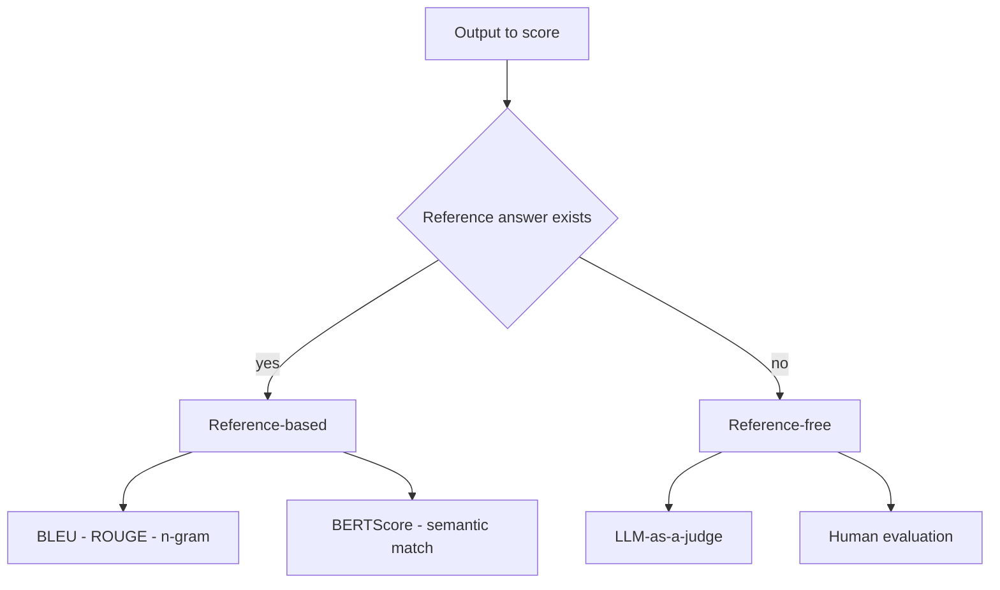
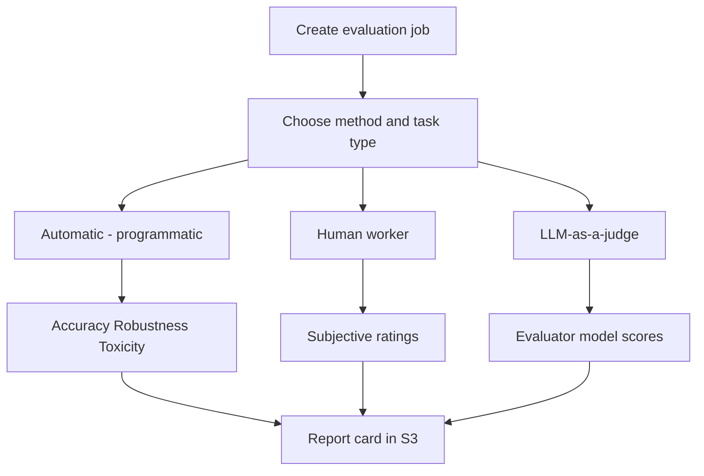
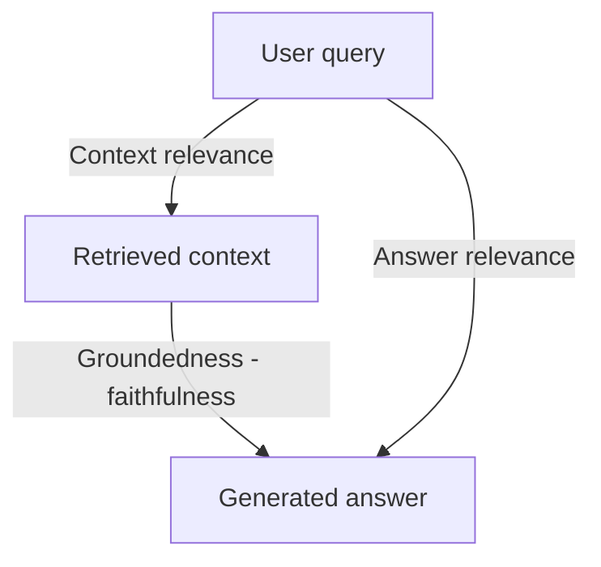
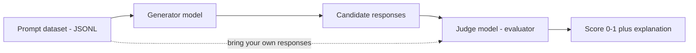
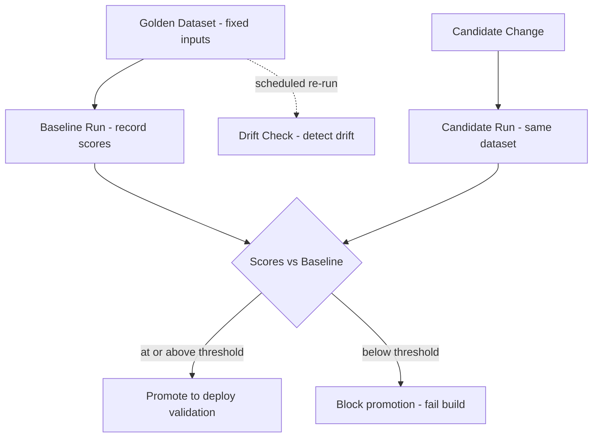
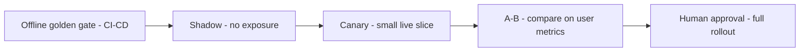
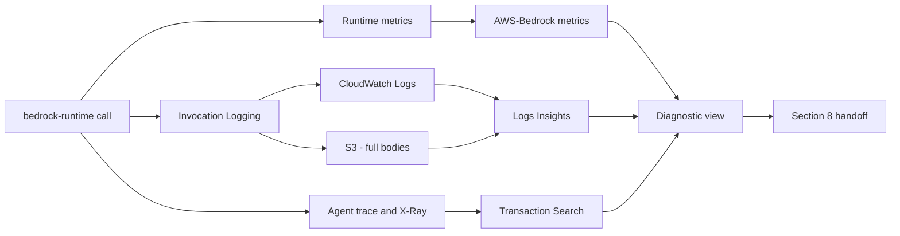
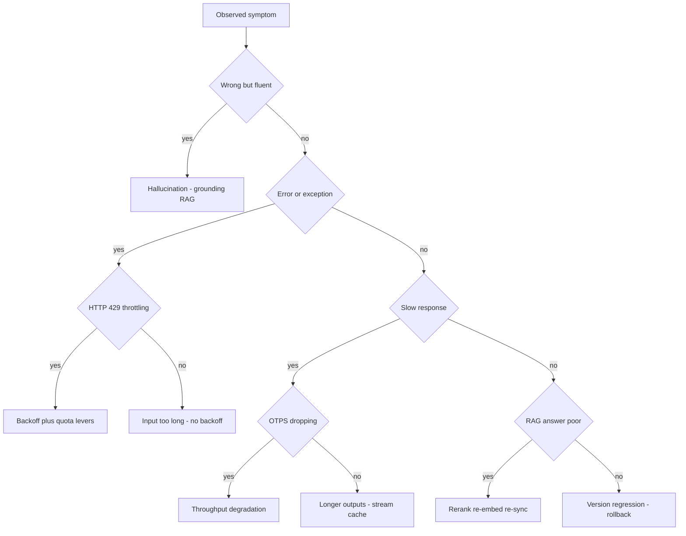
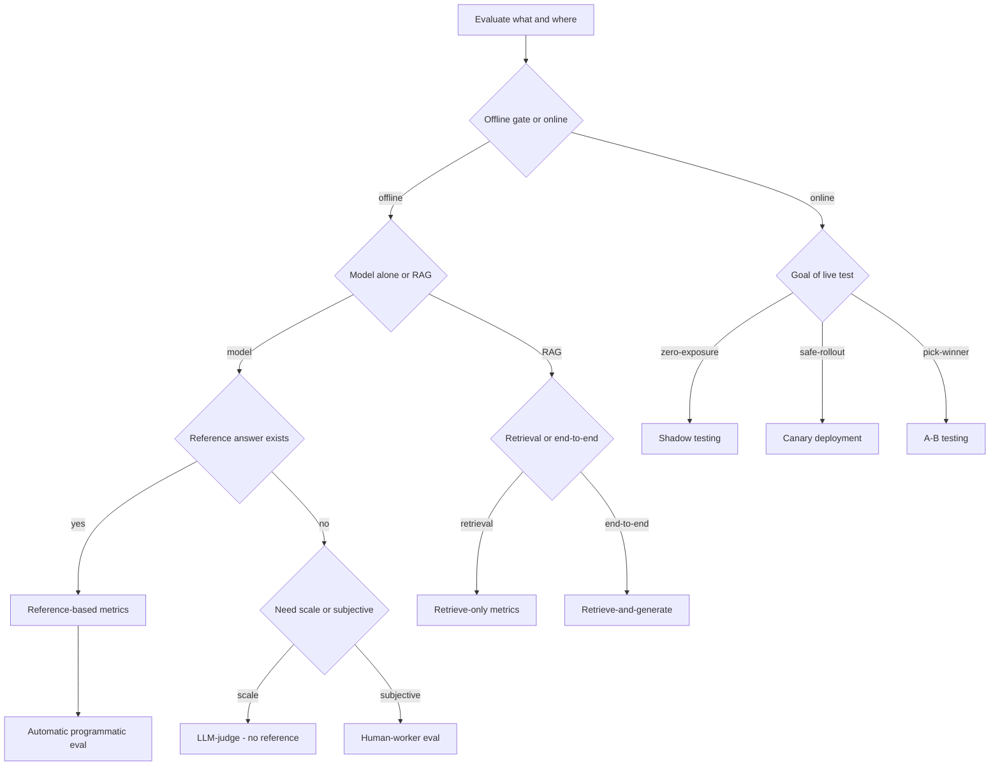

# Testing, Evaluation & Troubleshooting — Deep-Dive Study Guide

## Document Metadata

| Field | Value |
|-------|-------|
| Target Exam | AWS Certified Generative AI Developer - Professional (AIP-C01) |
| Exam Domains Covered | Domain 5: Testing, Validation, and Troubleshooting (11%) |
| Primary Tasks | Task 5.1 (evaluation systems for generative AI), Task 5.2 (troubleshooting generative AI applications) |
| File Position | 06 — the sixth Markdown file in the `AIP/` series by build order (01 → 02 → 06 → 04 → 03 → 08) |
| Study Guide | Guide 08 of the AIP-C01 Study Strategy |
| Exam Pattern Home | Principal home of exam Pattern 6 ("Evaluate FM quality before production") |
| Priority Level | MODERATE by exam weight (11%), but HIGH-leverage — GenAI evaluation differs fundamentally from traditional ML evaluation |
| Prerequisite Knowledge | Guide 01 (Foundation Models & Bedrock Core — model invocation, Converse API, inference parameters, Model Invocation Logging basics), Guide 02 (RAG, Vector Stores & Knowledge Bases — retrieval pipeline and grounding), Guide 04 (Agentic AI — Bedrock Agents, agent tracing, AgentCore observability), Guide 06 (AI Safety, Security & Governance — Guardrails, contextual grounding checks, Responsible AI), Guide 03 (Prompt Engineering & Management — prompt-governance lifecycle and the evaluation machinery it deferred here) |
| Source Material | Official AIP-C01 Exam Guide, Amazon Bedrock User Guide, AWS Well-Architected Generative AI Lens, AIP strategy + blueprint, Guides 01/02/04/06/03, MCP-researched AWS documentation |

> Note on numbering: this is the sixth Markdown file by build order (file 06), following the recommended 01 → 02 → 06 → 04 → 03 → 08 sequence, but its Study Strategy designation is Guide 08. The two values differ numerically — the same file-vs-strategy split seen in Guide 06 (whose metadata records "file 03 / Guide 06") and Guide 03 (whose metadata records "file 05 / Guide 03"). Both values are recorded explicitly above so the convention stays consistent with how Guides 01, 02, 03 (file), 04, and 05 (file) record their file position and strategy number and refer forward and backward to one another.

---

## How to Use This Guide

This is the sixth guide you build in the AIP-C01 textbook series (file 06) and Guide 08 in the recommended study order — the home of the whole of Domain 5 (Testing, Validation, and Troubleshooting — 11%): Task 5.1 (evaluation systems) and Task 5.2 (troubleshooting generative AI applications). The exam weight is moderate, but the material is high-leverage because generative AI evaluation differs fundamentally from traditional ML evaluation, and this guide is the principal home of exam Pattern 6 ("Evaluate FM quality before production"). It stays scoped to GenAI-specific testing, evaluation, and troubleshooting, and cross-references the prior guides where the topics meet rather than duplicating their depth.

This guide is the intentional home of the evaluation-and-troubleshooting depth that the earlier guides reference but defer. Guide 01 established model invocation, the Converse API, inference parameters, and the basics of Model Invocation Logging — drawn on here when teaching observability and deployment-time validation. Guide 02 established the retrieval pipeline and Knowledge Bases architecture — built on directly in the RAG-evaluation section, which measures retrieval and generation quality without re-teaching the pipeline. Guide 04 introduced Amazon Bedrock Agents, agent tracing, and AgentCore observability — cross-referenced when teaching agent evaluation and trace-based troubleshooting. Guide 06 (file 03) owns Guardrails, Responsible AI, and contextual grounding checks — this guide treats grounding and toxicity as evaluation dimensions and points to Guide 06 for the safety-control depth. Guide 03 (file 05) explicitly deferred the evaluation machinery — model evaluation frameworks, evaluation dimensions, LLM-as-a-judge at scale, golden datasets, and the GENOPS03-BP01 baseline-evaluation discipline — to "future Guide 08"; this guide is that Guide 08 and owns that deferred depth, cross-referencing Guide 03 for the prompt-governance lifecycle that consumes these evaluation results.

Each section is written in textbook-depth prose that teaches the reasoning behind each design choice, supplemented by comparison tables and Mermaid diagrams. Every section ends with an Exam-Relevant Distinctions checklist and a collapsible Knowledge Check quiz. Work the quizzes before revealing answers — active recall is what moves this material into long-term memory.

Because Amazon Bedrock Evaluations is a relatively new and fast-moving capability (model evaluation reached general availability after a re:Invent 2023 preview; RAG/Knowledge Base evaluation and LLM-as-a-judge are more recent additions with evolving metrics, supported evaluator models, task types, and Regions), the content for the evaluation sections is verified against current AWS documentation through MCP research rather than written from memory, and any claim that cannot be verified is explicitly flagged rather than presented as fact.

---

## Table of Contents

- [Section 1: Foundation Model Evaluation Fundamentals](#section-1-foundation-model-evaluation-fundamentals)
- [Section 2: Amazon Bedrock Model Evaluation](#section-2-amazon-bedrock-model-evaluation)
- [Section 3: RAG Evaluation](#section-3-rag-evaluation)
- [Section 4: LLM-as-a-Judge Methodology](#section-4-llm-as-a-judge-methodology)
- [Section 5: Golden Datasets / Baselines / Regression Testing](#section-5-golden-datasets--baselines--regression-testing)
- [Section 6: Deployment-Time Validation Patterns](#section-6-deployment-time-validation-patterns)
- [Section 7: Observability & Troubleshooting Instrumentation](#section-7-observability--troubleshooting-instrumentation)
- [Section 8: Common GenAI Failure Modes & Troubleshooting Decision Framework](#section-8-common-genai-failure-modes--troubleshooting-decision-framework)
- [Section 9: Exam Patterns & Quick Reference](#section-9-exam-patterns--quick-reference)
- [AWS Documentation References](#aws-documentation-references)

---

## Section 1: Foundation Model Evaluation Fundamentals

Every other section of this guide — Amazon Bedrock Model Evaluation, RAG evaluation, LLM-as-a-judge, golden datasets, deployment validation, observability, and troubleshooting — rests on a single conceptual shift that this section makes explicit. The shift is this: when you move from a traditional machine-learning classifier to a generative foundation model, the question "is the output correct?" stops having a clean, mechanical answer. Understanding *why* it stops having a clean answer is the foundation of Domain 5, and it is the single idea exam Pattern 6 keeps testing. If you internalize this section, the rest of the guide reads as a catalogue of techniques for coping with one underlying problem: open-ended output has no single right answer to check against.

This section sits squarely in Domain 5 (Testing, Validation, and Troubleshooting — 11% of the exam), Task 5.1, which covers designing and implementing evaluation systems for generative AI. It is also the place where this guide takes ownership of material that Guide 03 (Prompt Engineering & Management, file 05) deliberately set aside. Guide 03 taught the prompt-iteration loop — draft, measure against success criteria, diagnose, adjust — and then explicitly deferred "the measurement machinery — evaluation datasets, metrics, and scoring" to "future Guide 08," which is this guide. The hold-out test-set discipline Guide 03 introduced for prompt tuning is the same baseline-before-promotion logic that golden datasets formalize in Section 5. So when this guide claims to own the evaluation depth, it means precisely the content of this section and the eight that follow: the definitions, the metrics, the services, and the failure framework that the earlier guides pointed toward but did not unpack.

### Why generative output breaks traditional classification metrics

Traditional supervised machine learning evaluates a model by comparing each prediction to a known, fixed label and counting how often the model gets it right. This works because the output space is closed: a spam classifier outputs exactly one of two labels, a sentiment model outputs one of a handful of classes, and a fraud detector outputs a single yes-or-no decision. Against a closed output space with one correct answer per input, the four classic metrics are all well defined. Accuracy is the fraction of predictions that match the ground-truth label. Precision is, of the items the model flagged as positive, the fraction that truly were positive — it punishes false alarms. Recall is, of the items that truly were positive, the fraction the model caught — it punishes misses. F1 is the harmonic mean of precision and recall, a single number that balances the two when you care about both false alarms and misses. Every one of these metrics is built on the same machinery: a confusion matrix of true positives, false positives, true negatives, and false negatives, which can only be tallied when each output is a discrete label drawn from a known set and there is exactly one correct label to compare against.

Open-ended generative output dismantles that machinery at its base. Ask a foundation model to "summarize this incident report for an executive audience" or "explain why our latency spiked last night" and there is no single correct string to compare the output against. Two summaries can use entirely different words, sentence structures, and emphasis and both be excellent; a third can quote the source verbatim and be useless. There is no confusion matrix to build because there are no discrete classes and no canonical label — so precision and recall have nothing to count, accuracy has nothing to match against (an exact-string match against one "correct" answer would reject every valid paraphrase), and F1, being derived from precision and recall, inherits their collapse. Compounding the problem, foundation models are non-deterministic: AWS states plainly that because model outputs are non-deterministic and compute-intensive, traditional performance evaluation is "challenging," and it recommends defining clear performance thresholds and task requirements rather than leaning on a single accuracy figure. The same prompt can produce different valid outputs on different runs, so even the notion of "the" output to score is unstable.

A concrete contrast makes the break vivid. Consider a closed-form task: "Is this transaction fraudulent — yes or no?" The ground truth is a single label, the model emits a single label, and accuracy, precision, recall, and F1 are exactly the right tools — you can tally matches and mismatches mechanically. Now consider an open-ended task built from the same domain: "Write a customer-facing explanation of why this transaction was declined." The ground truth is now a *quality target*, not a string. A good answer must be relevant, factually grounded in the actual decline reason, internally consistent, and fluent — and a dozen differently worded answers can all satisfy those criteria. Running exact-match accuracy here would score a perfectly good explanation as "wrong" simply because it does not match the one reference sentence a labeler happened to write. AWS's own metric design reflects this divide directly: in Amazon Bedrock model evaluation, the closed-form task types are scored with classification-style metrics (question-and-answer uses an F1 score derived from precision and recall on a 0-to-1 scale; text classification uses binary accuracy against a ground-truth label), while the open-ended task types are scored differently — general text generation uses a Real World Knowledge score and summarization uses BERTScore (semantic similarity), not exact-match accuracy. The service draws the closed-versus-open line in the same place this section does.

This is the exact trap exam Pattern 6 plants. A scenario will describe a generative workload — a chatbot, a summarizer, a content generator — and then offer an answer choice that proposes measuring its quality with "accuracy" or "F1 score" as though it were a classifier. That choice is the distractor. Applying classification metrics to open-ended generative output is a category error: the metrics presuppose a closed output space and a single correct label, neither of which a generative task has. When you see traditional accuracy or F1 offered for free-form generated text, recognize it as the canonical Pattern 6 trap and reach instead for the generative-appropriate methods this guide develops — reference-based semantic metrics, reference-free LLM-as-a-judge, human evaluation, and the RAG-specific metrics of Section 3.

### The core GenAI quality dimensions

If a single number cannot capture generative quality, what replaces it is a small set of *quality dimensions*, each isolating one observable property of the output. AWS frames Bedrock Evaluations as covering "correctness, completeness, hallucination detection, and harmfulness," and the SageMaker FMEval framing adds factual knowledge, semantic robustness, and bias. Distilled to the four dimensions this guide uses, each names a different way an output can be good or bad, and — crucially — each fails independently of the others. An output can be fluent and confident while being completely fabricated; it can be factually correct while answering a different question than the one asked. Treating quality as one scalar hides exactly these trade-offs, which is why evaluation decomposes it.

**Relevance** measures whether the output actually addresses the input — whether it answers the question asked and stays on the topic the user raised. The observable property is the fit between the prompt's intent and the response's content. A failure that violates it: a user asks "What is our refund window for digital goods?" and the model returns an accurate, fluent, well-structured paragraph about the refund window for *physical* goods. Nothing in the answer is false, but it does not answer the question, so it fails on relevance even while it might pass on factual accuracy and fluency.

**Factual accuracy** measures whether the claims in the output are true — true about the world, or, in a RAG system, true to the retrieved source. The observable property is the correspondence between the model's assertions and verifiable fact. This is the dimension most associated with hallucination: a hallucination is a confident, plausible-sounding statement that is simply false. AWS measures the world-knowledge version of this with its Real World Knowledge score (a high score indicates the model is accurate about real-world facts) and names hallucination detection explicitly as an evaluation category. A failure that violates it: the model states that your product launched in 2019 when it launched in 2021, or cites a policy clause that does not exist. The answer can be perfectly relevant and beautifully written and still be wrong.

**Consistency** measures whether the model produces stable output for inputs that mean the same thing — whether trivial, meaning-preserving changes to the input leave the output essentially unchanged. AWS makes this concrete through its robustness metric: semantic robustness measures how much a model's output changes under minor, semantic-preserving perturbations such as added typos, case changes, or whitespace edits (each prompt is perturbed several times), and a *low* robustness score means the output is more stable. The observable property is invariance to noise that should not matter. A failure that violates it: a user types "whats my baLance" instead of "What is my balance" and the model, thrown by the casing and missing apostrophe, returns a substantively different or degraded answer. A robust system treats the two as the same request.

**Fluency** measures whether the output is well-formed, readable language — grammatical, coherent, and natural to a human reader. The observable property is linguistic quality independent of whether the content is correct or relevant. A failure that violates it: the model emits a run-on, half-repeated, grammatically broken sentence, or lapses into the wrong language mid-response. Fluency is the dimension modern large models fail *least* often, which is exactly why it is dangerous on its own — an output can be flawlessly fluent and still hallucinate, which is why fluency must never be mistaken for correctness. The closely related safety dimension AWS measures as toxicity (computed with the detoxify algorithm, where a low value indicates little toxic content) guards the harmfulness side of output quality and is owned in depth by Guide 06.

### Reference-based versus reference-free evaluation

Once quality is decomposed into dimensions, the next question is *how* you score a dimension automatically. There are two families of automated method, and the line between them is the single most useful classification in this section: the deciding criterion is whether you have a ground-truth (reference) answer to compare against.

**Reference-based evaluation** scores a candidate output by comparing it to a known, human-curated correct answer — the reference. It requires you to have that reference in hand. Within this family there are two sub-styles that the exam expects you to tell apart. The first is *n-gram overlap* metrics, which score how many word sequences the candidate shares with the reference. ROUGE (recall-oriented, the standard for summarization) and BLEU (precision-oriented, the standard for translation) are the canonical n-gram metrics — they are fast, cheap, and language-mechanical, but they are also "superficial": they reward surface word overlap and penalize a correct answer that simply uses different words than the reference. The second sub-style is *semantic-similarity* metrics, which fix that superficiality by comparing meaning rather than exact words. BERTScore is the named example: AWS describes it as calculated "using pre-trained contextual embeddings from BERT models," matching words in the candidate and reference sentences by cosine similarity, and Bedrock uses it to score summarization. Because BERTScore compares a candidate against a reference, it is still reference-based — but because it compares embeddings rather than literal n-grams, it credits a correct paraphrase that ROUGE or BLEU would penalize.

**Reference-free evaluation** scores a candidate output *without* a gold answer, by judging it against defined criteria instead. This is the only option for the large class of real generative tasks where no single correct answer exists or where curating references for every input is infeasible. The named reference-free method is LLM-as-a-judge: a separate "judge" foundation model reads the output (and optionally the prompt and any context) and scores it against criteria such as correctness, completeness, relevance, or faithfulness. AWS offers this within Bedrock Evaluations using curated judge models with optimized prompt engineering, so you are not required to hand it a reference answer. Section 4 develops the methodology — its benefits, its biases, and its configuration — in full; here it matters only as the archetype of reference-free scoring.

The decision criterion, then, is simply the availability of a ground-truth answer. If you have curated reference answers for your inputs, reference-based metrics apply — choose semantic-similarity (BERTScore) over n-gram (BLEU, ROUGE) when valid answers will be phrased differently than the reference. If you do not have, or cannot feasibly create, reference answers, you need a reference-free method such as LLM-as-a-judge (or human evaluation). The following diagram captures the choice.

> **Note on BLEU:** ROUGE, F1, and BERTScore are named directly in the Amazon Bedrock evaluation documentation reviewed for this guide; BLEU is *not* separately named on those pages. BLEU is presented here as the well-established n-gram precision counterpart to ROUGE (it is the field-standard n-gram metric for machine translation, just as ROUGE is for summarization), so that the n-gram family is complete. Treat the BLEU-versus-ROUGE pairing as field-standard knowledge rather than a verbatim AWS-documented Bedrock metric, and flag it as such if a question demands a BLEU-specific AWS citation.

### Human evaluation as the benchmark, and why it does not scale

Underneath every automated method is a benchmark it is trying to approximate: human judgment. The reason automated metrics exist at all is to stand in for a person reading the output and deciding whether it is good. AWS makes this hierarchy explicit when it describes LLM-as-a-judge as achieving "human-like evaluation quality" — the praise reveals that human evaluation is the gold standard the automated method is measured against, not the other way around. Human evaluation also captures dimensions that no automated metric reaches well: AWS positions human evaluators (company employees or industry subject-matter experts) as the way to assess subjective qualities like friendliness, writing style, and alignment with a brand voice, and Bedrock's human-evaluation workflow exists precisely so a person can rate outputs on criteria a script cannot.

If human evaluation is the most trustworthy signal, why not use it for everything? Because it does not scale, and AWS quantifies the limits. A human evaluation work team in Bedrock is a private workforce of up to 50 chosen workers, managed through Amazon SageMaker Ground Truth; a single human-based evaluation job accepts up to 1,000 prompts and can compare at most two inference sources at once. AWS describes human evaluation candidly as "a complex and labor-intensive process." Translate those numbers into the three limitations that motivate automation. The cost limitation: every rating is paid human time, and ratings must often be collected in duplicate for reliability, so cost grows linearly with the number of outputs scored. The time limitation: a human rater processes outputs at human speed, so evaluating thousands of responses takes days or weeks, which is fatally slow when you want to gate every deployment or re-run a benchmark nightly. The scale limitation: with a hard ceiling around a thousand prompts per job and fifty workers per team, human evaluation simply cannot cover the input volume or the iteration cadence that a production generative system generates. These three pressures are the entire reason automated and LLM-as-a-judge methods exist. AWS frames LLM-as-a-judge as delivering human-like quality with "up to 98% cost savings" and dramatically reduced evaluation time relative to human evaluation — the trade is a small loss of fidelity for an enormous gain in cost, speed, and scale, which is the central economic argument of Section 4.

> **Flag — blog-sourced figure:** The "up to 98% cost savings" number comes from an AWS Machine Learning blog announcing LLM-as-a-judge on Amazon Bedrock model evaluation, not from the Bedrock User Guide. It was current at the time of research but is a marketing-context figure; treat the *direction* (large cost and time reduction versus human evaluation) as the durable, exam-relevant claim and the exact percentage as illustrative rather than a hard, User-Guide-verified specification.

### Traditional ML evaluation versus generative AI evaluation

The table below consolidates the contrast that runs through this section. It is the mental model to carry into Pattern 6: when a scenario describes generative output, the right-hand column is in play, and any answer reaching for the left-hand column's tools on open-ended text is the trap.

| Dimension | Traditional ML evaluation | Generative AI evaluation |
|---|---|---|
| Output space | Closed — a fixed set of labels or a number | Open — free-form text with many valid forms |
| Correct answer | One canonical label per input | A quality target; many phrasings can be correct |
| Core metrics | Accuracy, precision, recall, F1 | Relevance, factual accuracy, consistency, fluency dimensions |
| How scored | Exact match to the ground-truth label | Reference-based (n-gram, semantic) or reference-free (LLM-as-a-judge, human) |
| Determinism | Deterministic — same input gives same prediction | Non-deterministic — same prompt can give varied valid outputs |
| Role of a reference | Always present (the label) | Sometimes absent — drives the reference-based vs reference-free choice |
| Human evaluation | Rarely needed once labeled | Often the benchmark automated methods approximate |
| Bedrock metric examples | F1 for question-and-answer; binary accuracy for classification | Real World Knowledge for general generation; BERTScore for summarization; robustness; toxicity |
| Failure if mismatched | — | Applying accuracy/F1 to open-ended text (Pattern 6 trap) |

### Exam-Relevant Distinctions

| If the exam says... | The answer is... | Why |
|---|---|---|
| "Measure chatbot/summarizer quality with accuracy or F1" | Distractor — Pattern 6 trap | Classification metrics need a closed output space and one correct label; generative output has neither |
| "Closed-form task — classify, yes/no, single label" | Accuracy / precision / recall / F1 are valid | A confusion matrix exists when each output is one label from a known set |
| "A correct answer is phrased differently than the reference" | BERTScore (semantic similarity), not BLEU/ROUGE | n-gram overlap penalizes valid paraphrases; embeddings compare meaning |
| "No gold/reference answer available" | Reference-free — LLM-as-a-judge or human | Reference-based metrics require a ground-truth answer to compare against |
| "Gold reference answers are available" | Reference-based metrics apply | The deciding criterion is whether a reference answer exists |
| "Assess friendliness, brand voice, subjective style" | Human evaluation | Subjective qualities are what human workers capture and scripts miss |
| "Evaluate thousands of outputs nightly / cheaply / at scale" | Automated or LLM-as-a-judge, not human | Human eval is cost-, time-, and scale-limited (up to 50 workers, up to 1,000 prompts/job) |
| "Output is fluent and confident, therefore correct" | Distractor — fluency ≠ accuracy | Fluency and factual accuracy fail independently; fluent text can hallucinate |

- The four classic metrics rest on a confusion matrix (true/false positives and negatives); without discrete labels and one correct answer, there is nothing to tally.
- F1 is the harmonic mean of precision and recall — it collapses for generative output precisely because precision and recall do.
- BLEU = precision-oriented n-gram, the translation standard; ROUGE = recall-oriented n-gram, the summarization standard. Both are reference-based and "superficial" (reward surface word overlap).
- BERTScore is reference-based but semantic — it needs a reference yet compares embeddings by cosine similarity, so it credits paraphrases.
- LLM-as-a-judge is the named reference-free method; human evaluation is also reference-free in that it needs no gold string.
- Robustness (low score = more stable) is AWS's name for the consistency dimension; it is measured by perturbing each prompt with semantic-preserving noise.
- Real World Knowledge (high score = accurate) is the general-text-generation accuracy metric; toxicity (low value = safe) is computed with the detoxify algorithm.
- Ground-truth data is "also known as a golden dataset" — the bridge from this section to Section 5.

### 🧠 Knowledge Check

Q1: A team ships a customer-support summarization feature on Amazon Bedrock and proposes measuring its quality with an accuracy score against one reference summary per ticket. Why is this the wrong choice, and what is the better approach?

- A) Accuracy is fine; just lower the match threshold to allow near-misses
- B) Exact-match accuracy rejects valid paraphrases; use a semantic metric like BERTScore or an LLM-as-a-judge
- C) Switch to precision and recall, which handle free-form text natively
- D) Summaries can't be evaluated at all; rely only on user complaints

**Answer: B** — Summarization is open-ended: many differently worded summaries are correct, so exact-match accuracy against a single reference penalizes good paraphrases. The generative-appropriate choices are a semantic-similarity metric (BERTScore, which Bedrock uses for summarization) when references exist, or a reference-free LLM-as-a-judge when they do not. Option A still anchors on one reference. Option C is wrong because precision and recall also need a confusion matrix that free-form text lacks. Option D overcorrects — generative output is evaluable, just not with classification metrics.

Q2: True or False — Because a foundation model's response is grammatical, coherent, and confident, it can be treated as factually correct for evaluation purposes.

**False.** Fluency and factual accuracy are independent quality dimensions that fail separately. A model can produce flawlessly fluent text that is entirely fabricated — that is exactly what a hallucination is. Evaluation decomposes quality into separate dimensions (relevance, factual accuracy, consistency, fluency) precisely so that a high fluency reading cannot be mistaken for correctness; factual accuracy must be measured on its own (for example via a Real World Knowledge score or, in RAG, a faithfulness/groundedness metric).

Q3: Fill in the blank — The single deciding criterion between reference-based and reference-free evaluation is the availability of a ___ answer. Among reference-based metrics, ___ and ROUGE compare n-gram overlap, while ___ compares meaning via contextual embeddings.

**Answer:** ground-truth (reference); BLEU; BERTScore. Reference-based methods need a curated correct answer to compare against; reference-free methods (LLM-as-a-judge, human evaluation) do not. BLEU (precision-oriented) and ROUGE (recall-oriented) are the n-gram-overlap metrics; BERTScore is reference-based but semantic, matching candidate and reference by cosine similarity so it credits valid paraphrases that n-gram metrics would penalize.

Q4: Scenario — A regulated bank must evaluate 40,000 generated loan-explanation responses before launch and re-run the benchmark on every model update. Leadership first proposes having subject-matter experts rate every response. What is the limitation, and what is the scalable design?

**Answer:** Human evaluation is the most trustworthy signal but does not scale to this volume or cadence — a Bedrock human work team is capped around 50 workers and a human-based job around 1,000 prompts, and AWS calls the process complex and labor-intensive, so 40,000 responses re-scored on every update is infeasible on cost and time. The scalable design uses humans to calibrate a smaller sample, then runs automated evaluation (programmatic metrics and/or LLM-as-a-judge) across the full set for the repeated, large-scale scoring — capturing most of the human-like judgment at a fraction of the cost and time. Reserve human raters for subjective dimensions (tone, brand voice) and for periodically re-calibrating the automated scorers.

Q5: An exam item describes a generative chatbot and offers four evaluation choices. Which one is the classic Pattern 6 trap, and why?

- A) Use an LLM-as-a-judge to score relevance and faithfulness
- B) Compute a traditional F1/accuracy score on the chatbot's free-form replies
- C) Build a golden dataset and run reference-based semantic scoring
- D) Collect human ratings on a sampled subset for calibration

**Answer: B** — Applying traditional accuracy or F1 to open-ended generated text is the canonical Pattern 6 trap. Those metrics presuppose a closed output space and a single correct label, which a free-form chatbot reply does not have, so the metric is a category error. A, C, and D are all legitimate generative-evaluation approaches (reference-free judging, reference-based semantic scoring, and human calibration). When you see classification metrics offered for free-form generated output, eliminate that choice first.

> **Source attribution:** The non-determinism of foundation models and the resulting "challenging" nature of traditional performance evaluation are MCP-researched from the AWS Well-Architected Generative AI Lens (GENOPS01-BP01, GENPERF01, GENPERF02). The closed-form-versus-open-ended metric split — question-and-answer scored with NLP-F1, text classification with binary accuracy, general text generation with the Real World Knowledge score, and summarization with BERTScore — together with the robustness (semantic-perturbation), Real World Knowledge, and toxicity (detoxify) metric definitions, is from the Amazon Bedrock User Guide model-evaluation task-types and programmatic-report pages. The quality-dimension framing (correctness, completeness, hallucination detection, harmfulness) and the three-method/reference-based-versus-reference-free pairing are from the Amazon Bedrock Evaluations product page and the Bedrock evaluation overview; the BERTScore "contextual embeddings / cosine similarity" definition is from the Bedrock programmatic-metrics page. The ROUGE-and-F1 "superficiality" contrast motivating reference-free LLM-as-a-judge is from the AWS RAG-evaluation Machine Learning blog (blog-sourced); BLEU is presented as the field-standard n-gram counterpart to ROUGE and is flagged above as not separately named in the AWS pages reviewed. The human-evaluation limits (a private work team of up to 50 workers via SageMaker Ground Truth, up to 1,000 prompts and two inference sources per human job, and the "complex and labor-intensive" characterization) are from the Bedrock human-worker-evaluation User Guide pages and the GA/preview announcement blogs; the "up to 98% cost savings" figure is flagged above as blog-sourced (the LLM-as-a-judge on Amazon Bedrock blog) rather than User-Guide-verified. The "ground-truth data, also known as a golden dataset" link is from Well-Architected GENPERF01-BP01, carried forward to Section 5.

---

## Section 2: Amazon Bedrock Model Evaluation

Section 1 established *why* generative evaluation is hard and *which* dimensions and metric families exist to cope with it. This section is where those ideas become a managed AWS service. Amazon Bedrock Evaluations is the concrete answer to the question Pattern 6 keeps asking — "how do you actually evaluate a foundation model's quality before production?" — and Task 5.1 expects you to know its three evaluation methods, how an evaluation job is assembled, the built-in metrics it computes, the task types it supports, and the difference between built-in and custom datasets and between AWS-managed and custom work teams. Everything in this section is verified against the Amazon Bedrock User Guide except where a claim is explicitly flagged as blog-sourced or fast-moving; those flags matter because Bedrock Evaluations is a young, rapidly changing capability and the exam rewards knowing the durable shape of the feature rather than a model-version list that will be stale by the time you sit the test.

### What Amazon Bedrock Evaluations is and the problem it solves

Amazon Bedrock Evaluations lets you measure the performance and effectiveness of Amazon Bedrock models and knowledge bases — and, through bring-your-own-inference, of models and Retrieval Augmented Generation sources that live outside Bedrock as well. In plain terms, it turns the abstract quality dimensions of Section 1 into numbers you can compare. Bedrock can compute metrics such as the semantic robustness of a model or the correctness of a knowledge base at retrieving information and generating responses, and it presents the results as a report card you can read side by side across candidate models.

The problem it solves is the one every team faces at the start of a generative project: of the many foundation models available, which one is actually best for *this* use case, and is the chosen model good enough to put in front of users? Without a structured evaluation, teams fall back on what AWS's own field guidance calls "vibe testing" — eyeballing a handful of outputs and forming an impression. That does not scale, is not repeatable, and gives you nothing to defend a launch decision with. Bedrock Evaluations replaces the impression with a quantitative, repeatable benchmark: the same prompts, scored the same way, across every model you are weighing, so that model selection and the go/no-go decision rest on evidence. This is the service that sits behind exam Pattern 6's canonical answer shape — when a scenario says "compare foundation models for a use case" or "validate model quality before production," Bedrock Evaluations is the tool the question is steering you toward.

The models you can put *under* evaluation are broader than just the base foundation models. Bedrock model evaluation jobs support foundation models, Amazon Bedrock Marketplace models, customized (fine-tuned) foundation models, imported foundation models, prompt routers, and models you have purchased Provisioned Throughput for. That breadth is the point: whatever form your candidate model takes, you can subject it to the same benchmark.

> **Flag — GA-versus-preview status is blog-verified, not User-Guide-stamped.** Amazon Bedrock model evaluation was first shown as a preview at re:Invent 2023 and is now generally available. The "generally available" wording comes from the AWS News Blog GA announcement, which was current at the time of research; the Bedrock User Guide feature pages document the capability in full but do not themselves carry a GA-versus-preview label. Treat the capability as GA for exam purposes, but understand that the GA claim is blog-sourced rather than stamped on the User Guide, and that RAG/Knowledge Base evaluation and LLM-as-a-judge are more recent additions whose metrics, evaluator models, task types, and Regions are still evolving.

### The three evaluation methods

The Bedrock evaluation overview names exactly three ways to evaluate a model. They map cleanly onto the reference-based/reference-free/human triad from Section 1, and the exam's job is usually to make you pick the right one for a described situation.

The first is automatic — also called programmatic — model evaluation. You hand Bedrock a dataset of prompts (a built-in benchmark dataset or your own custom dataset) and it computes objective metric scores for a task without any human in the loop. This is the right choice when the task is structured enough to be scored mechanically and you want fast, cheap, repeatable numbers — for example, scoring question-and-answer accuracy or measuring robustness across a few thousand prompts in a nightly run. Its strength is speed and repeatability; its limit is that it can only score what a deterministic metric can capture.

The second is human-worker evaluation. Here actual people — your own employees or industry subject-matter experts — read the model's responses and rate them against instructions you write. This is the right choice precisely when automatic metrics fall short: subjective qualities such as friendliness, writing style, brand-voice alignment, or domain-expert judgment that no script measures well. Section 1 established human evaluation as the trustworthy benchmark that does not scale, and that trade-off is exactly why this method coexists with the other two rather than replacing them.

The third is LLM-as-a-judge evaluation, in which a second foundation model — the evaluator, or judge, model — scores each response and produces a written explanation for its score. This is the right choice when you want judgment that is more nuanced and human-like than a deterministic metric, but at a scale, speed, and cost that human evaluation cannot reach. It is the bridge between the other two methods: more semantic than programmatic scoring, far cheaper and faster than human scoring. Because the judge methodology has real subtleties — judge biases, the need for calibration, and its specific Bedrock configuration — this guide develops it in full in Section 4; here it is enough to know it exists as the third model-evaluation method and when to reach for it. (A fourth, closely related capability — LLM-based RAG/Knowledge Base evaluation — applies the judge idea to retrieval pipelines and is the subject of Section 3.)

The diagram below shows how the three methods branch from a single evaluation job and converge on a single report card written to Amazon S3.

### How an evaluation job is structured and created

An evaluation job is the unit of work, and you create one the same three ways you do most Bedrock operations: through the console (which offers a guided wizard), through the AWS CLI (`aws bedrock create-evaluation-job`), or through an SDK (`create_evaluation_job`). Whichever entry point you use, the job is assembled from the same handful of components, and understanding them is what lets you answer the "what does an evaluation job need?" style of exam question.

At the center is the input prompt dataset — either a built-in benchmark dataset (available for automatic jobs only) or a custom JSONL dataset you stage in Amazon S3 (covered in detail below). The evaluation configuration declares what kind of job this is: an automated configuration carries one or more dataset-and-metric specifications, each naming a task type, the dataset to use, and the metric names to compute; a human-based configuration instead describes the rating workflow and work team. The inference configuration names the model or models under evaluation by their identifier (a foundation-model ARN, and optionally an inference-profile ARN for cross-Region inference), and can set inference parameters such as max tokens, temperature, and top-p so the candidate is exercised the way it will run in production.

Where the method calls for it, the job also names an evaluator model — the model that does the scoring. This is required for LLM-as-a-judge and for RAG evaluations and is not used for pure programmatic metric computation. It is worth being precise about the two distinct roles in a judge job: a generator model produces the responses, and a separate evaluator model scores them. Two more components are mandatory for every job regardless of method. An IAM service role (the job's `roleArn`) grants Bedrock permission to read the input dataset and write results in S3 and to invoke the models involved; the console can create a suitable role for you. And the S3 input/output locations specify where the input dataset lives (for custom datasets) and the output directory (`outputDataConfig.s3Uri`) where Bedrock writes the report card and results. Optional additions include a customer-managed KMS key for encryption, resource tags, and a job name and description, where the name must be unique within the account and Region.

A useful exam-anchoring detail: a minimal automatic job in the User Guide's own example needs only a job name, the service role ARN, the model identifier under `inferenceConfig`, the S3 output URI, and an automated evaluation configuration whose dataset-metric entry sets the task type (for example, question-and-answer), the built-in dataset (for example, the BoolQ benchmark), and the metric names (for example, accuracy and robustness). One operational caveat is worth memorizing because AWS calls it out explicitly: for human-based jobs the S3 *output* bucket must have CORS permissions configured, whereas CORS is *not* required for LLM-as-a-judge jobs.

### Built-in metrics and supported task types

Automatic evaluation organizes its scoring into three metric categories — accuracy, robustness, and toxicity — and supports four task types: general text generation (open-ended), text summarization, question and answer, and text classification. The exam-critical subtlety, and the thing most candidates miss, is that the *category names stay constant but the underlying computed metric changes with the task type*. "Accuracy" does not mean the same arithmetic for a summarizer as it does for a classifier; it means whatever metric correctly captures correctness for that task. The mapping below is the verified per-task-type breakdown, and it is the same closed-versus-open split Section 1 drew: closed-form task types (question-and-answer, classification) compute classification-style metrics, while open-ended task types (general generation, summarization) compute semantic or knowledge-based metrics.

| Task type | Accuracy metric | Robustness metric | Toxicity metric |
|---|---|---|---|
| General text generation | Real World Knowledge score | Word Error Rate | Toxicity (detoxify) |
| Text summarization | BERTScore | BERTScore and deltaBERTScore | Toxicity (detoxify) |
| Question and answer | NLP-F1 | F1 and deltaF1 | Toxicity (detoxify) |
| Text classification | Binary accuracy | classification accuracy and delta | Not listed |

Reading the categories in plain language: accuracy asks "is the output correct?" and is computed as a Real World Knowledge score for open-ended generation (a high score means the model encodes accurate real-world facts), as BERTScore semantic similarity for summarization, as an NLP-F1 score for question-and-answer, and as binary accuracy against the ground-truth label for classification. Robustness asks "is the output stable under trivial, meaning-preserving changes to the input?" — Bedrock perturbs each prompt roughly five times using semantic-preserving noise (lowercasing, keyboard-style typos, whitespace edits, number-to-word conversion, random case changes) and reports how much the score moves, so a smaller delta means a more consistent, more reliable model. Toxicity asks "is the output harmful?" and is computed with the detoxify algorithm, where a low value means the model is producing little toxic content. Note one gap the table makes explicit: toxicity is listed as a category for general generation, summarization, and question-and-answer, but it is *not* listed for text classification in the task-type table — a precise distinction worth carrying into the exam.

For completeness, LLM-as-a-judge model evaluation exposes a different, richer set of built-in metrics — correctness, completeness, faithfulness, helpfulness, logical coherence, relevance, following instructions, professional style and tone, harmfulness, stereotyping, and refusal — each scored by the evaluator model using its own evaluator prompt, with correctness and completeness able to use an optional ground-truth reference. Those judge metrics belong to Section 4's deep dive; what matters here is that the *automatic* method's three categories (accuracy, robustness, toxicity) are distinct from the *judge* method's metric menu, and the exam can test either.

### Built-in versus custom prompt datasets

A built-in dataset is a recognized benchmark that Amazon Bedrock provides and selects per task type — the BoolQ, NaturalQuestions, and TriviaQA datasets for question-and-answer, TREX for general generation, Gigaword for summarization, and so on. Built-in datasets are available for automatic evaluation jobs only, and they are the convenience option: they let you benchmark a model against a well-known dataset when you do not have labeled data of your own.

A custom dataset is your own prompts, supplied in JSON Lines format — a file with a `.jsonl` extension stored in Amazon S3, where each line is a self-contained, valid JSON object and a single job allows up to 1,000 prompts. The line schema is small: `prompt` is the required input text; `referenceResponse` is the optional ground-truth answer (used, for example, to compute completeness and correctness in judge jobs); and `category` is an optional label that enables per-category score breakdowns. For bring-your-own-inference scenarios — where you have already generated responses and just want them scored — you add a `modelResponses` field carrying the response text and the model identifier, and Bedrock skips the generation step and scores your pre-generated outputs directly.

Knowing *when a custom dataset is required* is the exam-relevant payoff. A custom dataset is required whenever the task is not covered by a built-in benchmark, whenever you need prompts (and ground-truth answers) that actually represent your use case rather than a generic academic dataset, for all human-worker jobs, and for judge and RAG jobs — none of which use the automatic built-in benchmark datasets. Put the other way around: built-in datasets are an automatic-evaluation convenience, and the moment your evaluation needs to reflect your real workload or use any method other than automatic, you are supplying a custom JSONL dataset.

### AWS-managed versus custom work teams

Human-worker evaluation needs people to do the rating, and Bedrock recognizes two ways to staff that work. A custom (bring-your-own) work team is a group of up to 50 workers that *you* choose — company employees or industry subject-matter experts — managed as a private workforce through Amazon SageMaker Ground Truth. You can reuse existing teams from Amazon Cognito, SageMaker Ground Truth, or Amazon Augmented AI, invite workers by email (up to 50 addresses at a time), write the rating instructions yourself, and add, remove, or disable workers through the Cognito or Ground Truth console; workers are notified only when first added to a team. The scale ceilings from Section 1 apply here: a human-based job allows up to 1,000 prompts and can compare up to two inference sources at once.

An AWS-managed work team is the alternative in which AWS supplies the reviewers, so you do not have to recruit, vet, and manage your own workforce. The practical distinction the exam wants is the staffing model: choose a custom work team when the rating requires *your* employees or domain experts (for confidentiality, specialized knowledge, or brand-specific judgment), and consider an AWS-managed team when you want human evaluation without standing up and operating a private workforce of your own.

> **Flag — AWS-managed work team existence is blog-verified.** The custom/private-workforce path (up to 50 workers via SageMaker Ground Truth, the email-invite and Cognito/Ground Truth management mechanics, and the up-to-1,000-prompt job limit) is verified against the Amazon Bedrock User Guide human-worker-evaluation pages. The existence of an *AWS-managed* work team as an alternative is verified from the GA announcement blog (and the original preview blog), which states that model evaluation "supports both custom work teams and AWS-managed teams for human evaluations"; the human-worker User Guide page itself documents the custom path in detail rather than spelling out the managed-team mechanics. Treat "custom = up to 50, SageMaker Ground Truth private workforce" as User-Guide-verified and "AWS-managed team exists as an option" as blog-verified.

### A note on evaluator models and Regions

> **Flag — the exact evaluator-model version list is a research-time snapshot.** For LLM-as-a-judge and RAG evaluations, Bedrock supports a specific set of evaluator models spanning four families — Amazon Nova, Anthropic Claude, Meta Llama, and Mistral — and supports cross-Region inference profiles for them. The precise model-version list (which Nova tiers, which Claude generations and tiers, which Llama and Mistral versions are eligible as evaluators) changes frequently as new models ship. Treat the four *families* as the stable, exam-durable fact and treat any specific version list as a snapshot at research time that must be re-checked against the live Bedrock "evaluator models" documentation page before relying on it.

> **Flag — Region availability is not statically listed.** The Bedrock User Guide's supported-Regions page for model evaluation does not enumerate a fixed Region list; it directs you to the per-model "models at a glance" cards to check model-evaluation compatibility per model and Region. Do not memorize or assert a fixed Region list — model-evaluation Region support is model-specific, and the authoritative source is the live model cards rather than a static list in this guide.

### Exam-Relevant Distinctions

| If the exam says... | The answer is... | Why |
|---|---|---|
| "Compare foundation models / validate quality before production" | Amazon Bedrock Evaluations | This is Pattern 6's canonical service for evidence-based model selection |
| "Fast, cheap, repeatable scoring of a structured task" | Automatic (programmatic) evaluation | Computes objective metrics with no human in the loop |
| "Rate friendliness, brand voice, subjective style" | Human-worker evaluation | Subjective qualities are what humans capture and scripts miss |
| "Nuanced human-like scoring at scale without human cost" | LLM-as-a-judge evaluation | Evaluator model scores and explains; cheaper/faster than humans (see Section 4) |
| "Evaluate on our own use-case prompts" | Custom JSONL dataset in S3 | Built-in datasets are generic benchmarks for automatic jobs only |
| "Use a recognized benchmark, no labeled data of our own" | Built-in dataset | Built-in benchmarks exist for automatic jobs as a convenience |
| "Reviewers must be our own employees / domain experts" | Custom work team | Up to 50 workers, private workforce via SageMaker Ground Truth |
| "Human evaluation without managing a workforce" | AWS-managed work team | AWS supplies reviewers (existence blog-verified) |
| "Which job needs an evaluator model?" | LLM-as-a-judge and RAG jobs | Automatic metric computation does not use an evaluator model |
| "Human-based job's S3 output bucket fails to write" | Configure CORS on the output bucket | CORS is required for human jobs, not for judge jobs |

- The three model-evaluation methods are automatic/programmatic, human-worker, and LLM-as-a-judge; a fourth related capability, LLM-based RAG/Knowledge Base evaluation, is covered in Section 3.
- Automatic metric categories are accuracy, robustness, and toxicity — but the computed metric changes by task type (RWK or BERTScore or NLP-F1 or binary accuracy for accuracy).
- Supported task types: general text generation, text summarization, question and answer, text classification.
- Toxicity is listed for general generation, summarization, and Q&A — not for text classification.
- Robustness perturbs each prompt about five times with semantic-preserving noise; a lower delta means a more stable model.
- Custom datasets are JSONL in S3, up to 1,000 prompts, keys `prompt` (required), `referenceResponse` and `category` (optional); built-in datasets are automatic-jobs-only.
- A custom dataset is required for human and judge/RAG jobs and for any task not covered by a built-in benchmark.
- Custom work team = up to 50 of your workers via SageMaker Ground Truth; AWS-managed team = AWS-supplied reviewers.
- An evaluation job is created via console, `aws bedrock create-evaluation-job`, or the SDK `create_evaluation_job`, and always needs an IAM service role and S3 input/output locations.

### 🧠 Knowledge Check

Q1: A team wants to choose between three foundation models for a customer-support question-and-answer feature and needs fast, repeatable, low-cost scoring across 3,000 labeled prompts. Which Bedrock evaluation method fits, and what accuracy metric will it compute?

- A) Human-worker evaluation, scored by subject-matter experts
- B) LLM-as-a-judge evaluation, scored by an evaluator model
- C) Automatic (programmatic) evaluation, scored with NLP-F1
- D) Automatic evaluation, scored with BERTScore

**Answer: C** — The task is structured (question-and-answer) with labeled data, and the requirement is fast, repeatable, low-cost scoring, which is exactly automatic/programmatic evaluation. For the question-and-answer task type, the accuracy category is computed as NLP-F1. Option D names the summarization accuracy metric (BERTScore), not Q&A. Options A and B add human or judge-model cost and latency that the scenario explicitly wants to avoid.

Q2: True or False — In Amazon Bedrock automatic model evaluation, selecting the "accuracy" metric computes the same underlying score regardless of the task type you choose.

**False.** The category name "accuracy" stays constant, but the underlying computed metric changes with the task type: a Real World Knowledge score for general text generation, BERTScore for summarization, NLP-F1 for question-and-answer, and binary accuracy for text classification. Treating "accuracy" as one fixed computation across task types is a common misconception the exam can exploit.

Q3: Fill in the blank — A custom prompt dataset for a Bedrock evaluation job must be stored in Amazon S3 in ______ format with a `.jsonl` extension, and a single job allows up to ______ prompts.

**Answer:** JSON Lines (JSONL) format; up to 1,000 prompts. Each line is a self-contained valid JSON object whose required key is `prompt`, with optional `referenceResponse` (ground-truth answer) and `category` (per-category scoring) keys.

Q4: Scenario — A bank must run human evaluation on generated loan-decision explanations. The ratings require the bank's own compliance specialists because of confidentiality and domain expertise, and the dataset is the bank's proprietary prompts. Which work-team and dataset choices apply?

**Answer:** Use a custom (bring-your-own) work team — up to 50 of the bank's own compliance specialists, managed as a private workforce through Amazon SageMaker Ground Truth — because the ratings require confidential, domain-expert judgment that an AWS-managed team cannot provide. The dataset must be a custom JSONL dataset in S3 (human-worker jobs do not use built-in benchmark datasets, and the prompts are proprietary). Remember the human-job ceilings: up to 1,000 prompts and at most two inference sources compared at once, and configure CORS on the S3 output bucket for human-based jobs.

Q5: What Went Wrong? — An engineer configures an LLM-as-a-judge evaluation job but provides only an `inferenceConfig` naming the model under evaluation and an S3 output location. The job cannot score the responses. What is missing?

**Answer:** A judge job requires an evaluator model — the model that scores the responses and writes an explanation — in addition to the generator model under evaluation. Pure automatic metric computation does not use an evaluator model, but LLM-as-a-judge (and RAG) evaluations do, so the configuration must name it. (Separately, an IAM service role with S3 read/write and model-invoke permissions is mandatory for every job, and the evaluator model must be one of the supported judge models — the families are Amazon Nova, Anthropic Claude, Meta Llama, and Mistral, with the exact version list a research-time snapshot to re-verify.)

> **Source attribution:** The purpose of Amazon Bedrock Evaluations (measuring Bedrock models and knowledge bases, plus external models and RAG sources, with metrics such as semantic robustness and knowledge-base correctness) and the list of model types that can be evaluated are MCP-researched from the Amazon Bedrock User Guide evaluation overview; the "going beyond vibes" problem framing is from an AWS Public Sector blog (blog-sourced). The general-availability status is flagged above as blog-verified from the AWS News Blog GA announcement (with the re:Invent 2023 preview origin), not stamped on the User Guide. The three evaluation methods, the job-structure components (input dataset, evaluation configuration, inference configuration, evaluator model, IAM service role, and S3 input/output locations), the create paths (`aws bedrock create-evaluation-job` and the SDK `create_evaluation_job`), the minimal automatic-job example, and the human-job CORS requirement are from the Bedrock User Guide model-evaluation create and overview pages and the create-evaluation-job API reference. The automatic metric categories (accuracy, robustness, toxicity), the four supported task types, the per-task-type computed-metric mapping, and the robustness-perturbation and toxicity (detoxify) mechanics are from the Bedrock User Guide model-evaluation task-types and programmatic-report pages; the judge built-in metric list is from the model-evaluation-metrics page (developed in Section 4). The built-in-versus-custom dataset rules, the JSONL schema (`prompt`, `referenceResponse`, `category`, `modelResponses`), and the up-to-1,000-prompt limit are from the Bedrock User Guide prompt-datasets pages and the SageMaker Unified Studio custom-dataset page. The custom work-team mechanics (up to 50 workers, SageMaker Ground Truth private workforce, email invites, Cognito/Ground Truth management) and the up-to-1,000-prompt/two-inference-source human-job limits are from the Bedrock User Guide human-worker-evaluation pages; the existence of an AWS-managed work team is flagged above as blog-verified. The supported evaluator-model families and the cross-Region inference-profile support are from the Bedrock User Guide evaluator-models page, with the exact version list flagged as a research-time snapshot; Region availability is flagged as not statically listed (defer to the live model cards via the supported-Regions page).

---

## Section 3: RAG Evaluation

A retrieval-augmented generation system is not one model you can score with one number. It is a pipeline: a retriever pulls passages from a knowledge base, and a generator writes an answer conditioned on those passages. When the final answer is wrong, a single end-to-end quality score tells you *that* it is wrong but not *where* it went wrong — and "where" is the only thing that tells you what to fix. Section 1 established that generative output needs semantic, reference-free evaluation rather than accuracy and F1; Section 2 established how Amazon Bedrock runs evaluation jobs. This section applies both to the specific shape of a RAG system, and it builds directly on the retrieval pipeline taught in Guide 02 (RAG, Vector Stores & Knowledge Bases). Guide 02 owns *how* retrieval works — chunking, embeddings, vector search, and Knowledge Bases architecture. This section owns *how you measure whether it worked*, and it deliberately does not re-teach the pipeline mechanics.

### Why a RAG system must be evaluated as two separable stages

The central idea is attribution. A RAG answer can fail in two fundamentally different ways, and the remedies do not overlap. The retriever can fail — it surfaces chunks that are irrelevant to the question, or it misses chunks that contained the needed facts — in which case the generator never had the material to answer correctly no matter how capable it is. Or the retriever can succeed and the generator can fail — it is handed correct, sufficient context but ignores it, contradicts it, or invents detail beyond it. If you only score the final answer, these two failure modes are indistinguishable, and you cannot tell whether to invest in better chunking and embeddings (a retrieval fix, in Guide 02's territory) or in a better generator model, prompt, or grounding control (a generation fix).

Separating the two stages resolves this. You measure retrieval quality on its own — did the system fetch relevant, complete context? — and you measure generation quality on its own — given whatever context was retrieved, did the model produce a correct, complete, grounded answer? AWS states the rationale directly: by analyzing the retrieval and generator components both jointly and independently, RAG evaluation helps identify bottlenecks, monitor performance, and improve the overall system. The practical payoff is a clean decision rule: a low retrieval score with an otherwise capable generator points you at the knowledge base and the retrieval configuration; a healthy retrieval score paired with a low generation score points you at the model and the prompt. This two-stage split is not just a conceptual nicety — as the next subsections show, Amazon Bedrock implements it as two distinct evaluation job types.

### Retrieval-quality metrics

Retrieval quality asks one question with two halves: of what the retriever returned, how much was relevant (precision-like), and of what the question actually needed, how much did the retriever find (recall-like)? Amazon Bedrock's Knowledge Base evaluation exposes exactly two built-in retrieval metrics, each scored on a 0-to-1 scale and averaged across the dataset.

| Metric (Builtin ID) | What it measures | High score means | Low score means | Needs ground truth? |
|---|---|---|---|---|
| Context relevance (`Builtin.ContextRelevance`) | How contextually relevant the retrieved chunks are to the question | Retrieved chunks are on-topic for the query | Retriever surfaced off-topic or noisy chunks | No |
| Context coverage (`Builtin.ContextCoverage`) | How much the retrieved chunks cover the information in the ground-truth texts | Retrieval captured the information the answer needs | Retrieval missed needed information (gaps) | Yes |

Context relevance is the precision-flavored metric: it scores whether the chunks the retriever chose are actually about the question, averaged over the retrieved chunks across all prompts. A high score says the retriever is not dragging in noise; a low score says it is returning passages that have little to do with the query, which both wastes context-window budget and tempts the generator into off-topic answers. Crucially, context relevance does not require a reference answer — it judges the chunks against the question alone.

Context coverage is the recall-flavored metric, and it is the one most candidates name imprecisely. It measures how much of the information present in the ground-truth text the retrieved chunks actually cover — in other words, did retrieval find everything the correct answer depends on? A high score means the needed facts were retrieved; a low score means the retriever left gaps, so even a perfect generator could only produce a partial answer. The exam-relevant catch: context coverage *requires* a ground-truth field in your prompt dataset, because it has to compare what was retrieved against what the answer should contain. Context relevance has no such requirement. So a retrieve-only job can run on relevance alone without ground truth, but the moment you want coverage you must supply ground-truth answers.

> **Flag — "context coverage/recall" naming.** The spec dimension "context coverage/recall" maps to AWS's literal metric **Context coverage** (`Builtin.ContextCoverage`); "recall" is the conceptual label for the idea (does the retrieval set contain all the needed information), not AWS's metric name. The widely used RAGAS/LlamaIndex framework names the same two ideas *context precision* and *context recall* — that is third-party (blog) framing, not AWS Knowledge Base metric naming. On the exam, treat **context relevance** and **context coverage** as the AWS-verified retrieval metric names.

### Generation-quality metrics and the faithfulness–hallucination link

Generation quality asks whether the answer, given whatever context was retrieved, is correct, complete, and — most importantly for hallucination — grounded. Bedrock's retrieve-and-generate Knowledge Base evaluation computes a broad set of generation metrics (ten built-in metrics, each scored 0-to-1 by an evaluator model and averaged across queries). The most exam-relevant are below; the full set also includes citation-quality and responsible-AI metrics.

| Metric (Builtin ID) | What it measures |
|---|---|
| Correctness (`Builtin.Correctness`) | How accurate the responses are in answering the questions |
| Completeness (`Builtin.Completeness`) | How well responses resolve all aspects of the questions |
| Helpfulness (`Builtin.Helpfulness`) | How holistically useful the responses are |
| Logical coherence (`Builtin.LogicalCoherence`) | Whether responses are free of logical gaps and contradictions |
| Faithfulness (`Builtin.Faithfulness`) | How well responses avoid hallucination with respect to the retrieved texts |
| Citation precision (`Builtin.CitationPrecision`) | How many cited passages were cited correctly |
| Citation coverage (`Builtin.CitationCoverage`) | How well the response is supported by cited passages (citation recall) |

Faithfulness (also called groundedness) is the metric most directly tied to hallucination, and the reason is in its definition: AWS defines faithfulness as avoiding hallucination *with respect to the retrieved text chunks* — the higher the score, the more faithful the generated responses are on average. The key word is "with respect to the retrieved text." Faithfulness does not ask whether the answer is true in the world; it asks whether every claim in the answer is supported by the context that was actually retrieved. That is precisely the operational definition of a RAG hallucination: the model asserting something the retrieved evidence does not support. A low faithfulness score is the direct quantitative signal that the generator is inventing content beyond its sources, which is why this is the metric you watch when the failure mode is hallucination (and the metric Section 8's hallucination troubleshooting and Guide 06's contextual grounding checks both connect back to).

The "answer relevance/correctness" dimension — does the final answer actually address what the user asked? — maps to **Correctness** (accuracy in answering the question), supplemented by **Completeness** and **Helpfulness** for the does-it-fully-and-usefully-answer angle.

> **Flag — "answer relevance" is not a built-in Knowledge Base RAG metric name.** AWS's Knowledge Base retrieve-and-generate built-in metric list does **not** contain a metric literally called "Answer relevance." Map the query-to-answer dimension to AWS **Correctness** (plus Completeness and Helpfulness). A metric literally named **Relevance** (`Builtin.Relevance`) does exist, but only in the *model-evaluation* LLM-as-a-judge metric set covered in Section 2 — not in the Knowledge Base RAG set. "Answer relevancy"/"answer correctness" as distinct metric names come from the RAGAS framework (blog), not the AWS Knowledge Base evaluation metrics. The citation metrics (citation precision and citation coverage) were added at general availability and assess how accurately responses are grounded in source documents; AWS recommends using the pair together for a complete view of citation quality.

### Amazon Bedrock Knowledge Base evaluation: retrieve-only vs retrieve-and-generate

Amazon Bedrock implements the two-stage split as two distinct RAG evaluation job types, and choosing between them is a common exam decision.

A **retrieve-only** job produces a report based only on the data retrieved from the RAG source. It scores the retrieval-quality metrics — context relevance, and context coverage when ground truth is supplied. You use it when the question you are answering is "is my retriever finding the right chunks?" and you do not yet care how the generator phrases the final answer. A **retrieve-and-generate** job produces a report based on the retrieved data *plus* the summaries produced by a response-generator model, and it scores both the retrieval-quality metrics and the generation-quality metrics above. You use it for end-to-end RAG quality, when you want to see retrieval and generation health together in one report.

Both job types rely on an evaluator (judge) model to compute the scores: the evaluator applies each selected metric and returns a value between 0 and 1, where closer to 1 means more of that metric's characteristic is present in the retrieved texts or the responses. Results appear on a report card in the console as per-metric averages and score distributions. Structurally, a RAG evaluation job mirrors the model-evaluation job from Section 2 — it is created through the console, the AWS CLI (`aws bedrock create-evaluation-job`), or an SDK, with `applicationType` set to `RagEvaluation`. Its components are an evaluator model; an inference source (either an Amazon Bedrock Knowledge Base referenced through the RAG configuration, or "bring your own inference responses" from an external RAG system); the selected metric names (for example `Builtin.ContextRelevance`, `Builtin.Faithfulness`); a prompt dataset in Amazon S3; an S3 output location for the report; an IAM service role; and an optional customer-managed KMS key. The bring-your-own-inference option (added at GA) is what lets you evaluate a RAG system hosted anywhere, not just a native Bedrock Knowledge Base.

| Evaluation job type | Scores which metrics | Needs a response-generator model? | Use when |
|---|---|---|---|
| Retrieve only | Retrieval quality (context relevance; context coverage with ground truth) | No | Isolating and tuning the retriever |
| Retrieve and generate | Retrieval quality + generation quality (correctness, faithfulness, etc.) | Yes | End-to-end RAG quality assessment |

### The RAG triad mental model

The cleanest way to remember which metric guards which part of the pipeline is the RAG triad: a mental model that frames RAG quality as three relationships among the three artifacts a RAG system produces — the query, the retrieved context, and the answer.

- Query → Context, judged by **context relevance**: are the retrieved chunks relevant to the question?
- Context → Answer, judged by **groundedness / faithfulness**: is the answer supported by the retrieved context, free of hallucination?
- Query → Answer, judged by **answer relevance**: does the final answer actually address the question?

The value of the triad is diagnostic: each edge points you at a different fix. A weak query-to-context edge is a retrieval problem (Guide 02 territory — chunking, embeddings, top-k). A weak context-to-answer edge is a grounding problem (a generator that ignores or contradicts good context — the hallucination signal). A weak query-to-answer edge means the answer drifts off-question even when retrieval and grounding look fine. Mapped onto AWS's verified Knowledge Base metric names: query-to-context is `Builtin.ContextRelevance`; context-to-answer is `Builtin.Faithfulness` (AWS's hallucination-with-respect-to-retrieved-text metric); and query-to-answer maps to `Builtin.Correctness` (plus Completeness/Helpfulness).

> **Flag — "RAG triad" is industry/TruLens terminology, not AWS terminology.** The exact phrase "RAG triad" was not found in the Amazon Bedrock User Guide; it is a vendor-neutral framework popularized by TruLens and the broader evaluation community. Use it as a mental model and map its three relationships onto AWS's verified metric names (above) — but do not attribute the phrase "RAG triad" to AWS documentation. The query-to-answer relationship in particular uses AWS **Correctness**, since AWS Knowledge Base RAG has no built-in metric literally named "answer relevance."

### Fast-moving status flags

> **Flag — GA-vs-preview status is blog-sourced.** RAG / Knowledge Base evaluation and LLM-as-a-judge launched in **public preview at re:Invent 2024** and reached **general availability in April 2025**, with GA adding bring-your-own-inference-responses and the new citation metrics. This GA-vs-preview wording comes from the AWS News / Machine Learning blog (current at research time); the User Guide documents the feature and metrics but does not stamp a GA-vs-preview label on the metric pages. Treat the existence of the metrics and job types as User-Guide-verified and the GA timeline as blog-verified.

> **Flag — evaluator-model list is a research-time snapshot; Region support is not statically listed.** Bedrock supports a set of evaluator models for RAG evaluation spanning four families — Amazon Nova, Anthropic Claude, Meta Llama, and Mistral — with cross-Region inference profiles supported. The exact eligible model-version list changes frequently as new models ship, so treat the four *families* as the stable, exam-durable fact and re-check any specific version list against the live Bedrock Knowledge Base evaluation documentation. Region availability is model-specific (tied to evaluator-model access) and is not enumerated as a fixed list in the docs — the documentation points to model access and model cards rather than asserting a fixed Region list.

### Exam-Relevant Distinctions

| If the exam says... | The answer is... | Why |
|---|---|---|
| "Bad RAG answer — is it retrieval or generation?" | Evaluate the two stages separately | Attribution: only stage-separated scores localize the fault |
| "Are we retrieving the right chunks?" | Context relevance (`Builtin.ContextRelevance`) | Precision-style retrieval metric; no ground truth needed |
| "Did retrieval find all the needed info?" | Context coverage (`Builtin.ContextCoverage`) | Recall-style retrieval metric; requires ground truth |
| "Model is inventing facts not in the sources" | Faithfulness / groundedness | Faithfulness = avoiding hallucination vs retrieved text |
| "Score only the retriever, no answer generation" | Retrieve-only evaluation job | Reports on retrieved data only |
| "Score the whole pipeline end to end" | Retrieve-and-generate evaluation job | Adds generation metrics on top of retrieval metrics |
| "Which metric is the hallucination signal?" | Faithfulness (`Builtin.Faithfulness`) | Defined as avoiding hallucination w.r.t. retrieved chunks |
| "Evaluate a RAG system hosted outside Bedrock" | Bring your own inference responses | BYOI was added at GA for external RAG sources |
| "Does the answer address the question?" | Correctness (+ Completeness/Helpfulness) | AWS KB RAG has no metric named "answer relevance" |

- Two retrieval metrics only: context relevance (no ground truth) and context coverage (ground truth required).
- Faithfulness/groundedness scores the answer against the *retrieved context*, not against world truth — that is exactly the hallucination question.
- "RAG triad" is TruLens/industry terminology, not AWS; map it to `Builtin.ContextRelevance`, `Builtin.Faithfulness`, and `Builtin.Correctness`.
- `Builtin.Relevance` exists only in the model-evaluation judge set (Section 2), not the Knowledge Base RAG set.
- Both RAG job types use an evaluator model to compute 0-to-1 scores; retrieve-and-generate also needs a response-generator model.
- Citation precision and citation coverage are GA additions for assessing how well responses are grounded in cited sources.
- Cross-reference Guide 02 for the retrieval pipeline mechanics; this section only measures it.

### 🧠 Knowledge Check

Q1: A RAG application returns answers that are fluent but frequently include details not present in the source documents. Which built-in Knowledge Base metric most directly quantifies this problem, and what does it compare the answer against?

- A) Context relevance — compares retrieved chunks against the query
- B) Faithfulness — compares the answer against the retrieved text chunks
- C) Correctness — compares the answer against world truth
- D) Context coverage — compares retrieved chunks against ground truth

**Answer: B** — The symptom (details not present in the sources) is hallucination, and AWS defines faithfulness as avoiding hallucination *with respect to the retrieved text chunks*. It compares each claim in the answer against the context that was actually retrieved, not against external truth. Option A measures retrieval relevance, not generation grounding. Option C (correctness) is about answer accuracy, but faithfulness is the metric AWS ties explicitly to hallucination. Option D is a retrieval recall metric.

Q2: True or False — A retrieve-only Knowledge Base evaluation job can always compute both context relevance and context coverage without any additional data.

**False.** Context relevance needs no ground truth, but context coverage *requires* a ground-truth field in the prompt dataset, because it measures how much of the ground-truth information the retrieved chunks cover. A retrieve-only job can run on relevance alone, but it can only add coverage when you supply ground-truth answers.

Q3: Fill in the blank — Amazon Bedrock offers two RAG evaluation job types: ______, which reports on the retrieved data only, and ______, which adds the generation metrics on top.

**Answer:** retrieve only; retrieve and generate. The retrieve-only type scores retrieval-quality metrics (context relevance, and context coverage with ground truth); the retrieve-and-generate type scores both retrieval-quality and generation-quality metrics (correctness, faithfulness, and the rest), and therefore also needs a response-generator model.

Q4: Scenario — Your RAG chatbot gives incomplete answers. A retrieve-and-generate evaluation shows high context relevance, low context coverage, and high faithfulness. Which stage is at fault and what do you fix?

**Answer:** Retrieval is at fault — specifically a recall (coverage) gap. High context relevance means the chunks that were retrieved are on-topic, and high faithfulness means the generator is correctly grounding its answer in whatever it received, so the generator is behaving well. But low context coverage means retrieval is missing some of the information the complete answer needs. The fix lives in the retrieval pipeline (Guide 02): revisit chunking strategy, increase the number of retrieved results (top-k), or improve the embeddings — not the generator model or prompt.

Q5: What's the trap? — An exam option claims "Use the built-in Knowledge Base RAG metric 'Answer relevance' to measure whether the answer addresses the question." Why is this wording a distractor?

**Answer:** AWS's Knowledge Base retrieve-and-generate built-in metric list does not contain a metric literally named "Answer relevance." The query-to-answer dimension maps to **Correctness** (plus Completeness and Helpfulness). A metric named `Builtin.Relevance` exists only in the model-evaluation LLM-as-a-judge set (Section 2), not in the Knowledge Base RAG set, and "answer relevancy" as a named metric belongs to the third-party RAGAS framework. The concept is real (it is the query-to-answer edge of the RAG triad); the AWS-specific metric name in the option is wrong.

> **Source attribution:** The two RAG evaluation job types (retrieve only and retrieve and generate), their job structure (`applicationType` `RagEvaluation`, evaluator model, Knowledge Base or bring-your-own inference source, S3 prompt dataset and output, IAM service role, optional KMS key), the create paths (`aws bedrock create-evaluation-job`, console, SDK), and the reliance on an evaluator model that computes 0-to-1 scores are MCP-researched from the Amazon Bedrock User Guide Knowledge Base evaluation pages (`evaluation-kb`, `knowledge-base-evaluation-create-ro`, `knowledge-base-evaluation-create-randg`, and `knowledge-base-eval-llm-results`). The retrieval-quality metrics (context relevance `Builtin.ContextRelevance` and context coverage `Builtin.ContextCoverage`, including the ground-truth requirement for coverage) and the generation-quality metrics (correctness, completeness, helpfulness, logical coherence, faithfulness, citation precision, citation coverage, and the responsible-AI metrics) with the verbatim faithfulness-as-avoiding-hallucination definition are from the Bedrock User Guide `knowledge-base-evaluation-metrics` and `knowledge-base-eval-llm-results` pages; the `Builtin.Relevance` model-evaluation metric is from the `model-evaluation-metrics` page. The rationale for analyzing retrieval and generation jointly and independently, the RAGAS context-precision/recall and answer-relevancy framing, and the GA-vs-preview timeline (re:Invent 2024 preview, April 2025 GA, plus bring-your-own-inference and citation metrics at GA) are flagged above as blog-verified from the AWS Machine Learning blog; the RAG-as-hallucination-mitigation framing is from the AWS "What is RAG" page. The "RAG triad" framework is flagged above as TruLens/industry terminology mapped onto AWS's verified metric names rather than AWS documentation. The evaluator-model families (Amazon Nova, Anthropic Claude, Meta Llama, Mistral) are User-Guide-verified, with the exact version list flagged as a research-time snapshot and Region availability flagged as not statically listed. Retrieval-pipeline mechanics are deferred to Guide 02 by cross-reference.

---

## Section 4: LLM-as-a-Judge Methodology

Section 1 set up a tension and left it unresolved. Human evaluation is the gold standard — it is the only method that natively captures subjective qualities like tone, helpfulness, and brand-voice alignment, and it is the benchmark every automated method is trying to approximate. But human evaluation does not scale: Section 2 put hard numbers on the ceiling, with a human work team capped at up to 50 workers and a human-based evaluation job capped at up to 1,000 prompts, and AWS itself calling human evaluation a "complex and labor-intensive process." Meanwhile, the cheap, scalable alternative — n-gram metrics like BLEU and ROUGE — is too crude, scoring surface word overlap rather than meaning. LLM-as-a-judge is the methodology that resolves this tension: it uses a foundation model to render human-like judgments at machine scale. This section explains what it is, why it scales, what it is good at, where it is dangerous, and how Amazon Bedrock configures it.

### What LLM-as-a-judge is, and why it scales beyond human review

LLM-as-a-judge means exactly what the name says: you use one foundation model — the judge, or evaluator model — to score another model's outputs against a set of defined criteria. AWS states it plainly in the Bedrock User Guide: with a model evaluation job that uses a judge model, Amazon Bedrock uses an LLM to score another model's responses and provide an explanation of how it scored each prompt-and-response pair. The "defined criteria" are the metrics you select (correctness, helpfulness, faithfulness, and so on — the full set is in the configuration subsection below). The judge does not just emit a number; it returns a numeric score per metric *plus* a natural-language explanation of why it scored the way it did, which is what makes its verdicts auditable in a way an n-gram overlap score never is.

A judge-based job involves two distinct model roles, and keeping them separate is an exam-critical distinction. The generator model produces the responses to the prompts in your dataset. The evaluator model — the judge — scores those responses. The two are configured independently: you can have a Bedrock model generate the responses, or you can bring your own pre-generated responses from any system hosted anywhere, in which case Bedrock skips the generation step and the judge scores the supplied responses directly. Scores from LLM-as-a-judge (and RAG) jobs are normalized to a 0-to-1 scale, where closer to 1 means more of that metric's characteristic is present; the console shows a histogram of score frequencies and the explanations for the first several prompts, and the full report lands in the S3 bucket you specify.

Why does this scale where human review cannot? Because a judge model is just another inference endpoint. It runs at the throughput of an API, not the throughput of a human reading and rating responses one at a time. AWS frames LLM-as-a-judge as using the reasoning capabilities of LLMs to evaluate other models more flexibly and at scale, reducing evaluation time "from weeks to hours while maintaining consistent evaluation standards across large datasets." That last clause matters as much as the speed: a single judge model applies the same rubric to every response identically, where a pool of 50 human raters inevitably drifts in interpretation. So the contrast with human evaluation is twofold — throughput (hours not weeks, thousands of prompts not a manually rated handful) and consistency (one rubric applied uniformly, not 50 humans calibrating against each other).

### Benefits: against human evaluation, and against n-gram metrics

LLM-as-a-judge is worth understanding as sitting between the two methods it improves on, beating each on the axis where the other is strong.

Against human evaluation, the benefits are scale and cost. On scale, an automated judge runs comprehensive evaluations across large datasets without the staffing and coordination overhead that caps human jobs at 50 workers and 1,000 prompts, maintaining consistent standards across the whole dataset rather than rationing review to a sample. On cost and time, AWS reports that LLM-as-a-judge delivers human-like evaluation quality with "up to 98% cost savings" while reducing evaluation time "from weeks to hours."

> **Flag — the "up to 98% cost savings" figure is blog-sourced, not User-Guide-stamped.** This number comes from the AWS Machine Learning blog (current at research time), not the Amazon Bedrock User Guide. Treat it as an illustrative, directional claim — the order-of-magnitude point (LLM-as-a-judge is dramatically cheaper and faster than human evaluation) is what is exam-durable, not the exact percentage. The same figure is flagged in Section 1.

Against n-gram metrics like BLEU and ROUGE, the benefits are semantic nuance and human-like judgment. N-gram metrics score surface word overlap against a reference string, which is why Section 1 classified them as superficial — they cannot tell a fluent, correct paraphrase apart from a clumsy one, and they collapse entirely on open-ended tasks where many wordings are equally valid. A judge model evaluates meaning. AWS positions LLM-as-a-judge as going "beyond statistical metrics like perplexity or bilingual evaluation understudy (BLEU) scores" to assess "nuanced qualities like correctness, creativity, and alignment with business requirements." That is the semantic-nuance benefit: the judge reasons about whether the answer is actually good, not whether it shares tokens with a reference. The human-like-judgment benefit is the flip side — AWS describes the method as combining "the efficiency of automated evaluation with the nuanced understanding typically associated with human assessment," reasoning across multiple dimensions (correctness, tone, safety, relevance) and producing an explainable rationale rather than a single opaque overlap number. In short: it gets the nuance of a human with the throughput of a metric.

### Pitfalls: judge bias, and the limits of cost, non-determinism, and calibration

A judge model is still a model, and handing the scoring to a model imports a new class of problems. The most discussed are the systematic biases a judge can exhibit. Three are standard in the evaluation literature:

- **Position bias** — the judge favors a response based on its order or position when comparing candidates, for example systematically preferring whichever answer is presented first regardless of quality.
- **Verbosity bias** — the judge favors longer, more elaborate responses over shorter ones, even when the extra length adds no real value.
- **Self-preference bias** — also called self-enhancement or architectural bias, the judge favors outputs produced by itself or by models of its own family or architecture.

> **Flag — the position / verbosity / self-preference bias taxonomy is industry/research knowledge, NOT AWS documentation.** These three named biases come from the LLM-as-a-judge research literature (for example, Zheng et al., "Judging LLM-as-a-Judge with MT-Bench and Chatbot Arena"), not from the Amazon Bedrock User Guide. A targeted search of AWS documentation for these terms returns only SageMaker Clarify's machine-learning *fairness* bias metrics, which are a different concept (demographic fairness, not judge-scoring bias). Do not attribute this taxonomy to AWS docs. AWS's nearest documented anchor is its acknowledgment — in the Amazon Nova LLM-as-a-judge announcement — that "many evaluators ... exhibit architectural bias," which is the self-preference idea, and its report that the Nova judge was validated to show "only a 3% aggregate bias relative to human annotations" across an internal study of over 10,000 human-preference judgments. Present the named taxonomy as research/industry knowledge and the architectural-bias acknowledgment plus the 3% Nova study as the AWS-sourced anchor.

Beyond bias, three further limitations matter. The first is cost. LLM-as-a-judge is far cheaper than human evaluation, but it is not free — every judged prompt is an additional evaluator-model inference billed per token, so cost and completion time become real constraints at scale. AWS's own best practices treat this as a genuine limitation, recommending stratified sampling for large workloads (more than 1,000 prompts) to maintain coverage while managing cost and time, and tuning batch sizes against cost constraints.

The second is non-determinism. Foundation models are non-deterministic by nature — Section 1 established this as a User-Guide-verified fact, and it is precisely what makes traditional evaluation "challenging." That property does not vanish when the model is acting as a judge: the same prompt-and-response pair can draw a different score on different runs. AWS does not state "the judge is non-deterministic" as a standalone sentence, but its mitigations point straight at the concern — it recommends using the same evaluator model across comparisons for standardized benchmarking, computing rank-correlation between runs to check agreement, and documenting your evaluation configuration and parameters for reproducibility.

> **Flag — "the judge itself is non-deterministic" is inferred, not a standalone AWS statement.** This limitation is built from two verified pieces: AWS's general statement that foundation models are non-deterministic (Well-Architected Generative AI Lens) plus AWS's "consistent evaluator," reproducibility, and rank-correlation best practices. AWS does not publish a single sentence asserting that the judge model is non-deterministic; the inference is sound but should be presented as a reasoned conclusion, not a documented fact.

The third — and the one that ties the others together — is the need to calibrate the judge against human judgment. Human evaluation is the gold standard the judge is approximating (Section 1), and AWS validates judge quality by correlation with human judgments, not by treating the judge's verdict as ground truth on its own. Even for its low-bias Nova judge, AWS explicitly recommends "occasional spot checks to validate critical comparisons." That gives a concrete, exam-usable rule for when LLM-as-a-judge results should *not* be relied upon without human calibration: for high-stakes or critical comparisons (where being wrong is expensive), and for any comparison where the judge shares a family or architecture with one of the candidate models — the self-preference risk above means the judge may quietly favor its own kin, so a human spot check is required to trust the verdict. The first half of that rule (critical comparisons warrant spot checks) is AWS-sourced; the self-preference rationale for the second half is the industry-knowledge taxonomy applied.

### How LLM-as-a-judge is configured in Amazon Bedrock

Configuring a judge-based evaluation job builds directly on the job structure from Section 2; the LLM-as-a-judge-specific pieces are the judge model and the criteria.

You select a judge (evaluator) model and a generator model. The generator is a Bedrock model that produces responses, or you bring your own pre-generated responses. The judge is chosen from a curated list that AWS maintains — and this is the single most important exam distinction in this section: you do not bring your own judge model. AWS provides pre-selected, high-quality evaluation models with optimized prompt engineering, and the Bedrock team maintains and updates both the judge-model selection and the associated evaluation prompts. So the correct mental model is "select a judge from the Bedrock-curated list," not "supply a judge model of my choosing." The curated judge models span four families — Amazon Nova, Anthropic Claude, Meta Llama, and Mistral — with cross-Region inference profiles supported.

> **Flag — judge-model families are stable; exact versions are a research-time snapshot.** Treat the four families (Amazon Nova, Anthropic Claude, Meta Llama, Mistral) as the exam-durable fact. The specific eligible model versions (which Claude, which Nova) change frequently as new models ship, so any precise version list must be re-checked against the live Bedrock `evaluation-judge` documentation rather than memorized. This mirrors the evaluator-model flags in Sections 2 and 3. Region availability is likewise model-specific and not enumerated as a fixed list — the docs point to model access and quotas rather than asserting a fixed set of Regions.

You define the evaluation metrics or criteria. You choose from Amazon Bedrock's eleven built-in judge metrics — Correctness, Completeness, Faithfulness, Helpfulness, Logical coherence (`Builtin.Coherence`), Relevance, Following instructions, Professional style and tone, Harmfulness, Stereotyping, and Refusal — each of which carries its own evaluator prompt, or you author custom metrics. The eleven group into four categories: quality (correctness, completeness, faithfulness), user experience (helpfulness, coherence, relevance), instruction compliance (following instructions, professional style and tone), and safety (harmfulness, stereotyping, refusal). Correctness and Completeness can optionally use a reference (ground-truth) response when one is supplied, but ground truth is optional for LLM-as-a-judge in general — the method's whole point is that it can score against criteria without a gold answer. Custom metrics, added at general availability, let you write your own judge prompt, define a rating scale, and inject runtime data through built-in variables — useful for brand-voice rubrics or domain-specific categorical scoring.

The remaining mechanics are the same as any evaluation job: a prompt dataset in JSON Lines format in Amazon S3 (each line a JSON object with `prompt` required, `referenceResponse` optional, and `category` optional for per-category scoring), an S3 output location for the report, and an IAM service role with permission to read the input, write the output, and invoke the models. Jobs are created through the console, the AWS CLI (`aws bedrock create-evaluation-job`), or an SDK; the evaluator configuration maps to the API's `EvaluatorModelConfig`, which is fixed at one model and is responsible for computing all evaluation-related metrics in the job.

> **Flag — CORS prerequisite shows a documentation discrepancy for LLM-as-a-judge jobs.** The Section 2 User-Guide finding recorded that CORS configuration on the S3 output bucket is required for *human-based* evaluation jobs and is *not* required for LLM-as-a-judge jobs. The LLM-as-a-judge AWS blog, however, lists "set up and enable CORS on your S3 bucket" among its prerequisites for LLM-as-a-judge jobs. Treat this as a documentation discrepancy rather than a settled fact: CORS is unambiguously required for human-worker jobs; for LLM-as-a-judge jobs the two AWS sources disagree, so flag the conflict rather than asserting either side.

Finally, the cross-reference. Guide 03 (Prompt Engineering & Management, file 05) uses LLM-as-a-judge inside its Prompt Optimization feature — its Advanced Prompt Optimization supports a default LLM-as-a-judge evaluation, steering-criteria and custom-rubric judge modes, and a custom judge-model selection — as the scoring engine that drives automatic prompt improvement. That is the same judge-model machinery described here, pointed at a different goal (improving a prompt rather than benchmarking a model). See Guide 03, Section 5 (Amazon Bedrock Prompt Optimization) for those mechanics; this guide does not restate them.

> **Flag — GA timeline is blog/whats-new-sourced, not User-Guide-stamped.** LLM-as-a-judge launched in public preview at re:Invent 2024 and reached general availability in March 2025 (base LLM-as-a-judge and RAG evaluation), with custom metrics following in April 2025. These dates come from AWS What's New and News blog posts (current at research time); the User Guide documents the capability and metrics but does not stamp a GA-vs-preview label on the feature pages. Treat the capability and metrics as User-Guide-verified and the GA timeline as blog-verified.

### Exam-Relevant Distinctions

| If the exam says... | The answer is... | Why |
|---|---|---|
| "Score model outputs at scale with human-like judgment" | LLM-as-a-judge | A judge model scores another model's outputs against defined criteria |
| "Bring your own judge model to Bedrock evaluation" | Distractor — not possible | Judge models are curated by AWS; you select from the list |
| "Human-like quality without the cost of human raters" | LLM-as-a-judge (scale + cost benefit) | Hours not weeks; consistent rubric across the dataset |
| "BLEU/ROUGE can't capture meaning here" | LLM-as-a-judge (semantic nuance) | Judges meaning, not surface n-gram overlap |
| "Judge prefers the first/longer/own-family answer" | Position / verbosity / self-preference bias | Research-knowledge judge biases (not AWS-documented) |
| "Critical comparison — can we trust the judge alone?" | No — add human spot checks | AWS recommends spot checks for critical comparisons |
| "Judge shares architecture with a candidate model" | Calibrate with human review | Self-preference risk; do not rely on judge alone |
| "Two models in a judge job" | Generator (produces) + evaluator (scores) | Distinct roles; generator can be BYO responses |
| "Define what 'good' means beyond the 11 built-ins" | Custom metrics (judge prompt + rating scale) | GA addition for brand-voice/domain rubrics |

- The judge model is selected from a Bedrock-curated list — the user never supplies their own judge model.
- A judge job has two roles: generator (produces responses) and evaluator/judge (scores them); scores are normalized 0-to-1 with a natural-language explanation.
- Eleven built-in judge metrics in four categories (quality, user experience, instruction compliance, safety); ground truth is optional.
- The position/verbosity/self-preference bias taxonomy is industry/research knowledge, not AWS documentation; AWS's anchor is "architectural bias" plus the 3% Nova bias study.
- "Up to 98% cost savings" is blog-sourced and directional, not a User-Guide SLA.
- Use the same evaluator model across comparisons and document the configuration for reproducibility — the judge is non-deterministic (inferred from AWS's general non-determinism statement).
- Do not rely on LLM-as-a-judge without human calibration for high-stakes/critical comparisons or when the judge shares a family/architecture with a candidate.
- Guide 03 (file 05) uses this same judge machinery inside Prompt Optimization — cross-reference, do not duplicate.

### 🧠 Knowledge Check

Q1: An ML team needs to evaluate 5,000 summarization outputs for correctness and tone. Human review is too slow and BLEU misses meaning entirely. Which Bedrock capability fits, and what two model roles does it involve?

- A) Human-worker evaluation with an AWS-managed team; rater and reviewer roles
- B) LLM-as-a-judge; a generator model that produces responses and an evaluator model that scores them
- C) Automatic programmatic evaluation; a generator model and a scoring model
- D) Prompt Optimization; a simple optimizer and an advanced optimizer

**Answer: B** — The need for human-like, semantic judgment at scale (5,000 outputs, tone and correctness) is the LLM-as-a-judge use case: it scores meaning rather than n-gram overlap and runs at API throughput. A judge job uses two distinct roles — a generator model that produces the candidate responses and an evaluator (judge) model that scores them. Option A does not scale to 5,000 (human jobs cap at 1,000 prompts and 50 workers). Option C's programmatic metrics are the superficial n-gram-style scores the question rules out. Option D is prompt improvement, not output evaluation.

Q2: True or False — In Amazon Bedrock, you supply your own judge model to evaluate responses, just as you supply the model under test.

**False.** Judge (evaluator) models are curated by AWS — you select one from a maintained list (spanning Amazon Nova, Anthropic Claude, Meta Llama, and Mistral families) with AWS-optimized evaluation prompts. You do not bring your own judge model. You *can* bring your own generated responses for the model under test, but the judge itself is chosen from the Bedrock-curated set. This is a common exam trap.

Q3: A judge model consistently rates a model's answers higher when that model belongs to the same family as the judge. Name this bias, and state whether it is AWS-documented.

**Answer:** This is self-preference bias (also called self-enhancement or architectural bias). It is not AWS-documented as a named taxonomy — it comes from the LLM-as-a-judge research literature (for example, Zheng et al.). AWS's closest documented acknowledgment is that "many evaluators exhibit architectural bias," reported alongside its Nova judge validation showing only 3% aggregate bias versus human annotations. The remedy is human calibration: spot-check critical comparisons, especially when the judge and a candidate share a family or architecture.

Q4: Scenario — A team runs the same LLM-as-a-judge evaluation twice and gets slightly different scores, then wants to benchmark three candidate models fairly. What two practices does AWS recommend, and what underlying property motivates them?

**Answer:** AWS recommends using the same evaluator model across all comparisons (a "consistent evaluator") and documenting the evaluation configuration and parameters for reproducibility, along with computing rank-correlation between runs to check agreement. The underlying property is non-determinism: foundation models — including the judge — can return different outputs for identical inputs, so holding the evaluator and configuration fixed is what makes a cross-model benchmark fair and repeatable. Note that "the judge is non-deterministic" is inferred from AWS's general non-determinism statement plus these best practices, not a standalone AWS sentence.

Q5: What's the trap? — An exam option reads: "LLM-as-a-judge fully replaces human evaluation, so no human review is ever needed." Why is this wrong?

**Answer:** LLM-as-a-judge approximates human judgment at scale, but it does not eliminate the need for human review. AWS explicitly recommends occasional spot checks to validate critical comparisons, even for its low-bias Nova judge. Human judgment remains the gold standard the judge is calibrated against, and judge biases (position, verbosity, self-preference) plus non-determinism mean its verdicts must be calibrated against humans for high-stakes comparisons or when the judge shares an architecture with a candidate model. The correct framing is "scales human-like evaluation," not "replaces human evaluation."

> **Source attribution:** The LLM-as-a-judge definition (a judge model scoring another model's responses with a per-pair explanation), the two-model generator/evaluator architecture, bring-your-own-inference responses, the 0-to-1 normalized scoring with natural-language explanations, the eleven built-in judge metrics and their four categories, custom metrics, the JSONL prompt-dataset contract, the IAM/S3 configuration, the `EvaluatorModelConfig` API (fixed at one evaluator model), and the curated-judge-model design (users do not bring their own judge) are MCP-researched from the Amazon Bedrock User Guide (`evaluation-judge`, `model-evaluation-metrics`, `model-evaluation-prompt-datasets-judge`, `evaluation`) and the Bedrock API Reference (`API_EvaluatorModelConfig`). The scale, cost, time, semantic-nuance, and human-like-judgment benefits, the "consistent evaluator"/reproducibility/rank-correlation best practices, the stratified-sampling cost guidance, the spot-check-critical-comparisons calibration recommendation, the architectural-bias acknowledgment, and the Nova 3% bias study are flagged above as AWS blog-sourced (AWS Machine Learning blog: "LLM-as-a-judge on Amazon Bedrock Model Evaluation" and "Evaluating generative AI models with Amazon Nova LLM-as-a-Judge"); the "up to 98% cost savings" figure is flagged as blog-sourced and directional. The position/verbosity/self-preference bias taxonomy is flagged as LLM-as-a-judge research/industry knowledge (for example, Zheng et al.), not AWS documentation. "The judge itself is non-deterministic" is flagged as inferred from AWS's general non-determinism statement (Well-Architected Generative AI Lens) plus the reproducibility best practices. The GA timeline (re:Invent 2024 preview; base LLM-as-a-judge and RAG evaluation GA March 2025; custom metrics April 2025) is flagged as AWS What's New / News blog-sourced, not User-Guide-stamped. The judge-model families (Amazon Nova, Anthropic Claude, Meta Llama, Mistral) are User-Guide-verified with the exact version list flagged as a research-time snapshot and Region availability flagged as not statically listed. The CORS prerequisite is flagged as a documentation discrepancy between the User Guide (not required for judge jobs) and the LLM-as-a-judge blog (lists it as a prerequisite). Guide 03 (Prompt Engineering & Management, file 05), Section 5, owns the use of LLM-as-a-judge within Prompt Optimization and is cross-referenced by pointer rather than restated.

---

---

## Section 5: Golden Datasets / Baselines / Regression Testing

The first four sections answered the question "how do you score a single generative output?" — with reference-based metrics, Bedrock Model Evaluation jobs, RAG metrics, and LLM-as-a-judge. This section answers a different and more operational question: "how do you know whether a change made your application better or worse?" That question cannot be answered by scoring one output in isolation. It requires a fixed yardstick that does not move between measurements, a recorded "before" number to compare against, and an automated gate that refuses to ship a change that regresses quality. Those three things — the golden dataset, the baseline, and the regression gate — are the subject of this section, and together they are what turns ad-hoc evaluation into a repeatable engineering discipline. This is also the material Guide 03 (Prompt Engineering & Management, file 05) explicitly deferred here when it set aside "the GENOPS03-BP01 baseline-evaluation discipline" and "golden datasets" for "future Guide 08."

### What a golden dataset is, and how it is assembled

A golden dataset — AWS uses the term interchangeably with ground-truth data — is a curated set of representative inputs paired with verified expected outputs. The Well-Architected Generative AI Lens defines it precisely in best practice GENPERF01-BP01: "Ground truth data, also known as a golden dataset, is data considered to be of the highest quality in regard to a specific use case," and for generative workloads it is "oftentimes prompt-response pairs." A golden dataset "might be dozens, hundreds, thousands or more sample prompts and their corresponding expected responses," and it deliberately contains "several prompts containing variations of the same ask, with several responses describing variations of an acceptable response." That last detail matters: because a generative task has no single correct string (Section 1), the dataset encodes a range of acceptable answers per input rather than one canonical label.

The reason a golden dataset is the precondition for every other technique in this section is repeatability. AWS frames ground-truth data as the thing that lets you "facilitate the rigorous and uniform testing of large language models" and "automate the testing and evaluation of models," so that "new models can quickly be evaluated to determine if their performance for a specific use case meets the current model's high bar." Uniform, automated, repeatable — these are the operative words. If the inputs change between runs, you cannot tell whether a score moved because the model changed or because the test changed. Freezing the inputs is what isolates the variable you actually care about. A golden dataset is, in effect, the generative-AI analogue of a regression test suite: a fixed set of cases scored the same way on every run.

Assembling one well means covering more than the happy path. AWS Prescriptive Guidance is explicit that a robust evaluation dataset "must also cover a wide range of scenarios, including simple and complex queries, expected and unexpected usage patterns, and inputs with varying levels of ambiguity" — that is, both nominal and edge-case scenarios. It names three complementary sources for the examples. Real-world logs supply authentic inputs, and AWS singles out interactions that had poor outcomes or drew negative feedback as especially valuable. Manually curated examples are where domain experts craft canonical cases for core functionality and critical business requirements. Synthetically generated data uses an LLM to manufacture edge cases, adversarial inputs such as prompt-injection attempts, and bias-probing queries that would be tedious to write by hand. The three together give you breadth (synthetic and logged inputs) and authority (expert-curated answers) in the same dataset.

Because a generative task rarely has one correct string, AWS describes two ways to encode the expected output, and the distinction is exam-useful because it maps straight onto Section 1's reference-based-versus-reference-free split. A reference text is a complete ideal response — appropriate when exact wording or structure is critical, as in regulated domains. Expected facts instead list the key facts, entities, or concepts that must appear, and the evaluator checks for their presence regardless of phrasing — which accommodates the linguistic variability that makes a single reference string brittle. Choosing expected-facts encoding is how you build a golden dataset for an open-ended task without pretending there is one right answer.

The mechanics of curation, per GENPERF01-BP01's implementation steps, run roughly as follows: define the prompts and their expected responses (AWS suggests Amazon SageMaker Ground Truth to scale the human curation) and enrich each pair with metadata; store the pairs in Amazon S3 organized for dictionary-style lookup (layers for language, domain, and use case, with the final layer a prompt-to-expected-response key/value); build a data dictionary with an AWS Glue Crawler; and build a testing harness that automatically tests models as they become available, querying dataset segments through Amazon Athena. Two governance points attach here. First, the golden dataset is a "living artifact" — AWS says to treat it "as a living artifact, one that changes and extends based on the use cases being tested," and Prescriptive Guidance reinforces this by recommending that user-reported production failures "be triaged and converted into new test cases" and "added to the version-controlled evaluation dataset," which "continuously hardens the automated test suite." Second, the dataset must respect your organization's AI policy: if policy prohibits testing against production data, the golden dataset "should contain references to data which is functionally equivalent to production data," with mock datasets and mock endpoints standing in for the real thing (a governance hook that ties back to Guide 06). And one caution: if you synthesize the golden answers with an LLM, AWS warns it is "critical that you take extreme care to validate the results," because "the quality of these questions directly impacts the entire application's quality" — a wrong gold answer silently corrupts every score computed against it.

### Establishing a baseline before a change

A golden dataset is the yardstick; a baseline is the first measurement taken with it. The discipline is to run the golden dataset against the current production configuration, record the scores, and treat those recorded scores as the bar that any future change must clear. Without a recorded "before," there is no meaningful "after" — a score of 0.82 on a candidate means nothing until you know the incumbent scored 0.79 or 0.88.

The AWS home for this discipline is the Well-Architected Generative AI Lens best practice GENOPS03-BP01. A precise note on its identity is worth making, because it is a common source of error: GENOPS03-BP01 is titled "Implement prompt template management," and its parent question GENOPS03 asks "How do you maintain traceability for your models, prompts, and assets?" The best practice is not titled "baseline evaluation." What it *prescribes*, however, is exactly the baseline-before-change discipline. Its implementation guidance says to "capture baseline metrics of the model output and validate whether there are deviations from the expected results," and states plainly that "the baseline should be your functional performance evaluation, which uses your ground truth data." Its second implementation step is literally named "Implement a baseline performance evaluation," with sub-steps to "compile a dataset of ground truth examples to serve as a benchmark," "identify and establish performance metrics relevant to your application," and "conduct preliminary performance assessments to establish a baseline." So the correct way to cite it is: GENOPS03-BP01 ("Implement prompt template management") prescribes capturing a baseline performance evaluation against ground-truth data before changing a prompt, and rates the risk of not doing so as High. Cite it for the baseline discipline; do not misstate its title.

GENOPS03-BP01 also binds the baseline to the prompt-governance lifecycle, which is why Guide 03 deferred it here. The best practice names Amazon Bedrock Prompt Management (to "create, edit, version, and share prompts across teams") and Amazon Bedrock Flows (which "supports versioning, rollback, and A/B testing") as the tooling that operationalizes versioned prompts against a baseline. Those mechanics belong to Guide 03's prompt-governance lifecycle and are not restated here — this section's contribution is the evaluation half: the baseline is what the governance lifecycle measures each new prompt version against. The parent question GENPERF01 reinforces the same idea from the model-selection angle: "task performance is evaluated using benchmarks built from ground truth data," and a new model is judged on whether it meets "the current model's high bar." That high bar is the baseline.

### Prompt and prompt-version testing with the golden dataset

Once you have a fixed golden dataset and a recorded baseline, side-by-side comparison of variants becomes straightforward and fair. GENOPS03-BP01 makes variant testing an explicit step: "develop several versions of each prompt to explore different phrasings and structures," "use Amazon Bedrock Flows to configure A/B testing workflows for prompt variants," and "analyze the performance of each prompt variant to determine the most effective options." The golden dataset is what makes the comparison honest — you run every variant against the same frozen inputs and compare scores, so any difference in score reflects the variant and not a difference in test cases.

AWS treats the evaluation dataset itself as the official, versioned benchmark for this purpose. Prescriptive Guidance states that the evaluation dataset "becomes the official benchmark against which all changes to the application stack are measured," that "any modification to this dataset should be a versioned change," and that this "makes sure that performance comparisons between different application versions are always fair and consistent." It even defines an application version as "a complete, immutable snapshot of the entire stack: the specific code version, the prompt version, the model configuration, and the evaluation dataset version it was validated against." The lesson for the exam is that fair version comparison requires pinning the dataset version alongside the prompt and model versions.

The mechanics of prompt versioning, Prompt Management, and Prompt Flows live in Guide 03 (Prompt Engineering & Management, file 05) and are not duplicated here. This section covers only the *use* of the golden dataset as the shared yardstick for prompt-version comparison; for how to create, version, and route prompts, see Guide 03.

### Regression testing and quality gates

Regression testing is the automation of the baseline comparison. The pattern: run the golden dataset against a candidate change, compare the candidate's scores to the recorded baseline, and block promotion if the candidate falls below a predefined pass/fail threshold. AWS Prescriptive Guidance states this almost verbatim. In the continuous-integration "Evaluation" stage, "the pipeline automatically runs the new application version against the versioned evaluation dataset," scores the outputs (it can reuse the same LLM-as-a-judge metrics from Section 4), and — the key sentence — "the pipeline is configured to fail the build if the evaluation scores drop below a predefined threshold. In this way, the pipeline automatically detects and prevents quality regressions." The same guidance restates it for the production stage: "a build should automatically fail if quality scores, such as faithfulness or relevance, drop below a predefined threshold," which "helps prevent quality regressions from ever reaching production." Note the named metrics — faithfulness and relevance — tie this gate directly back to the RAG metrics of Section 3 and the judge metrics of Section 4.

It is worth being precise about attribution, because the exam rewards knowing which AWS source owns which idea. The "fail the build if scores drop below a predefined threshold" quality-gate language comes from AWS Prescriptive Guidance (the generative-AI lifecycle operational-excellence material), not from the Well-Architected Generative AI Lens. The Lens supplies the baseline-and-ground-truth discipline (GENOPS03-BP01, GENPERF01-BP01); Prescriptive Guidance supplies the CI/CD quality-gate that automates it. AWS calls this layer offline evaluation — "a method that allows you to assess the performance of an AI system by using historical data" — and says to "integrate offline evaluations into your CI/CD pipeline" as "a critical quality gate." It even points to software-style frameworks (pytest-evals, LangSmith pytest) that bring AI evaluation into standard engineering workflows, underlining that the golden-dataset regression test is meant to behave like any other automated test gate.

This gate is the natural handoff point to two other sections. Toward deployment validation: once the offline gate passes, AWS layers online validation on top — "if all the preceding checks pass, the new version ... is automatically deployed to a staging environment" for "canary releases, or A/B testing." That is the bridge to Section 6, which owns canary, A/B, and shadow testing; the regression gate is the offline precondition that earns a candidate the right to be validated online. Toward troubleshooting: when a recurring failure surfaces in production, the remediation loop is to capture the failing case, add it to the golden dataset, and let the regression gate catch the same failure on every future change — which is how Section 8 connects quality regression back to the golden-dataset baseline as both a detection and a prevention mechanism.

### Ongoing re-runs to detect drift

A golden dataset is not a one-time gate run only at promotion time. Its second job is drift detection: re-running the same dataset on a recurring schedule to catch quality changes that appear without any code or prompt change of your own. AWS frames the evaluation loop as explicitly continuous — "the evaluation lifecycle is a continuous loop, not a one-time check" — and GENOPS03-BP01 prescribes a recurring cadence directly, telling teams to "establish a regular review and optimization process," "plan periodic performance evaluations to assess model effectiveness," and "update and version prompts based on evaluation insights." Periodic re-evaluation against the fixed dataset is what surfaces silent regressions.

Two forces drive the drift the re-run is meant to catch. The first is model updates: a managed foundation model can be updated by the provider underneath you, changing output quality without any change on your side. Re-running the same frozen golden dataset isolates this cleanly — because the inputs are held fixed, any score movement is attributable to the model rather than to changing questions. The second is changes in input or usage patterns: the questions real users ask drift away from what your prompt and RAG configuration were tuned for. This kind of drift shows up not in the fixed dataset but in production score trends; AWS's observability guidance says the platform should track "trends in quality evaluation scores and user feedback over time" so teams can "proactively detect performance drift or escalating costs." So the two signals are complementary — re-running the golden dataset catches model-driven drift, and monitoring live production scores catches usage-driven drift.

A precise attribution note applies to the word "drift." The formal drift taxonomy — data drift, concept drift, and the like — and the tooling to detect it are documented in the Well-Architected Machine Learning Lens, not on the Generative AI Lens golden-dataset pages. The relevant ML-Lens best practice is MLPERF06-BP04 ("Monitor, detect, and handle model performance degradation"), which calls for continuously monitoring "data drift, concept drift, model bias, or data quality issues," establishing baseline metrics, and setting automated alerts, using Amazon SageMaker Model Monitor and SageMaker Clarify. SageMaker Model Monitor offers four monitor types — data quality, model quality, bias drift, and feature-attribution drift — and works by "creating a baseline from training data, and scheduling monitoring jobs that detect drift against that baseline." The recurring golden-dataset re-run is the generative-AI analogue of that pattern: re-score the fixed dataset on a schedule and alarm when the scores deviate from the recorded baseline. The point to carry into the exam is that the GenAI recurring-re-run practice is supported by GENOPS03-BP01's periodic-review cadence and the observability "detect performance drift" guidance, while the formal data/concept-drift vocabulary and the SageMaker Model Monitor tooling belong to the ML Lens and SageMaker — do not attribute the drift taxonomy to the GenAI-Lens golden-dataset pages.

The drift-monitoring instrumentation itself — the CloudWatch alarms, the scheduled jobs, the dashboards that watch the production score trend — is the province of the future Guide 07 (monitoring scope) and is not built out here. This section's contribution is the role golden datasets play in drift detection: they are the fixed benchmark that a recurring re-run compares against. For how to wire up the recurring jobs and alarms, see Guide 07.

> **Flag — what is and is not MCP-verified in this section.** Every load-bearing claim here is verified against current AWS documentation. The golden-dataset definition is verbatim from the Well-Architected Generative AI Lens (GENPERF01-BP01). The baseline-before-change discipline, its tooling (Bedrock Prompt Management and Flows), and the periodic-review cadence are verified from GENOPS03-BP01 — whose verified title is "Implement prompt template management," not "baseline evaluation." The nominal-plus-edge-case coverage, the three dataset sources, the reference-text-versus-expected-facts encodings, the living-artifact framing, and the "fail the build below a predefined threshold" quality gate are verified from AWS Prescriptive Guidance (generative-AI lifecycle), which is the correct owner of the quality-gate language — not the Well-Architected Lens. The formal drift taxonomy and SageMaker Model Monitor are verified from the Well-Architected Machine Learning Lens (MLPERF06-BP04) and the SageMaker Developer Guide, not the GenAI-Lens golden-dataset pages. The covariate/label/concept-shift drift-driver vocabulary is AWS blog-sourced (SageMaker Model Monitor blogs) and is presented as framing rather than as a Lens-stamped fact. No GA-versus-preview concern applies, because this section covers methodology and Well-Architected guidance rather than a fast-moving Bedrock feature.

### Exam-Relevant Distinctions

| If the exam says... | The answer is... | Why |
|---|---|---|
| "Need repeatable, consistent evaluation across runs" | Golden / ground-truth dataset | A fixed curated benchmark scores the same inputs the same way every run |
| "GENOPS03-BP01 is titled 'baseline evaluation'" | Distractor — wrong title | It is titled "Implement prompt template management"; its content prescribes the baseline |
| "AWS home of the baseline-before-change discipline" | GENOPS03-BP01 (GenAI Lens) | Implementation step 2 is "Implement a baseline performance evaluation" against ground truth |
| "Block the release if quality scores drop below a threshold" | Regression quality gate (Prescriptive Guidance) | "Fail the build if scores drop below a predefined threshold" — CI/CD offline gate |
| "Which AWS source owns 'fail the build below threshold'?" | AWS Prescriptive Guidance, not the Well-Architected Lens | The Lens owns the baseline/ground-truth discipline; Prescriptive Guidance owns the CI/CD gate |
| "Detect data drift / concept drift with a baseline + scheduled jobs" | SageMaker Model Monitor (ML Lens, MLPERF06-BP04) | Formal drift taxonomy and tooling are ML-Lens / SageMaker, not the GenAI-Lens golden-dataset pages |
| "Catch quality loss after a silent model update" | Re-run the fixed golden dataset on a schedule | Holding inputs fixed isolates model-driven change from usage-driven change |
| "Fairly compare two prompt versions" | Run both against the same versioned golden dataset | Pinning the dataset version makes the comparison fair and consistent |
| "Where are Prompt Management / Flows mechanics taught?" | Guide 03 (file 05) — cross-reference only | This guide covers the golden-dataset *use*, not the prompt-management mechanics |
| "Where is the drift-monitoring instrumentation built?" | Guide 07 (monitoring scope) — cross-reference only | This section covers the *role* of golden datasets in drift detection, not the alarms/jobs |

- Golden dataset and ground-truth data are the same thing in AWS terminology (GENPERF01-BP01).
- A golden dataset pairs representative inputs with verified expected outputs and must cover nominal and edge-case scenarios.
- The three dataset sources are real-world logs (especially poor-outcome interactions), expert-curated examples, and synthetically generated edge/adversarial cases.
- Expected output can be encoded as a reference text (exact ideal answer) or as expected facts (key facts that must be present regardless of phrasing).
- The baseline is the recorded score of the current configuration on the golden dataset — the bar a candidate change must clear. Risk of skipping it: High (GENOPS03-BP01).
- The quality gate fails the build when candidate scores fall below a predefined threshold; the named example metrics are faithfulness and relevance.
- A versioned evaluation dataset must be pinned alongside code, prompt, and model versions for comparisons to be fair.
- Re-running the golden dataset is recurring, not one-time; it isolates model-update drift because the inputs are held fixed.
- If you synthesize gold answers with an LLM, validate them carefully — a wrong gold answer corrupts every score computed against it.
- Treat the golden dataset as a living artifact: triage production failures into new versioned test cases.

### 🧠 Knowledge Check

Q1: A team wants every evaluation run to score the same inputs the same way so they can tell whether a prompt change helped or hurt. What artifact provides this, and why is it the precondition for repeatable evaluation?

- A) A larger temperature setting, so outputs are more consistent
- B) A golden (ground-truth) dataset — a fixed, curated set of inputs paired with verified expected outputs
- C) A CloudWatch dashboard tracking token usage
- D) A second judge model to break ties

**Answer: B** — A golden dataset (which AWS uses interchangeably with ground-truth data, per GENPERF01-BP01) is a fixed, curated set of representative inputs paired with verified expected outputs. Freezing the inputs is exactly what makes evaluation repeatable: because the same inputs are scored the same way on every run, any score movement is attributable to the change under test rather than to a change in the test itself. Option A confuses output sampling with test-input stability. Options C and D are monitoring and judging mechanisms, not the fixed benchmark that makes comparison possible.

Q2: True or False — The Well-Architected Generative AI Lens best practice GENOPS03-BP01 is titled "Baseline evaluation."

**False.** GENOPS03-BP01 is titled "Implement prompt template management" (its parent question, GENOPS03, asks how you maintain traceability for models, prompts, and assets). It is the correct AWS home for the baseline-before-change discipline — its implementation guidance says "the baseline should be your functional performance evaluation, which uses your ground truth data," and its second implementation step is literally named "Implement a baseline performance evaluation" — but it is not *titled* "baseline evaluation." Asserting the wrong title is a factual error the exam can use as a distractor.

Q3: Fill in the blank — In an AWS Prescriptive Guidance CI/CD pipeline, the regression quality gate is configured to ______ if the evaluation scores drop below a predefined threshold, which is how it prevents quality regressions.

**Answer:** fail the build. The verbatim guidance is "the pipeline is configured to fail the build if the evaluation scores drop below a predefined threshold," with named example metrics such as faithfulness and relevance. Note the attribution: this quality-gate language comes from AWS Prescriptive Guidance (the generative-AI lifecycle material), not from the Well-Architected Generative AI Lens — the Lens owns the baseline-and-ground-truth discipline, while Prescriptive Guidance owns the CI/CD gate that automates it.

Q4: Scenario — A managed foundation model your application calls was silently updated by the provider, and you suspect output quality changed even though you shipped no code. Which practice surfaces this, and why does holding the dataset fixed matter?

**Answer:** Re-run the fixed golden dataset on a recurring schedule and compare the scores to the recorded baseline. Because the dataset inputs are held fixed, any movement in the scores is attributable to the model update rather than to a change in the questions being asked — that isolation is the whole point. AWS supports the recurring cadence through GENOPS03-BP01's "periodic performance evaluations" and its observability guidance to "proactively detect performance drift." Note that the formal drift taxonomy (data/concept drift) and the SageMaker Model Monitor tooling come from the Well-Architected Machine Learning Lens (MLPERF06-BP04) and the SageMaker Developer Guide, not from the GenAI-Lens golden-dataset pages.

Q5: What's the trap? — An exam option reads: "Use the Well-Architected Generative AI Lens GENOPS03-BP01 quality gate to automatically fail the build if faithfulness drops below a threshold." What is wrong with this statement?

**Answer:** It misattributes the source. The "fail the build below a predefined threshold" quality-gate language is from AWS Prescriptive Guidance (generative-AI lifecycle operational excellence), not from the Well-Architected Generative AI Lens. GENOPS03-BP01 prescribes the baseline-and-ground-truth discipline that the gate depends on, but it does not itself define a CI/CD build-failing quality gate. The distinction matters because the exam tests whether you know which AWS source owns which idea — the Lens for the baseline discipline, Prescriptive Guidance for the automated CI/CD gate.

> **Source attribution:** The golden-dataset / ground-truth definition ("ground truth data, also known as a golden dataset"), the prompt-response-pair structure, the repeatable/uniform/automated-testing rationale, the "current model's high bar" baseline framing, the living-artifact framing, the SageMaker Ground Truth / S3 / Glue Crawler / Athena curation mechanics, and the AI-policy / mock-data caveat are MCP-researched from the AWS Well-Architected Generative AI Lens (GENPERF01-BP01 and the parent question GENPERF01). The baseline-before-change discipline — including the verified best-practice title "Implement prompt template management" (not "baseline evaluation"), the implementation guidance binding the baseline to ground-truth data, the "Implement a baseline performance evaluation" implementation step, the High risk rating, the periodic-review cadence, and the naming of Amazon Bedrock Prompt Management and Bedrock Flows as tooling — is MCP-researched from the Well-Architected Generative AI Lens (GENOPS03-BP01) and its parent question GENOPS03 ("How do you maintain traceability for your models, prompts, and assets?"). The nominal-plus-edge-case coverage requirement, the three dataset sources (real-world logs, expert curation, synthetic generation), the reference-text-versus-expected-facts encodings, the versioned-evaluation-dataset-as-official-benchmark and immutable-application-version framing, the offline-evaluation quality gate, and the verbatim "fail the build if the evaluation scores drop below a predefined threshold" language are MCP-researched from AWS Prescriptive Guidance (Generative AI Lifecycle — Operational Excellence: the development experimentation/quality, preproduction hardening, and production monitoring/advanced-operations pages) — attributed to Prescriptive Guidance rather than the Well-Architected Lens. The formal drift taxonomy (data drift, concept drift) and the SageMaker Model Monitor four-monitor / baseline-and-scheduled-jobs pattern are MCP-researched from the Well-Architected Machine Learning Lens (MLPERF06-BP04) and the Amazon SageMaker Developer Guide (Model Monitor), and are attributed there rather than to the GenAI-Lens golden-dataset pages; the covariate/label/concept-shift drift-driver vocabulary is flagged above as AWS blog-sourced framing. Guide 03 (Prompt Engineering & Management, file 05) owns the Prompt Management and Prompt Flows mechanics and the prompt-governance lifecycle; the future Guide 07 owns the drift-monitoring instrumentation — both are cross-referenced by pointer rather than restated.

---

## Section 6: Deployment-Time Validation Patterns

Section 5 ended at the boundary between offline and online validation. The golden-dataset quality gate is an offline check: it runs in CI/CD against a fixed set of inputs, before a single real user touches the new version, and it fails the build if the candidate scores below the recorded baseline. That gate is necessary but not sufficient. A new model, prompt, or configuration can clear every offline test and still misbehave under production conditions — real traffic distributions, real latency tails, real concurrency, real user phrasing the golden dataset never anticipated. AWS makes this limitation explicit: "not all aspects of a generative AI application can be fully replicated in a synthetic environment," which is precisely why release strategies that exercise the new version against real (or realistic) traffic are required *in addition to* offline evaluation. This section covers those online validation patterns — canary deployment, A/B testing, and shadow testing — plus the synthetic-workflow validation that drives a variant without real users at all.

Before going further, one framing point governs everything in this section, and the exam tests it. Canary, A/B, and shadow testing are general deployment-and-testing strategies, not Amazon Bedrock features. There is no Bedrock console button labeled "canary deployment." The GenAI-specific definitions of these patterns come from AWS Prescriptive Guidance (the generative-AI lifecycle "Advanced operations" material), which frames each one for foundation-model workloads. The concrete traffic-shifting *mechanics* — splitting endpoint traffic by weight, baking periods, automatic rollback on a CloudWatch alarm — are documented for Amazon SageMaker AI (production variants, shadow variants, deployment guardrails), not for Bedrock. Bedrock has no built-in endpoint traffic-splitting or deployment-guardrail equivalent. For a Bedrock workload you implement these patterns at the application or routing layer: your own code routes a percentage of requests to a new model ID, a new inference profile, or a new prompt or agent alias, and your own code collects the comparison signal. Keep that distinction sharp — treating Bedrock as if it natively splits endpoint traffic the way a SageMaker endpoint does is a factual error.

### Canary deployment — limiting blast radius

A canary deployment is the standard, risk-mitigating strategy for rolling out any significant update. You release the new version to a very small subset of live traffic first — the canary group, typically 1–5% of users — while the remaining traffic stays on the current stable version. You then watch a full suite of health metrics on that small slice: system health (latency and error rates), cost, and AI quality. If every metric stays stable and within its service-level objectives (SLOs), you gradually increase the new version's share of traffic, either in a two-step fashion (small trial, then the full remainder) or linearly (incrementally increasing percentages). If any critical metric degrades, traffic is immediately and automatically rolled back to the previous stable version.

That automatic rollback is the entire point, and it is the specific risk the pattern mitigates: limiting blast radius. The term "blast radius" is the scope of harm a bad change can do. Because the canary only ever carries 1–5% of traffic until it has proven itself, a regression that slips past offline testing damages at most that small fraction of users before the rollback fires — not the entire population. Canary is, in effect, a more risk-averse form of blue/green deployment: instead of cutting all traffic over at once, you shift it incrementally and keep the old version warm as an instant fallback. The decision signal for a canary is health-metric SLOs, and the question it answers is "is the new version safe to expand?" — not "is it better than the old one." That distinction separates canary from A/B testing.

On AWS, the canary *mechanics* are anchored in SageMaker AI deployment guardrails, which provide canary and linear traffic-shifting modes with baking periods — a window during which the new model serves its small slice while CloudWatch alarms watch it — and automatic rollback if an alarm trips (Well-Architected Machine Learning Lens, MLREL04-BP02). For a Bedrock workload there is no managed guardrail; you achieve the same effect at the routing layer by sending a small percentage of requests to the new model ID or alias and rolling back in your own code if your monitoring degrades.

### A/B testing — picking the winner on live traffic

A/B testing is used to make a data-driven decision between two or more competing versions of a component, typically a prompt or a model configuration. A small, statistically significant portion of live traffic — for example 5% — is routed to the new version (version B), while the majority stays on the current version (version A). The system then collects and compares business-critical metrics for both groups and uses the result as quantitative evidence for which version performs better on the metrics that matter most to the business.

The source of that comparison signal is the exam-critical detail. For A/B testing the signal is business and user-outcome metrics: user feedback scores, task completion rates, and click-through rates. These are exactly the "user feedback / rating signals" the pattern depends on — a thumbs-up/thumbs-down control, a star rating, whether the user completed the task the assistant was helping with, whether they clicked the suggested action. This is a fundamentally different signal from canary's. Canary watches health-metric SLOs (latency, error rate, cost, AI quality) to answer "is this safe?" A/B watches user-outcome metrics to answer "which one is better?" Both run on a small slice of live traffic, so they are easy to confuse, but the purpose and the signal differ. If an exam scenario emphasizes choosing between two prompt versions based on which one users prefer or complete more tasks with, that is A/B testing, and the answer hinges on the user-feedback signal.

The SageMaker AI implementation of A/B testing runs multiple production variants on a single endpoint, distributing inference traffic among model versions by configured weights, with a `TargetVariant` header to send a specific request to a specific variant (useful for testing across customer segments). For Bedrock, again, you implement the split at the routing layer and gather the feedback signal in your application. Amazon Bedrock Flows supports versioning, rollback, and A/B testing of prompt flows — which is why the Guide 03 prompt-and-flow alias mechanics (covered below) are the natural Bedrock-side surface for A/B testing over prompts.

### Shadow testing — validating with no user-facing exposure

Shadow testing is the lowest-risk strategy for evaluating a new model or a major logic change. The new version — the shadow — is deployed alongside the current production version and receives a copy of the same live user traffic. Its responses are generated and logged, but they are never shown to the end user. The production version continues to serve every user-facing response. Teams then compare the shadow's metrics (latency, cost, error rate, AI quality scores) against the production baseline, measured on the very same requests.

The reason shadow testing carries no user-facing risk follows directly from that design: the shadow's outputs are logged but never served, so a bad shadow response physically cannot reach a user. Yet the shadow is still exercised by real production inputs — real phrasing, real edge cases, real load — so it validates behavior under genuine conditions. This is the strongest pre-promotion confidence at the lowest possible risk: you learn how the new version behaves on production traffic without exposing anyone to it. Shadow testing is the natural choice when the change is high-stakes — a new model family, a major rewrite of the orchestration logic — and you want to see it run against real traffic before you let it answer a single user.

The SageMaker AI mechanics, to attribute precisely, deploy a shadow variant alongside the production variant in one endpoint via an endpoint configuration with `ProductionVariants` plus `ShadowProductionVariants`; SageMaker routes a copy of live requests to the shadow, returns only the production variant's responses to the caller, and offers a built-in side-by-side metrics dashboard. SageMaker shadow tests run for a predefined duration (up to 30 days) and have endpoint constraints — they are incompatible with serverless, asynchronous, multi-model, and multi-container endpoints and with Inferentia (Inf1) instances, and allow at most one shadow variant per endpoint. Those constraints are SageMaker endpoint facts, not generic GenAI or Bedrock facts; mention them only when discussing the SageMaker mechanism. For Bedrock, shadowing means your application dual-invokes — call the production model and the shadow model on the same request, serve only the production response, and log the shadow response for offline comparison.

### Where the three patterns sit in the lifecycle

These three patterns are not alternatives competing for the same slot; they layer onto the lifecycle in sequence and serve different purposes. The offline golden-dataset quality gate from Section 5 runs first, in CI/CD, and fails the build below threshold. Only a version that clears that gate is promoted to a staging or production environment where the online patterns apply: shadow testing exercises a high-risk change against copied real traffic with zero exposure; a canary release then exposes a small live slice with automatic rollback; A/B testing compares competing variants on user-outcome metrics. A human-in-the-loop approval gate is typically the ultimate promotion step. The diagram below shows that progression.

The comparison table consolidates what each pattern validates, the user-facing risk it carries, the signal it reads, and when to reach for it.

| Pattern | What it validates | User-facing risk | Comparison signal / decision | When to choose |
|---|---|---|---|---|
| Shadow testing | New variant's latency, cost, error rate, and AI quality under real production inputs — outputs logged, never served | None — responses are not shown to users | Shadow-versus-production metrics on the same copied traffic | Highest-confidence pre-promotion check; high-stakes changes (new model or major logic change) before any exposure |
| Canary deployment | New variant's health (latency, error rates), cost, and AI quality on a small live slice (1–5%), with automatic rollback | Low and contained to the canary group; auto-rollback limits blast radius | Health-metric SLOs — stable means expand traffic, degraded means roll back | Standard risk-mitigating rollout of any significant update; answers "is the new version safe?" |
| A/B testing | Which of two or more competing variants performs better on business outcomes, on a live slice | Low — a small percentage of users hit version B | User feedback scores, task completion rates, click-through rates (business-outcome metrics) | Data-driven choice between prompt or config A and B; answers "which version is better?" |

### Validation with synthetic workflows

The online patterns all depend on real traffic — live users, or a copy of their requests. Synthetic-workflow validation removes the dependency on real users entirely: it drives the variant with scripted, generated test traffic that simulates how users behave, rather than waiting for actual users to arrive. This matters for two reasons. First, it lets you exercise a new version before it has any production traffic at all — in a pre-production or internal environment where no real users exist yet. Second, it lets you drive specific scenarios on demand, including edge cases and adversarial inputs that occur rarely in real traffic.

The AWS-native mechanism for this is Amazon CloudWatch Synthetics canaries — configurable scripts that simulate user traffic on a schedule and verify endpoints and APIs from the outside in, producing metrics, logs, and screenshots. A Synthetics canary can monitor pre-production and private or internal endpoints, and the same canary script can be reused for load testing. This is the concrete "synthetic workflow" that drives a variant with synthetic requests instead of live users.

That name collision is itself an exam trap and must be called out: a CloudWatch Synthetics canary is a scripted synthetic-traffic monitor, which is a completely different concept from a canary deployment. The canary deployment of the earlier subsection is a small live-traffic rollout with automatic rollback; the Synthetics canary is a robot that fires scripted requests at an endpoint to check it from the outside. Same word, two unrelated meanings — if a question pairs "canary" with "scripted synthetic requests on a schedule / monitor an endpoint," it means Synthetics; if it pairs "canary" with "route 5% of live users / automatic rollback," it means the deployment pattern.

Synthetic test traffic frequently rides on synthetic data — algorithmically generated data (often produced by a generative model) that preserves the statistical properties of real data without containing actual observed records, which is valuable for scale, privacy, and bias reduction. But synthetic data and synthetic workflows carry a mandatory caveat that the exam treats as a Responsible AI requirement: synthetic data must be validated before it is trusted. The Well-Architected Responsible AI Lens best practice RAIDP02-BP04 ("Validate the quality and reliability of augmented or synthetic datasets") requires assessing synthetic examples against human-evaluation standards, checking for bias, verifying that statistical properties including edge cases are preserved, confirming the synthetic data can substitute for real data, and documenting its limitations — and rates the level of risk if this is skipped as High. This is the same caution Section 5 raised about synthetically generated golden answers: synthetic inputs that have not been validated can silently distort the very results you are using them to produce.

### Cross-references — where the routing and alias mechanics live

This section teaches the validation *patterns*; the deployment, routing, and alias mechanisms they ride on belong to neighboring guides and are referenced here by pointer rather than re-taught.

- Guide 01 (Foundation Models & Bedrock Core, file 01) owns model invocation, the Converse API, inference parameters, and Bedrock's model-and-routing surface. For a Bedrock workload, canary, A/B, and shadow are implemented at the application or routing layer by directing a fraction of requests to a different model ID, inference profile, or configuration. The nearest Bedrock-native routing mechanism is Amazon Bedrock intelligent prompt routing, which provides a single serverless endpoint that dynamically routes between models in the same family to optimize cost and quality — that is a routing optimization, not a validation pattern, but it is the closest native anchor. See Guide 01 for the deployment and routing depth.
- Guide 04 (Agentic AI, file 04) owns Amazon Bedrock Agents, agent aliases and versions, and AgentCore deployment. Agent aliases and versions are the routing surface for canary, A/B, or shadow testing over agents — point a fraction of traffic at a new agent alias. See Guide 04 for the alias and version mechanics.
- Guide 03 (Prompt Engineering & Management, file 05) owns Prompt Management and Prompt Flows, including aliases and versions. Prompt and flow aliases are the routing surface for canary and A/B testing over prompts; Bedrock Flows explicitly supports versioning, rollback, and A/B testing (the GENOPS03-BP01 finding carried from Section 5). See Guide 03 for the alias and version mechanics; this section explains the validation patterns that consume them.

> **Flag — what is and is not MCP-verified in this section.** The GenAI-specific definitions of canary deployment, A/B testing, and shadow testing — including canary's 1–5% slice and automatic-rollback blast-radius framing, A/B's named comparison signals (user feedback scores, task completion rates, click-through rates), and shadow's logged-but-never-served no-exposure property — are verified verbatim from AWS Prescriptive Guidance (generative-AI lifecycle, "Advanced operations for generative AI applications in production"), which is the authoritative source for the FM framing. The "not all aspects can be replicated in a synthetic environment" motivation is verified from the same page. The traffic-shifting mechanics (production variants, shadow production variants, deployment guardrails, baking periods, the `TargetVariant` header, the 30-day shadow limit, and the shadow endpoint incompatibilities) are verified from the Amazon SageMaker Developer Guide and the Well-Architected Machine Learning Lens (MLREL04-BP02) and are attributed to SageMaker specifically — they are not Bedrock capabilities. The critical accuracy flag is that Bedrock has no built-in endpoint traffic-splitting or deployment-guardrail equivalent; for Bedrock these patterns are implemented at the application/routing layer, and any claim that Bedrock natively splits endpoint traffic is incorrect. CloudWatch Synthetics canaries (scripted synthetic traffic on a schedule) are verified from the CloudWatch Synthetics documentation, and the two-meanings-of-canary distinction is flagged to prevent exam confusion. The synthetic-data definition is verified from the AWS "What is synthetic data" page, and the mandatory synthetic-data-validation requirement (High risk if skipped) from the Well-Architected Responsible AI Lens (RAIDP02-BP04). Bedrock intelligent prompt routing is verified from the Bedrock User Guide and is presented as a routing optimization, not a validation pattern. No GA-versus-preview concern applies to the patterns themselves, which are methodology plus Well-Architected and Prescriptive Guidance content rather than a fast-moving Bedrock feature.

### Exam-Relevant Distinctions

| If the exam says... | The answer is... | Why |
|---|---|---|
| "Validate a new model under real traffic with zero user impact" | Shadow testing | Shadow responses are logged but never served, so no user is exposed |
| "Roll out a change to a small % of users with automatic rollback" | Canary deployment | Small live slice (1–5%) plus auto-rollback limits blast radius |
| "Decide which of two prompts users prefer / complete more tasks with" | A/B testing | Comparison signal is user-outcome metrics, not health SLOs |
| "Limit blast radius if the new version regresses" | Canary deployment | The specific risk canary mitigates — harm contained to the small slice |
| "Which signal does A/B testing compare?" | User feedback scores, task completion, click-through | Business-outcome metrics, distinct from canary's latency/error/cost SLOs |
| "Bedrock automatically splits endpoint traffic for a canary" | Distractor — not a Bedrock feature | Traffic-splitting mechanics are SageMaker; Bedrock does it at the routing layer |
| "Scripted requests on a schedule to monitor an endpoint" | CloudWatch Synthetics canary | A synthetic-traffic monitor, not a canary deployment |
| "ProductionVariants / ShadowProductionVariants / deployment guardrails" | SageMaker AI mechanics | Attribute to SageMaker, never to Bedrock |
| "Drive validation without real users" | Synthetic workflows / Synthetics canaries | Generated test traffic exercises the variant pre-production |
| "Use synthetic data for testing — anything required first?" | Validate it (RAIDP02-BP04) | Synthetic data must be validated for fidelity and bias; High risk if skipped |
| "Where are prompt/agent alias mechanics taught?" | Guides 03 and 04 — cross-reference only | This section covers the patterns; the alias routing surface lives there |

- Memory aid for the three patterns: shadow = no user exposure (logged, not served); canary = limit blast radius (small live slice, auto-rollback, "is it safe?"); A/B = pick the winner (compare on user-feedback/business metrics, "which is better?").
- Canary and A/B both run on a small live slice; the difference is the signal and the question — canary reads health SLOs ("safe?"), A/B reads user-outcome metrics ("better?").
- Two meanings of "canary": a canary deployment is a small live-traffic rollout with auto-rollback; a CloudWatch Synthetics canary is a scripted synthetic-traffic monitor. Same word, unrelated concepts.
- The GenAI framing of all three patterns is AWS Prescriptive Guidance (gen-ai-lifecycle); the traffic-shifting mechanics are SageMaker; Bedrock implements them at the application/routing layer.
- Online validation patterns exist because synthetic/offline environments cannot replicate everything — they layer on top of the Section 5 offline quality gate, not instead of it.
- Synthetic data must be validated before trust (RAIDP02-BP04, High risk if skipped).

### 🧠 Knowledge Check

Q1: A team is about to roll out a new foundation model to a high-traffic assistant. They want to confirm it behaves correctly on real production requests but are unwilling to expose any user to a potentially bad response. Which validation pattern fits, and why does it carry no user-facing risk?

- A) Canary deployment — route 5% of live users to the new model
- B) A/B testing — split traffic and compare user feedback
- C) Shadow testing — send a copy of live traffic to the new model and log its responses without serving them
- D) Blue/green cutover — switch all traffic at once with a fast rollback

**Answer: C** — Shadow testing deploys the new version alongside production and feeds it a copy of the same live traffic, but its responses are logged and never shown to users; production continues to serve every user-facing response. Because the shadow's outputs physically cannot reach a user, the pattern carries no user-facing risk while still exercising the new model under genuine production inputs. Options A and B both expose a slice of real users to the new version (low risk, but not zero). Option D exposes everyone at the moment of cutover.

Q2: True or False — Amazon Bedrock provides a built-in deployment guardrail that automatically splits endpoint traffic between a current and a new model and rolls back on a CloudWatch alarm, the same way a canary deployment works on a SageMaker endpoint.

**False.** The automatic traffic-splitting and rollback mechanics — production variants, deployment guardrails, baking periods, alarm-driven rollback — are Amazon SageMaker AI capabilities. Bedrock has no built-in endpoint traffic-splitting or deployment-guardrail equivalent. For a Bedrock workload, canary, A/B, and shadow patterns are implemented at the application or routing layer: your code routes a fraction of requests to a new model ID, inference profile, or prompt/agent alias and handles the comparison and rollback itself. Treating Bedrock as if it natively splits endpoint traffic like SageMaker is the trap this question targets.

Q3: Fill in the blank — Canary deployment and A/B testing both run on a small slice of live traffic, but they read different signals. Canary watches ______ to decide whether the new version is safe to expand, while A/B testing watches ______ to decide which version is better.

**Answer:** health-metric SLOs (latency, error rate, cost, AI quality); user-outcome metrics (user feedback scores, task completion rates, click-through rates). Canary answers "is the new version safe?" by monitoring system health and rolling back automatically if a critical metric degrades. A/B testing answers "which version performs better?" by comparing business-critical outcome metrics between the two groups. The shared small-live-slice mechanism is what makes the two easy to confuse; the signal and the question are what separate them.

Q4: Scenario — A QA team wants to exercise a new prompt configuration in a private pre-production environment before any real users exist, driving it with scripted requests that simulate user behavior on a schedule. Which AWS mechanism fits, and what naming trap should they avoid?

**Answer:** Amazon CloudWatch Synthetics canaries — configurable scripts that simulate user traffic on a schedule and verify endpoints and APIs from the outside in, including private and pre-production endpoints. This is synthetic-workflow validation: it drives the variant with generated test traffic rather than live users. The naming trap is that a CloudWatch Synthetics "canary" is a scripted synthetic-traffic monitor, which is entirely different from a canary deployment (a small live-traffic rollout with automatic rollback). If a question pairs "canary" with scripted synthetic requests and endpoint monitoring, it means Synthetics; if it pairs "canary" with a live-traffic percentage and auto-rollback, it means the deployment pattern.

Q5: What's the trap? — A team plans to validate a new model by driving it with a large synthetically generated test set and promoting the model if its scores look good. They skip any review of the synthetic data itself. What is wrong, and which AWS guidance applies?

**Answer:** Synthetic data must be validated before it is trusted. The Well-Architected Responsible AI Lens best practice RAIDP02-BP04 ("Validate the quality and reliability of augmented or synthetic datasets") requires assessing synthetic examples against human-evaluation standards, checking for bias, verifying that statistical properties including edge cases are preserved, confirming the synthetic data can substitute for real data, and documenting its limitations — and rates the risk of skipping this as High. Unvalidated synthetic test traffic can silently distort the very scores used to make the promotion decision, the same way an unvalidated synthetic gold answer corrupts golden-dataset scoring (Section 5). The fix is to validate the synthetic dataset for fidelity, bias, and edge-case coverage before relying on results computed against it.

> **Source attribution:** The GenAI-specific definitions of canary deployment (the 1–5% canary group, the health-metric suite of latency/error rates/cost/AI quality, gradual expansion, and immediate automatic rollback to contain impact to a small user base), A/B testing (routing a small statistically significant slice to version B and comparing business-critical metrics — user feedback scores, task completion rates, and click-through rates), and shadow testing (the shadow receiving a copy of live traffic with responses generated and logged but not shown to the end user, operating under real-world conditions without affecting the user experience), along with the "not all aspects can be fully replicated in a synthetic environment" motivation and the lifecycle ordering of offline gate then canary/A-B in staging, are MCP-researched from AWS Prescriptive Guidance (Generative AI Lifecycle — Operational Excellence: "Advanced operations for generative AI applications in production" and "Preproduction hardening"). The canary blue/green relationship and two-step-versus-linear traffic shifting are MCP-researched from the AWS deployment-options whitepaper. The traffic-shifting mechanics — SageMaker AI deployment guardrails with canary/linear modes and baking periods, A/B testing via multiple production variants with the `TargetVariant` header, and shadow testing via `ProductionVariants` plus `ShadowProductionVariants` with the up-to-30-day duration and endpoint incompatibilities — are MCP-researched from the Amazon SageMaker Developer Guide (shadow tests) and the Well-Architected Machine Learning Lens (MLREL04-BP02), and are attributed to SageMaker specifically rather than to Bedrock. CloudWatch Synthetics canaries (scripts that simulate user traffic on a schedule to monitor endpoints from the outside in, including private and pre-production endpoints, reusable for load testing) are MCP-researched from the CloudWatch Synthetics documentation. The synthetic-data definition is MCP-researched from the AWS "What is synthetic data" page, and the requirement to validate synthetic datasets before use (High risk if skipped) from the Well-Architected Responsible AI Lens (RAIDP02-BP04). Amazon Bedrock intelligent prompt routing is MCP-researched from the Amazon Bedrock User Guide and presented as the nearest Bedrock-native routing anchor, not as a validation pattern. Guide 01 (Foundation Models & Bedrock Core, file 01) owns model invocation and routing, Guide 04 (Agentic AI, file 04) owns agent aliases and versions, and Guide 03 (Prompt Engineering & Management, file 05) owns Prompt Management and Prompt Flows aliases and versions; all three are cross-referenced by pointer rather than restated. The critical framing that Bedrock has no native endpoint traffic-splitting or deployment-guardrail equivalent — so these patterns are implemented at the Bedrock application/routing layer — is flagged above rather than presented as a Bedrock feature.

---

## Section 7: Observability & Troubleshooting Instrumentation

Sections 1 through 6 built the *evaluation* half of Domain 5: how to decide, before and during a rollout, whether a model, a RAG pipeline, a prompt, or a deployment variant is good enough. This section pivots to the *troubleshooting* half (Task 5.2). Once a workload is live, evaluation scores alone cannot tell you why a specific request was slow, why latency crept up over a week, why an agent took the wrong action, or whether responses are quietly drifting off the source material. Answering those questions requires instrumentation — the logs, metrics, and traces that record what actually happened at invocation time — and a diagnostic discipline that correlates more than one of those signals to land on a single root cause. This section teaches the three instrumentation layers Amazon Bedrock gives you (Model Invocation Logging, CloudWatch runtime metrics with Logs Insights, and X-Ray plus agent tracing), works one multi-signal diagnosis end to end, and hands the resulting instrumentation forward to Section 8, where each failure mode is mapped to a symptom, a cause, and a remediation.

The deliberate scope boundary for this section is the *diagnostic* use of instrumentation — turning the signals on and reading them to find a root cause. The broader, standing production-monitoring program — dashboards maintained over time, alarm thresholds, paging, and the long-horizon drift instrumentation that watches quality scores week over week — is the monitoring scope owned by **Guide 07** (the future cost-and-monitoring guide), and is referenced here by name rather than re-taught. The same split appeared in Section 5, which deferred recurring drift monitoring to Guide 07. Here, the golden-dataset re-runs and quality-score trends from Section 5 reappear only as one *source* of the derived quality signal, not as the monitoring program itself.

### Amazon Bedrock Model Invocation Logging — capturing what happened

The foundation of GenAI troubleshooting is a durable record of the request and the response, because a model invocation is non-deterministic and cannot be reliably reproduced after the fact. Amazon Bedrock Model Invocation Logging is the feature that produces that record. **Guide 01** (Foundation Models & Bedrock Core, file 01) introduced Model Invocation Logging alongside model invocation, the Converse API, and inference parameters and established the logging basics; this section reuses that foundation and goes deeper on the three capture categories, both destinations, the enablement prerequisites, and the log-entry schema you actually query during a diagnosis. It does not re-teach the Converse and InvokeModel API surface — see Guide 01 for that.

Model invocation logging collects the full request data, the full response data, and the metadata associated with every supported call performed in your account in a Region. Those map exactly to the three capture categories the exam expects you to name:

- Request inputs — the full request body sent to the model. In the log entry this is `input.inputBodyJson`, accompanied by `input.inputTokenCount` and `input.inputContentType`. This is what lets you reconstruct the exact prompt, context, and inference parameters that produced a bad answer.
- Response outputs — the full response body returned by the model, recorded as `output.outputBodyJson` with `output.outputTokenCount` and `output.outputContentType`. This is what lets you inspect the actual generation when a user reports a hallucination or an empty answer.
- Metadata — the contextual fields: `timestamp`, `accountId`, `region`, `requestId`, `operation`, `modelId`, the caller `identity.arn`, and an optional caller-supplied `requestMetadata` tag set. Every field is populated automatically by Bedrock except `requestMetadata`, which you attach to correlate a log entry back to your own application context (a session ID, a tenant, a feature flag).

Each entry is a single JSON object with `schemaType` set to `ModelInvocationLog`, and the format is identical whether the record lands in CloudWatch Logs or in Amazon S3. Logging captures the Converse, ConverseStream, InvokeModel, and InvokeModelWithResponseStream operations, and only for calls made through the `bedrock-runtime` endpoint — a boundary worth memorizing, because calls through other endpoints (for example the Responses API on the `bedrock-mantle` endpoint) are not captured by this feature at all.

There are two destinations, and you may send to either or both: Amazon CloudWatch Logs and Amazon S3. Only destinations in the same account and Region are supported. The destination choice carries one consequence that matters for troubleshooting: inline log bodies are capped at 100 KB, and any binary data or body larger than 100 KB is written as a separate S3 object under a data prefix. That means a CloudWatch-Logs-only configuration silently loses large or binary payloads unless you also configure an S3 location. For a workload that handles long documents, large prompts, or image and video modalities, configure S3 (or both) so the full payload is retained.

The single most important operational fact about this feature is that it is disabled by default — capturing nothing until you explicitly turn it on. The exam likes the trap of assuming Bedrock logs invocations automatically; it does not. Beyond turning it on, there are named prerequisites you must satisfy first:

- A destination must already exist before you enable logging — you set up the Amazon S3 bucket or the CloudWatch Logs log group first.
- For an S3 destination, the bucket must be in the same account and Region, and it needs a bucket policy granting the `bedrock.amazonaws.com` service principal permission to call `s3:PutObject`. The bucket ACL must be disabled for the policy to take effect. The console can attach the policy for you if you grant it the relevant bucket-policy permissions.
- For a CloudWatch Logs destination, you create the log group and an IAM role that Bedrock assumes (a trust policy for `bedrock.amazonaws.com`) carrying `logs:CreateLogStream` and `logs:PutLogEvents` on the `aws/bedrock/modelinvocations` log stream.

You manage the configuration with `PutModelInvocationLoggingConfiguration`, `GetModelInvocationLoggingConfiguration`, and `DeleteModelInvocationLoggingConfiguration`, and in the console you select which data modalities to publish — Text, Image, Embedding, Video. Once enabled, the logged events are immediately queryable: CloudWatch Logs Insights can run queries directly over the invocation log events (AWS publishes an example that groups token usage by IAM principal — `fields identity.arn ... | stats sum(inTokens), sum(outTokens), count() by principal | sort totalInput desc`), and S3-delivered data can be queried with S3 Select or Amazon Athena and catalogued with AWS Glue. This queryability is the bridge from raw logs into the metric-and-quality analysis covered next.

Model Invocation Logging is a long-standing, generally available Bedrock feature documented in the User Guide with no preview label; it is available wherever the `bedrock-runtime` endpoint operates, subject to the same-account, same-Region constraint. The User Guide does not publish a Region list for the feature itself, so this guide presents it as GA and available with the `bedrock-runtime` endpoint without asserting a specific Region set.

### CloudWatch metrics and Logs Insights — four signal categories

Where Model Invocation Logging gives you the per-request record, Amazon CloudWatch metrics give you the aggregate operational picture. The `bedrock-runtime.{region}.amazonaws.com` endpoint publishes metrics to CloudWatch under the `AWS/Bedrock` namespace, used to monitor invocation volume, latency, token consumption, error rates, and logging-delivery health. (Workloads on the separate `bedrock-mantle` endpoint use a different metrics page — do not conflate the two.) The exam expects you to monitor at minimum four signal categories and to name the metric or log source for each. Three of the four are native `AWS/Bedrock` metrics; the fourth — quality — is not, and that distinction is the critical accuracy point of this section.

Token usage is measured by `InputTokenCount` and `OutputTokenCount` (with `CacheReadInputTokens` and `CacheWriteInputTokens` for prompt caching and `OutputImageCount` for image models). A related metric, `EstimatedTPMQuotaUsage`, approximates tokens-per-minute quota consumption — but AWS explicitly warns it is an approximation, not the reservation-based count that drives throttling, and should not be used as the sole capacity-planning signal. Token usage is both a cost driver and, as the worked diagnosis below shows, a key input to explaining latency.

Latency is measured by `InvocationLatency` — the time from request sent to the last token received — and by `TimeToFirstToken`, the time from request sent to the first token. `TimeToFirstToken` is emitted for streaming operations only (ConverseStream and InvokeModelWithResponseStream); it does not exist for non-streaming calls. That constraint matters because the diagnostic walkthrough below depends on it.

Error rates are measured by `InvocationClientErrors` (client-side, such as a malformed request), `InvocationServerErrors` (AWS server-side faults), and `InvocationThrottles` (requests throttled by the system). A subtlety the exam can exploit: throttled requests and other invocation errors do not count as `Invocations` or as successful calls, and the throttle count you observe depends on your SDK's retry settings — aggressive retries can inflate the apparent throttle volume. Invocation volume itself is the `Invocations` metric (successful Converse, ConverseStream, InvokeModel, and InvokeModelWithResponseStream requests), with `LegacyModelInvocations` for legacy models. All these metrics carry the `ModelId` dimension, so you can slice every signal by model.

The fourth category — a quality signal such as a hallucination rate — is where accuracy matters most. There is no native quality or accuracy metric in the `AWS/Bedrock` namespace. The runtime metrics are operational only: invocations, latency, tokens, errors, throttles, and logging-delivery success or failure. A quality signal must be derived and instrumented, and there are three verified ways to produce one:

1. Amazon Bedrock Guardrails contextual grounding check. Guardrails evaluates a response against a reference source and the user query on two dimensions — grounding (factual accuracy versus the source) and relevance (does it address the query) — with configurable confidence thresholds; responses below threshold are blocked as potential hallucinations. This is the closest AWS-native hallucination signal, and Guardrails emits its own CloudWatch metrics. The grounding control itself belongs to **Guide 06** (AI Safety, Security & Governance, file 03); this section uses it only as a quality-signal source, and Section 8 reuses it as the hallucination remediation.
2. Golden-dataset and LLM-as-a-judge scores emitted as custom CloudWatch metrics. Re-run the golden dataset from Section 5, compute faithfulness, relevance, or judge scores, and publish them as custom metrics so you can trend them and alarm on a drop. This is the "track quality-evaluation-score trends over time to proactively detect drift" pattern, shared with Section 5.
3. CloudWatch Logs Insights over the logged output bodies. Because the full response body and token counts are logged (the previous subsection), Logs Insights can compute quality-adjacent signals directly — refusal or empty-response rates, output-length distributions, or per-principal token spend.

So the correct mental model is: token usage, latency, and error rates are out-of-the-box `AWS/Bedrock` metrics; the quality signal is assembled from Guardrails grounding scores, golden-dataset or judge custom metrics, and/or Logs Insights analysis. Asserting a built-in "hallucination rate" runtime metric would be a factual error.

This diagnostic instrumentation is distinct from the standing production-monitoring program — the maintained dashboards, the alarm thresholds, and the long-horizon drift watch — which is the monitoring scope owned by **Guide 07**. The signals are the same; the difference is that this section reads them to root-cause a specific incident, while Guide 07 operates them continuously over the life of the workload.

### AWS X-Ray and Bedrock/agent tracing — two kinds of visibility

Logs and metrics tell you *what* and *how much*; tracing tells you *where* and *why* across a multi-step request. There are two complementary kinds of trace visibility, and the exam distinguishes them. **Guide 04** (Agentic AI, file 04) owns the depth on Amazon Bedrock Agents, agent tracing, and AgentCore observability; this section uses those traces as troubleshooting instrumentation and cross-references Guide 04 by name for the agent-construction and AgentCore-deployment depth rather than re-teaching how agents and action groups are built.

Reasoning-step visibility comes from the Amazon Bedrock Agents trace. Each response from a Bedrock agent is accompanied by a trace that details the steps the agent orchestrated and lets you follow the reasoning process that led to the response — the inputs to each invoked action group and queried knowledge base, their outputs, and the rationale used to choose each action; a failed step returns a failure reason. You enable it by setting `enableTrace` to TRUE on `InvokeAgent`, after which each response chunk carries a `trace` field. The sub-trace types make the reasoning legible: `PreProcessingTrace` (contextualize, categorize, and validate the input), `OrchestrationTrace` (interpret the input, invoke action groups, and query knowledge bases — this is where the `Rationale`, `InvocationInput`, and `Observation` live), `PostProcessingTrace` (final response handling), plus `CustomOrchestrationTrace`, `RoutingClassifierTrace`, `FailureTrace`, and `GuardrailTrace`. This is the step-by-step "why did the agent do that" view. The AWS-sanctioned best practice here is the Well-Architected Generative AI Lens GENOPS03-BP02, "Enable tracing for agents and RAG workflows": turn on `enableTrace`, store the trace data centrally in Amazon S3 or CloudWatch Logs, secure it, and analyze runtimes and resource utilization. The level of risk if you do not is rated High.

Distributed-request visibility comes from AWS X-Ray, which traces a request across service boundaries to find performance bottlenecks and troubleshoot failures — the other half of the picture, covering the path a request takes through your application and downstream services rather than the agent's internal reasoning. The two connect through Amazon Bedrock AgentCore, which integrates with X-Ray to provide distributed tracing for agents and tools, propagating trace context to downstream services (carried on the `X-Amzn-Trace-Id` header, with W3C `traceparent` also supported) and supporting custom instrumentation through the AWS Distro for OpenTelemetry (ADOT) SDK. There is one named prerequisite the exam can test: you must enable CloudWatch Transaction Search in the account — a one-time setup — before AgentCore can send trace data to X-Ray and before you can view those traces.

Where do AgentCore signals land? Traces and spans go to `/aws/spans/default`, viewed through CloudWatch Transaction Search, and automatically capture agent invocation sequences, framework-component integration, LLM calls and responses, tool invocations and results, and error paths. OTEL metrics are published to CloudWatch in Enhanced Metric Format under the `bedrock-agentcore` namespace, and OTEL structured logs go to `/aws/bedrock-agentcore/runtimes/<agent_id>-<endpoint_name>/otel-rt-logs` with correlation IDs linking logs to traces. Tying it together at the viewing layer, CloudWatch generative AI observability provides out-of-the-box dashboards for token usage, latency, and error rates plus end-to-end prompt tracing across knowledge bases, tools, and models, and an AgentCore tab for monitoring a fleet of agents; it ships two pre-built dashboards (Model Invocations and Amazon Bedrock AgentCore agents) and works with Strands Agents, LangChain, and LangGraph.

A note on status, because parts of this layer are fast-moving. The Bedrock Agents trace and the `AWS/Bedrock` runtime metrics are generally available, documented in the User Guide with no preview label (though `TimeToFirstToken` and `EstimatedTPMQuotaUsage` are recent additions, announced via the AWS blog and auto-emitted at no extra cost). CloudWatch generative AI observability, however, transitioned from preview (announced July 2025 in four Regions) to general availability (announced October 2025 in nine Regions). That Region list is a snapshot at research time and is expanding — re-verify it against the live What's New page and documentation. AgentCore and AgentCore Observability are newer still: the X-Ray integration, the Transaction Search prerequisite, and the `bedrock-agentcore` namespace mechanics are documented in the AgentCore Developer Guide, but those pages do not stamp a GA-versus-preview label or a Region list, so this guide presents the mechanics as current at research time without asserting AgentCore's GA status or Regions — direct yourself to the live AgentCore docs for the authoritative status.

### Observability data flow

The diagram below shows the single invocation source fanning out into the three instrumentation paths — logging, metrics, and tracing — and converging on a diagnostic view that hands off to the Section 8 failure-mode framework.

### A worked diagnostic walkthrough — correlating latency, tokens, and throughput

Instrumentation is only useful if you know how to read more than one signal at once. AWS documents a textbook example: diagnosing a rise in `InvocationLatency` by deriving Output Tokens Per Second (OTPS). It correlates three distinct signals — `InvocationLatency`, `OutputTokenCount`, and `TimeToFirstToken` — to separate two root causes that look identical on a latency chart alone.

The scenario: a CloudWatch alarm fires because `InvocationLatency` on a streaming chat workload has climbed over the past week. Latency alone is ambiguous. A request can be slow for two fundamentally different reasons: the model is generating *more* tokens (a workload change — users are sending longer prompts or asking for longer answers), or the model is generating tokens *more slowly* (a service-side throughput change). The remediation is completely different in each case, so you must tell them apart before acting.

The relationship AWS documents is:

`InvocationLatency = TimeToFirstToken + (OutputTokenCount / OTPS) * 1000`

Solving for throughput isolates the variable you care about:

`OTPS = OutputTokenCount / (InvocationLatency - TimeToFirstToken) * 1000`

You build OTPS as a CloudWatch metric-math expression — `m2 / (m1 - m3) * 1000`, where `m1` is `InvocationLatency`, `m2` is `OutputTokenCount`, and `m3` is `TimeToFirstToken` — and put a static-threshold or anomaly-detection alarm on it. Now correlate the signals:

- If OTPS is stable while latency is high, throughput per token has not degraded — the model is simply producing longer outputs. The root cause is a workload change. You confirm it by checking that `OutputTokenCount` rose in step with latency, and you remediate at the workload level (cap `max_tokens`, tighten the prompt, or set user expectations) rather than escalating an infrastructure problem that does not exist.
- If OTPS is dropping while latency is high, the model is generating each token more slowly — a genuine service-side throughput degradation. That is the condition worth paging on, and it routes to the latency failure mode in Section 8.

One signal (latency) raised the alarm; correlating it with a second and third (output token count and time-to-first-token, combined into OTPS) told you which of two root causes you actually had. The one constraint to remember is that `TimeToFirstToken` is emitted for streaming operations only, so this OTPS diagnosis applies to ConverseStream and InvokeModelWithResponseStream traffic; for non-streaming calls you have `InvocationLatency` and `OutputTokenCount` but not the first-token split, so you cannot decompose latency the same way.

This is exactly the kind of multi-signal instrumentation Section 8 consumes. The OTPS decomposition feeds the latency failure mode, the throttle metrics feed the throttling failure mode, the Guardrails grounding score feeds the hallucination failure mode, and the agent trace feeds the agent-misbehavior diagnosis. Section 7 turns the signals on and shows how to correlate them; Section 8 maps each resulting symptom to a cause and a remediation.

> **Flag — what is and is not MCP-verified in this section.** The three Model Invocation Logging capture categories (full request data, response data, and metadata), both destinations (Amazon S3 and CloudWatch Logs), the enablement prerequisites (disabled by default, destination set up first, the S3 bucket policy granting `bedrock.amazonaws.com` `s3:PutObject`, and the CloudWatch Logs IAM role), the 100 KB inline limit with large or binary bodies going to S3 only, the `bedrock-runtime` endpoint scope, and the log-entry schema are verified from the Amazon Bedrock User Guide. The `AWS/Bedrock` runtime metric names — `InputTokenCount`, `OutputTokenCount`, `InvocationLatency`, `TimeToFirstToken` (streaming-only), `InvocationClientErrors`, `InvocationServerErrors`, `InvocationThrottles`, and `Invocations` — and the OTPS diagnostic relationship are verified from the Bedrock User Guide runtime-metrics and OTPS pages. The Bedrock Agents trace and its sub-trace types, GENOPS03-BP02, the X-Ray and AgentCore integration, the CloudWatch Transaction Search prerequisite, and the `bedrock-agentcore` namespace are verified from the Bedrock User Guide, the Well-Architected Generative AI Lens, the AWS X-Ray Developer Guide, and the AgentCore Developer Guide. The critical accuracy flag is that there is no native "hallucination rate" or any quality or accuracy metric in the `AWS/Bedrock` namespace — the runtime metrics are operational only, and the quality signal must be derived from Guardrails contextual grounding scores, golden-dataset or LLM-as-a-judge scores emitted as custom metrics, or Logs Insights analysis of logged output bodies; presenting a built-in quality metric as fact would be incorrect. `TimeToFirstToken` and `EstimatedTPMQuotaUsage` are recent (blog-announced) additions, and `EstimatedTPMQuotaUsage` is explicitly an approximation, not the throttling-driving reservation count. CloudWatch generative AI observability transitioned from preview (July 2025, four Regions) to GA (October 2025, nine Regions) — the nine-Region list is a research-time snapshot that is expanding and must be re-checked against the live What's New page. AgentCore and AgentCore Observability GA-versus-preview status and Region availability are not stamped in the documentation, so the mechanics are presented as current at research time without asserting GA or specific Regions.

### Exam-Relevant Distinctions

| If the exam says... | The answer is... | Why |
|---|---|---|
| "Capture the exact prompt and response for a bad invocation" | Model Invocation Logging | Logs full request body, response body, and metadata per call |
| "Bedrock logs every invocation automatically" | Distractor — disabled by default | Logging must be explicitly enabled and a destination set up first |
| "Where can logged invocations be sent?" | S3, CloudWatch Logs, or both | Same-account, same-Region destinations only |
| "Large or binary response bodies in the logs" | Go to S3 only | Inline log bodies cap at 100 KB; larger data is S3-only |
| "Which endpoint does invocation logging cover?" | `bedrock-runtime` only | Converse, ConverseStream, InvokeModel, InvokeModelWithResponseStream |
| "Metric for prompt and completion size / cost" | `InputTokenCount`, `OutputTokenCount` | Token-usage metrics in the `AWS/Bedrock` namespace |
| "End-to-end request latency metric" | `InvocationLatency` | Request-sent to last-token-received |
| "Time-to-first-token metric — when is it emitted?" | `TimeToFirstToken`, streaming only | Exists only for ConverseStream / InvokeModelWithResponseStream |
| "Metrics for throttling and errors" | `InvocationThrottles`, `InvocationClientErrors`, `InvocationServerErrors` | Throttles and errors do not count as `Invocations` |
| "Built-in CloudWatch hallucination-rate metric" | Distractor — does not exist | Quality signal is derived, not a native `AWS/Bedrock` metric |
| "Native-ish hallucination signal in AWS" | Guardrails contextual grounding score | Grounding plus relevance scores; emits Guardrails CloudWatch metrics |
| "See an agent's step-by-step reasoning" | Bedrock Agents trace (`enableTrace`) | Pre-processing, orchestration, post-processing sub-traces |
| "Trace a request across service boundaries" | AWS X-Ray | Distributed-request visibility, distinct from reasoning-step trace |
| "Prerequisite to view AgentCore / X-Ray traces" | Enable CloudWatch Transaction Search | One-time per-account setup |
| "Diagnose why InvocationLatency rose" | Derive OTPS from latency, tokens, TTFT | Stable OTPS = longer outputs; dropping OTPS = throughput degradation |

- Three capture categories to memorize: request inputs, response outputs, metadata — the same three the User Guide names as full request data, response data, and metadata.
- Two enablement prerequisites worth naming: logging is disabled by default (turn it on), and the destination (S3 bucket with a `bedrock.amazonaws.com` `s3:PutObject` policy, or a log group plus an IAM role) must exist first.
- Operational metrics are native (`AWS/Bedrock`); the quality signal is always derived — Guardrails grounding, golden-dataset/judge custom metrics, or Logs Insights over logged bodies.
- Two kinds of trace: agent trace = reasoning steps (why the agent acted); X-Ray = distributed request path (where time and failures occurred).
- `EstimatedTPMQuotaUsage` is an approximation, not the reservation count that drives throttling — do not use it as the sole quota signal.
- OTPS decomposition is streaming-only because it needs `TimeToFirstToken`.
- CloudWatch GenAI observability went preview (Jul 2025) → GA (Oct 2025); treat its Region list as a snapshot. AgentCore observability status is not doc-stamped.

### 🧠 Knowledge Check

Q1: A user reports that the assistant gave a wrong, fabricated answer an hour ago, but the team cannot reproduce it. They want to inspect the exact prompt, context, and generated response for that specific request. What must already have been in place, and where would they look?

- A) CloudWatch runtime metrics, which store each request's input and output body
- B) Model Invocation Logging, enabled in advance with an S3 or CloudWatch Logs destination
- C) AWS X-Ray tracing, which records the full response body for every segment
- D) Nothing — Bedrock retains all invocation bodies automatically for 30 days

**Answer: B** — Reconstructing the exact request and response requires Model Invocation Logging, which captures the full request body, the full response body, and metadata per call. The catch is that it is disabled by default and needs a destination (Amazon S3, CloudWatch Logs, or both) configured before it captures anything, so it must have been enabled before the incident. Option A is wrong because CloudWatch metrics are aggregate counters and latencies, not per-request payloads. Option C is wrong because X-Ray traces request paths and timings, not full model response bodies. Option D is the trap — Bedrock does not log invocations automatically.

Q2: True or False — Amazon CloudWatch provides a built-in `AWS/Bedrock` metric named hallucination rate that you can alarm on directly to detect when responses drift off the source material.

**False.** The `AWS/Bedrock` namespace publishes operational metrics only — invocations, latency (`InvocationLatency`, `TimeToFirstToken`), token usage (`InputTokenCount`, `OutputTokenCount`), error rates (`InvocationClientErrors`, `InvocationServerErrors`, `InvocationThrottles`), and logging-delivery health. There is no native quality or hallucination metric. A quality signal must be derived: from Bedrock Guardrails contextual grounding-check scores (which emit their own metrics), from golden-dataset or LLM-as-a-judge scores you publish as custom CloudWatch metrics, or from CloudWatch Logs Insights analysis of the logged output bodies. Assuming a built-in hallucination-rate metric is a common exam trap.

Q3: Fill in the blank — A latency alarm fires. To tell whether the model is producing longer outputs versus generating tokens more slowly, you derive ________ using the formula OTPS = OutputTokenCount / (InvocationLatency − TimeToFirstToken) × 1000. If this value is ________ while latency is high, the cause is longer outputs (a workload change); if it is ________, the cause is service-side throughput degradation.

**Answer:** Output Tokens Per Second (OTPS); stable; dropping. OTPS isolates per-token throughput from total latency. Stable OTPS with rising latency means the model is keeping pace per token but emitting more of them — confirmed by a matching rise in `OutputTokenCount` — so you remediate at the workload level (cap `max_tokens`, tighten prompts). Dropping OTPS means each token is taking longer, a genuine throughput problem to escalate. Because the formula needs `TimeToFirstToken`, this decomposition works only for streaming operations.

Q4: Scenario — A team running a Bedrock agent needs two things: a step-by-step view of the agent's reasoning (which action groups it invoked and why) and an end-to-end distributed trace of the request as it crosses into downstream services. Which instrumentation provides each, and what one-time account setup is required for the distributed traces to appear?

**Answer:** The step-by-step reasoning view comes from the Bedrock Agents trace, enabled by setting `enableTrace` to TRUE on `InvokeAgent`; its orchestration sub-trace exposes the rationale, invocation inputs, and observations for each action group and knowledge base query. The distributed, cross-service trace comes from AWS X-Ray, which Amazon Bedrock AgentCore integrates with (propagating context on the `X-Amzn-Trace-Id` header and supporting ADOT custom instrumentation). The one-time, per-account prerequisite is enabling CloudWatch Transaction Search — without it, AgentCore cannot send trace data to X-Ray and the traces will not be viewable. This split — agent trace for reasoning steps, X-Ray for the distributed request path — is the distinction the question targets.

Q5: What's the trap? — A team configures Model Invocation Logging to CloudWatch Logs only (no S3 destination) for a workload that processes large documents and images, then later finds that some large request and response bodies are missing from the logs. What went wrong, and how should it be fixed?

**Answer:** Inline log bodies are capped at 100 KB, and any body larger than 100 KB or any binary data (such as images or video) is written as a separate Amazon S3 object under a data prefix — it is delivered to S3 only. A CloudWatch-Logs-only configuration therefore silently drops large and binary payloads, which is exactly what a document-and-image workload produces. The fix is to add an S3 destination (you can send to both CloudWatch Logs and S3); the large and binary bodies then land in S3 while the inline metadata and smaller bodies remain queryable in CloudWatch Logs. The trap is assuming CloudWatch Logs retains the full payload regardless of size.

> **Source attribution:** Amazon Bedrock Model Invocation Logging — the three capture categories (full request data, response data, and metadata), the `ModelInvocationLog` JSON schema, both destinations (Amazon S3 and CloudWatch Logs, same-account and same-Region), the 100 KB inline limit with large or binary data delivered to S3 only, the `bedrock-runtime` endpoint scope (Converse, ConverseStream, InvokeModel, InvokeModelWithResponseStream), the enablement prerequisites (disabled by default, destination set up first, the S3 bucket policy granting `bedrock.amazonaws.com` `s3:PutObject` with ACLs disabled, and the CloudWatch Logs log group plus IAM role), the configuration API, the selectable modalities, and the Logs Insights queryability are MCP-researched from the Amazon Bedrock User Guide (Model Invocation Logging) [User Guide]. The `AWS/Bedrock` CloudWatch runtime metrics — `InputTokenCount`, `OutputTokenCount`, `CacheReadInputTokens`, `CacheWriteInputTokens`, `OutputImageCount`, `EstimatedTPMQuotaUsage`, `InvocationLatency`, `TimeToFirstToken` (streaming-only), `InvocationClientErrors`, `InvocationServerErrors`, `InvocationThrottles`, `Invocations`, `LegacyModelInvocations`, the logging-delivery metrics, and the `ModelId` dimension — are MCP-researched from the Amazon Bedrock User Guide (runtime metrics) [User Guide], and the Output Tokens Per Second (OTPS) diagnostic relationship and metric-math construction are MCP-researched from the Amazon Bedrock User Guide (monitoring OTPS) [User Guide]. The Bedrock Agents trace and its sub-trace types (`PreProcessingTrace`, `OrchestrationTrace` with `Rationale`/`InvocationInput`/`Observation`, `PostProcessingTrace`, `CustomOrchestrationTrace`, `RoutingClassifierTrace`, `FailureTrace`, `GuardrailTrace`) are MCP-researched from the Amazon Bedrock User Guide (trace events) [User Guide]; the "enable tracing for agents and RAG workflows" best practice (GENOPS03-BP02, High risk if not established) is MCP-researched from the Well-Architected Generative AI Lens [User Guide]. AWS X-Ray distributed tracing and the distributed-tracing concept are MCP-researched from the AWS X-Ray documentation overview and the AWS "What is distributed tracing" page [User Guide]; the X-Ray and AgentCore integration, the `X-Amzn-Trace-Id` propagation, the AWS Distro for OpenTelemetry instrumentation, and the CloudWatch Transaction Search prerequisite are MCP-researched from the AWS X-Ray Developer Guide (AgentCore) [User Guide], and the AgentCore trace/metric/log destinations (`/aws/spans/default`, the `bedrock-agentcore` namespace, the OTEL log paths) from the Amazon Bedrock AgentCore Developer Guide (observability) [User Guide]. The contextual grounding check as the AWS-native quality-signal source is MCP-researched from the Amazon Bedrock User Guide (Guardrails contextual grounding check) [User Guide] and the AWS News blog announcing hallucination detection in Guardrails [blog]. The CloudWatch generative AI observability viewing surface is MCP-researched from the Amazon CloudWatch User Guide (GenAI observability) [User Guide] and the CloudWatch generative-AI-observability feature page [aws.amazon.com]; its preview-to-GA transition and Region lists are MCP-researched from the AWS What's New posts of July 2025 (preview, four Regions) [whats-new] and October 2025 (GA, nine Regions) [whats-new]. The recent addition of `TimeToFirstToken` and `EstimatedTPMQuotaUsage` is MCP-researched from the AWS Machine Learning blog on new CloudWatch metrics for TTFT and estimated quota consumption [blog]. Guide 01 (Foundation Models & Bedrock Core, file 01) owns the Model Invocation Logging basics, Guide 04 (Agentic AI, file 04) owns agent tracing and AgentCore observability, Guide 06 (AI Safety, Security & Governance, file 03) owns Guardrails and the contextual grounding check, and Guide 07 (future monitoring guide) owns the standing production-monitoring scope; all are cross-referenced by name rather than restated. The critical flag that no native "hallucination rate" or quality metric exists in the `AWS/Bedrock` namespace — so the quality signal is derived — and the fast-moving GA-versus-Region caveats for CloudWatch GenAI observability and AgentCore observability are stated above rather than presented as settled fact.

---

## Section 8: Common GenAI Failure Modes & Troubleshooting Decision Framework

Section 7 turned the instrumentation on and showed how to correlate logs, metrics, and traces into a single root cause. This section is where that diagnostic discipline becomes a structured playbook. Task 5.2 of the exam rarely asks you to recite a metric name in isolation; it gives you a *symptom* — a fabricated answer, a slow response, an `HTTP 429`, a RAG pipeline returning the wrong document, a quality score that dropped after a release — and asks you to name the *likely cause* and the *correct remediation*. The skill being tested is the mapping from observable symptom to root cause to fix, and the most common way to get a question wrong is to apply the right remediation to the wrong failure mode (the classic trap is retrying a malformed request with exponential backoff, which can never succeed).

This section walks the six failure modes the blueprint calls out — hallucination, context-window overflow and token-limit errors, latency, throttling and FM API integration errors, RAG retrieval/embedding/drift, and quality regression across versions — and for each one states the observable symptom, at least one likely root cause, and at least one AWS-verified remediation. It then consolidates everything into a troubleshooting decision framework: a decision tree that branches from the observed symptom to the right remediation path, and a symptom-to-cause-to-remediation table with one row per failure mode. Each failure mode connects back to the guide it belongs to — Guide 06 for grounding, Guide 02 for the retrieval pipeline, Guide 01 and Guide 04 for invocation and agents, Guide 03 for prompt versioning — and to the evaluation machinery in Sections 3 and 5 that detects it.

One framing note carries through the whole section. A few of the failure-mode *names* the blueprint uses are conceptual labels, not literal AWS exception names, and a few of the remediation *phrases* are conceptual rather than AWS feature names. Where that is the case, this section maps the conceptual label to the named AWS mechanism and flags the gap explicitly, so you neither memorize an exception that does not exist nor miss the real mechanism behind a generic phrase.

### Hallucination

A hallucination is a model generating plausible but factually incorrect output — fluent, confident text that is not supported by the source data or by real-world fact. The observable symptoms are distinctive: an answer that confidently cites nonexistent facts, statistics, or sources; in a RAG application, an answer that contradicts or adds information not present in the retrieved context; and, in the evaluation layer, a low faithfulness or groundedness score. That last symptom is the bridge to Section 3: faithfulness is defined as the model avoiding hallucination with respect to the retrieved text chunks, so faithfulness/groundedness (the `Builtin.Faithfulness` metric in a retrieve-and-generate Knowledge Base evaluation) is the metric most directly tied to this failure mode. **Guide 03** owns the prompt-side treatment of faithfulness, and Section 3 of this guide owns the RAG-evaluation metric.

The root cause of a hallucination is fundamentally a grounding failure: the model answers from its parametric memory rather than from an authoritative source. That happens when no source is supplied at all (the application has no RAG layer), when the retrieved context is missing or insufficient to answer the question (a retrieval failure, which routes to the RAG failure mode below), or when the model extrapolates beyond what the supplied source actually supports. Because the defect is the absence of grounding, the remediations all work by forcing the answer back onto authoritative data or by detecting when it has drifted off.

The primary AWS-native control is the Amazon Bedrock Guardrails contextual grounding check, which belongs to **Guide 06** (AI Safety, Security & Governance) and which this section reuses as the runtime hallucination remediation that Section 7 named as the derived quality signal. Guardrails supports contextual grounding checks to detect and filter hallucinations when a reference source and a user query are provided. It scores two dimensions — grounding (is the response factually grounded in the source, where any new information introduced in the response is considered un-grounded) and relevance (does the response address the query) — against configurable thresholds, and blocks responses that fall below threshold as likely hallucinations. The threshold range is 0 to 0.99; a threshold of 1 is invalid because it would block all content. One exam-relevant boundary: the contextual grounding check supports summarization, paraphrasing, and question answering, but it does not support conversational QA / chatbot use cases — a distinction worth remembering because the obvious chatbot scenario is exactly where a careless answer would assume grounding is available.

Two further remediations complete the set. The architectural fix is to ground the model in authoritative data with RAG — supplying retrieved context from a Knowledge Base (Guide 02) so the model has a source to answer from, which is the primary structural mitigation and the reason faithfulness is the linked metric. The newest AWS-native control is Guardrails Automated Reasoning checks, which use mathematical/formal-logic techniques to validate responses and help prevent hallucinations; AWS cites accuracy as high as 99% for this feature. Treat Automated Reasoning checks as an additional, evolving AWS-native hallucination control, and treat the 99% figure as an AWS-cited product-page claim rather than a service-level guarantee. At runtime there is no native hallucination-rate metric (Section 7), so the operational hallucination signal is always derived — from the Guardrails grounding score, from golden-dataset or judge custom metrics, or from Logs Insights over logged output bodies.

### Context-window overflow and token-limit errors

This failure mode is the one whose *name* most needs care. AWS does not document a single Bedrock exception literally called "ContextWindowOverflow." The conceptual failure — input plus output exceeding the model's token budget — surfaces as two distinct, verified conditions, and the exam reward is for knowing both and knowing they are handled differently.

The first condition is a token-limit / input-too-long error, which Bedrock raises as a `ValidationException` when the request violates the model's input constraints — for example, when the prompt plus context exceeds the model's maximum context length. The critical property of a `ValidationException` is that it is a non-retryable client error: the request is malformed for this model, so retrying it (with or without backoff) will never succeed. This is the same dividing line that dominates the throttling failure mode below, and it is the single most exam-critical discriminator in this section.

The second condition is more subtle and is the verified link between token budgeting and throttling. At the start of every request, Bedrock deducts `Total input tokens + max_tokens` from your tokens-per-minute and tokens-per-day quota, and throttles the request if that deduction would exceed a quota. So an over-large `max_tokens` value can cause a throttle — an `HTTP 429 ThrottlingException` — even when the prompt itself comfortably fits inside the model's context window. AWS states the remedy directly: if you are hitting TPM quotas earlier than expected, try reducing `max_tokens`. The root cause in both conditions is the same shape — the prompt, the conversation history, the retrieved document excerpts, and the requested completion together exceed a budget — with long chat histories and large RAG document-return counts being the usual drivers.

The remediations the blueprint names are "dynamic chunking" and "context pruning." Neither is a literal AWS feature name, so map each to its verified mechanism. Dynamic chunking maps most precisely to the chunking strategies in Amazon Bedrock Knowledge Bases (Guide 02), where documents are split into right-sized chunks during ingestion so retrieval returns bounded context rather than whole documents. Knowledge Bases support fixed-size chunking (`FIXED_SIZE`, with configurable max tokens and overlap), a default strategy (roughly 300 tokens honoring sentence boundaries), hierarchical chunking (`HIERARCHICAL`, nested parent/child chunks where precise child chunks are retrieved and then replaced with broader parent chunks to give the model comprehensive context while keeping embeddings precise), semantic chunking (`SEMANTIC`, splitting on meaning), and none (`NONE`, one chunk per file). Hierarchical chunking is the closest match to "dynamic chunking," because the retrieval set is dynamically composed of child-then-parent chunks.

Context pruning maps to reducing what actually goes into the prompt: limiting the size of trailing conversation history, setting document-return limits in the Knowledge Base configuration to balance enough context against token and latency cost, crafting prompts within a known budget while leaving buffer for edge cases such as unusually long queries, and using a reranker to retrieve fewer but more relevant results (which both improves relevance and shrinks the prompt). The third remediation is to tune `max_tokens` to the expected completion size so the initial quota deduction is only slightly above the final adjusted deduction — AWS's worked example contrasts an oversized `max_tokens` of 32,000 (a 36,000-token initial deduction that throttles concurrency) against an optimized 1,250 (a 5,250-token deduction that sustains far more concurrent requests).

### Latency

The latency failure mode shows up as elevated `InvocationLatency` (the time from request sent to last token received) and, for streaming workloads, high `TimeToFirstToken` — experienced by users as slow or sluggish responses. Section 7 supplied the decomposition that isolates the root cause: deriving Output Tokens Per Second (OTPS) from `OutputTokenCount`, `InvocationLatency`, and `TimeToFirstToken` separates two causes that look identical on a latency chart. If OTPS is stable while latency is high, the model is simply producing longer outputs — a workload change, not an infrastructure problem. If OTPS is dropping, the model is generating each token more slowly — a genuine service-side throughput degradation. Other contributing root causes include large input context (long prompts or large RAG excerpts), an oversized `max_tokens`, non-streaming invocation (the user waits for the whole response before seeing anything), choosing a heavier model than the task needs, and multi-step agent orchestration overhead (Guide 04).

The remediations are layered. The first and cheapest is streaming: use ConverseStream or InvokeModelWithResponseStream so the first tokens reach the user quickly, which improves perceived latency even when total latency is unchanged — `TimeToFirstToken` is the metric that proves the improvement. The second is prompt caching, which caches frequently reused prompt prefixes (long system prompts, large reference documents) so the model skips reprocessing them; AWS cites latency reductions of up to 85% and input-token cost reductions of up to 90%, subject to a model-specific minimum cacheable token count and a cache time-to-live of five minutes or one hour. The third is latency-optimized inference, set with `performanceConfig.latency = "optimized"` on the runtime call for faster responses without compromising accuracy and with no extra setup — but the User Guide states this feature is in preview release for Amazon Bedrock and subject to change, so treat it as preview, and treat its supported-model list (such as Amazon Nova Pro, Anthropic Claude 3.5 Haiku, and Meta Llama 3.1 405B/70B) and Region list as research-time snapshots to re-verify. The fourth is to reduce the work: a reranker returns fewer, more relevant chunks so the prompt is smaller; choosing a smaller/faster model (a Haiku-class model) for latency-sensitive tasks; using Intelligent Prompt Routing (Guide 01) to dynamically select a cost- and latency-appropriate model; and reducing `max_tokens` to the needed completion size. Both the prompt-caching figures and any percentage claims here are AWS-cited product-page numbers, not guarantees.

### Throttling and FM API integration errors

This is the failure mode the exam tests most precisely, and every fact here is verified from AWS re:Post (not blog). The symptom is a `ThrottlingException` returned with `HTTP 429`, carrying client-facing messages such as "Too many requests, please wait before trying again," "Your request rate is too high. Reduce the frequency of requests," or — importantly — "Too many tokens, please wait before trying again." That last message proves throttling can be token-rate-based, not only request-rate-based. The root cause is exceeding Amazon Bedrock service quotas: each model has separate requests-per-minute (RPM) and tokens-per-minute (TPM) quotas that are enforced concurrently, so you can be throttled for hitting either one. New AWS accounts may start with reduced quotas, and (as the token-limit failure mode showed) an over-large `max_tokens` can trigger a token-rate throttle even when request volume is modest. Throttled requests do not count as `Invocations` in CloudWatch (Section 7).

The primary AWS-prescribed remediation is retry with exponential backoff. AWS SDKs include built-in retry with exponential backoff, configurable through the botocore `Config` object (`retries={'max_attempts': N, 'mode': 'standard' | 'legacy' | 'adaptive'}`), and AWS additionally recommends adding jitter to avoid the thundering-herd problem and a circuit-breaker pattern for production. The exam-critical caveat — the single most important sentence in this section — is that exponential backoff applies to transient errors only. AWS explicitly lists the retryable/transient errors as `ThrottlingException`, `ModelTimeoutException`, `ServiceUnavailableException`, `InternalServerException`, and network errors, and explicitly warns *not* to retry the non-transient client errors `ValidationException` and `AccessDeniedException`, because retrying a malformed or unauthorized request wastes calls and can never succeed. If a scenario shows a `ValidationException` (the input-too-long condition from the token-limit failure mode) or an `AccessDeniedException` (an authorization problem), the correct answer is to fix the request or the permissions, not to add backoff.

The second remediation is rate limiting and quota management: smooth and reduce request frequency on the client side, monitor service quotas (alarm on `InvocationThrottles` in the `AWS/Bedrock` namespace to detect throttling in real time, noting that the throttle count you observe depends on SDK retry settings), request a quota increase, distribute load across cross-Region inference profiles (each Region has independent capacity pools, and some models require inference profiles), and use Provisioned Throughput for guaranteed capacity on steady, high-volume workloads. The broader FM API error taxonomy follows the same transient-versus-client split: transient and retryable are `ServiceUnavailableException` (`HTTP 503`), `InternalServerException`, `ModelTimeoutException`, and network timeouts; non-retryable client errors are `ValidationException`, `AccessDeniedException`, `ServiceQuotaExceededException`, `ResourceNotFoundException`, and `ConflictException`. The model-invocation API surface, quotas, Provisioned Throughput, and cross-Region inference belong to **Guide 01**, and agent/AgentCore API integration to **Guide 04**.

### RAG retrieval, embedding, and drift

A RAG application can fail even with a fully populated knowledge base, and the two-stage split from Section 3 is what attributes the failure correctly. The symptom is RAG answers that are wrong, incomplete, or hallucinated despite a populated knowledge base, with low context relevance or context coverage scores; the diagnostic question is whether retrieval surfaced the wrong/insufficient chunks (a retrieval-stage failure) or the model ignored good chunks (a generation-stage failure, which routes back to hallucination). This failure mode has three distinct sub-failures, each with its own remediation, and the blueprint requires a remediation for each.

The first sub-failure is retrieval quality. The root cause is that the vector search top-k does not surface the most relevant chunks — semantic search returns approximately relevant rather than best matches, chunking was poor, or the query phrasing is mismatched to how the documents are written. The primary remediation is a reranker: a reranker model calculates the relevance of candidate chunks to the query and reorders them, returning fewer but more relevant results, used through the Rerank API or inside a Knowledge Base `Retrieve` / `RetrieveAndGenerate` call, overriding the default ranking and reducing cost and latency as a side effect. A complementary remediation is advanced parsing, advanced chunking, and query reformulation/decomposition, which improve retrieval precision for complex documents.

The second sub-failure is embedding mismatch. The root cause is that the embedding model used to encode the query differs from — or is incompatible with — the one used to encode the stored chunks, or the embedding model was changed without re-indexing, so query and document vectors live in different vector spaces and similarity search returns poor matches. The remediation is to re-embed and re-sync: changing the embedding configuration requires re-ingesting the data source, and a Knowledge Base sync re-parses, re-chunks, re-embeds, and re-indexes the content (modifying a data source, including any embedding/configuration change, requires a sync to re-index). The operating rule is to use a single consistent embedding model for both the query and the corpus.

The third sub-failure is drift. The root cause is that retrieval quality degrades over time because the reference corpus changes, user queries evolve away from what the corpus covers, or the underlying model is updated. The symptom is falling retrieval-relevance or quality scores on a re-run of the golden dataset (Section 5). The remediation is recurring re-evaluation plus re-sync: re-run the golden dataset on a schedule and compare to the recorded baseline, and keep the data source synced (incremental sync processes only added, modified, and deleted documents). Here a provenance flag applies — the formal drift taxonomy (data/concept drift) and the Model Monitor/Clarify tooling are sourced from the Well-Architected Machine Learning Lens (best practice MLPERF06-BP04) and SageMaker, carried forward from Section 5, rather than stamped on the Bedrock Knowledge Bases pages, and the embedding-drift monitoring method (PCA plus K-means over embedding vectors) is a blog. Present "re-run the golden dataset and re-sync the data source" as the verified GenAI practice and attribute the formal drift machinery to the ML Lens and SageMaker sources. All three sub-failures connect to **Guide 02** for the retrieval pipeline and to Section 3 for the metrics that detect them.

### Quality regression across prompt or model versions

The final failure mode is a quality regression introduced by a version change, and it is the direct payoff of Section 5. The detection signal is the one the blueprint requires: a golden-dataset comparison against the established baseline. You re-run the curated golden dataset (the ground-truth set, GENPERF01-BP01) against the candidate prompt or model version and compare its scores to the recorded baseline; a regression is a statistically meaningful drop below that baseline. AWS's quality-gate language is to fail the build if scores drop below a predefined threshold. The root cause is a version change that shifted output quality below the prior baseline — a new prompt version, a new or silently updated foundation model, a changed inference parameter, or a changed RAG configuration (chunking or embedding). Holding the golden dataset fixed is what isolates the cause: the same inputs are scored the same way, so any score delta is attributable to the version change rather than to test noise.

The remediations build the quality gate and its escape hatch. The first is the regression-testing quality gate itself — run the golden dataset in CI/CD and block promotion of any candidate that falls below the baseline threshold (Section 5), recognizing that deployment validation (canary, shadow, and A/B testing from Section 6) catches what offline gates miss. The second is rollback to the last-good version: Bedrock Prompt Management and Flows support versioning and rollback (Guide 03), so when a candidate regresses you revert to the baseline-passing version. The third, named by the blueprint, is schema/output validation — where a downstream system expects structured output such as JSON, validate the candidate's outputs against the expected schema as part of the gate so a version that breaks output structure is caught before promotion; this is a generic quality-gate validation practice layered into the regression gate rather than a single named Bedrock feature, and is flagged as such. The fourth is ongoing re-runs to catch post-deployment drift — periodic re-evaluation (GENOPS03-BP01's plan-periodic-evaluations guidance) plus production score-trend dashboards — which connects this failure mode back to the drift sub-failure above and forward to Guide 03's prompt-versioning mechanics.

### Troubleshooting decision framework

The framework below operationalizes all six failure modes. The decision tree starts from the observed symptom and branches to the correct remediation path; the key structural point is that exponential backoff lives only on the throttling/transient-error branch, and the `ValidationException` / input-too-long condition is explicitly excluded from backoff — the discriminator that separates a correct answer from the most common trap.

The companion table maps each failure mode from symptom to likely root cause to AWS-verified remediation, with one row per mode.

| Symptom (observed) | Likely root cause | Remediation (AWS-verified) |
|---|---|---|
| Fluent but factually wrong / unsupported answer; low faithfulness score | Model answers from parametric memory; missing or insufficient grounding | Guardrails contextual grounding check (block below threshold); ground with RAG; Automated Reasoning checks — Guide 06, Section 3 |
| `ValidationException` "input too long"; or premature TPM throttle from large `max_tokens` | Input plus history plus excerpts plus completion exceed the token budget; `max_tokens` oversized | Dynamic/hierarchical chunking; context pruning (trailing-history limit, doc-return limit, reranker); tune `max_tokens` — Guide 02, Section 7 |
| High `InvocationLatency` / high `TimeToFirstToken`; sluggish UX | Longer outputs (stable OTPS) vs slower generation (dropping OTPS); large context; non-streaming | Streaming; prompt caching (up to 85% latency cut); latency-optimized inference (preview); reranker; right-size model and `max_tokens` — Guides 01/04, Section 7 |
| `ThrottlingException` (`HTTP 429`); "Too many requests" or "Too many tokens" | Exceeded RPM or TPM service quota (enforced concurrently) | Exponential backoff plus jitter — transient only, NOT `ValidationException`/`AccessDeniedException`; rate limiting; cross-Region inference profiles; quota increase; Provisioned Throughput — Guides 01/04, Section 7 |
| Wrong/incomplete RAG answers; low context relevance/coverage; degrading over time | Retrieval quality (top-k miss); embedding mismatch (model changed without re-index); drift (corpus/queries evolve) | Reranker plus advanced chunking plus query reformulation; re-embed/re-sync data source; recurring golden-dataset re-run plus MLPERF06-BP04 drift monitoring — Guide 02, Sections 3/5 |
| Candidate prompt/model version scores below baseline on golden dataset | New prompt, model, parameter, or RAG-config version regressed quality | Golden-dataset regression quality gate (fail build below threshold); rollback to last-good version; schema/output validation; periodic re-eval — Sections 5/6, Guide 03 |

> **Flag — what is and is not MCP-verified in this section.** The hallucination control set (Guardrails contextual grounding check with its grounding and relevance dimensions, the 0-to-0.99 threshold range, and the supported summarization/paraphrasing/QA use cases excluding conversational QA), the throttling facts (`ThrottlingException` returning `HTTP 429`, the request-rate and token-rate messages, separate RPM and TPM quotas enforced concurrently), the transient-versus-client error split for exponential backoff (retry `ThrottlingException`/`ModelTimeoutException`/`ServiceUnavailableException`/`InternalServerException`/network; do NOT retry `ValidationException`/`AccessDeniedException`), the token-burndown quota deduction of `input + max_tokens`, the Knowledge Bases chunking strategies, the reranker behavior, the data-source sync re-embedding behavior, the latency remediations (streaming, prompt caching, latency-optimized inference, reranking), the OTPS latency decomposition, and the golden-dataset regression gate (GENPERF01-BP01, GENOPS03-BP01) are verified from the Amazon Bedrock User Guide, the Amazon Bedrock API Reference, AWS re:Post Knowledge Center, the AWS Prescriptive Guidance generative-AI lifecycle, and the Well-Architected Generative AI Lens. Explicitly flagged as not literally AWS-named or as evolving: (1) "context-window overflow" is not a literal Bedrock exception — it maps to a `ValidationException` / input-too-long client error and a quota-driven `ThrottlingException` from `input + max_tokens`, and there is no exception called "ContextWindowOverflow"; (2) "dynamic chunking" and "context pruning" are conceptual remediations mapped to named AWS mechanisms (hierarchical chunking, trailing-history and document-return limits, reranking) rather than AWS feature names; (3) latency-optimized inference is in preview per the User Guide, and its supported-model and Region lists are research-time snapshots; (4) there is no native runtime hallucination-rate metric (Section 7) — the quality signal is derived from Guardrails grounding scores, golden-dataset/judge custom metrics, or Logs Insights; (5) the formal drift taxonomy and Model Monitor/Clarify tooling are Well-Architected Machine Learning Lens (MLPERF06-BP04) and SageMaker sources, and the embedding-drift PCA/K-means method is a blog, both carried from Section 5; (6) schema/output validation is a generic quality-gate practice, not a single named Bedrock feature; and (7) the Automated Reasoning "up to 99% accuracy" and prompt-caching "up to 85% latency / 90% cost" figures are AWS product-page/marketing claims, presented as AWS-cited rather than as service-level guarantees.

### Exam-Relevant Distinctions

| If the exam says... | The answer is... | Why |
|---|---|---|
| "Fluent, confident answer with fabricated facts" | Hallucination → grounding check / RAG | A grounding failure; faithfulness is the linked metric (Section 3) |
| "Native-ish hallucination control in Bedrock" | Guardrails contextual grounding check | Scores grounding plus relevance; blocks responses below threshold |
| "Contextual grounding check on a chatbot" | Distractor — not a supported use case | Supports summarization, paraphrasing, QA — not conversational QA |
| "ContextWindowOverflow exception" | Distractor — no such exception | Maps to `ValidationException` (input too long) and quota `ThrottlingException` |
| "Retry the ValidationException with backoff" | Distractor — never retry it | `ValidationException`/`AccessDeniedException` are non-retryable client errors |
| "HTTP 429 / ThrottlingException" | Exponential backoff plus quota levers | Transient error; backoff plus jitter, cross-Region profiles, quota increase |
| "Hitting TPM quota earlier than expected" | Reduce `max_tokens` | Bedrock deducts `input + max_tokens` from the TPM quota up front |
| "InvocationLatency rose — workload or service?" | Derive OTPS to decide | Stable OTPS = longer outputs; dropping OTPS = throughput degradation |
| "Cut latency on a reused long system prompt" | Prompt caching | Caches reused prefixes; AWS cites up to 85% latency reduction |
| "RAG returns approximately-relevant chunks" | Reranker | Reorders for relevance; returns fewer but more relevant results |
| "Embedding model changed, retrieval got worse" | Re-embed and re-sync the data source | Query and corpus vectors must share one embedding space |
| "Quality dropped after a prompt/model release" | Golden-dataset regression gate plus rollback | Compare candidate to baseline; block below threshold; revert version |

- Exponential backoff is for transient errors only — `ThrottlingException`, `ModelTimeoutException`, `ServiceUnavailableException`, `InternalServerException`, network — and explicitly NOT for `ValidationException` or `AccessDeniedException`. This transient-versus-client split is the most exam-critical discriminator in the section.
- `ThrottlingException` returns `HTTP 429` and can be request-rate OR token-rate based; RPM and TPM quotas are enforced concurrently, so you can be throttled on either.
- Bedrock deducts `Total input tokens + max_tokens` from the TPM/TPD quota at the start of a request, so an oversized `max_tokens` can throttle a request whose prompt fits the context window.
- Latency-optimized inference is in preview (User-Guide-stamped); its supported-model and Region lists are research-time snapshots to re-verify.
- There is no native runtime hallucination-rate metric — derive the quality signal from Guardrails grounding scores, golden-dataset/judge custom metrics, or Logs Insights (Section 7).
- "Dynamic chunking" ≈ hierarchical chunking; "context pruning" ≈ trailing-history limits, document-return limits, and reranking — conceptual labels backed by named AWS mechanisms.

### 🧠 Knowledge Check

Q1: A Bedrock-backed service intermittently returns errors under load. The team wraps every call in an exponential-backoff-with-jitter retry loop. Throttling errors clear up, but a subset of requests still fail after exhausting all retries, each returning a `ValidationException`. What went wrong?

**Answer:** Exponential backoff is being applied to a non-retryable client error. AWS specifies backoff for transient errors only — `ThrottlingException`, `ModelTimeoutException`, `ServiceUnavailableException`, `InternalServerException`, and network errors — and explicitly warns *not* to retry `ValidationException` or `AccessDeniedException`. A `ValidationException` means the request itself is invalid for that model (commonly the input exceeds the model's maximum context length), so retrying it can never succeed and only wastes calls. The fix is to correct the request — reduce the prompt/context size, apply chunking or context pruning, or lower `max_tokens` — not to retry. Backoff was the right tool for the throttles and the wrong tool for the validation failures.

Q2: A team reports being throttled with "context-window overflow." They ask which Bedrock exception named `ContextWindowOverflow` they should catch. How do you correct them, and what are they actually seeing?

**Answer:** There is no Bedrock exception named `ContextWindowOverflow` — it is a conceptual failure mode, not a literal exception. What they are actually seeing is one of two verified conditions. If the prompt plus context exceeds the model's maximum input length, Bedrock raises a `ValidationException` (input too long), a non-retryable client error. If they are being throttled (`HTTP 429 ThrottlingException`) despite a prompt that fits the window, the cause is the token-burndown rule: Bedrock deducts `input tokens + max_tokens` from the TPM quota up front, so an oversized `max_tokens` can exceed the quota and trigger a token-rate throttle. The remedies differ — fix/shrink the request for the `ValidationException`, and reduce `max_tokens` (or raise the quota) for the throttle.

Q3: A streaming chat workload triggers a latency alarm — `InvocationLatency` has climbed over the past week. Before paging the on-call engineer, which single derived signal tells you whether this is a workload change or a service-side problem, and how do you read it?

- A) `InvocationThrottles` — if it is rising, the latency is caused by throttling
- B) Output Tokens Per Second (OTPS) — stable means longer outputs, dropping means throughput degradation
- C) `EstimatedTPMQuotaUsage` — if it is near the quota, the model is slowing down
- D) `Invocations` — if it is falling, the service is degraded

**Answer: B** — OTPS, derived as `OutputTokenCount / (InvocationLatency − TimeToFirstToken) × 1000`, separates the two causes that look identical on a latency chart. If OTPS is stable while latency is high, per-token throughput is fine and the model is simply producing longer outputs — a workload change you remediate by capping `max_tokens` or tightening the prompt. If OTPS is dropping, the model is generating each token more slowly — a genuine service-side throughput degradation worth paging on. Option A confuses throttling with latency; option C misuses an approximation metric; option D's volume metric does not decompose latency. Note this works only on streaming traffic, because `TimeToFirstToken` is streaming-only.

Q4: True or False — Amazon Bedrock Guardrails contextual grounding checks are the recommended way to detect hallucinations in a conversational QA chatbot.

**False.** The contextual grounding check supports summarization, paraphrasing, and question answering, but it does *not* support conversational QA / chatbot use cases. It scores a response against a reference source and the user query on grounding and relevance dimensions with a configurable threshold (0 to 0.99), and it is the primary AWS-native hallucination control for the supported use cases — but a chatbot scenario is outside its supported scope. For the supported cases it remains the closest AWS-native hallucination signal; for hallucination mitigation more broadly, grounding the model with RAG and (newer) Automated Reasoning checks are the complementary controls.

Q5: Scenario — A RAG assistant that worked well at launch now returns increasingly incomplete and off-topic answers months later, even though no code changed. Golden-dataset re-runs show falling context-relevance scores. Which sub-failure is this, and what is the remediation?

**Answer:** This is drift — retrieval quality degrading over time because the reference corpus has changed, user queries have evolved away from what the corpus covers, or the underlying model was updated. The detection signal is exactly what they observed: falling retrieval-relevance/quality scores on a recurring golden-dataset re-run compared to the recorded baseline (Section 5). The remediation is recurring re-evaluation plus re-sync — re-run the golden dataset on a schedule, compare to baseline, and keep the data source synced (incremental sync processes only added/modified/deleted documents). If the root cause were instead an embedding-model change, the fix would be to re-embed and re-sync so query and corpus share one vector space; if it were a top-k relevance miss, a reranker would be the fix. The formal drift taxonomy and Model Monitor tooling come from the Well-Architected Machine Learning Lens (MLPERF06-BP04), not the Bedrock Knowledge Bases pages.

> **Source attribution.** This section is MCP-verified against current AWS documentation: the Amazon Bedrock User Guide (contextual grounding checks, token-burndown quota mechanics, Knowledge Bases chunking strategies, reranking, data-source sync/ingestion, prompt caching, latency-optimized inference, runtime metrics and OTPS), the Amazon Bedrock API Reference (`ChunkingConfiguration`), AWS re:Post Knowledge Center (the `ThrottlingException`/`HTTP 429` behavior and the exponential-backoff transient-versus-client-error split), the AWS Prescriptive Guidance generative-AI lifecycle (pre-production hardening / quality gates), and the Well-Architected Generative AI Lens (GENOPS03-BP01, GENPERF01-BP01) and Machine Learning Lens (MLPERF06-BP04). Items explicitly flagged in the verification note above are either conceptual labels mapped to named AWS mechanisms ("context-window overflow," "dynamic chunking," "context pruning," schema validation), preview/snapshot status (latency-optimized inference and its model/Region lists), derived rather than native signals (no runtime hallucination-rate metric), non-Bedrock-stamped provenance (the formal drift taxonomy and SageMaker tooling, carried from Section 5), or AWS product-page/marketing figures (Automated Reasoning 99%, prompt-caching 85%/90%) presented as AWS-cited rather than guaranteed. Cross-references to Guides 01, 02, 03, 04, and 06 and to Sections 3, 5, and 7 point to the guides and sections that own each topic's depth.

---

## Section 9: Exam Patterns & Quick Reference

This is the capstone section, and it is the principal home of exam Pattern 6 ("Evaluate FM quality before production"). The previous eight sections taught the machinery — why generative output cannot be scored like a classifier (Section 1), Amazon Bedrock Model Evaluation and its three methods (Section 2), RAG evaluation as two separable stages (Section 3), LLM-as-a-judge (Section 4), golden datasets and the regression gate (Section 5), deployment-time validation patterns (Section 6), observability instrumentation (Section 7), and the failure-mode troubleshooting framework (Section 8). This section compresses all of it into the patterns the exam actually tests: the shape of the Pattern 6 question, a single decision tree that picks the right evaluation or validation mechanism, a quick decision guide that maps a scenario phrase to an answer, the traps the exam plants, a consolidated symptom-to-remediation table, and the Domain 5 map that ties everything back to Tasks 5.1 and 5.2 and out to the neighboring domains.

Domain 5 (Testing, Validation, and Troubleshooting) is 11% of the AIP-C01 exam — moderate by weight but high-leverage, because generative AI evaluation differs fundamentally from traditional ML evaluation and because the same evaluation reasoning surfaces inside Domain 1 (model and RAG design), Domain 2 (deployment and API integration), Domain 3 (Responsible AI), and Domain 4 (monitoring). Read this section as the night-before review: the prose frames each artifact, but the tables and the decision tree are the things to commit to memory. Nothing here is new material — every claim is carried forward from the MCP-verified Sections 1-8 and the AIP strategy and blueprint documents, with each section's verification flags preserved.

### Exam Pattern 6 — "Evaluate FM quality before production"

Pattern 6 is the organizing idea of this entire guide. Whenever a scenario asks how to *know* whether a model, a RAG system, a prompt, or a generated output is good enough — especially before or during a production rollout — you are looking at a Pattern 6 question, and the answer is always some flavor of structured evaluation or validation, never "ship it and watch" and never a traditional classification metric. The pattern has three parts, and the exam exploits all three: it phrases the scenario in a recognizable way, it offers a menu of correct mechanisms, and it plants one specific wrong answer that catches candidates who have not internalized why generative evaluation is different.

**Part 1 — The scenario signature.** A Pattern 6 question asks you to assess, compare, validate, or measure the quality of a foundation model, a RAG system, a prompt, or a generated output, typically with production on the horizon. The tell-tale phrasings, harvested from the distinction tables across Sections 1-8, include: "compare foundation models and validate quality before production," "evaluate thousands of outputs nightly, cheaply, at scale," "score model outputs at scale with human-like judgment," "is the bad RAG answer a retrieval or a generation problem?," "we need repeatable, consistent evaluation across runs," "block the release if quality scores drop below a threshold," "validate a new model under real traffic with zero user impact," and "decide which of two prompts users prefer." The common thread is that the correct answer is an evaluation or validation *mechanism*, and the distractors are either a traditional-ML metric or a "just eyeball it" non-answer (informal vibe testing).

**Part 2 — The canonical answer shape.** Pattern 6 has a fixed menu of five correct answer ingredients, and almost every Pattern 6 question's right answer is one of them. Each is now backed by a full section of this guide:

- Amazon Bedrock Model Evaluation — the automatic/programmatic, human-worker, and LLM-as-a-judge methods; the canonical service for evidence-based model selection before production (Section 2).
- LLM-as-a-judge — an AWS-curated judge model scores another model's outputs against defined criteria at human-like quality and machine scale, used for both model evaluation and RAG evaluation (Section 4).
- RAG evaluation — evaluate retrieval and generation as two separable stages (retrieve-only versus retrieve-and-generate), where faithfulness is the hallucination-linked metric (Section 3).
- Golden datasets — a fixed, curated ground-truth benchmark establishes a baseline and powers the regression quality gate that fails the build when a candidate drops below threshold (Section 5).
- Canary and A/B testing (and shadow) — deployment-time validation on real or realistic traffic, layered on after the offline gate passes (Section 6).

**Part 3 — The canonical trap.** The wrong answer the exam plants is applying traditional classification metrics — accuracy, precision, recall, F1 — to open-ended generative output. The trap works because those metrics need a closed output space and a single correct label, and generative output has neither: there are many valid phrasings of a good answer and no single ground-truth string to match against (Section 1). The same trap has corollaries the exam reuses: treating fluency or a confident tone as evidence of correctness (fluency and factual accuracy fail independently); reaching for exact-match accuracy where a semantic metric such as BERTScore or a reference-free LLM-as-a-judge is required; and assuming a built-in CloudWatch "hallucination rate" metric exists when it does not (Section 7). If you see accuracy or F1 offered against a chatbot, summarizer, or any open-ended generator, that option is the planted distractor.

### The evaluation-method decision tree

Most Pattern 6 questions reduce to four nested decisions, and the tree below lets you walk from a scenario to the right mechanism. The first decision is *where in the lifecycle* you are: an offline evaluation against a fixed dataset (which runs first, in CI/CD) or an online validation against live or realistic traffic (which layers on only after the offline gate passes). Inside the offline branch, you decide *what* you are evaluating — a model in isolation versus a RAG system — and then *how* to score it, which is where the reference-availability question and the automatic-versus-human-versus-judge question live. Inside the online branch, you decide *which* deployment-validation pattern fits the goal. Reading the tree top to bottom answers all four decisions the exam tests: automatic versus human versus LLM-as-a-judge, reference-based versus reference-free, model evaluation versus RAG evaluation, and canary versus A/B versus shadow.

A few reading notes make the tree exam-ready. The reference-availability test (does a verified ground-truth answer exist?) is the *sole* criterion for reference-based versus reference-free metrics — reference-based covers BLEU and ROUGE (n-gram), BERTScore (semantic), and F1 for closed-form tasks, while reference-free covers LLM-as-a-judge and human evaluation. Automatic evaluation is the path for structured tasks with labeled data where you want fast, cheap, repeatable objective scores; human-worker evaluation is the path for subjective qualities like friendliness, brand voice, and tone that scripts cannot capture; and LLM-as-a-judge is the path when you need nuanced, human-like scoring at scale without the cost and time of human review. On the RAG branch, retrieve-only scores retrieval metrics (context relevance, context coverage) while retrieve-and-generate adds the generation metrics (correctness, faithfulness, completeness, helpfulness). On the online branch, shadow testing serves no responses to users (zero exposure), canary routes a small live slice with automatic rollback (limit blast radius — "is it safe?"), and A/B compares two variants on user-outcome metrics ("which is better?"). The ordering is load-bearing: the offline golden-dataset gate is the precondition, and the online patterns only validate what the gate already cleared.

### Quick decision guide

The table below maps the scenario phrasings the exam uses to the answer pattern and the reason, spanning every section of the guide. When a question's wording matches a row, the middle column is the mechanism to look for in the options and the right column is the justification that defends it against the distractors.

| If the exam scenario says... | The answer pattern is... | Why / source section |
|---|---|---|
| "Measure chatbot or summarizer quality with accuracy or F1" | Distractor — use BERTScore or LLM-as-a-judge | Classification metrics need a closed output space and one correct label; generative output has neither (S1) |
| "A correct answer is phrased differently from the reference" | BERTScore (semantic similarity), not BLEU/ROUGE | n-gram overlap penalizes valid paraphrases; embeddings compare meaning (S1) |
| "No gold or reference answer is available" | Reference-free — LLM-as-a-judge or human evaluation | Reference-based metrics require a ground-truth answer to compare against (S1) |
| "Compare foundation models / validate quality before production" | Amazon Bedrock Model Evaluation | Pattern 6's canonical service for evidence-based model selection (S2) |
| "Rate friendliness, brand voice, or subjective style" | Human-worker evaluation | Subjective qualities are what humans capture and scripts miss (S2) |
| "Score outputs at scale with human-like judgment, without human cost" | LLM-as-a-judge evaluation | A judge model scores against defined criteria in hours, not weeks (S2/S4) |
| "Bad RAG answer — is it the retriever or the generator?" | Evaluate the two stages separately | Only stage-separated scores localize the fault (S3) |
| "Model is inventing facts not in the retrieved sources" | Faithfulness / groundedness (`Builtin.Faithfulness`) | Defined as avoiding hallucination relative to the retrieved chunks (S3) |
| "Need repeatable, consistent evaluation across runs" | Golden / ground-truth dataset | A fixed curated benchmark scores the same inputs the same way every run (S5) |
| "Block the release if quality scores drop below a threshold" | Golden-dataset regression quality gate | Prescriptive Guidance owns the CI/CD gate; the Lens owns the baseline discipline (S5) |
| "Validate a new model under real traffic with zero user impact" | Shadow testing | Shadow responses are logged but never served, so no user is exposed (S6) |
| "Roll out a change to a small % of users with automatic rollback" | Canary deployment | A small live slice (1-5%) plus auto-rollback limits blast radius (S6) |
| "Decide which of two prompts users prefer or complete more tasks with" | A/B testing | The comparison signal is user-outcome metrics, not health SLOs (S6) |
| "Capture the exact prompt and response for a bad invocation" | Model Invocation Logging (enabled in advance) | Logs the full request body, response body, and metadata per call; off by default (S7) |
| "HTTP 429 / ThrottlingException under load" | Exponential backoff + jitter (transient only) + quota levers | Backoff is for transient errors; never for `ValidationException`/`AccessDeniedException` (S8) |
| "Hitting TPM quota earlier than expected" | Reduce `max_tokens` | Bedrock deducts `input + max_tokens` from the TPM quota up front (S8) |

### Common exam traps and distractors

The exam rarely tests recall in isolation; it tests whether you can reject the plausible-but-wrong option. The traps below span every required topic — evaluation metrics, Bedrock Evaluations methods, RAG evaluation, LLM-as-a-judge, deployment validation, and troubleshooting — and each one is a wrong answer the exam is known to plant.

1. **Traditional metrics on generative output (metrics — the Pattern 6 trap).** Applying accuracy, precision, recall, or F1 to open-ended generation. They need a confusion matrix — discrete labels and one correct answer — but open-ended text has many valid phrasings and no single ground-truth string. The right tools are BERTScore (semantic, reference-based) or LLM-as-a-judge (reference-free). A corollary trap treats fluent, confident prose as evidence of correctness; fluency and factual accuracy fail independently, and the factual signal is faithfulness, not readability.

2. **"Accuracy" is one fixed computation in Bedrock automatic evaluation (Bedrock methods).** The category name "accuracy" stays constant, but the metric it computes changes by task type — Real World Knowledge for general text generation, BERTScore for summarization, NLP-F1 for question-and-answer, and binary accuracy for classification. An option that claims one universal accuracy calculation across all task types is wrong.

3. **Bring your own judge model (LLM-as-a-judge / Bedrock methods).** Judge and evaluator models are AWS-curated — you select from a maintained list (Nova, Claude, Llama, Mistral families). You can bring your own *generated responses* to evaluate, but you cannot supply your own judge model. An option offering to plug in a custom judge model is a distractor.

4. **LLM-as-a-judge fully replaces human evaluation (LLM-as-a-judge).** It approximates human judgment at scale; it does not eliminate it. AWS recommends spot checks for critical comparisons, and judge biases (position, verbosity, and self-preference — research-knowledge framing, not AWS-documented) plus non-determinism require human calibration for high-stakes cases or when the judge shares an architecture with a candidate model. The correct framing is "scales human-like evaluation," not "replaces it."

5. **A built-in "Answer relevance" Knowledge Base RAG metric (RAG evaluation).** AWS's Knowledge Base retrieve-and-generate built-in metric list has no metric literally named "Answer relevance." The query-to-answer dimension maps to Correctness (with Completeness and Helpfulness). `Builtin.Relevance` exists only in the model-evaluation judge set, and "answer relevancy" is third-party RAGAS naming — so an option citing a built-in KB "answer relevance" metric is a naming trap.

6. **Bedrock natively splits endpoint traffic for canary, A/B, or shadow testing (deployment validation).** The traffic-shifting mechanics — production variants, shadow production variants, deployment guardrails, baking periods, and `TargetVariant` — are Amazon SageMaker AI, not Amazon Bedrock. Bedrock has no built-in endpoint traffic-splitting or deployment-guardrail equivalent; for Bedrock these patterns live at the application and routing layer (route a percentage of requests to a new model ID, inference profile, or prompt/agent alias). A second, related confusion: a canary *deployment* (small live slice with rollback) is unrelated to a CloudWatch Synthetics *canary* (a scripted synthetic-traffic monitor) — match by context.

7. **A built-in CloudWatch "hallucination rate" metric (troubleshooting / observability).** The `AWS/Bedrock` namespace is operational only — invocations, latency, tokens, errors, and throttles. No native quality or hallucination metric exists. The quality signal must be derived from Guardrails contextual grounding scores, golden-dataset or LLM-as-a-judge scores emitted as custom metrics, or Logs Insights analysis over logged output bodies. An option naming a built-in hallucination metric is a distractor.

8. **Retry a `ValidationException` with exponential backoff, or catch a `ContextWindowOverflow` exception (troubleshooting — the most exam-critical discriminator).** Exponential backoff is for transient errors only — `ThrottlingException`, `ModelTimeoutException`, `ServiceUnavailableException`, `InternalServerException`, and network errors. `ValidationException` and `AccessDeniedException` are non-retryable client errors; retrying them never succeeds, so you fix the request or the permissions. And there is no literal Bedrock exception called `ContextWindowOverflow` — "context-window overflow" is a conceptual failure mode that surfaces as a `ValidationException` (input too long) and/or a quota `ThrottlingException` driven by `input + max_tokens`.

9. **Misattributing the regression quality gate to the Well-Architected Lens (golden datasets / regression).** The "fail the build below a predefined threshold" CI/CD quality-gate language is AWS Prescriptive Guidance, not the Well-Architected Generative AI Lens. The Lens (best practice GENOPS03-BP01, which is titled "Implement prompt template management," not "Baseline evaluation") owns the baseline-and-ground-truth discipline; Prescriptive Guidance owns the automated gate. An option that credits the automated gate to the Lens is subtly wrong.

### Consolidated troubleshooting quick reference

The table below is the Section 8 troubleshooting framework reproduced as a single-glance reference, with one row per failure mode the blueprint calls out — hallucination, context-window overflow and token-limit errors, latency, throttling and API errors, retrieval/embedding/drift, and quality regression. Every remediation is AWS-verified in Section 8, and the carried-forward flags travel with the rows: latency-optimized inference is in preview, "dynamic chunking" and "context pruning" are conceptual labels mapped to named AWS mechanisms, and the formal drift taxonomy (MLPERF06-BP04) is Well-Architected Machine Learning Lens and SageMaker provenance rather than a Bedrock-stamped feature.

| Symptom (observed) | Likely root cause | Remediation (AWS-verified) |
|---|---|---|
| Fluent but factually wrong / unsupported answer; low faithfulness score | Model answers from parametric memory; missing or insufficient grounding | Guardrails contextual grounding check (block below threshold); ground with RAG; Automated Reasoning checks — Guide 06, Section 3 |
| `ValidationException` "input too long"; or premature TPM throttle from large `max_tokens` (context-window overflow / token-limit) | Input plus history plus excerpts plus completion exceed the token budget; `max_tokens` oversized | Dynamic/hierarchical chunking; context pruning (trailing-history limit, doc-return limit, reranker); tune `max_tokens` — Guide 02, Section 7 |
| High `InvocationLatency` / high `TimeToFirstToken`; sluggish UX | Longer outputs (stable OTPS) vs slower generation (dropping OTPS); large context; non-streaming | Streaming; prompt caching (up to 85% latency cut); latency-optimized inference (preview); reranker; right-size model and `max_tokens` — Guides 01/04, Section 7 |
| `ThrottlingException` (`HTTP 429`); "Too many requests" or "Too many tokens" | Exceeded RPM or TPM service quota (enforced concurrently) | Exponential backoff plus jitter — transient only, NOT `ValidationException`/`AccessDeniedException`; rate limiting; cross-Region inference profiles; quota increase; Provisioned Throughput — Guides 01/04, Section 7 |
| Wrong/incomplete RAG answers; low context relevance/coverage; degrading over time (retrieval/embedding/drift) | Retrieval quality (top-k miss); embedding mismatch (model changed without re-index); drift (corpus/queries evolve) | Reranker plus advanced chunking plus query reformulation; re-embed/re-sync data source; recurring golden-dataset re-run plus MLPERF06-BP04 drift monitoring — Guide 02, Sections 3/5 |
| Candidate prompt/model version scores below baseline on golden dataset (quality regression) | New prompt, model, parameter, or RAG-config version regressed quality | Golden-dataset regression quality gate (fail build below threshold); rollback to last-good version; schema/output validation; periodic re-eval — Sections 5/6, Guide 03 |

### Domain 5 mapping and cross-references to Domains 1-4

Domain 5 — Testing, Validation, and Troubleshooting — is 11% of the exam and splits into two tasks. Task 5.1 (evaluation systems) covers the relevance, factual-accuracy, consistency, and fluency dimensions, Bedrock Model Evaluations, A/B and canary testing, user feedback and rating signals, regression testing with quality gates, RAG evaluation and LLM-as-a-judge, retrieval-quality testing, Bedrock Agent evaluations, and deployment validation with synthetic workflows. Task 5.2 (troubleshooting GenAI applications) covers context-window overflow and dynamic chunking, FM integration and API errors, prompt testing frameworks and version comparison, retrieval/embedding/drift diagnostics, and prompt maintenance via CloudWatch Logs, X-Ray, and schema validation. The table below maps each section of this guide to its primary Domain 5 task, its role in Pattern 6, and the related material in Domains 1-4.

| Guide section | Primary D5 task | Pattern 6 role | Cross-references to Domains 1-4 |
|---|---|---|---|
| 1. Foundation Model Evaluation Fundamentals | 5.1 | Establishes the trap (accuracy/F1 on generative output) and the quality dimensions | D3 (3.4 Responsible AI — LLM-as-a-judge, fairness/bias); D4 (4.3 monitoring — quality signals) |
| 2. Amazon Bedrock Model Evaluation | 5.1 | Canonical answer service for "evaluate FM quality before production" | D1 (1.1/1.2 model selection and configuration); D3 (3.4 LLM-as-a-judge evaluations) |
| 3. RAG Evaluation | 5.1 | Answer ingredient: RAG evaluation; faithfulness = hallucination signal | D1 (1.4/1.5 vector stores and retrieval — Guide 02); D3 (3.1 hallucination reduction via grounding) |
| 4. LLM-as-a-Judge Methodology | 5.1 | Answer ingredient: judge-based scoring at scale | D3 (3.4 Responsible AI — LLM-as-a-judge); D1 (1.6 prompt governance — Guide 03) |
| 5. Golden Datasets / Baselines / Regression Testing | 5.1, 5.2 | Answer ingredient: golden datasets + baseline + regression gate | D4 (4.3 golden datasets for hallucination detection); D1 (1.6 prompt versioning); D3 (3.3 governance/drift) |
| 6. Deployment-Time Validation Patterns | 5.1 | Answer ingredient: canary / A-B (and shadow) validation | D2 (2.2 deployment strategies, 2.4 model routing); D4 (4.2 A/B testing); Guides 01/03/04 aliases |
| 7. Observability & Troubleshooting Instrumentation | 5.2 | Supplies the signals that detect Pattern 6 quality problems at runtime | D2 (2.5 Logs Insights + X-Ray); D4 (4.3 dashboards, Model Invocation Logs); D3 (3.4 agent tracing) |
| 8. Common GenAI Failure Modes & Decision Framework | 5.2 | Maps Pattern 6 failure symptoms to causes and remediations | D2 (2.4 backoff + rate limiting + X-Ray); D1 (1.5 chunking/retrieval); D3 (3.1 grounding) |
| 9. Exam Patterns & Quick Reference | 5.1, 5.2 | Home of Pattern 6; consolidates all of the above | Pattern 6 + Domains 1, 2, 3, 4 (this mapping table) |

The neighboring domains are where Domain 5 reasoning resurfaces, and the exam frequently cross-lists these topics. The Domain 1 bridge (31% of the exam) is that model selection and configuration (Task 1.2) and RAG retrieval design (Tasks 1.4/1.5) produce the very artifacts this guide evaluates — Guide 02 owns the retrieval pipeline Section 3 measures, and Guide 01 owns the model invocation Sections 2, 6, and 7 instrument. The Domain 2 bridge (26%) is that deployment strategies and model routing (Task 2.2), FM API integration with exponential backoff and X-Ray (Task 2.4), and CloudWatch Logs Insights and X-Ray troubleshooting (Task 2.5) are the implementation surface for Sections 6, 7, and 8. The Domain 3 bridge (20%) is that Responsible AI explicitly lists LLM-as-a-judge evaluations and A/B testing (Task 3.4) and hallucination reduction via Knowledge Base grounding (Task 3.1), so Sections 3, 4, and 8 are exactly where Domain 5 and Domain 3 overlap, with Guide 06 owning the Guardrails and grounding depth. The Domain 4 bridge (12%) is that monitoring systems (Task 4.3) name CloudWatch token usage, hallucination rate, response quality, Bedrock Model Invocation Logs, and golden datasets for hallucination detection — overlapping Sections 5 and 7, with the standing monitoring instrumentation deferred to future Guide 07.

### Exam-Relevant Distinctions

| If the exam says... | The answer is... | Why |
|---|---|---|
| "Validate FM quality before production" | Pattern 6 — pick a structured evaluation/validation mechanism | The answer is never "ship and watch" or a classification metric |
| "Accuracy or F1 on a chatbot/summarizer" | Distractor — the planted Pattern 6 trap | Generative output has no closed label space; use BERTScore or LLM-as-a-judge |
| "Bring your own judge / evaluator model" | Distractor — judge models are AWS-curated | You can bring your own responses, not your own judge |
| "Built-in KB 'Answer relevance' metric" | Distractor — maps to Correctness | "Answer relevancy" is RAGAS naming; not a built-in KB metric |
| "Bedrock splits endpoint traffic for canary/A-B" | Distractor — that is SageMaker | Bedrock does canary/A-B/shadow at the application/routing layer |
| "Built-in CloudWatch hallucination-rate metric" | Distractor — derive it | `AWS/Bedrock` is operational only; derive from Guardrails/golden-dataset/Logs Insights |
| "Retry the ValidationException with backoff" | Distractor — never retry it | Backoff is transient-only; fix the malformed request instead |

- Offline golden-dataset gate runs first (CI/CD, fail-below-threshold); the online patterns (shadow, then canary, then A/B) only validate what the gate already cleared.
- Shadow = zero user exposure ("validate safely"); canary = small live slice with rollback ("is it safe?"); A/B = two variants on user-outcome metrics ("which is better?").
- The regression quality gate language is AWS Prescriptive Guidance; the baseline-and-ground-truth discipline is the Well-Architected Generative AI Lens (GENOPS03-BP01, titled "Implement prompt template management").
- "Context-window overflow" is not a literal Bedrock exception — it maps to a `ValidationException` (input too long, non-retryable) and/or a quota `ThrottlingException` from `input + max_tokens`.

### 🧠 Knowledge Check

Q1: A team is choosing between two foundation models for a customer-support summarizer and must justify the choice with evidence before production. The proposed evaluation plan scores each model's summaries with classification accuracy against a labeled test set. Which Pattern 6 answer ingredient should they use instead, and why is the accuracy plan wrong?

- A) Keep accuracy — it is the standard metric for model comparison
- B) Amazon Bedrock Model Evaluation with a summarization task type (BERTScore or LLM-as-a-judge), because summaries have no single correct string
- C) A canary deployment to compare the models on live traffic first
- D) CloudWatch's built-in summarization-quality metric

**Answer: B** — This is a textbook Pattern 6 scenario (compare foundation models, justify before production), so the canonical answer is Amazon Bedrock Model Evaluation. Summarization is open-ended generation: there are many valid summaries of one document and no single ground-truth string, so classification accuracy (option A) is the planted Pattern 6 trap. Bedrock's automatic summarization task type computes BERTScore (semantic similarity), and LLM-as-a-judge can score it reference-free — both fit generative output. Option C inverts the order: deployment validation comes after the offline evaluation, not instead of it. Option D names a metric that does not exist — the `AWS/Bedrock` namespace is operational only, with no built-in quality metric.

Q2: True or False — Amazon Bedrock natively splits endpoint traffic so you can route 5% of requests to a new model variant for a canary deployment with automatic rollback.

**False.** Native endpoint traffic-splitting with production variants, shadow variants, deployment guardrails, and automatic rollback is an Amazon SageMaker AI capability, not Amazon Bedrock. Bedrock has no built-in endpoint traffic-splitting or deployment-guardrail equivalent. For Bedrock workloads, canary, A/B, and shadow patterns are implemented at the application and routing layer — your code routes a percentage of requests to a new model ID, inference profile, or prompt/agent alias and reads the health or outcome metrics. The concept is the same; the trap is assuming Bedrock provides the SageMaker plumbing.

Q3: A service calls Bedrock under heavy load and wraps every invocation in an exponential-backoff-with-jitter retry. Throttling errors recover, but a batch of requests with very long prompts keeps failing after all retries, each returning a `ValidationException`. What went wrong, and what is the fix?

**Answer:** Backoff is being applied to a non-retryable client error. Exponential backoff is specified for transient errors only — `ThrottlingException`, `ModelTimeoutException`, `ServiceUnavailableException`, `InternalServerException`, and network errors — and AWS explicitly warns *not* to retry `ValidationException` or `AccessDeniedException`. The long-prompt failures are a `ValidationException` (input exceeds the model's maximum context length), which is the real "context-window overflow" condition — there is no `ContextWindowOverflow` exception. Retrying it can never succeed. The fix is to correct the request: shorten the prompt or context, apply chunking or context pruning, or lower `max_tokens`. Backoff was right for the throttles and wrong for the validation failures — the transient-versus-client split is the most exam-critical discriminator in Domain 5.

Q4: Scenario — A team wants to ship a new RAG configuration only if it does not regress answer faithfulness, and they want to validate the new config under real production inputs without any user ever seeing its responses. Which two mechanisms cover these two requirements?

**Answer:** Two distinct mechanisms, one per requirement. The "do not ship if faithfulness regresses" requirement is the golden-dataset regression quality gate (Section 5): re-run the curated ground-truth dataset against the candidate config, compute faithfulness, and fail the build if the score drops below the recorded baseline threshold. That CI/CD gate is AWS Prescriptive Guidance; the baseline discipline behind it is the Well-Architected Generative AI Lens (GENOPS03-BP01). The "validate under real inputs with zero user exposure" requirement is shadow testing (Section 6): production traffic is mirrored to the new config and its responses are logged but never served, so behavior is validated with no user-facing risk. Canary would expose a small slice of users; A/B would compare on user outcomes — neither gives zero exposure. The offline gate runs first; shadow layers on after it passes.

Q5: Fill in the blank — The single canonical trap of exam Pattern 6 is applying traditional ________ metrics, namely accuracy, precision, recall, and ________, to open-ended generative output.

**Answer:** classification (the first blank) and F1 (the second). These metrics require a closed output space and a single correct label, computed from a confusion matrix. Open-ended generation has neither — many phrasings are valid and there is no single ground-truth string — so the correct tools are semantic reference-based metrics (BERTScore) or reference-free evaluation (LLM-as-a-judge, human). Whenever accuracy or F1 is offered against a chatbot, summarizer, or other open-ended generator, it is the planted distractor.

### 🧠 Multiple-Response Knowledge Check

These items match the AIP-C01 multiple-response shape (choose 2+ of 5+ options). Read every option; the wrong ones are the traps this guide names by section.

Q1: A team must select a foundation model for an open-ended customer-support assistant and justify the choice with evidence before production. There is no single gold-standard answer for most tickets, but the team also wants to score "brand voice and friendliness" and to run thousands of evaluations cheaply each night. Which TWO mechanisms does this Pattern 6 scenario call for? (Select TWO)

- A) Compute classification accuracy and F1 against a labeled test set
- B) Amazon Bedrock Model Evaluation with human-worker evaluation for the subjective brand-voice and friendliness scoring
- C) LLM-as-a-judge evaluation to score thousands of outputs nightly at human-like quality and machine scale
- D) A CloudWatch built-in "response quality" metric read from the `AWS/Bedrock` namespace
- E) A canary deployment to live traffic to decide which model is better before any offline evaluation

**Answer: B, C** — The scenario has two distinct needs and each maps to a different Bedrock Model Evaluation method. Subjective qualities like brand voice and friendliness are precisely what scripts miss and humans capture, so human-worker evaluation (B) is the path. "Thousands of evaluations cheaply each night with human-like judgment" is the literal signature for LLM-as-a-judge (C) — it scores at machine scale in hours, not weeks. Option A is the planted Pattern 6 trap: accuracy/F1 need a closed label space and one correct string, which open-ended support replies do not have. Option D names a metric that does not exist — `AWS/Bedrock` is operational only (invocations, latency, tokens, errors, throttles), with no built-in quality metric. Option E inverts the lifecycle ordering: the offline evaluation comes first and the online patterns only validate what the offline gate already cleared.

Q2: A RAG assistant is returning a fluent but factually wrong answer that contains a detail not present in any retrieved document. The team needs to (a) localize whether the fault is retrieval or generation and (b) reduce these unsupported-fact answers in production. Which THREE actions are correct? (Select THREE)

- A) Evaluate retrieval and generation as two separable stages so the faithfulness (groundedness) score localizes the fault to the generator
- B) Treat the answer's fluency and confident tone as evidence it is probably correct and lower the temperature only
- C) Add a Guardrails contextual grounding check that blocks responses scoring below a grounding threshold
- D) Enable a built-in CloudWatch "hallucination rate" metric to alarm on these answers
- E) Improve grounding by re-checking retrieval quality (reranker, advanced chunking, query reformulation) so the generator has the right context

**Answer: A, C, E** — Stage-separated RAG evaluation (A) is the only way to tell a top-k retrieval miss apart from a faithful-generation failure; faithfulness is the hallucination-linked metric measured against the retrieved chunks. Guardrails contextual grounding checks (C) are the AWS-verified remediation that blocks low-grounding responses below a threshold. Fixing retrieval quality (E) gives the generator the correct context to ground on. Option B is the corollary Pattern 6 trap: fluency and factual accuracy fail independently, so confident prose is never evidence of correctness. Option D names a non-existent metric — there is no built-in CloudWatch hallucination rate; you derive the quality signal from Guardrails grounding scores, golden-dataset/LLM-as-a-judge scores emitted as custom metrics, or Logs Insights over logged output bodies.

Q3: A service invoking Amazon Bedrock under load sees two failure clusters: HTTP 429 ThrottlingExceptions during traffic spikes, and a separate batch of requests with very long prompts that keep failing with ValidationException after every retry. Which TWO statements describe the correct handling? (Select TWO)

- A) Apply exponential backoff with jitter to the ThrottlingExceptions, since throttling is a transient error
- B) Apply exponential backoff with jitter to the ValidationExceptions too, since retrying eventually clears them
- C) Stop retrying the ValidationExceptions and fix the request — shorten the prompt/context, chunk it, or lower `max_tokens`
- D) Catch a `ContextWindowOverflow` exception to detect the long-prompt failures
- E) Raise `max_tokens` on the throttled calls so each request completes in fewer retries

**Answer: A, C** — This is the transient-versus-client-error split, the most exam-critical discriminator in Domain 5. Exponential backoff with jitter is for transient errors only — `ThrottlingException`, `ModelTimeoutException`, `ServiceUnavailableException`, `InternalServerException`, and network errors — so it is correct for the 429s (A). `ValidationException` is a non-retryable client error, so retrying it can never succeed; the fix is to correct the request (C). Option B is the planted trap — AWS explicitly warns not to retry `ValidationException`/`AccessDeniedException`. Option D names a non-existent exception: "context-window overflow" is a conceptual failure mode that surfaces as a `ValidationException` (input too long), not a literal `ContextWindowOverflow`. Option E worsens throttling — Bedrock deducts `input + max_tokens` from the TPM quota up front, so raising `max_tokens` consumes quota faster and triggers earlier throttling.

Q4: A team wants to (1) block any release whose answer faithfulness regresses below the recorded baseline, and (2) validate the new RAG configuration under real production inputs with zero user exposure, and they are building the answer from this guide's named sources. Which TWO statements are correct? (Select TWO)

- A) The "fail the build below a predefined threshold" CI/CD quality-gate language is AWS Prescriptive Guidance, powered by a golden-dataset regression gate
- B) Shadow testing satisfies the zero-user-exposure requirement because mirrored responses are logged but never served
- C) A canary deployment satisfies the zero-user-exposure requirement because only 1-5% of users see the new config
- D) Amazon Bedrock natively splits endpoint traffic to run the shadow test with automatic rollback
- E) The automated "fail-below-threshold" build gate is owned by the Well-Architected Generative AI Lens best practice GENOPS03-BP01

**Answer: A, B** — The regression gate (A) is the golden-dataset re-run that fails the build when a candidate drops below the recorded baseline, and that CI/CD "fail-below-threshold" language is AWS Prescriptive Guidance. Zero user exposure (B) is shadow testing — production traffic is mirrored and logged but never served, so no user is exposed. Option C is wrong because a canary exposes a small live slice of real users (1-5%), which is not zero exposure. Option D is the SageMaker-versus-Bedrock trap: native endpoint traffic-splitting, shadow production variants, and deployment guardrails with automatic rollback are Amazon SageMaker AI capabilities; Bedrock has no built-in equivalent and implements these patterns at the application/routing layer. Option E misattributes ownership — the Lens (GENOPS03-BP01, titled "Implement prompt template management") owns the baseline-and-ground-truth discipline, while Prescriptive Guidance owns the automated gate.

> **Source attribution.** This section is an aggregation: it performs no new MCP research and instead consolidates the already-written, MCP-verified Sections 1-8 of this guide together with the AIP strategy and blueprint documents (`AIP/00-AIP-C01-Study-Strategy.md` for Pattern 6 and `AIP/AIP-C01-Exam-Blueprint.md` for the Domain 5 tasks and the Domain 1-4 task list). Every factual claim, metric name, and remediation here traces to its owning section, and all of those sections' verification flags are preserved unchanged — the SageMaker-versus-Bedrock traffic-splitting boundary, the absence of any native CloudWatch hallucination-rate metric, the GENOPS03-BP01 title ("Implement prompt template management") with Prescriptive Guidance owning the CI/CD quality gate, "context-window overflow" being a conceptual label rather than a literal Bedrock exception, exponential backoff applying to transient errors only, and latency-optimized inference being in preview. For the underlying AWS documentation citations, see the consolidated AWS Documentation References section at the end of this guide rather than a per-section reference block here.

---

## AWS Documentation References

All sources used across the nine sections, consolidated and deduplicated, organized by topic. Each entry is labeled by source type so you can weight authority: AWS User Guide, API Reference, Developer Guide, Well-Architected Lens, and Prescriptive Guidance pages are the durable, exam-authoritative sources, while Blog, What's New, re:Post, Guidance, and AWS product-page sources were current at research time but cover fast-moving capabilities and may evolve. The verification flags in each section's source-attribution blockquote indicate which specific claims rest on the non-User-Guide sources.

### Foundation Model Evaluation Fundamentals

- [SageMaker Clarify — foundation model evaluation (what it is)](https://docs.aws.amazon.com/sagemaker/latest/dg/clarify-foundation-model-evaluate-whatis.html) — Developer Guide (SageMaker)
- [SageMaker Clarify — foundation model evaluation overview and dimensions](https://docs.aws.amazon.com/sagemaker/latest/dg/clarify-foundation-model-evaluate-overview.html) — Developer Guide (SageMaker)

### Amazon Bedrock Model Evaluation

- [Evaluate the performance of Amazon Bedrock resources (overview and three methods)](https://docs.aws.amazon.com/bedrock/latest/userguide/evaluation.html) — User Guide
- [Supported task types for model evaluation](https://docs.aws.amazon.com/bedrock/latest/userguide/model-evaluation-tasks.html) — User Guide
- [Automatic (programmatic) evaluation report and metrics](https://docs.aws.amazon.com/bedrock/latest/userguide/model-evaluation-report-programmatic.html) — User Guide
- [Built-in metrics for model evaluation](https://docs.aws.amazon.com/bedrock/latest/userguide/model-evaluation-metrics.html) — User Guide
- [Create an automatic model evaluation job](https://docs.aws.amazon.com/bedrock/latest/userguide/model-evaluation-jobs-management-create.html) — User Guide
- [Create a human-based model evaluation job](https://docs.aws.amazon.com/bedrock/latest/userguide/model-evaluation-jobs-management-create-human.html) — User Guide
- [Human worker (private workforce) evaluations](https://docs.aws.amazon.com/bedrock/latest/userguide/human-worker-evaluations.html) — User Guide
- [Custom prompt datasets (JSONL) for judge evaluation](https://docs.aws.amazon.com/bedrock/latest/userguide/model-evaluation-prompt-datasets-judge.html) — User Guide
- [Supported Regions and models for model evaluation](https://docs.aws.amazon.com/bedrock/latest/userguide/evaluation-support.html) — User Guide
- [CreateEvaluationJob (boto3 reference)](https://docs.aws.amazon.com/boto3/latest/reference/services/bedrock/client/create_evaluation_job.html) — API Reference
- [Custom prompt datasets in SageMaker Unified Studio](https://docs.aws.amazon.com/sagemaker-unified-studio/latest/userguide/model-evaluation-prompt-datasets-custom.html) — User Guide (SageMaker Unified Studio)
- [Amazon Bedrock Evaluations product page](https://aws.amazon.com/bedrock/evaluations/) — AWS product page
- [Amazon Bedrock model evaluation is now generally available](https://aws.amazon.com/blogs/aws/amazon-bedrock-model-evaluation-is-now-generally-available/) — Blog
- [Evaluate, compare, and select the best foundation models (preview origin)](https://aws.amazon.com/blogs/aws/evaluate-compare-and-select-the-best-foundation-models-for-your-use-case-in-amazon-bedrock-preview/) — Blog
- [Going beyond vibes: evaluating Bedrock workloads for production](https://aws.amazon.com/blogs/publicsector/going-beyond-vibes-evaluating-your-amazon-bedrock-workloads-for-production/) — Blog
- [Use custom metrics to evaluate your generative AI application with Amazon Bedrock](https://aws.amazon.com/blogs/machine-learning/use-custom-metrics-to-evaluate-your-generative-ai-application-with-amazon-bedrock/) — Blog

### RAG Evaluation

- [Evaluate a knowledge base (RAG) overview](https://docs.aws.amazon.com/bedrock/latest/userguide/evaluation-kb.html) — User Guide
- [Knowledge base evaluation metrics](https://docs.aws.amazon.com/bedrock/latest/userguide/knowledge-base-evaluation-metrics.html) — User Guide
- [Interpreting knowledge base evaluation (LLM) results](https://docs.aws.amazon.com/bedrock/latest/userguide/knowledge-base-eval-llm-results.html) — User Guide
- [Create a retrieve-only knowledge base evaluation](https://docs.aws.amazon.com/bedrock/latest/userguide/knowledge-base-evaluation-create-ro.html) — User Guide
- [Create a retrieve-and-generate knowledge base evaluation](https://docs.aws.amazon.com/bedrock/latest/userguide/knowledge-base-evaluation-create-randg.html) — User Guide
- [What is Retrieval-Augmented Generation (RAG)?](https://aws.amazon.com/what-is/retrieval-augmented-generation/) — AWS product page
- [Evaluate RAG responses with Amazon Bedrock, LlamaIndex, and RAGAS](https://aws.amazon.com/blogs/machine-learning/evaluate-rag-responses-with-amazon-bedrock-llamaindex-and-ragas/) — Blog
- [Evaluating RAG applications with Amazon Bedrock knowledge base evaluation](https://aws.amazon.com/blogs/machine-learning/evaluating-rag-applications-with-amazon-bedrock-knowledge-base-evaluation/) — Blog
- [Evaluate models or RAG systems using Amazon Bedrock Evaluations (now GA)](https://aws.amazon.com/blogs/machine-learning/evaluate-models-or-rag-systems-using-amazon-bedrock-evaluations-now-generally-available/) — Blog

### LLM-as-a-Judge Methodology

- [Use a judge model (LLM-as-a-judge) and supported evaluator models](https://docs.aws.amazon.com/bedrock/latest/userguide/evaluation-judge.html) — User Guide
- [Judge model prompt dataset format](https://docs.aws.amazon.com/bedrock/latest/userguide/model-evaluation-type-judge-prompt.html) — User Guide
- [EvaluatorModelConfig](https://docs.aws.amazon.com/bedrock/latest/APIReference/API_EvaluatorModelConfig.html) — API Reference
- [Amazon Bedrock model evaluation — LLM-as-a-judge (GA)](https://aws.amazon.com/about-aws/whats-new/2025/03/amazon-bedrock-model-evaluation-llm-as-a-judge/) — What's New
- [Amazon Bedrock RAG evaluation generally available](https://aws.amazon.com/about-aws/whats-new/2025/03/amazon-bedrock-rag-evaluation-generally-available/) — What's New
- [Amazon Bedrock RAG and model evaluations — custom metrics](https://aws.amazon.com/about-aws/whats-new/2025/04/amazon-bedrock-rag-model-evaluations-custom-metrics/) — What's New
- [New RAG evaluation and LLM-as-a-judge capabilities in Amazon Bedrock](https://aws.amazon.com/blogs/aws/new-rag-evaluation-and-llm-as-a-judge-capabilities-in-amazon-bedrock/) — Blog
- [LLM-as-a-judge on Amazon Bedrock model evaluation](https://aws.amazon.com/blogs/machine-learning/llm-as-a-judge-on-amazon-bedrock-model-evaluation/) — Blog
- [Evaluating generative AI models with Amazon Nova LLM-as-a-judge on SageMaker AI](https://aws.amazon.com/blogs/machine-learning/evaluating-generative-ai-models-with-amazon-nova-llm-as-a-judge-on-amazon-sagemaker-ai/) — Blog
- [Reinforcement fine-tuning with LLM-as-a-judge](https://aws.amazon.com/blogs/machine-learning/reinforcement-fine-tuning-with-llm-as-a-judge/) — Blog

### Golden Datasets, Baselines & Regression Testing

- [Amazon SageMaker Model Monitor](https://docs.aws.amazon.com/sagemaker/latest/dg/model-monitor.html) — Developer Guide (SageMaker)
- [What is continuous testing?](https://aws.amazon.com/what-is/continuous-testing/) — AWS product page
- [Guidance for evaluating generative AI applications using OSS on AWS](https://aws.amazon.com/solutions/guidance/evaluating-generative-ai-applications-using-oss-on-aws/) — Guidance
- [Evaluating prompts at scale with Prompt Management and Prompt Flows](https://aws.amazon.com/blogs/machine-learning/evaluating-prompts-at-scale-with-prompt-management-and-prompt-flows-for-amazon-bedrock/) — Blog
- [Bring your own container to project model accuracy drift with SageMaker Model Monitor](https://aws.amazon.com/blogs/machine-learning/bring-your-own-container-to-project-model-accuracy-drift-with-amazon-sagemaker-model-monitor/) — Blog
- [Detect NLP data drift using custom Amazon SageMaker Model Monitor](https://aws.amazon.com/blogs/machine-learning/detect-nlp-data-drift-using-custom-amazon-sagemaker-model-monitor/) — Blog

### Deployment-Time Validation Patterns

- [Canary deployments (deployment options whitepaper)](https://docs.aws.amazon.com/whitepapers/latest/overview-deployment-options/canary-deployments.html) — Whitepaper
- [SageMaker shadow tests](https://docs.aws.amazon.com/sagemaker/latest/dg/shadow-tests.html) — Developer Guide (SageMaker)
- [SageMaker shadow deployment](https://docs.aws.amazon.com/sagemaker/latest/dg/model-shadow-deployment.html) — Developer Guide (SageMaker)
- [Create a SageMaker shadow test](https://docs.aws.amazon.com/sagemaker/latest/dg/shadow-tests-create.html) — Developer Guide (SageMaker)
- [What is synthetic data?](https://aws.amazon.com/what-is/synthetic-data/) — AWS product page
- [CloudWatch Synthetics create-canary (CLI reference)](https://docs.aws.amazon.com/cli/latest/reference/synthetics/create-canary.html) — CLI Reference
- [Amazon Bedrock intelligent prompt routing](https://docs.aws.amazon.com/bedrock/latest/userguide/prompt-routing.html) — User Guide
- [A/B testing ML models in production using Amazon SageMaker](https://aws.amazon.com/blogs/machine-learning/a-b-testing-ml-models-in-production-using-amazon-sagemaker/) — Blog
- [Monitor your private endpoints using CloudWatch Synthetics](https://aws.amazon.com/blogs/mt/monitor-your-private-endpoints-using-cloudwatch-synthetics/) — Blog
- [Reduce code duplication in load testing and synthetic monitoring with CloudWatch Synthetics](https://aws.amazon.com/blogs/mt/reduce-code-duplication-in-load-testing-and-synthetic-monitoring-using-amazon-cloudwatch-synthetics/) — Blog

### Observability & Tracing

- [Amazon Bedrock model invocation logging](https://docs.aws.amazon.com/bedrock/latest/userguide/model-invocation-logging.html) — User Guide
- [Amazon Bedrock runtime CloudWatch metrics](https://docs.aws.amazon.com/bedrock/latest/userguide/monitoring-runtime-metrics.html) — User Guide
- [Diagnose latency with Output Tokens Per Second (OTPS)](https://docs.aws.amazon.com/bedrock/latest/userguide/monitoring-runtime-otps.html) — User Guide
- [Amazon Bedrock Agents trace events](https://docs.aws.amazon.com/bedrock/latest/userguide/trace-events.html) — User Guide
- [AWS X-Ray with Amazon Bedrock AgentCore](https://docs.aws.amazon.com/xray/latest/devguide/xray-services-agentcore.html) — Developer Guide (X-Ray)
- [AgentCore observability — view traces and metrics](https://docs.aws.amazon.com/bedrock-agentcore/latest/devguide/observability-view.html) — Developer Guide (AgentCore)
- [AgentCore observability — get started](https://docs.aws.amazon.com/bedrock-agentcore/latest/devguide/observability-get-started.html) — Developer Guide (AgentCore)
- [Amazon CloudWatch generative AI observability](https://docs.aws.amazon.com/AmazonCloudWatch/latest/monitoring/GenAI-observability.html) — User Guide (CloudWatch)
- [AWS X-Ray documentation overview](https://aws.amazon.com/documentation-overview/xray/) — Documentation overview
- [What is distributed tracing?](https://aws.amazon.com/what-is/distributed-tracing/) — AWS product page
- [CloudWatch generative AI observability (feature page)](https://aws.amazon.com/cloudwatch/features/generative-ai-observability/) — AWS product page
- [Generative AI observability in Amazon CloudWatch (GA)](https://aws.amazon.com/about-aws/whats-new/2025/10/generative-ai-observability-amazon-cloudwatch/) — What's New
- [Amazon CloudWatch generative AI observability (preview)](https://aws.amazon.com/about-aws/whats-new/2025/07/amazon-cloudwatch-generative-ai-observability-preview/) — What's New
- [New CloudWatch metrics for TTFT and estimated quota consumption](https://aws.amazon.com/blogs/machine-learning/improve-operational-visibility-for-inference-workloads-on-amazon-bedrock-with-new-cloudwatch-metrics-for-ttft-and-estimated-quota-consumption/) — Blog
- [Monitoring generative AI applications using Amazon Bedrock and CloudWatch integration](https://aws.amazon.com/blogs/mt/monitoring-generative-ai-applications-using-amazon-bedrock-and-amazon-cloudwatch-integration/) — Blog

### Failure Modes & Troubleshooting

- [Guardrails contextual grounding check](https://docs.aws.amazon.com/bedrock/latest/userguide/guardrails-contextual-grounding-check.html) — User Guide
- [Token burndown and quota mechanics](https://docs.aws.amazon.com/bedrock/latest/userguide/quotas-token-burndown.html) — User Guide
- [Knowledge Bases chunking strategies](https://docs.aws.amazon.com/bedrock/latest/userguide/kb-chunking.html) — User Guide
- [ChunkingConfiguration (Agents API)](https://docs.aws.amazon.com/bedrock/latest/APIReference/API_agent_ChunkingConfiguration.html) — API Reference
- [Prompt caching](https://docs.aws.amazon.com/bedrock/latest/userguide/prompt-caching.html) — User Guide
- [Latency-optimized inference](https://docs.aws.amazon.com/bedrock/latest/userguide/latency-optimized-inference.html) — User Guide
- [Rerank to improve retrieval relevance](https://docs.aws.amazon.com/bedrock/latest/userguide/rerank.html) — User Guide
- [Sync and ingest a knowledge base data source (re-embedding)](https://docs.aws.amazon.com/bedrock/latest/userguide/kb-data-source-sync-ingest.html) — User Guide
- [Update a knowledge base data source](https://docs.aws.amazon.com/bedrock/latest/userguide/kb-ds-update.html) — User Guide
- [Tips for managing model token limits (Generative AI Application Builder)](https://docs.aws.amazon.com/solutions/latest/generative-ai-application-builder-on-aws/tips-for-managing-model-token-limits.html) — Solutions Implementation Guide
- [Bedrock security, privacy, and responsible AI (Automated Reasoning checks)](https://aws.amazon.com/bedrock/security-privacy-responsible-ai/) — AWS product page
- [Amazon Bedrock Guardrails](https://aws.amazon.com/bedrock/guardrails/) — AWS product page
- [Amazon Bedrock cost optimization](https://aws.amazon.com/bedrock/cost-optimization/) — AWS product page
- [Amazon Bedrock prompt caching](https://aws.amazon.com/bedrock/prompt-caching/) — AWS product page
- [Why am I getting throttling errors from Amazon Bedrock?](https://repost.aws/knowledge-center/bedrock-throttling-error) — re:Post Knowledge Center
- [Retry Bedrock API calls with exponential backoff](https://repost.aws/knowledge-center/bedrock-retry-exponential-backoff-api) — re:Post Knowledge Center
- [Reducing hallucinations in LLMs with custom intervention using Bedrock Agents](https://aws.amazon.com/blogs/machine-learning/reducing-hallucinations-in-large-language-models-with-custom-intervention-using-amazon-bedrock-agents/) — Blog
- [Improve AI assistant response accuracy using Knowledge Bases and a reranking model](https://aws.amazon.com/blogs/machine-learning/improve-ai-assistant-response-accuracy-using-knowledge-bases-for-amazon-bedrock-and-a-reranking-model/) — Blog
- [Knowledge Bases now supports advanced parsing, chunking, and query reformulation](https://aws.amazon.com/blogs/machine-learning/amazon-bedrock-knowledge-bases-now-supports-advanced-parsing-chunking-and-query-reformulation-giving-greater-control-of-accuracy-in-rag-based-applications/) — Blog
- [Monitor embedding drift for LLMs deployed from SageMaker JumpStart](https://aws.amazon.com/blogs/machine-learning/monitor-embedding-drift-for-llms-deployed-from-amazon-sagemaker-jumpstart/) — Blog
- [Guardrails for Amazon Bedrock can now detect hallucinations](https://aws.amazon.com/blogs/aws/guardrails-for-amazon-bedrock-can-now-detect-hallucinations-and-safeguard-apps-built-using-custom-or-third-party-fms/) — Blog

### Well-Architected & Prescriptive Guidance

- [GENOPS01-BP01 — establish operational excellence practices](https://docs.aws.amazon.com/wellarchitected/latest/generative-ai-lens/genops01-bp01.html) — Well-Architected (Generative AI Lens)
- [GENPERF01 — how do you select and evaluate model performance?](https://docs.aws.amazon.com/wellarchitected/latest/generative-ai-lens/genperf01.html) — Well-Architected (Generative AI Lens)
- [GENPERF01-BP01 — establish ground-truth data (golden dataset)](https://docs.aws.amazon.com/wellarchitected/latest/generative-ai-lens/genperf01-bp01.html) — Well-Architected (Generative AI Lens)
- [GENPERF02 — performance metrics for generative AI](https://docs.aws.amazon.com/wellarchitected/latest/generative-ai-lens/genperf02.html) — Well-Architected (Generative AI Lens)
- [GENOPS03 — how do you maintain traceability for models, prompts, and assets?](https://docs.aws.amazon.com/wellarchitected/latest/generative-ai-lens/genops03.html) — Well-Architected (Generative AI Lens)
- [GENOPS03-BP01 — implement prompt template management (baseline discipline)](https://docs.aws.amazon.com/wellarchitected/latest/generative-ai-lens/genops03-bp01.html) — Well-Architected (Generative AI Lens)
- [GENOPS03-BP02 — enable tracing for agents and RAG workflows](https://docs.aws.amazon.com/wellarchitected/latest/generative-ai-lens/genops03-bp02.html) — Well-Architected (Generative AI Lens)
- [MLPERF06-BP04 — monitor, detect, and handle model performance degradation](https://docs.aws.amazon.com/wellarchitected/latest/machine-learning-lens/mlperf06-bp04.html) — Well-Architected (Machine Learning Lens)
- [MLREL04-BP02 — deploy with deployment guardrails (canary and linear)](https://docs.aws.amazon.com/wellarchitected/latest/machine-learning-lens/mlrel04-bp02.html) — Well-Architected (Machine Learning Lens)
- [RAIDP02-BP04 — validate synthetic data before use](https://docs.aws.amazon.com/wellarchitected/latest/responsible-ai-lens/raidp02-bp04.html) — Well-Architected (Responsible AI Lens)
- [Generative AI lifecycle — development experimentation and quality](https://docs.aws.amazon.com/prescriptive-guidance/latest/gen-ai-lifecycle-operational-excellence/dev-experimenting-quality.html) — Prescriptive Guidance
- [Generative AI lifecycle — preproduction hardening (quality gate)](https://docs.aws.amazon.com/prescriptive-guidance/latest/gen-ai-lifecycle-operational-excellence/preprod-hardening.html) — Prescriptive Guidance
- [Generative AI lifecycle — production monitoring and advanced operations (canary, A/B, shadow)](https://docs.aws.amazon.com/prescriptive-guidance/latest/gen-ai-lifecycle-operational-excellence/prod-monitoring-advanced-operations.html) — Prescriptive Guidance
